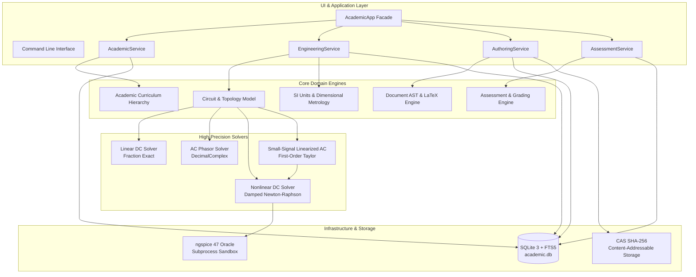

# AcademicCore

<div align="center">

[](https://www.python.org/downloads/)
[]()
[]()
[]()
[]()
[]()

**A high-precision, deterministic academic engineering, physics simulation, and verification platform.**  
*Bridging exact circuit physics, semiconductor modeling, curriculum governance, and high-integrity assessment.*

---

[Key Capabilities](#key-capabilities--architectural-pillars) •
[Architecture](#architectural-overview) •
[Subsystems](#subsystems-deep-dive) •
[Component Matrix](#supported-components--elements) •
[Phase Ledger](#phase-ledger--certification-status) •
[Code Examples](#hands-on-code-recipes) •
[Quickstart](#developer-quickstart)

---

</div>

> [!IMPORTANT]
> **Deterministic Sovereignty Principle**:  
> AcademicCore operates fully without requiring a Large Language Model (LLM). When a mathematical, physical, or numerical answer exists, it is obtained via deterministic, closed-form, or exact numerical algorithms. AI is utilized strictly as an explanatory, conversational, and pedagogical layer—never as the mathematical or physical authority of the system.

> [!NOTE]
> **Zero-Float Physical Core Invariant**:  
> All physical quantities, circuit equations, conductances, node voltages, and student scores are evaluated using exact rationals (`fractions.Fraction`) or arbitrary-precision `Decimal` (50 to 80 digits). Floating-point conversions are banned from physical calculations and grading arithmetic to prevent IEEE-754 numerical drift, enforced via continuous AST static analysis tripwires.

---

## Key Capabilities & Architectural Pillars

- **Unified MNA Circuit Solver**: Full Modified Nodal Analysis supporting:
  - **Linear DC**: Exact rational solver (`Fraction`) over arbitrary topologies with machine-zero residuals.
  - **AC Steady-State**: Complex frequency-domain phasors ($e^{+j\omega t}$) supporting inductors, capacitors, and complex power.
  - **Nonlinear DC**: Damped Newton-Raphson solver with Shockley diodes and BJT Ebers-Moll transistors.
  - **Small-Signal AC (F8-J)**: First-order Taylor linearization around frozen DC operating points ($\mathbf{J}(\mathbf{x}_0)$), extracting dynamic transconductance ($g_m$), input resistance ($r_\pi$), and output conductance ($g_o$).
- **Nonlinear Semiconductor Physics**:
  - Full Shockley diode companion models with geometric voltage clamping.
  - Coupled $3 \times 3$ analytical Jacobians for Bipolar Junction Transistors (NPN and PNP) under Ebers-Moll formulation.
  - Provable matrix conservation invariants: $\sum_i J_{ij} = 0$ (KCL conservation) and $\sum_j J_{ij} = 0$ (reference voltage shift invariance).
- **Physical Law Verification Engine**: Every solved circuit automatically evaluates Kirchhoff's Current Law (KCL), Kirchhoff's Voltage Law (KVL), and Tellegen's power balance theorem ($\sum P = 0$) with residual tolerances down to $10^{-24}\text{ W}$.
- **Industrial Oracle Cross-Validation**: Continuous automated regression against 64-bit `ngspice 47` guarantees relative solution error $< 10^{-4}$ ($0.01\%$) and phase error $< 0.05^\circ$ across canonical benchmark circuits.
- **Durable Assessment & Evaluation Platform (F9)**:
  - Session state-machine lifecycle (`NOT_STARTED` $\to$ `IN_PROGRESS` $\to$ `SUBMITTED`, `EXPIRED`, `CANCELLED`).
  - Strict `Decimal` scoring policy supporting positive marks, partial credit, negative penalties, and pass/fail thresholds.
  - SQLite persistence with crash recovery and countdown timer survival across process restarts.
  - Deterministic pseudo-random seed permutations for student exam shuffling.
- **Academic Management & Knowledge Hierarchy**: 7-tier academic curriculum tree (University $\to$ Degree $\to$ Academic Year $\to$ Term $\to$ Subject $\to$ Topic $\to$ Section) with prerequisite DAG validation and weighted gradebooks.
- **Document & Authoring Engine**: Canonical Document AST with LaTeX math formulas, bidirectional Markdown/HTML roundtrip, native PDF generation, Content-Addressable Storage (CAS SHA-256), and transactional undo/redo commands.
- **Zero Dynamic Code Execution**: Zero usage of `eval`, `exec`, `compile`, or uncontrolled subprocess calls.

---

## Architectural Overview

AcademicCore is structured as a modular monolith adhering to Domain-Driven Design (DDD), clean architecture boundaries, and transactional persistence.



---

## Subsystems Deep Dive

### 1. Circuit & Semiconductor Simulation Core (F6, F7, F8-A → F8-J)

The simulation core models electrical networks with metrological rigor, avoiding numerical float degradation:

1. **Constitutive MNA Formulations**:
   - Formulates the system $\mathbf{A} \mathbf{x} = \mathbf{b}$ where $\mathbf{x} = [\mathbf{v}^T, \mathbf{i}_{\text{aux}}^T]^T$.
   - Incorporates auxiliary current unknowns for independent voltage sources ($V$), op-amps ($O$), transformers ($T$), CCVS ($H$), and CCCS ($F$).
2. **AC Frequency-Domain Phasors**:
   - Supports inductive ($Z_L = j\omega L$) and capacitive ($Y_C = j\omega C$) elements.
   - Computes complex apparent power $\mathbf{S} = P + jQ$, power factor, Thévenin/Norton equivalents ($Z_{th}, V_{th}$), and resonant quality factors ($Q$).
   - Computes Bode magnitude (dB) and unwrapped phase responses across arbitrary frequency sweeps.
3. **Nonlinear Semiconductor Modeling (Shockley & Ebers-Moll)**:
   - Solves nonlinear operating points via damped Newton-Raphson with geometric line-search backtracking:
     $$\mathbf{J}(\mathbf{v}^{(k)}) \Delta \mathbf{v}^{(k)} = -\mathbf{f}(\mathbf{v}^{(k)})$$
   - Analytical Ebers-Moll BJT formulation:
     $$I_E = \frac{I_S}{\alpha_F}\left(e^{V_{BE}/V_T} - 1\right) - I_S\left(e^{V_{BC}/V_T} - 1\right)$$
     $$I_C = I_S\left(e^{V_{BE}/V_T} - 1\right) - \frac{I_S}{\alpha_R}\left(e^{V_{BC}/V_T} - 1\right)$$
   - Automatic classification into operational modes: **Active**, **Saturation**, **Cutoff**, and **Reverse Active**.
4. **Small-Signal Linearization (F8-J)**:
   - Evaluates first-order Taylor expansion around frozen DC operating point $\mathbf{x}_0$:
     $$g_m = \left.\frac{\partial I_C}{\partial V_{BE}}\right|_{\mathbf{x}_0}, \quad r_\pi = \left(\left.\frac{\partial I_B}{\partial V_{BE}}\right|_{\mathbf{x}_0}\right)^{-1}, \quad r_o = \left(\left.\frac{\partial I_C}{\partial V_{CE}}\right|_{\mathbf{x}_0}\right)^{-1}$$
   - Seamlessly stitches the linearized dynamic conductances into the high-precision complex AC solver for frequency response sweeps.

---

### 2. Assessment & Evaluation Platform (F9-A → F9-D)

Designed for high-stakes academic testing, certification exams, and automated homework grading:

- **Strict `Decimal` Scoring Policy**: All score weights, penalties, partial credits, and final results are represented as Python `Decimal` objects, completely eliminating rounding errors common in standard LMS systems.
- **Session State Machine**:
  ```text
  [NOT_STARTED] ──> start() ──> [IN_PROGRESS] ──> submit() ──> [SUBMITTED]
                                      │
                                      ├──> timer_expired ──────> [EXPIRED]
                                      └──> cancel() ───────────> [CANCELLED]
  ```
- **Crash Recovery & Timer Survival**:
  - Expiration timestamps (`expires_at`) are stored persistently as ISO-8601 UTC strings in SQLite.
  - If a student's client or server process restarts mid-exam, the session recovers its exact remaining countdown time. If the deadline has elapsed during downtime, the session is atomically transitioned to `EXPIRED`.
- **Flexible Grading Policies**:
  - Configurable partial credit for multi-step numerical exercises.
  - Configurable negative marking penalties for incorrect attempts.
  - Strict minimum score clamping (prevents negative overall marks).
  - Configurable passing thresholds (e.g., `Decimal("5.0")` out of `10.0`).
- **Deterministic Exam Generation**:
  - Deterministic pseudo-random item shuffling and option randomization via seed integers.
  - Allows regenerating the exact exam variant for retroactive academic auditing.

---

### 3. Academic Curriculum & Knowledge Tree (F1, F4)

Organizes educational content into a formal 7-tier hierarchical ontology:

```text
University (Institution)
  └── Degree (e.g., B.S. in Electrical Engineering)
        └── Academic Year (e.g., Year 2 - 2025/2026)
              └── Term (e.g., Fall Semester)
                    └── Subject (e.g., Circuit Theory I)
                          └── Topic (e.g., Bipolar Transistors)
                                └── Section (e.g., Small-Signal Analysis)
```

- **Activity Lifecycle**: Tracks readings, laboratory sessions, assessments, and projects.
- **Prerequisite Graphs**: Enforces Directed Acyclic Graph (DAG) dependencies between subjects and topics.
- **Weighted Gradebook**: Supports weighted scoring scales, optional assignments, and additive GPA calculations.

---

### 4. Content, Document & Authoring Engine (F2, F3, F5)

- **Canonical Document AST**:
  - Rich document tree supporting headers, lists, code blocks, tables, callout blocks, and LaTeX math formulas ($\LaTeX$).
  - 100% fidelity roundtrip between Markdown and HTML.
  - Direct native PDF generation without headless browser dependencies.
- **Content-Addressable Storage (CAS)**:
  - Files and media are deduplicated and indexed by SHA-256 digests.
  - SQLite FTS5 integration enables sub-millisecond full-text search across all authored materials.
- **Transactional Authoring Commands**:
  - 7 verifiable editing commands (`InsertNode`, `DeleteNode`, `UpdateNode`, `MoveNode`, etc.).
  - Full transactional undo/redo stack with document schema validation rules.

---

## Supported Components & Elements

| Symbol | Name | Operating Domain | Mathematical Model & Stamping Formulation | Reference Report |
|:---:|:---|:---:|:---|:---:|
| **R** | Resistor | DC, AC, NL | Ohm's law: $V = R \cdot I$, conductance stamping $G = 1/R$ | [`GATE-F8B.md`](docs/gates/GATE-F8B.md) |
| **L** | Inductor | AC Phasor | Impedance $Z_L = j\omega L$, reactive power $Q_L = \frac{1}{2}\omega L \vert I\vert^2$ | [`GATE-F8D3.md`](docs/gates/GATE-F8D3.md) |
| **C** | Capacitor | AC Phasor | Admittance $Y_C = j\omega C$, reactive power $Q_C = -\frac{1}{2}\omega C \vert V\vert^2$ | [`GATE-F8D3.md`](docs/gates/GATE-F8D3.md) |
| **V** | Voltage Source | DC, AC, NL | Independent voltage constraint, auxiliary current variable | [`GATE-F8B.md`](docs/gates/GATE-F8B.md) |
| **I** | Current Source | DC, AC, NL | Independent current delivery into nodes | [`GATE-F8B.md`](docs/gates/GATE-F8B.md) |
| **E** | VCVS | DC, AC, NL | Voltage-Controlled Voltage Source ($V_{\text{out}} = \mu \cdot \Delta V_{\text{ctrl}}$) | [`GATE-F8E.md`](docs/gates/GATE-F8E.md) |
| **G** | VCCS | DC, AC, NL | Voltage-Controlled Current Source ($I_{\text{out}} = g_m \cdot \Delta V_{\text{ctrl}}$) | [`GATE-F8E.md`](docs/gates/GATE-F8E.md) |
| **H** | CCVS | DC, AC, NL | Current-Controlled Voltage Source ($V_{\text{out}} = r_m \cdot I_{\text{ctrl}}$) | [`GATE-F8E.md`](docs/gates/GATE-F8E.md) |
| **F** | CCCS | DC, AC, NL | Current-Controlled Current Source ($I_{\text{out}} = \beta \cdot I_{\text{ctrl}}$) | [`GATE-F8E.md`](docs/gates/GATE-F8E.md) |
| **O** | Op-Amp | DC, AC, NL | Ideal operational amplifier (nullor: $V_+ = V_-$, $i_+ = i_- = 0$) | [`GATE-F8F.md`](docs/gates/GATE-F8F.md) |
| **T** | Transformer | DC, AC, NL | Ideal transformer with turns ratio $n$ ($V_1 = n V_2, I_2 = -n I_1$) | [`GATE-F8G.md`](docs/gates/GATE-F8G.md) |
| **D** | Diode | Nonlinear DC / AC | Shockley equation $I_D = I_S(e^{V_D / n V_T} - 1)$, dynamic $g_d$ | [`GATE-F8H.md`](docs/gates/GATE-F8H.md) |
| **Q** | BJT | Nonlinear DC / AC | Ebers-Moll (NPN/PNP), $3\times 3$ analytical Jacobian, dynamic $g_m, r_\pi, r_o$ | [`GATE-F8I.md`](docs/gates/GATE-F8I.md), [`GATE-F8J.md`](docs/gates/GATE-F8J.md) |

---

## Phase Ledger & Certification Status

| Phase | Subsystem | Key Deliverables & Scope | Status | Verification Gate |
|:---:|:---|:---|:---:|:---:|
| **F0** | Foundation & Audit | Architecture baseline, modular monolith, 10 ADRs. | **CERTIFIED** | [`MATRIX.md`](docs/migration/MATRIX.md) |
| **F1** | Domain & Identity | 20 domain entities, deterministic IDs, SQLite storage. | **CERTIFIED** | [`MIGRATION-REPORT-F1.md`](docs/migration/MIGRATION-REPORT-F1.md) |
| **F2** | Resource Engine | Content-Addressable Storage (CAS SHA-256), FTS5 indexing. | **CERTIFIED** | [`F2-REPORT.md`](docs/phase-reports/F2-REPORT.md) |
| **F3** | Document Engine | Canonical AST, Markdown/HTML roundtrip, native PDF renderer. | **CERTIFIED** | [`F3-REPORT.md`](docs/phase-reports/F3-REPORT.md) |
| **F4** | Academic Management | Course catalog, tree CRUD, gradebook calculations, facade. | **CERTIFIED** | [`F4-REPORT.md`](docs/phase-reports/F4-REPORT.md) |
| **F5** | Authoring Engine | Structured authoring commands, validation rules, undo/redo. | **CERTIFIED** | [`F5-REPORT.md`](docs/phase-reports/F5-REPORT.md) |
| **F6** | Engineering Foundation | SI units, dimensional quantities, equation parser, netlists. | **CERTIFIED** | [`F6-REPORT.md`](docs/phase-reports/F6-REPORT.md) |
| **F7** | Simulation Runtime | ngspice 47 integration, sandboxed subprocess execution. | **CERTIFIED** | [`F7-B8-HARDENING-REPORT.md`](F7-B8-HARDENING-REPORT.md) |
| **F8-A** | Electronics Knowledge Core | Canonical circuit models, boundary contracts, validation. | **CERTIFIED** | [`GATE-F8A.md`](docs/gates/GATE-F8A.md) |
| **F8-B** | General Linear DC MNA | Exact rational solver (`Fraction`) for $R, V, I, E, G, H, F, O$. | **CERTIFIED** | [`GATE-F8B.md`](docs/gates/GATE-F8B.md) |
| **F8-C** | DC Thévenin & Norton | Exact 1-port equivalent reductions via test-source injection. | **CERTIFIED** | [`GATE-F8C.md`](docs/gates/GATE-F8C.md) |
| **F8-D** | AC Phasor Suite | D1–D8: Phasors, power, frequency sweeps, Bode, resonance $Q$. | **CERTIFIED** | [`GATE-F8D.md`](docs/gates/GATE-F8D.md) |
| **F8-E** | Linear Dependent Sources | VCVS, VCCS, CCVS, CCCS with cyclic dependency detection. | **CERTIFIED** | [`GATE-F8E.md`](docs/gates/GATE-F8E.md) |
| **F8-F** | Ideal Op-Amps | Nullor MNA stamping, singular circuit rank classification. | **CERTIFIED** | [`GATE-F8F.md`](docs/gates/GATE-F8F.md) |
| **F8-G** | Transformers & Two-Port | Ideal transformers and two-port parameter matrices ($Z, Y, H, ABCD$). | **CERTIFIED** | [`GATE-F8G.md`](docs/gates/GATE-F8G.md) |
| **F8-H** | Shockley Diode DC | Damped Newton-Raphson solver, Shockley companion model. | **CERTIFIED** | [`GATE-F8H.md`](docs/gates/GATE-F8H.md) |
| **F8-I** | BJT Ebers-Moll DC | NPN/PNP models, $3\times 3$ analytical Jacobian, ngspice 47 validation. | **CERTIFIED** | [`GATE-F8I.md`](docs/gates/GATE-F8I.md) |
| **F8-J** | Small-Signal Linearized AC | Taylor expansion around DC bias, dynamic $g_m, r_\pi, r_o$, AC sweeps. | **CERTIFIED** | [`GATE-F8J.md`](docs/gates/GATE-F8J.md) |
| **F9-A** | Assessment Audit | Subsystem gap analysis, architectural readiness & contracts. | **CERTIFIED** | [`GATE-F9A.md`](docs/gates/GATE-F9A.md) |
| **F9-B** | Assessment Domain Core | Pure Decimal scoring, grading policies, state machine models. | **CERTIFIED** | [`test_f9b`](tests/test_f9b_domain_assessment.py) |
| **F9-C** | Assessment Orchestration | Session service, lifecycle management, facade integration. | **CERTIFIED** | [`GATE-F9-C.md`](docs/gates/GATE-F9-C.md) |
| **F9-D** | Assessment Persistence | SQLite migration 011, restart survival, countdown recovery. | **CERTIFIED** | [`GATE-F9-D.md`](docs/gates/GATE-F9-D.md) |
| **F9-E/F**| Assessment UI & Analytics | Interactive exam player, question editor, psychometric analytics. | *Planned* | [`ROADMAP.md`](docs/roadmap/ROADMAP.md) |
| **F10–F15**| Advanced Platform | Transient DAE solver, MOSFETs, Socratic AI Tutor, Cloud Sync. | *Planned* | [`ROADMAP.md`](docs/roadmap/ROADMAP.md) |

---

## Hands-On Code Recipes

### Recipe 1: BJT Operating Point & Tellegen Power Balance

```python
from academic_core.domain.engineering.circuit import Circuit, Component
from academic_core.domain.engineering.mna import solve_nonlinear_dc
from academic_core.domain.engineering.units import parse_quantity

# 1. Construct a common-emitter amplifier circuit
circuit = Circuit("common_emitter_bjt")
circuit.add(Component("Vcc", "V", parse_quantity("12 V"), pins={"+": "vcc", "-": "0"}))
circuit.add(Component("R_bias", "R", parse_quantity("220 kohm"), pins={"1": "vcc", "2": "base"}))
circuit.add(Component("R_load", "R", parse_quantity("1 kohm"), pins={"1": "vcc", "2": "collector"}))
circuit.add(Component(
    "Q1", "Q", None,
    pins={"C": "collector", "B": "base", "E": "0"},
    parameters={
        "polarity": "NPN",
        "Is": parse_quantity("1e-14 A"),
        "Bf": parse_quantity("100"),
        "Br": parse_quantity("1"),
        "Vt": parse_quantity("0.02585 V"),
    }
))

# 2. Solve nonlinear DC operating point via Damped Newton-Raphson
solution = solve_nonlinear_dc(circuit)

print(f"Convergence Status : {solution.status.value}")
print(f"Base Voltage       : {solution.node_voltages['base']:.4f} V")
print(f"Collector Voltage  : {solution.node_voltages['collector']:.4f} V")
print(f"BJT Operating Mode : {solution.bjt_operating_mode['Q1']}")

# 3. Verify fundamental physical conservation laws down to 10^-24
conservation = solution.conservation_checks
print(f"KCL & KVL Satisfied: {conservation.passed}")
print(f"Net Power Balance  : {conservation.power_residual} W")
```

---

### Recipe 2: Small-Signal AC Frequency Response (Bode Analysis)

```python
from academic_core.domain.engineering.circuit import Circuit, Component
from academic_core.domain.engineering.ac import solve_ac_mna
from academic_core.domain.engineering.units import parse_quantity
import math

# 1. Construct an RLC low-pass filter
c = Circuit("rlc_filter")
c.add(Component("Vin", "V", parse_quantity("1 V"), pins={"+": "in", "-": "0"}, parameters={"ac_mag": parse_quantity("1 V")}))
c.add(Component("L1", "L", parse_quantity("10 mH"), pins={"1": "in", "2": "out"}))
c.add(Component("C1", "C", parse_quantity("100 nF"), pins={"1": "out", "2": "0"}))
c.add(Component("Rload", "R", parse_quantity("1 kohm"), pins={"1": "out", "2": "0"}))

# 2. Sweep across frequency spectrum (100 Hz to 100 kHz)
freqs = [100, 1000, 5032, 10000, 100000] # 5032 Hz ~ resonant frequency
print("Freq (Hz) | Mag (dB)  | Phase (deg)")
print("----------|-----------|------------")

for f in freqs:
    omega = 2 * math.pi * f
    result = solve_ac_mna(c, omega=omega)
    v_out = result.node_voltages["out"]
    mag_db = 20 * math.log10(abs(v_out))
    phase_deg = math.degrees(math.atan2(v_out.imag, v_out.real))
    print(f"{f:9d} | {mag_db:9.2f} | {phase_deg:10.2f}")
```

---

### Recipe 3: Starting & Auto-Grading an Assessment Session

```python
from decimal import Decimal
from academic_core.application.facade import AcademicApp
from academic_core.domain.assessment import GradingPolicy, StudentResponse

# 1. Initialize application with durable SQLite storage
app = AcademicApp("academic.db")

# 2. Create a graded examination
assessment = app.assessment.create_assessment(
    subject_id="sub_circuits_101",
    title="Midterm Exam: Transistor Biasing",
    duration_min=45,
    policy=GradingPolicy(
        points_per_item=Decimal("2.5"),
        negative_marking_penalty=Decimal("0.5"),
        passing_score=Decimal("5.0"),
    ),
    items=[
        {
            "prompt": "Determine the collector current $I_C$ for $V_{BE} = 0.7\\text{ V}$.",
            "item_type": "NUMERICAL",
            "expected_answer": "4.35 mA",
            "tolerance_percent": Decimal("2.0"),
        },
        {
            "prompt": "Which region is the BJT in when both junctions are forward biased?",
            "item_type": "SINGLE_CHOICE",
            "options": ["Cutoff", "Active", "Saturation", "Reverse Active"],
            "expected_answer": "Saturation",
        },
    ]
)

# 3. Start a student session (with persistent countdown timer)
session = app.assessment.start_session(
    assessment_id=assessment.stable_id,
    student_id="student_dmartinez"
)
print(f"Session Started: {session.stable_id}, Status: {session.status.value}")

# 4. Record answers and submit
app.assessment.record_response(
    session_id=session.stable_id,
    response=StudentResponse(item_id=session.item_order[0], given_answer="4.34 mA")
)
app.assessment.record_response(
    session_id=session.stable_id,
    response=StudentResponse(item_id=session.item_order[1], given_answer="Saturation")
)

result = app.assessment.submit_session(session.stable_id)
print(f"Final Score : {result.total_score} / {result.max_score}")
print(f"Passed      : {result.passed}")
```

---

## Developer Quickstart

### 1. Environment Setup

```bash
# Clone the repository
git clone https://github.com/Damaga2005/AcademicCore.git
cd AcademicCore

# Create and activate Python virtual environment
python -m venv .venv

# On Windows PowerShell:
.\.venv\Scripts\Activate.ps1

# On Linux / macOS:
source .venv/bin/activate

# Install core and development dependencies
pip install -r requirements.txt
pip install -r requirements-dev.txt
```

### 2. Running Test Batteries

```bash
# 1. Run the entire test battery (1,740+ passing tests)
pytest -q

# 2. Run Semiconductor & Nonlinear DC Suite (Shockley + Ebers-Moll: 143 tests)
pytest tests/test_f8h_nonlinear_dc.py tests/test_f8i_bjt.py tests/test_f8i_nonlinear_bjt.py -v

# 3. Run Small-Signal Linearized AC Suite (F8-J: 23 tests)
pytest tests/test_f8j_small_signal_ac.py -v

# 4. Run Assessment Domain, Orchestration & Persistence Suite (F9-B, F9-C, F9-D: 36 tests)
pytest tests/test_f9b_domain_assessment.py tests/test_f9c_assessment_orchestration.py tests/test_f9d_assessment_persistence.py -v

# 5. Run AC Phasors, Power & Resonance Suite (F8-D1 → F8-D8: 120+ tests)
pytest tests/test_f8d*.py -v
```

### 3. Running Static Code & Zero-Float Audits

```bash
# Run the AST Zero-Float audit tripwire
pytest tests/test_eng_security.py -k "zero_float"

# Run architectural boundary and dependency isolation checks
pytest tests/test_architecture.py
```

---

## Repository Directory Layout

```text
AcademicCore/
├── src/academic_core/
│   ├── domain/
│   │   ├── engineering/             # Physical and circuit domain core
│   │   │   ├── circuit.py           # Canonical circuit model, components & topology
│   │   │   ├── units.py             # SI units, dimensions & exact Quantities
│   │   │   ├── mna/                 # Linear DC, op-amps, transformers & dependent sources
│   │   │   │   ├── diode.py         # Shockley diode companion model (F8-H)
│   │   │   │   ├── bjt.py           # Ebers-Moll BJT & 3x3 analytical Jacobian (F8-I)
│   │   │   │   └── nonlinear.py     # Damped Newton-Raphson nonlinear DC solver
│   │   │   ├── ac/                  # Frequency-domain AC phasors, power & Bode sweeps
│   │   │   │   └── small_signal.py  # Linearized small-signal AC around DC bias (F8-J)
│   │   │   ├── thevenin/            # DC and AC Thévenin / Norton equivalence reductions
│   │   │   └── math/                # Arbitrary-precision Gauss elimination & rank solvers
│   │   ├── assessment/              # Assessment models, sessions & Decimal grading (F9-B)
│   │   ├── academic/                # Curriculum hierarchy, subjects, rubrics & gradebook
│   │   └── documents/               # Document AST, LaTeX math & authoring blocks
│   ├── application/                 # Orchestration services & unified facade
│   │   ├── facade.py                # AcademicApp entry point
│   │   ├── assessment.py            # Assessment orchestration service (F9-C)
│   │   ├── authoring.py             # Reversible editing commands & undo/redo
│   │   └── engineering.py           # Circuit simulation orchestration
│   └── infrastructure/              # Storage, external oracles & file systems
│       ├── database.py              # SQLite connection, pragmas & schema management
│       ├── assessment.py            # AssessmentRepository with recovery logic (F9-D)
│       ├── migrations/              # Forward-only SQL migrations (001 through 011)
│       ├── cas.py                   # Content-Addressable Storage (SHA-256)
│       └── ngspice.py               # Sandboxed ngspice 47 runner & oracle
├── tests/                           # Complete test battery (1,740+ test cases)
├── docs/
│   ├── gates/                       # Production gate certification reports (GATE-F1 to GATE-F9-D)
│   ├── roadmap/                     # Comprehensive architecture roadmap (ROADMAP.md)
│   └── adr/                         # Architectural Decision Records (ADR-0001 to ADR-0016)
├── pyproject.toml                   # Project configuration & build metadata
├── CHANGELOG.md                     # Semantic versioning history & phase release notes
└── README.md                        # Project documentation
```

---

## The AcademicCore Manifesto

```text
1. BUILD SMALL, VERIFY COMPLETELY
2. KEEP THE SYSTEM DETERMINISTIC
3. ELIMINATE ARITHMETIC DRIFT (ZERO-FLOAT PHYSICAL CORE)
4. TELLEGEN, KCL, AND KVL ARE INVIOLABLE
5. USE AI FOR PEDAGOGY, NEVER AS PHYSICAL AUTHORITY
6. PROVABLE PROVENANCE AND EXACT REPRODUCIBILITY ALWAYS
```

---

## License

AcademicCore is open-source software licensed under the [MIT License](LICENSE).
