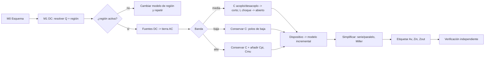
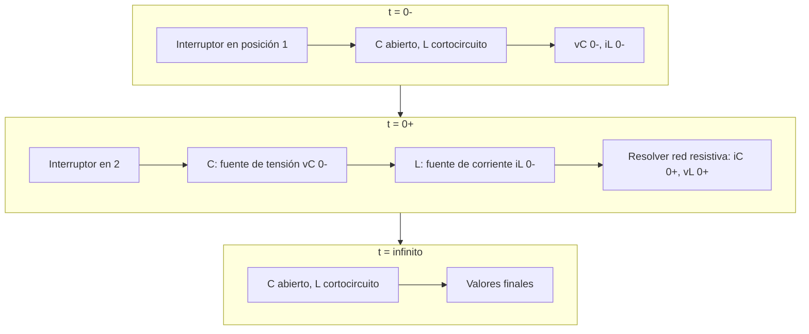
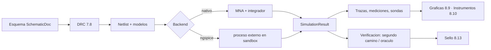

# Laboratorio de Circuitos Electrónicos — Especificación de diseño

Estado: **borrador de especificación, sin implementación iniciada** · Fecha: 2026-10-01 · Ruta de UI actual: `engineering/circuits` (página «Circuitos»), `engineering/analysis`, `engineering/lab` · Ruta prevista del laboratorio: `engineering/circuits-lab` (decisión D3, §3.9)
Parte 1 del documento: **§0 Cómo leer, §1 Objetivo y requisitos, §2 Punto de partida real (inventario verificado del código y de los tests), §3 Arquitectura, mapa asignatura→bloques, renombrado y reorganización.** Las partes 2–6 (motor de pasos y catálogos, dibujo/editor/simulación, dispositivos y analógico, RF/energía/control y medida, y calculadoras a riesgos y anexos) siguen a continuación con numeración única; el índice general está justo debajo.

Plantilla de estructura, estilo y nivel de detalle: `DIGITAL_DESIGN_LAB.md`. Capa matemática compartida (motor de pasos, justificación de método, hipótesis): `MATH_LAB.md` §5 y §5.5b. Lo circuital y de alta frecuencia que el catálogo matemático había dejado aparte (`math_catalog/extra_circuitos_control.md`, `math_catalog/extra_electromagnetismo.md`) **vive aquí por decisión del usuario**. Fronteras con los otros laboratorios (todos hermanos de este documento): `MATH_LAB.md` §16, `SIGNALS_LAB.md` §3.1 y §23.4 (D8), `DIGITAL_DESIGN_LAB.md` §23 y el futuro `AEROSPACE_LAB.md` (en preparación: allí van `orbital\`, `satcom\`, `ui\aerospace.py` y todo análisis estructural aeroespacial; ver §3.8).

Todo lo que dice «existe» en esta parte se ha **comprobado leyendo el código** del repositorio `C:\Users\dmart\Documents\AcademicCore` el 2026-10-01 (rutas, nombres de funciones, número de líneas y de tests). Lo que dice «falta» se ha buscado por nombre de módulo, de función y por texto; se indica cuando la ausencia es solo por nombre.

## Índice general

- **Parte 1 — Cómo leer, objetivo, punto de partida y arquitectura (§0–§3)**
  - §0 Cómo leer este documento
  - §1 Objetivo y requisitos
  - §2 Punto de partida real
  - §3 Arquitectura, mapa asignatura→bloques, renombrado y reorganización
- **Parte 2 — Motor de pasos y catálogo de CCE y Análisis de Circuitos (§4–§5)**
  - §4 Motor de pasos y solvers
  - §5 CCE y Análisis de Circuitos: catálogo de tipos de ejercicio
- **Parte 3 — Dibujo dinámico, editor y SPICE, simulación e instrumentos (§6–§8)**
  - §6 Dibujo dinámico de circuitos
  - §7 Editor de esquemas, biblioteca de componentes y modelos, netlist/SPICE
  - §8 Simulación, gráficas e instrumentos virtuales
- **Parte 4 — Dispositivos electrónicos y circuitos analógicos (§9–§10)**
  - §9 Dispositivos electrónicos (asignatura DE) — unión PN, diodo, BJT, MOSFET, JFET, optoelectrónica, punto Q y pequeña señal
  - §10 Circuitos analógicos (asignatura CA): amplificadores, etapas, frecuencia, op-amp, realimentación, estabilidad, osciladores, filtros, ruido, referencias, PLL, ADC/DAC
- **Parte 5 — Alta frecuencia y RF, energía y tecnología, control y medida (§11–§13)**
  - §11 Alta frecuencia y RF
  - §12 Procesado de la energía y tecnología electrónica
  - §13 Control y medida
- **Parte 6 — Calculadoras, ejercicios, tutor, interfaz, persistencia, pruebas, fases y riesgos (§14–§22 y Anexos)**
  - §14 Calculadoras
  - §15 Ejercicios, generador y corrección
  - §16 Explicación y tutor
  - §17 Interfaz y accesibilidad
  - §18 Persistencia y formatos
  - §19 Seguridad y rendimiento
  - §20 Pruebas y criterios de aceptación
  - §21 Fases de entrega
  - §22 Riesgos, límites y decisiones
  - Anexo A: Leyes y relaciones fundamentales (formato y catálogo)
  - Anexo B: Formatos de datos (propuestos)
  - Anexo C: Convenciones declaradas por ejercicio
  - Anexo D: Mapa asignatura → bloques → pruebas
  - Anexo E: Erratas conocidas como casos de prueba
  - Anexo F: Mapa de módulos y responsabilidades (propuesto, tras el renombrado)
  - Anexo G: Glosario

Atajos: ids y niveles `BL`/`CI`/`FE` en §0.3 y §3.5.3 · fases `CI-R`, `CI-0`…`CI-16` y sub-olas en §21.2 y §21.2.1 · **decisiones (todas decididas) en §22.3** · contradicciones entre partes resueltas en §22.4 · reparto con otros laboratorios en §3.3.1 (`MATH_LAB` §16 y `SIGNALS_LAB` D8).

---

## 0. Cómo leer este documento

### 0.1 Mapa de secciones del documento completo

| Parte | Sección | Contenido |
|---|---|---|
| **1** | 0 | Cómo leer, convenciones de marcas e identificadores |
| 1 | 1 | Objetivo, requisitos del usuario (trazabilidad), principios, alcance |
| 1 | 2 | **Punto de partida real**: qué existe en `domain/engineering`, `domain/electronics`, aplicación, infraestructura, UI y tests; convenciones reales de los motores; lagunas verificadas; hallazgos de deuda |
| 1 | 3 | **Arquitectura** por capas y paquetes objetivo; mapa asignatura→bloques `BL-*`; **renombrado** `engineering` → «Circuitos electrónicos»; reorganización (qué se queda, qué se mueve, qué sale) |
| 2 | 4 | Motor de pasos y solvers (nodos, mallas, MNA, Thévenin, superposición, Millman), justificación de método, hipótesis, verificación por segundo camino |
| 2 | 5 | CCE y Análisis de Circuitos: DC, AC/fasores, potencia, transitorios 1.º/2.º orden y conmutación, Laplace, dos puertos, Bode, síntesis inversa, circuitos a trozos. Catálogo de tipos de ejercicio |
| 3 | 6 | Dibujo dinámico: tabla componente×modo, reglas de transformación, animación paso a paso, capas, leyenda |
| 3 | 7 | Editor de esquemas, biblioteca de componentes y modelos, netlist/SPICE import-export |
| 3 | 8 | Simulación, gráficas e instrumentos virtuales |
| 4 | 9 | Dispositivos (unión PN, diodo, BJT, MOSFET, polarización, punto Q, pequeña señal) |
| 4 | 10 | Circuitos analógicos (amplificadores, respuesta en frecuencia, op-amp, realimentación, estabilidad, osciladores, filtros, ruido, referencias, PLL, ADC/DAC) |
| 5 | 11 | Alta frecuencia y RF (líneas, Smith, adaptación, parámetros S/ABCD, ruido, guías) |
| 5 | 12 | Procesado de la energía y tecnología electrónica |
| 5 | 13 | Control y medida (GUM, calibración, ajuste, aberrantes) |
| 6 | 14–22 | Calculadoras, ejercicios y corrección, tutor, interfaz y accesibilidad, persistencia, seguridad y rendimiento, pruebas, fases (incluida la fase de renombrado), riesgos y decisiones D1..D47 (tabla única en §22.3), anexos |

### 0.2 Marcas de estado (se usan en todas las partes)

| Marca | Significado |
|---|---|
| **[EXISTE]** | Está en el repositorio, certificado por tests, y se reutiliza tal cual |
| **[AMPLÍA]** | Existe; se añaden capacidades **sin romper** su contrato público ni sus tests |
| **[NUEVO]** | No existe; se crea |
| **[MUEVE]** | Existe y cambia de paquete/ruta (ver §3.8) |
| **[SALE]** | Existe aquí hoy pero lo asume otro laboratorio (señales, digital, aeroespacial: `orbital`, `satcom`…) |
| **[RENOMBRA]** | Cambia de nombre en el paquete, no de comportamiento (ver §3.7) |

### 0.3 Identificadores estables

- Bloques temáticos: `BL-<área>-<n>` con áreas `CCE`, `AC`, `DEV`, `AN`, `RF`, `PW`, `CT`, `ME` (§3.5 da el **índice maestro**; las partes 2–5 detallan cada bloque en tipos `CI-<área>-<nn>` y no pueden reutilizar un número).
- Decisiones: `D1..D47`, **todas decididas** en la tabla única de §22.3 (la numeración de cada parte se fundió allí; las contradicciones entre partes, en §22.4).
- Niveles de identificador de ejercicio (no se mezclan): **`BL-<área>-<n>`** = bloque temático del índice maestro (§3.5.2); **`CI-<área>-<nn>`** = tipo de ejercicio del catálogo detallado (§5.3, §5.5, §9.10, §10.17, §11.13, §12.13, §13), siempre con dos cifras; **`FE-<área>-<n>`** = familia de ejercicio con su frecuencia en examen (§15.2). `CI-<n>`/`CI-R`/`CI-9.1` (sin área) son **fases** (§21).
- Requisitos del usuario: `R1..R14` (§1.2). Lagunas verificadas: `L1..L24` (§2.10). Hallazgos de deuda del código: `H1..H13` (§2.11 y §3.6.1).
- Referencias cruzadas por número de sección (`§4.3`), nunca por número de línea.

### 0.4 Convenciones de este texto

- Rutas siempre relativas a `src\academic_core\` salvo que empiecen por `tests\` o `docs\`. `domain\engineering\ac` significa `src\academic_core\domain\engineering\ac`.
- Nombres de código (clases, funciones, claves de esquema) en `monoespaciado` y **tal cual existen**. Los nombres que propongo se marcan **[NUEVO]**.
- Cifras de líneas y de tests: contadas el 2026-10-01 con `wc -l` y recuento de `def test_`. Son orientativas (varían con cada commit) pero sirven para dimensionar el esfuerzo.
- Idioma de la interfaz: español. Valores de enumeración y claves internas en inglés (convención ya establecida en el proyecto: `SUCCESS`, `UNSUPPORTED`, `INVALID`…).
- Símbolos gráficos: **IEC 60617 por defecto**, ANSI/IEEE alternable (D5). Símbolos matemáticos: `j` unidad imaginaria (ingeniería); `e^{+jωt}` y amplitud **pico** por defecto, tal como declara el motor AC (`TIME_CONVENTION`, `AMPLITUDE_CONVENTION` en `domain\engineering\ac\operating_point.py`). Todo ejercicio **declara** su convención (Anexo de la parte 6, y principio P5 de §1.3).
- Abreviaturas de asignaturas: **CCE** Componentes y Circuitos Electrónicos (1.er cuatr.), **AC** Análisis de Circuitos (2.º), **DE** Dispositivos Electrónicos (3.º), **PSPICE** Simulación y Análisis de Circuitos mediante PSPICE (3.º), **CA** Circuitos Analógicos (4.º), **ICAF** Introducción a los Circuitos de Alta Frecuencia (4.º), **CAF** Circuitos de Alta Frecuencia (5.º), **SC** Sistemas de Control (5.º), **SM** Sistemas de Medida (5.º), **PEE** Procesado de la Energía Eléctrica (6.º), **TE** Tecnología Electrónica (6.º), **EI** Electrónica Inteligente (7.º). Los números de cuatrimestre salen de `guias_upc\cuatrimestre_1..7`. En el material del OneDrive aparecen carpetas `CIAF` e `ICAF`: se tratan como alta frecuencia introductoria (ICAF, 4.º); la correspondencia exacta de `CIAF` con CAF/ICAF **no está verificada** (los «controles de CIAF» de §11 salen de esas carpetas).

### 0.5 Qué NO es este documento

No contiene código ni modifica nada del repositorio, de OneDrive ni de `guias_upc` (solo lectura). Describe **qué** se construye, **cómo se organiza** y **cómo se verifica**; no un calendario.

---

## 1. Objetivo y requisitos

### 1.1 Objetivo

La carrera (Grado en Ingeniería Electrónica de Telecomunicación, UPC) **va de circuitos**. Lo que el proyecto llamaba «engineering» se presenta ya al usuario como **«Circuitos electrónicos»** (área de navegación en `ui\routes.py`, pestaña principal en `ui\main_window.py`). El objetivo es convertir esa área en **el laboratorio de circuitos más completo posible para esta carrera**, de modo que un estudiante pueda, sin salir de la aplicación, hacer **el ciclo completo de cualquier ejercicio de circuitos de cualquier asignatura**, desde CCE (1.º) hasta lo más avanzado (alta frecuencia, control, medida, energía):

1. Partir de un **enunciado** (texto, esquema en papel o foto, netlist, o un esquema dibujado en el editor).
2. **Construir el circuito** en un editor de esquemas con biblioteca de componentes y modelos, o importarlo de SPICE.
3. **Elegir y justificar el método** (nodos, mallas, MNA, Thévenin/Norton, superposición, Millman, reducción serie-paralelo, divisor, transformación de fuentes, Laplace, fasores…) y **comprobar las hipótesis** del método.
4. **Resolver paso a paso**, mostrando cada ecuación, cada sustitución y su motivo.
5. **Ver el circuito transformarse**: el esquemático cambia según el modo de análisis (punto de trabajo, pequeña señal, media banda, alta/baja frecuencia, Thévenin/Norton, transitorio con C/L→fuentes, fasores, dominio *s*, dos puertos, modelo por tramos de diodo/zener, conmutación), **resaltando qué sustituye a qué y por qué**.
6. **Verificar por un segundo camino independiente** (otro método, conservación de potencia/Tellegen, KCL/KVL residual, ngspice como oráculo opcional, Monte Carlo para tolerancias).
7. **Simular** (OP, barrido DC, AC, transitorio, ruido, Monte Carlo, paramétrico, sensibilidad) y **ver gráficas** (Bode, Nyquist, Smith, lugar de las raíces, formas de onda, característica I-V, recta de carga).
8. **Medir** con instrumentos virtuales (polímetro, osciloscopio, generador, analizador de redes, analizador de espectro) y calcular incertidumbre (GUM).
9. **Calcular** con calculadoras especializadas (dB/neper, series E, divisores, filtros, op-amp, osciladores, PLL, ADC/DAC, líneas, adaptación, convertidores, magnéticos…).
10. **Practicar**: generador de ejercicios con corrección, usando **exámenes reales** de la carrera como casos de prueba, y **explicar** cualquier resultado desde la traza del motor (nunca desde un modelo generativo).

### 1.2 Requisitos explícitos del usuario (trazabilidad)

| Id | Requisito (textual o resumido) | Dónde se atiende |
|---|---|---|
| R1 | Renombrar visiblemente «engineering» como «Circuitos electrónicos» (UI ya hecha; el paquete se renombra en fase aparte, con tests en verde antes y después) | §3.7, §21 (parte 6) |
| R2 | Incluir **absolutamente todo** lo que se pueda calcular con un circuito o relacionado, de CCE a lo más avanzado: Análisis de Circuitos, Dispositivos, Circuitos Analógicos, Alta Frecuencia (líneas, Smith, adaptación, parámetros S, ruido), Control, Medida (GUM), Energía (convertidores, magnéticos), Tecnología Electrónica, PSPICE, Electrónica Inteligente | §3.5 (índice maestro), partes 2–5 |
| R3 | Solvers **paso a paso** con **justificación de cada elección de método** y **hipótesis comprobadas** | §4 (parte 2) |
| R4 | **Verificación por un segundo camino independiente** | §4.x (parte 2), §20 (parte 6) |
| R5 | **Dibujos de circuitos dinámicos**: el esquemático se transforma según el modo (DC/punto de trabajo, pequeña señal con rd/híbrido-π/T/gm-ro-gmb, fuentes DC a tierra AC, C en cortocircuito en media banda, L abiertos, alta/baja frecuencia con Cπ, Cμ, Cgs, Cgd, Thévenin/Norton, transitorio con C/L→fuentes y estado inicial, fasores/dominio *s*, dos puertos h/z/y/ABCD/S, modelo por tramos de diodo/zener, conmutación), con reglas de dibujo, transformación paso a paso, resaltado de qué sustituye a qué y por qué, capas y leyenda | §6 (parte 3) |
| R6 | **Editor de esquemas**, biblioteca de componentes y modelos, netlist/SPICE | §7 (parte 3) |
| R7 | **Simulación**: OP, barrido DC, AC, transitorio, ruido, Monte Carlo, paramétrico | §8 (parte 3) |
| R8 | **Gráficas**: Bode, Nyquist, Smith, lugar de raíces, formas de onda | §8 (parte 3) |
| R9 | **Instrumentos virtuales** | §8 (parte 3) |
| R10 | **Calculadoras** (dB, series E, divisores, filtros, op-amp, osciladores, PLL, ADC/DAC…) | §14 (parte 6) |
| R11 | **Generador de ejercicios y corrección**, con **exámenes reales** como casos de prueba | §15 (parte 6) |
| R12 | **Tutor/explicación**, accesibilidad, rendimiento, pruebas, fases, riesgos, decisiones | §16–§22 (parte 6) |
| R13 | Lo circuital y de **alta frecuencia** (líneas, Smith, adaptación, guías) va **aquí**, no en el laboratorio matemático | §3.5, §11 (parte 5) |
| R14 | «Sin dejarte nada»: el usuario considera este el **spec más delicado**; prioridad CCE y Análisis de Circuitos (fuentes reales: guías y OneDrive) | §3.5, §5 (parte 2) |

### 1.3 Principios de diseño

Se heredan los de `DIGITAL_DESIGN_LAB.md` §1.3 y `MATH_LAB.md` §1, y se **particularizan** a circuitos:

1. **P1 · Exactitud y determinismo.** Todo resultado es función pura de la entrada. El motor existente ya cumple esto: aritmética **exacta racional** (`fractions.Fraction`) para circuitos lineales y `Decimal` con contexto explícito (`make_context`, 50 dígitos) para lo no lineal y transitorio; **`float` prohibido** en cálculo de física (declarado en `domain\engineering\mna\bjt.py` y otros). Sin reloj de pared ni aleatoriedad no sembrada (Monte Carlo con semilla: `MCConfig`). Mismo circuito + misma configuración ⇒ mismo *digest*.
2. **P2 · Nada se inventa en la interfaz.** `ui\` dibuja y envía órdenes; los solvers y las reglas de transformación del dibujo viven en dominio/aplicación (regla ya establecida: «zero solver code» en `ui\virtual_lab.py`). **Las transformaciones del esquemático (§6) son datos puros** (lista de operaciones sobre un `Circuit`), no código de pintura.
3. **P3 · Todo resultado es explicable.** Cada solver emite una **traza de pasos** (ley, antes, después, motivo). La explicación al estudiante sale de esa traza (`domain\execution` + `application\explain_service.py`), no de un LLM.
4. **P4 · Dos caminos, un veredicto.** Todo resultado se comprueba por un método **independiente** antes de mostrarse como «verificado» (§4, parte 2). ngspice es un **oráculo opcional** (ya existe en `application\oracle.py`), nunca la fuente de la verdad.
5. **P5 · Convención declarada.** Pico/eficaz, `e^{+jωt}` vs `e^{-jωt}`, `j` vs `i`, dB de amplitud vs potencia, signo de fuentes, convención de signos pasivo/activo: **cada ejercicio declara la suya** y el motor convierte; el corrector compara **propiedad o respuesta**, no la forma (`math_catalog/extra_circuitos_control.md` §3.1).
6. **P6 · Validez del modelo explícita.** Un modelo (diodo ideal, exponencial, por tramos; BJT Ebers-Moll; MOSFET nivel 1; op-amp ideal/real) lleva sus **hipótesis y su rango de validez**, y el motor **las comprueba tras resolver** (p. ej. «el diodo supuesto en conducción tiene `I>0`», «el BJT está en activa: `VCE>VCEsat`», «MOS en saturación: `VDS≥VGS−VT`»). Si no se cumplen, se itera de estado y se muestra la iteración.
7. **P7 · Honestidad de los límites.** Lo que el motor no soporta se declara `UNSUPPORTED` con el motivo y nunca se aproxima en silencio (patrón actual: `UnsupportedElementError`, estados `INVALID`/`UNSUPPORTED`). Los esquemas dibujados pero no simulables se marcan como tales.
8. **P8 · Un modelo, varias vistas.** El **`Circuit` canónico** (`domain\engineering\circuit.py`, versión `engcircuit/6.0`) es la única representación del circuito; esquema, netlist SPICE, tabla de componentes, matriz MNA y dibujo transformado son **vistas** del mismo objeto (ya es el caso: «There is no separate wire model», `application\schematic.py`).
9. **P9 · Sin dependencias pesadas.** El proyecto depende solo de `PySide6` (`pyproject.toml`); el cálculo es biblioteca estándar. Cada dependencia nueva se justifica y es opcional. No se introduce NumPy/SciPy (el rendimiento se resuelve con exactitud selectiva y *caches*, §19 parte 6).
10. **P10 · Seguridad.** Sin `eval`, sin acceso dinámico a atributos, sin red ni sistema de ficheros en `domain\` (los paquetes certificados lo verifican con tests AST: `tests\test_architecture.py`, `tests\test_f8p3_rf.py`).

### 1.4 Alcance: qué entra y qué no

**Dentro (el laboratorio de circuitos):**

- Teoría de circuitos lineales y no lineales (resistivos, RLC, fasores, Laplace, dos puertos, transitorios, circuitos a trozos).
- Dispositivos como **modelos de circuito** (diodo, zener, LED, BJT, MOSFET, JFET, op-amp, transformador) y sus **modelos equivalentes** de gran y pequeña señal. La física de semiconductores (bandas, uniones, control de carga) entra como **calculadora y ejercicio** (§9), no como simulador de dispositivos.
- Circuitos analógicos: amplificadores, etapas, respuesta en frecuencia, realimentación, estabilidad, osciladores, filtros activos, ruido, referencias, PLL, convertidores A/D y D/A.
- Alta frecuencia y RF **circuital** (líneas, Smith, adaptación, parámetros S/ABCD, ruido, amplificadores, atenuadores, divisores, filtros, guías como línea equivalente). `rf` y `comms` se quedan (`domain\engineering\rf`, `domain\engineering\comms`).
- Procesado de la energía (convertidores DC-DC, rectificadores, magnéticos, térmico) y tecnología electrónica (PCB, impedancia controlada, EMC como **cálculo**).
- Control (función de transferencia, Routh, lugar de raíces, Nyquist, estado) y medida (GUM, calibración, ajuste, aberrantes, ruido, sensores y acondicionamiento).
- Simulación (propia y ngspice opcional), instrumentos virtuales, gráficas, netlist/SPICE.

**Fuera (lo asumen otros laboratorios; ver §3.8):**

- Lógica digital y diseño digital: `DIGITAL_DESIGN_LAB.md` (`domain\engineering\digital`, `digital_circuit.py`, `ui\digital_editor.py`, `ui\logic_analyzer.py`). **[SALE]**
- Procesado de señal discreta (DFT, filtros FIR/IIR, muestreo, transformada Z): `SIGNALS_LAB.md` (`domain\engineering\dsp`). **[SALE]**
- Mecánica orbital y enlaces por satélite: `domain\engineering\orbital`, `satcom`, `ui\aerospace.py`. **[SALE]** → `AEROSPACE_LAB.md` (en preparación; mientras no exista se quedan donde están).
- Estructural: hay que distinguir dos cosas. El `structural\` **del repositorio** es el reconocimiento de topologías de **circuitos** (hallazgo H9, decisión D28): **no sale** porque lo usa el reconocimiento de conceptos de electrónica. Cualquier análisis estructural **aeroespacial** (mecánica de estructuras) saldría a `AEROSPACE_LAB.md`; hoy no hay código de ese tipo en `domain\engineering` (comprobado por nombre de módulo).
- Matemáticas puras (álgebra lineal, cálculo, EDO como técnica): `MATH_LAB.md`. Aquí se **usan** vía la capa compartida (§3.3).
- Electromagnetismo de campos (Maxwell, Gauss, Biot-Savart, guías dieléctricas, fibra, antenas como radiación): `math_catalog/extra_electromagnetismo.md` fija el reparto: **lo circuital va aquí**; los campos puros quedan en el laboratorio matemático/físico.
- Diseño microelectrónico a nivel layout/litografía y dispositivos fotovoltaicos como física del dispositivo: solo se atiende lo **calculable como circuito** (curva I-V del fotovoltaico como diodo con fuente, §9; CMOS como circuito, §10). El layout no.

### 1.5 Definición de «completo» (criterio de cobertura)

El laboratorio se considera **completo** cuando, **para cada tema de cada guía docente** de la lista de §3.5, existe al menos: (a) un tipo de ejercicio `CI-*` con generador y corrección; (b) un solver con pasos y justificación de método; (c) la verificación por segundo camino; (d) la vista dinámica del circuito que corresponda; (e) casos de prueba tomados de **material real** (exámenes y ejercicios de OneDrive y `guias_upc`). Se mantiene una **matriz de cobertura** (tema de guía → bloque → solver → vista → pruebas) en el Anexo de la parte 6, y la fase de certificación final (§21) exige que no tenga celdas vacías, salvo las declaradas fuera de alcance en §1.4.

### 1.6 Perfiles de usuario y flujos principales

| Perfil | Necesidad | Flujo |
|---|---|---|
| Estudiante de CCE/AC (el 80 % del uso esperado) | Resolver y **entender** un problema de examen | Enunciado → dibujar/importar → método justificado → pasos → vista transformada → verificación → ejercicios parecidos |
| Estudiante de DE/CA | Polarización, punto Q, pequeña señal, etapas, respuesta en frecuencia, realimentación | Esquema con BJT/MOS → OP → circuito incremental dibujado → ganancia, Zin, Zout, polos → Bode |
| Estudiante de ICAF/CAF | Líneas, Smith, adaptación, parámetros S | Calculadora + carta de Smith interactiva + pasos de adaptación |
| Estudiante de SC/SM/PEE/TE | Función de transferencia, estabilidad, incertidumbre, convertidores, PCB | Calculadoras y solvers por bloque (§12, §13) |
| Laboratorio / prácticas (PSPICE, CCE prácticas 0–6) | Simular y medir | Netlist/esquema → simulación → instrumentos virtuales → informe |
| Profesor / autor de ejercicios | Crear enunciados con solución | Editor de esquemas + plantilla de enunciado + corrección por propiedad (`ui\authoring.py` existente) |

---

## 2. Punto de partida real

> Todo lo de esta sección es inventario verificado. Las líneas son de `wc -l` del 2026-10-01. El motor de circuitos es la parte más grande y más certificada del repositorio: **no se reescribe**; se amplía por encima.

### 2.1 Panorama general

| Capa | Ruta | Tamaño aprox. | Papel |
|---|---|---|---|
| Dominio de circuitos | `domain\engineering\` | ≈ 48 700 líneas (152 ficheros) en 15 subpaquetes + 8 módulos sueltos | Motores exactos (MNA, AC, transitorio, no lineal, dos puertos, Thévenin, control, RF, GUM, laboratorio virtual) |
| Dominio de conocimiento | `domain\electronics\` | 1 325 líneas, 11 módulos | Conceptos, modelos, ecuaciones, procedimientos y reconocimiento de topologías (Fase 8-A) |
| Trazas de ejecución (explicabilidad) | `domain\execution\` | 6 373 líneas, 15 módulos | Trazas E0 (`ExecutionTrace`, `TraceRecorder`) de cada solver, con *replay* |
| Aplicación | `application\engineering.py` (330), `schematic.py` (228), `lab_service.py` (208), `simulation_service.py` (222), `oracle.py` (112), `explain_service.py` (429), `exercise_service.py` (74) | ≈ 1 600 líneas | Servicios sin Qt |
| Infraestructura | `infrastructure\engineering.py` (95), `ngspice.py` (418), `ngspice_parser.py` (791) | ≈ 1 300 líneas | Repositorio SQLite de proyectos/circuitos y puente ngspice |
| UI | `ui\engineering.py` (532), `schematic.py` (563), `simulation.py` (270), `virtual_lab.py` (505), `workspace.py` (284), `waveform.py` (248), `lab_view.py` (539) | ≈ 2 900 líneas | Panel de circuitos, editor de esquemas, simulación, laboratorio virtual |
| Tests | `tests\test_f8*`, `test_eng_*`, `test_e0*`, `test_schematic_editor.py`, `test_ux_engineering.py`… | ≈ 3 900 tests solo en estos ficheros | Certificación por fases (F8-A … F8-Q, E0–E0.4) |

Total de tests del repositorio: 172 ficheros `tests\test_*.py`; 41 de ellos **leen rutas físicas** de `domain\engineering` (relevante para el renombrado, §3.7).

### 2.2 `domain\engineering`: inventario por módulo

Leyenda de **destino**: **Q** = se queda como circuitos; **A** = se queda y se amplía; **S** = sale a otro laboratorio; **C** = compartido con otro laboratorio.

| Módulo / paquete | Líneas | Qué hace (verificado) | Tests principales | Destino |
|---|---:|---|---|---|
| `circuit.py` | 252 | `Component` (frozen: `ref`, `type`, `value: Quantity`, `pins: dict`, `parameters`, `metadata`), `Circuit` (`add`, `validate`, `to_netlist`, `to_storage`/`from_storage`, `from_netlist`), `COMPONENT_PINS` (R C L V I D Q M J E G H F O T), `CIRCUIT_VERSION = "engcircuit/6.0"`, `EngineeringProject` | `test_eng_circuit` (6), `test_eng_persist` (5) | **A** (núcleo; ver §3.6) |
| `units.py` | 300 | `Unit`, `Quantity` (Decimal + dimensión SI con exponentes enteros), `parse_unit`, `parse_quantity`; constantes `VOLTAGE`, `CURRENT`, `RESISTANCE`, `CAPACITANCE`, `INDUCTANCE`, `FREQUENCY`, `TIME`, `POWER`, `ADMITTANCE`, `DIMENSIONLESS`… | `test_quantities`, `test_p0_decimal_battery` | **A** |
| `equations.py` | 383 | Analizador/evaluador de ecuaciones **sin `eval`** (gramática propia, lista blanca `sqrt exp log log10 sin cos tan abs`), `ENGINE_VERSION = "engcalc/6.0"`, comprobación de dimensión | `test_eng_equations` (6) | **A** |
| `calc.py` | 94 | `calculate(inputs, source, …)`; `LIBRARY` de 15 fórmulas (`ohm-v/i/r`, `power-vi/i2r/v2r`, `charge-qcv`, `energy-cap/ind`, `freq-period`, `voltage-divider`, `pt100-cvd`, `ntc-beta`, `ad620-rg`, `wheatstone`) | `test_eng_calc` (4) | **A** (base del catálogo de calculadoras, §14) |
| `models.py` | 75 | `ComponentModel` y constructores `resistor`, `capacitor`, `inductor`, `voltage_source`, `current_source`, `diode`, `bjt`, `mosfet`, `jfet` (modelos mínimos) | n/d | **A** (base de la biblioteca de modelos, §7) |
| `mna\` | 8 923 | **MNA exacto** (ver §2.3) | `test_f8b` … `test_f8m` | **A** |
| `ac\` | 7 454 | **Régimen sinusoidal permanente, Bode, potencia, impedancias, dos puertos, Thévenin/Norton AC, resonancia, pequeña señal** (ver §2.4) | `test_f8d1` … `d8`, `test_f8g`, `test_f8j` | **A** |
| `control\` | 3 054 | SISO LTI: `tf.py` (`TransferFunctionTF`, `series`, `parallel`, `feedback`, `feedback_positive`, `sensitivity`, `complementary`, `ZPK`, `cancellation_report`), `poly.py` (`Polynomial`, `durand_kerner_roots`, `validate_roots`), `stability.py` (`routh_of_poly/tf`, `pole_inventory`), `locus.py` (asíntotas, condición de ángulo, puntos de ruptura, cruces jω, `locus`), `margins.py` (cruces de ganancia y de fase, `margins`), `pid.py` (`pid_parallel/ideal/series`, `ziegler_nichols`, `ultimate_gain`, `closed_loop`), `response.py` (`step_response`, `impulse_response`, `first_order_*`, `second_order_metrics`), `statespace.py` (`tf_to_ss`, `ss_to_tf`, `ctrb_rank`, `obsv_rank`, `ss_eigenvalues`), `report.py` | `test_f8p1_control` (51) | **A** |
| `rf\` | 1 793 | `lines.py` (`LineRLGC`, `LineZGamma`, `input_impedance`, `reflection_coefficient`, `load_*`), `smith.py` (`z_to_gamma`, `rotate_along_line`, círculos de R y X), `matching.py` (`quarter_wave_match`, `lc_match`, `single_stub_shunt_match`, `single_stub_series_match`, `conjugate_match`), `networks.py` (`TwoPort`, `make_z/y/abcd`, conversiones, `cascade_abcd`, `line_abcd`), `sparams.py` (`SParameters`, `s_to_abcd`, `abcd_to_s`, `TMatrix`), `margins.py` (`vswr`, `return_loss_db`, `insertion_loss_db`, `mismatch_loss_db`, `transducer_gain`, `rollett_stability`), `primitives.py`, `report.py` | `test_f8p3_rf` (52) | **A** |
| `comms\` | 2 503 | Comunicaciones digitales: modulación, constelaciones, canal AWGN, detección, métricas BER, pulsos | `test_f8p4_comms` (40) | **Q** (D29) |
| `lab\` | 5 398 | **Laboratorio virtual F8-N**: `LaboratorySession`, `ExperimentDefinition`, `AnalysisKind` (OP, DC_SWEEP, PARAM_SWEEP, CORNERS, SENS_DC, SENS_AC, MONTE_CARLO, AC_POINT, AC_SWEEP, TRANSIENT), `StimulusKind` (DC, STEP, PULSE, SINE, AC), `InstrumentKind` (voltmeter, ammeter, oscilloscope, frequency_response_viewer, sweep_viewer), `MeasurementKind` (max, min, pp, mean, rms, crossings, period, frequency, rise/fall_time, overshoot, settling, ac_gain/_db/_phase/_amplitude, bandwidth, dc_value), sondas de tensión/corriente/parámetro, *replay*, serialización `f8n-lab/1` | `test_f8n_lab*` (125) | **A** |
| `metrology\` + `gum.py` | 1 676 + 1 295 | GUM: tipo A/B (rectangular, triangular, normal), correlaciones, sensibilidades, Welch-Satterthwaite, factor de cobertura (t de Student), presupuesto, `evaluate_gum`; capa `metrology` (`o1`…`o5`: entradas, propagación, circuito DC/AC, cifras significativas, trazabilidad) | `test_f8o_metrology` (70) | **A** |
| `simulation.py` | 1 960 | Especificaciones de simulación para backend externo: `TransientAnalysis`, `ACAnalysis`, `NoiseAnalysis` (`.noise`), `SensitivityAnalysis`, `MonteCarloAnalysis`, `DCSweepAnalysis`, distribuciones, `SimulationResult`, `Signal`, `ComplexSignal`, `SimulationBackend` (ABC), `NullSimulationBackend`, `MockSimulationBackend`, `run_monte_carlo`, `parse_spice_number` | `test_f7a*`, `test_f7b*` | **A** |
| `math\` | 2 334 | `decimal_complex.DecimalComplex`, `rational.RationalComplex`, `trig` (seno/coseno/π en Decimal), `logarithm`, **`linsolve`** (solver lineal exacto y de alta precisión con escalado y diagnóstico) | `test_f8d1`, `test_f8d2` | **C** con `MATH_LAB` (§3.3) |
| `symbolic\` | 1 566 | Álgebra simbólica **de una variable** con registro de pasos: `expr`, `normal`, `derive`, `integrate`, `solve` (lineal), `numeric`, `steps` (`Step`, `StepLog`) | `test_e01_explainable_expansion` | **C** con `MATH_LAB` |
| `thevenin\` | 894 | Thévenin/Norton **DC** con puerto: `analyze_thevenin`, `analyze_norton`, `analyze_one_port` (`TheveninPort`, `TheveninResult`, `NortonResult`, `OnePortEquivalent`) y `verify_equivalent_with_loads` (verificación con cargas de prueba) | `test_f8c_thevenin_norton` (34) | **A** |
| `structural\` | 1 988 | **Reconocimiento estructural de circuitos** (F7-B8): `StructuralCircuitAnalyzer`, `CircuitGraph`, reglas (resistencia única, serie, paralelo, divisor de tensión/corriente, puente resistivo, serie-paralelo reducible, fuentes independientes, red dinámica), `AnalysisPlan`/`AnalysisClassifier` | `test_f7b8_structural` (110) | **Q** (no sale; ver H9, D28) |
| `digital\` + `digital_circuit.py` | 1 981 + 300 | Motor lógico F8-Q de dos estados dirigido por eventos | `test_f8q*` (≈ 241) | **S** → `DIGITAL_DESIGN_LAB.md` |
| `dsp\` | 2 229 | DFT, filtros FIR/IIR, muestreo, transformada Z, márgenes discretos | `test_f8p2_dsp` (34) | **S** → `SIGNALS_LAB.md` |
| `orbital\`, `satcom\` | 648 + 1 572 | Mecánica kepleriana; presupuesto de enlace, ruido de sistema, antenas | `test_f16_orbital`, `test_f8p5_satcom` (44) | **S** → `AEROSPACE_LAB.md` |

### 2.3 `mna\`: motor MNA exacto (lo más valioso)

| Módulo | Aporta | Entrada / salida clave |
|---|---|---|
| `problem.py` | `build_mna_problem(circuit, *, allow_diodes, …) -> MNAProblem`; validación de dimensiones, referencia (`"0"` o `GND`), alcanzabilidad, `unknown_labels` | Capa de **auditoría**: lanza errores tipados (`mna\errors.py`: `InvalidCircuitError`, `UnsupportedElementError`, `FloatingCircuitError`, `MissingReferenceError`, `DimensionalityError`, `CircularControlError`, `NumericalSolveError`) |
| `solver.py` | `solve_linear_dc(circuit, observer=None) -> AnalysisResult`; aritmética `Fraction` exacta (Gauss-Jordan), **singular ⇔ pivote == 0**, `fundamental_cycle_chords` y residuo KVL de ciclos fundamentales, `circuit_digest` | Estados en banda `SUCCESS`, `INVALID`, `UNSUPPORTED`, singular/inconsistente; tensiones de nodo, corrientes de rama, potencias, **balance de potencia** |
| `linear.py`, `dependent.py` | Estampas de R, V, I y de las fuentes dependientes **E** (VCVS), **G** (VCCS), **H** (CCVS), **F** (CCCS); op-amp ideal **O** (nullor: `V+ = V−`, corriente de entrada nula) | `DEPENDENT_TYPES`, `describe_dependents` |
| `diode.py` | Shockley (`Is`, `n`, `Vt`); variantes `KIND_RECT`, `KIND_ZENER`, `KIND_LED`, `KIND_SCHOTTKY`, `KIND_PHOTO`; `companion`, `variant_companion`, `shockley_conductance` | Modelo de compañero de Newton |
| `bjt.py` | **Ebers-Moll** NPN/PNP: `Is`, `Bf`, `Br`, `Nf`, `Nr`, `Vt`; `bjt_jacobian`, `bjt_terminal_currents` | **Sin tensión de Early, sin resistencias parásitas, sin capacidades** (L5, L6) |
| `mosfet.py` | **Nivel 1 / Shichman-Hodges** NMOS/PMOS: `Kp`, `Vto`, `Lambda`, `Phi`, `Gamma` (efecto de sustrato); `mos_region` (corte/triodo/saturación), `mos_conductances` (`gm`, `gds`, `gmb`) | Sin `Cgs`, `Cgd`, `Cdb` (L6) |
| `jfet.py` | JFET de ley cuadrática: `Idss`, `Vp`, `Lambda`; `jfet_region`, conductancias | n/d |
| `nonlinear.py` | `solve_nonlinear_dc(circuit, …) -> NonlinearResult` (Newton amortiguado con retroceso por bisección, `RTOL/ATOL/STOL/MAX_ITER/MAX_BACKTRACK`), `solve_nonlinear_dc_state` → `NewtonState`; `NonlinearStatus` | **Punto de trabajo** de circuitos con D/Q/M/J |
| `transient.py` | `solve_transient(circuit, config)`; integración implícita **`BE`**, **`TR`** (trapezoidal), **`BDF2`** (Gear de paso variable) con estimador LTE y paso adaptativo (factor 0,85), reversión transaccional de pasos rechazados; fuentes con `wave` (step, pulse, sine…), condiciones iniciales (`ic`) en C y L | `TransientConfig`, `TransientResult`, `TransientStatus` |
| `analysis.py` | `solve_dc_sweep` (barrido DC), `solve_param_sweep` (barrido de parámetro y **esquinas**), `solve_worst_case` (**peor caso**), `run_monte_carlo_native` (**Monte Carlo sembrado**, `UniformDist`, `NormalDist`), `ParamAddress`, `ObservableSpec`, `GridSpec`, `substitute`, `dc_equivalent` (C abierto, L cortocircuitado), `circuit_digest` | `SweepConfig`, `ParamSweepConfig`, `WorstCaseConfig`, `MCConfig` |
| `sensitivity.py` | **Sensibilidad analítica** (derivadas exactas respecto a parámetros) en DC no lineal y en AC: `solve_dc_sensitivity`, `solve_ac_sensitivity`, parciales de D/Q/M/J | `SensitivityConfig`, `ACSensitivityConfig` |

### 2.4 `ac\`: régimen sinusoidal, redes y pequeña señal

| Módulo | Aporta |
|---|---|
| `problem.py`, `solver.py`, `solution.py` | **MNA complejo**: `build_ac_problem(circuit, op, …)` (auditoría, errores tipados) y `solve_ac`/`solve_ac_problem` (en banda). Frecuencia única positiva, R/L/C + fuentes independientes + dependientes + O + T. **Convención declarada: `e^{+jωt}`, amplitudes pico** (`TIME_CONVENTION`, `AMPLITUDE_CONVENTION`, `PHASE_CONVENTION`). Modo **exacto racional** si todas las fases caen en ejes (`_exact_eligible`), si no alta precisión `DecimalComplex`. Estados `ACStatus` |
| `operating_point.py`, `phasors.py` | `ACOperatingPoint`, `magnitude`, `phase`, `to_polar`, `rms_from_peak` |
| `power.py` | `analyze_power`: potencia por elemento, **conservación** (`verify_conservation`), `ConservationReport`, `ACPowerAnalysis` (P, Q, S, fp) |
| `impedance.py` | `branch_impedance`, `branch_admittance`, `measure_port` (método directo o **fuente de prueba**), `deactivate_sources`, `PortDefinition`, `ImpedanceValue` |
| `thevenin.py` | `analyze_ac_thevenin`: `Vth` de circuito abierto, `Zth` por fuente de prueba sobre la red desactivada, **`In` por cortocircuito directo** (no `Vth/Zth`), `Yn` independiente; `verify_with_load`; `ACOnePortEquivalent` |
| `twoport.py` | `z_parameters`, `y_parameters`, `h_parameters`, `g_parameters`, `abcd_parameters` **a partir de un circuito y dos puertos** (excitación en abierto o en cortocircuito), con categoría y condiciones (`TwoPortParameters`, `TwoPortEntry`) |
| `response.py`, `bode.py` | `TransferFunction`, `analyze_transfer`, `frequency_response`/`ResponseDefinition`, `linear_frequencies`, `log_frequencies`; **Bode numérico**: `magnitude_db`, `unwrap_phases`, **corte a −3 dB** (`half_power_threshold_db`, `CutoffBracket`), bandas (`PassBand`), extremos |
| `resonance.py` | `scan_resonance`, `scan_port_equivalents`, **factor de calidad** (`QualityFactor`, energético y por ancho de banda: `quality_from_bandwidth`), cruces de reactancia por cero |
| `small_signal.py` | `solve_small_signal_ac(circuit, frequency, dc_result=…)`: **punto de trabajo → circuito incremental** y solución AC. Parámetros linealizados: diodo `g_d`/`r_d`; BJT `g_m`, `r_pi`; MOSFET `g_m`, `g_ds`, `g_mb`; JFET `g_m`, `g_ds`; las fuentes DC pasan a tierra AC |

### 2.5 Laboratorio virtual, aplicación, conocimiento y trazas

- `domain\engineering\lab\` define **sesión → experimento → estímulos → sondas → ejecución → medidas**; cada `Run` es **una llamada** a un motor certificado (no añade solver ni generador de forma de onda). `lab\run.py` despacha a `solve_linear_dc`/`solve_nonlinear_dc`/`solve_dc_sweep`/`solve_param_sweep`/`solve_worst_case`/`run_monte_carlo_native`/`solve_dc_sensitivity`/`solve_ac_sensitivity`/`solve_ac`/`frequency_response`/`solve_transient`. Serialización `f8n-lab/1` (`dumps_session`, `loads_document`, `table_csv`, `sweep_csv`, `waveform_csv`), reproducción (`replay_run`).
- `application\lab_service.py` (`LabService`: `create_session`, `add_experiment`, `run_experiment`, `save_text`/`load_text`, `replay`, **`verify_with_ngspice`**); `application\simulation_service.py` (`SimulationService`: demos `demo_divider`, `demo_rc_step`, `demo_rc_ac`; `plan_project`, `run_op`, `run_analysis`; soporta `OP`, `TRANSIENT`, `AC_POINT`, `AC_SWEEP`, `DC_SWEEP`); `application\engineering.py` (`EngineeringService`: proyectos, circuitos, `COMPONENT_SPECS` de 15 tipos con etiquetas en español y parámetros por defecto, `one_port` con vista `OnePortView` (Thévenin/Norton), `calculate`, `calculate_library`, `evaluate_measurement_uncertainty`, `analyze_circuit_structure`, `recognize_electronics_concepts`).
- `application\oracle.py`: **ngspice como oráculo independiente solo de `.op`**; el exportador cubre `RCLVIEGHFDQ` y declara `unsupported` M, J, O, T en vez de aproximar; resultados `match | differs | unavailable | unsupported | error`. Tolerancias: `ABS_TOL = 1e-4 V`, `REL_TOL_LINEAR = 1e-4`, `REL_TOL_SEMI = 2e-3`.
- `infrastructure\ngspice.py`: `NgSpiceBackend(SimulationBackend)` + `NgSpiceDiscovery`; `ngspice_parser.py`: parser de `.op`, `.dc`, `.tran`, `.ac`, **`.noise`** y sensibilidad hacia `SimulationResult`. **El ruido existe hoy solo como especificación + parser de ngspice**, no como solver propio (L9).
- `domain\electronics\` (Fase 8-A): `concepts`, `models`, `equations` (`EQUATIONS`, `GENERAL_LAWS` con validez y «not_covered»), `analyses` (tipos de análisis con prerrequisitos), `procedures` (**procedimientos paso a paso por concepto y análisis**: `AnalysisProcedure`, `AnalysisStep`), `registry` (`TOPOLOGY_TO_CONCEPTS`, `validate_registries`), `recognition` (`ElectronicsConceptRecognizer`), `applicability` (`check_analysis_applicability`), `calc` (`series_equivalent`, `parallel_equivalent`, `current_divider`, `voltage_divider_chain`). Es el germen de la **justificación de método** (§4 parte 2): ya existe «topología reconocida → concepto → análisis aplicable → procedimiento».
- `domain\execution\` + `application\explain_service.py`: trazas E0 de `explain_linear_dc`, `explain_dc_sweep`, `explain_ac`, `explain_transient`, `explain_tf_point`, `explain_ac_mna`, `explain_dc_sweep_detail`, `explain_transient_detail`, `explain_ac_sweep`, `explain_tf_analysis`, `explain_transient_newton`, `explain_ac_sweep_mna`, `explain_lab_run*`; *replay* y comparación por digest. **Es el motor de «paso a paso» que se reutiliza** (§4.1 parte 2).

### 2.6 Interfaz actual

| Elemento | Ruta | Estado |
|---|---|---|
| Navegación | `ui\routes.py`: área `engineering` rotulada «Circuitos electrónicos» con rutas `engineering/circuits` («Circuitos»), `engineering/analysis` («Análisis»), `engineering/lab` («Laboratorio»), `engineering/digital-logic` («Lógica digital»), `engineering/aerospace` («Aeroespacial»); claves heredadas (`engineering`, `simulation`, `lab`, `logic`, `aerospace`) | Hecho. Menú «Ir» y pestaña renombrados (`ui\main_window.py`, líneas 124, 601, 614) |
| Panel de circuitos | `ui\engineering.py` `EngineeringPanel`: proyectos, circuitos, botones «Nuevo proyecto», «Nuevo circuito», «Añadir componente», «Thévenin/Norton…», «Calcular…», «Estado de los motores»; vistas «Esquema», «Componentes», «Netlist» | Existe |
| Editor de esquemas | `application\schematic.py` (operaciones puras sobre `Circuit`: `place`, `move`, `rotate`, `delete`, `set_value`, `connect`, `ground`, `detach`, `rename_net`, `freeze_layout`, `set_parameters`, `nets_of`, `layout`, `pin_positions`, `PIN_OFFSETS` para los 15 tipos) + `ui\schematic.py` (`SchematicView`, `SchematicPalette`, `SchematicPage`, `draw_symbol`, `ground_symbol`, `symbol_icon`) | Existe; **sin cables explícitos (el nombre de nodo es la conexión), sin deshacer, sin subcircuitos, sin selección múltiple, sin transformación por modo** (L10–L12) |
| Simulación | `ui\simulation.py` `SimulationPanel` | Existe (OP, transitorio, AC, barrido DC sobre demos o circuitos) |
| Laboratorio virtual | `ui\virtual_lab.py` `VirtualLabPanel` (+ `ui\lab_view.py`, `ui\waveform.py`) | Existe: sesión, experimento, estímulos, sondas, ejecución, medidas; osciloscopio sobre `WaveformWidget` |
| Componentes de UI compartidos | `ui\workspace.py`: `Panel`, `Metric`, `KeyValueList`, `EmptyState`, `VerificationCard` (muestra oráculo y conservación), `HintList`, `Notice` | Existe |

### 2.7 Tests existentes (certificación)

Recuento de `def test_` por fichero (2026-10-01). Son **la red de seguridad del renombrado y de toda ampliación**.

| Bloque | Ficheros | Tests |
|---|---|---:|
| F8-A conocimiento de electrónica | `test_f8a_electronics_knowledge` | 28 |
| F8-B MNA lineal; F8-C Thévenin-Norton DC | `test_f8b_mna_solver`, `test_f8c_thevenin_norton` | 65 + 34 |
| F8-D complejos, AC, potencia, impedancia, Bode, Th/Nor AC, resonancia | `test_f8d1` … `test_f8d8` | 55+65+98+61+91+67+46+68 = 551 |
| F8-E fuentes dependientes; F8-F op-amp ideal; F8-G dos puertos y transformador | `test_f8e_dependent_sources`, `test_f8f_ideal_opamp`, `test_f8g_twoport_transformer` | 97 + 74 + 101 |
| F8-H no lineal DC; F8-I BJT; F8-J pequeña señal; F8-K semiconductores adicionales | `test_f8h`, `test_f8i_bjt`, `test_f8i_nonlinear_bjt`, `test_f8j`, `test_f8k` | 52 + 26 + 31 + 29 + 110 |
| F8-L transitorio; F8-M barridos y sensibilidad | `test_f8l_transient`, `test_f8m_analysis` | 58 + 71 |
| F8-N laboratorio virtual | `test_f8n_lab`, `_engines`, `_measure`, `_serde`, `_valid` | 40+16+22+30+17 = 125 |
| F8-O metrología | `test_f8o_metrology` | 70 |
| F8-P control / DSP / RF / comunicaciones / satcom | `test_f8p1` … `test_f8p5` | 51 + 34 + 52 + 40 + 44 |
| F8-Q digital (sale) | `test_f8q1` … `test_f8q7` | ≈ 241 |
| Generalidad F8 | `test_f8_generality` | 22 |
| E0 trazas explicables | `test_e0_execution_trace`, `test_e01*`, `test_e02`, `test_e03`, `test_e04` | 38 + 68 + 13 + 28 + 27 + 33 + 27 |
| Motor básico (F6) | `test_eng_calc`, `_circuit`, `_equations`, `_persist`, `_security` | 4 + 6 + 6 + 5 + 5 |
| Estructural B8 | `test_f7b8_structural` | 110 |
| Editor y UX | `test_schematic_editor`, `test_ux_engineering`, `test_ui_engineering`, `test_f15_virtual_lab_ui`, `test_f15_app` | 15 + 27 + 1 + 2 + 27 |
| Arquitectura (reglas de capas) | `test_architecture` | 13 |

Reglas de capas ya impuestas por test (`tests\test_architecture.py`): dominio puro (sin Qt, sqlite, red); `application`/`infrastructure` sin UI; la UI no toca infraestructura; **direcciones entre capas del motor** (`test_dsp_layer_direction`, `test_rf_layer_direction`, `test_comms_layer_direction`, `test_satcom_layer_direction`: análisis AST; `dsp` puede consumir `control`, nada fluye hacia `control`/`mna`/`ac`/`lab`).

### 2.8 Convenciones reales de los motores (hay que respetarlas)

| Tema | Convención verificada |
|---|---|
| Números | `Decimal` (contexto `make_context`, 50 dígitos) y `Fraction`; `Quantity` = `Decimal` + dimensión; **sin `float`** en física. `DecimalComplex` y `RationalComplex` para complejos |
| Referencia | Un único nodo de referencia llamado `"0"` o `GND` (insensible a mayúsculas) |
| Pines | R, C, L: `1`,`2`; V, I: `+`,`-`; D: `A`,`K`; Q: `C`,`B`,`E`; M: `D`,`G`,`S`,`B`; J: `D`,`G`,`S`; E, G, H, F: `+`,`-` (datos de control en `parameters`: `cp`/`cn` o `control_ref`); O: `+`,`-`,`o`; T (transformador ideal): `1`,`2`,`3`,`4` con relación en `value` |
| Signo | Incógnitas MNA con corriente de `+` a `−` dentro de la fuente; las corrientes que **entran** al puerto en AC se obtienen negando la incógnita (`ac\thevenin.py`) |
| AC | `e^{+jωt}`, amplitudes **pico**; frecuencia única positiva por resolución; `rms_from_peak` convierte |
| Estados | Resultados en banda con `SUCCESS`/`INVALID`/`UNSUPPORTED`…; la API de auditoría lanza excepciones tipadas |
| Identidad | `circuit_digest` (SHA de estructura canónica), `ENGINE_VERSION` por motor, esquemas con etiqueta: `engcircuit/6.0`, `engcalc/6.0`, `f8n-lab/1`, `f8p3-rf/1`, `digital-circuit/1` |
| Persistencia | `Circuit.to_storage()` = netlist legible + líneas `*@ <ref> {json}` con `parameters` y `metadata`; `from_storage` las relee; formato de netlist **propio** (un valor por línea: `R1 n1 n2 1kohm`), no SPICE completo |
| Presentación | Español en rótulos; enumeraciones e identificadores en inglés |

### 2.9 Qué cubre hoy cada asignatura (capacidad real, antes de este spec)

| Asignatura | Ya resuelto por el motor | Falta (resumen; detalle en §2.10) |
|---|---|---|
| **CCE** (1.º) | KCL/KVL, serie/paralelo, divisores, nodos/mallas (vía MNA), Thévenin/Norton DC (`test_f8c`), máxima transferencia (fórmula), diodo exponencial y variantes, BJT Ebers-Moll, op-amp ideal, laboratorio virtual con polímetro/osciloscopio/generador | Pasos explicados de nodos/mallas, justificación del método, superposición explicada, **diodo ideal y lineal por tramos** como estados, BJT por zonas con comprobación de hipótesis, recta de carga, dibujo transformado |
| **AC** (2.º) | Transitorio 1.er/2.º orden (`solve_transient`), AC fasorial, Bode **numérico**, impedancia, resonancia, Thévenin AC, dos puertos Z/Y/H/G/ABCD, pequeña señal D/Q/M/J, polos (vía `control`) | **Laplace y circuito transformado** simbólico, condiciones iniciales como fuentes, respuesta libre/forzada, Bode **asintótico** con correcciones, **síntesis inversa de H(s)**, filtros con op-amp, Fourier aplicado, cargas/descargas a través de diodos con eventos, convolución |
| **DE** (3.º) | Modelos D/Q/M/J y pequeña señal numérica | Física de uniones PN (bandas, electrostática, control de carga), Ebers-Moll explicado, efectos no ideales, condensador MOS, optoelectrónica (§9) |
| **CA** (4.º) | Op-amp ideal, realimentación (`control.tf.feedback`), Routh, LGR, márgenes, respuesta AC | Op-amp **real** (offset, bias, CMRR/PSRR, GBW, slew rate), amplificadores por etapas, respuesta con Cπ/Cμ, osciladores, 555, filtros activos, ADC/DAC, PLL, ruido (§10) |
| **ICAF/CAF** (4.º/5.º) | Líneas, Smith, adaptación λ/4, stub, red L, ABCD/Z/Y/S, VSWR, pérdidas de retorno/inserción, estabilidad de Rollett | Línea con pérdidas y transitorio (rebotes/TDR), problemas inversos, microstrip, guías, amplificadores de microondas, ruido (NF, Friis), divisores/acopladores/filtros (§11) |
| **SC** (5.º) | Todo el control SISO LTI de §2.2 | Nyquist, Jury/discreto, Lyapunov, Ackermann, observadores, compensadores (L17; coordinar con `SIGNALS_LAB` lo discreto) |
| **SM** (5.º) | GUM completo, MC, sensibilidades, fórmulas de PT100/NTC/AD620/Wheatstone | Aberrantes (Chauvenet, IQR), ajuste/calibración (MCO lineal y no lineal), interferencias, ruido de medida, acondicionamiento de sensores completo (§13) |
| **PEE** (6.º) | Transitorio y transformador ideal | **Todo lo de convertidores**: síntesis, régimen estacionario CCM/DCM, promediado en espacio de estados, magnéticos reales, aislados (§12) |
| **TE** (6.º) | n/d | Impedancia controlada de pistas, EMC como cálculo, filtros EMI, ESD (§12) |
| **PSPICE** (3.º) | `NgSpiceBackend` y parser; laboratorio virtual con barridos | Importación/exportación de netlist SPICE completa, subcircuitos, `.model`, `.param`, `.step`, `.meas`, informe (§7, §8) |
| **EI** (7.º) | n/d | Solo la parte circuital: sensores, acondicionamiento, ADC, consumo; el resto (IA) no es de circuitos (§3.5) |

### 2.10 Lagunas verificadas (L1..L24)

La verificación fue por lectura de índices de módulos y búsqueda por texto en `domain\`. Cuando se dice «por nombre» no se auditó el interior.

| Id | Laguna | Consecuencia | Se resuelve en |
|---|---|---|---|
| L1 | **No existe un motor de «métodos de análisis» explicados**: nodos y mallas solo existen implícitamente dentro de MNA; no hay superposición, Millman, transformación de fuentes ni reducción serie-paralelo con pasos | No se puede mostrar *por qué* se eligió un método ni resolver «como en clase» | §4 |
| L2 | **No hay justificación de método ni comprobación de hipótesis** como dato (hay `ElectronicsConceptRecognizer` y `procedures`, que describen pero no deciden ni verifican sobre el circuito concreto) | n/d | §4.5 |
| L3 | **Diodo: no hay modelo ideal ni lineal por tramos ni por estados** (solo Shockley y variantes con compañero de Newton) | Los ejercicios de CCE/AC con «diodo ideal» o «`Vγ` + `rd`» no son expresables ni explicables | §5, §9 |
| L4 | **BJT por zonas** (corte/activa/saturación con `VBE = 0,7`, `β`, `VCEsat`) no existe como modelo de gran señal con comprobación de hipótesis | Ejercicios clásicos de CCE | §9 |
| L5 | **BJT sin efecto Early (`VA`/`ro`), sin `rb`/`re`/`rc`**; `BJTSmallSignalParams` solo trae `g_m`, `r_pi` y jacobiano | El híbrido-π completo y el modelo en T no son dibujables ni calculables | §9 |
| L6 | **Sin capacidades de dispositivo**: `Cπ`, `Cμ`, `Cgs`, `Cgd`, `Cdb`, `Cj`, `Cd` | Sin respuesta en alta frecuencia de etapas (efecto Miller, `fT`) | §9, §10 |
| L7 | **MOSFET de nivel 1**; JFET cuadrático; sin canal corto ni subumbral | Aceptable para la carrera; se documenta como límite | §9 |
| L8 | **Op-amp solo ideal** (nullor): sin `A0`, GBW, `Rin`, `Rout`, offset, `Ib`, CMRR, PSRR, slew rate, saturación a los carriles | No se puede hacer CA tema 2 | §10 |
| L9 | **Ruido de circuito**: solo `NoiseAnalysis` (especificación para ngspice) y parser; sin solver propio de ruido térmico/shot/flicker, ENBW, NF | SM unidad 4, CA, CAF | §10, §11 |
| L10 | **Sin dibujo dinámico**: `ui\schematic.py` dibuja el circuito tal cual; no lo transforma por modo ni resalta sustituciones | Núcleo del encargo R5 | §6 |
| L11 | **Editor**: sin deshacer/rehacer, selección múltiple, copiar/pegar, cables explícitos, subcircuitos ni jerarquía, etiquetas de nodo y valores editables en el lienzo, ni ERC | Incómodo por encima de ≈ 15 componentes | §7 |
| L12 | **Símbolos**: 15 tipos fijos (`PIN_OFFSETS`) dibujados en un solo estilo (R en zigzag, es decir ANSI/IEEE; no existe el estilo IEC, que pasa a ser el defecto, D5); faltan zener, LED, Schottky con símbolo propio, potenciómetro, interruptor, transformador real con acoplamiento, línea de transmisión, fuentes de pulso/seno con símbolo propio, tierras diferenciadas, sondas, interruptores controlados, relé, 555 y otros CI | Biblioteca pobre | §7 |
| L13 | **Netlist propia, no SPICE**: `from_netlist` solo lee «ref nets… valor»; no hay `.model`, `.subckt`, `.param`, `.step`, `.meas`, `.include`, fuentes `SIN/PULSE/PWL`, sufijo `meg`, líneas de continuación `+`, parámetros `W/L` | No se pueden importar prácticas de PSPICE | §7 |
| L14 | **Laplace y circuito transformado**: no hay estampado en dominio *s* con condiciones iniciales como fuentes ni transformada inversa de una `H(s)` **simbólica**; `control.response` hace fracciones parciales **numéricas** | AC temas 3 y 4 | §5 |
| L15 | **Álgebra simbólica de una sola variable** (`symbolic\`; `MATH_LAB.md` §2 lo confirma): `H(s)` con `R`, `C`, `K` simbólicos exige racionales **multivariable** | Funciones de red «con letras» (muy frecuentes en exámenes) | §4.7, D2 |
| L16 | **Bode asintótico** (rectas, correcciones de −3 dB y ±1 dB, pendientes por polos y ceros) y **síntesis inversa** (de la curva a `H(s)`): no existen (`ac\bode.py` es numérico) | AC tema 5 (≈ 12 de 13 exámenes con Bode, según `extra_circuitos_control.md`) | §5 |
| L17 | **Nyquist** (principio del argumento, rodeos), Jury, Lyapunov, Ackermann, observadores, compensadores: no existen en `control\` (por nombre) | SC | §13 |
| L18 | **Diagramas de flujo de señal / Mason** y diagramas de bloques con simplificación paso a paso | CA tema 3, SC | §10, §13 |
| L19 | **Convertidores conmutados**, magnéticos, térmico, EMC, PCB: nada | PEE, TE | §12 |
| L20 | **Línea con pérdidas completa, transitorio de líneas (rebotes/TDR), microstrip/coplanar, guías**: `rf\lines.py` tiene RLGC y `LineZGamma` pero no TDR ni geometrías; amplificadores y ruido de RF no | ICAF/CAF | §11 |
| L21 | **Calculadoras**: la biblioteca tiene 15 fórmulas; faltan dB/neper/dBm, series E y tolerancias, filtros, op-amp, osciladores, PLL, ADC/DAC, térmicas, cables | R10 | §14 |
| L22 | **Generador de ejercicios y corrección propios de circuitos** con exámenes reales: `exercise_service.py` solo expone la biblioteca de fórmulas (74 líneas) | R11 | §15 |
| L23 | **Excitaciones y eventos**: el transitorio acepta `wave` pero no hay PWL, exponencial, AM/FM, retardo/periódicas arbitrarias, ni **conmutación en un instante** como concepto de primera clase (continuidad de `vC` e `iL`) | AC tema 2, PEE | §5, §8 |
| L24 | **Oráculo ngspice solo para `.op`** y sin M, J, O, T: no verifica AC, transitorio ni barridos | Verificación por segundo camino incompleta | §4.8, §8 |

### 2.11 Hallazgos de deuda y riesgos del código (H1..H12; H13 en §3.6.1)

Cosas que **hay que saber antes de tocar nada**.

| Id | Hallazgo | Implicación |
|---|---|---|
| H1 | `Component` es `frozen=True`, pero sus `pins`/`parameters`/`metadata` son `dict` mutables (deuda reconocida en un comentario de `circuit.py`, auditada 2026-09) | Las transformaciones del dibujo (§6) **no deben mutar**: siempre construyen un `Circuit` nuevo (como ya hace `application\schematic.py`) |
| H2 | Existen **dos** `Circuit`/`Component`: el canónico `domain\engineering\circuit.py` y un resto de la Fase 0 en `engines\engineering.py` (`Component(ref, kind, value, nodes)`, `Circuit(stable_id, …)`) descrito como stub | Confusión y riesgo en el renombrado; se retira o se marca obsoleto en la fase de limpieza (§3.8, §3.7.3 paso CI-R.7) |
| H3 | `to_netlist` es el **formato del *digest*** («`to_netlist` stays exactly as it is (digests and golden tests read it)» en `circuit.py`) | **No se puede cambiar la salida de `to_netlist`**: el export SPICE es una función **nueva** (§7) |
| H4 | `schema` y `ENGINE_VERSION` están embebidos en documentos serializados y en *digests* (`engcircuit/6.0`, `f8n-lab/1`, …) | El renombrado de paquete **no debe tocar** estas cadenas; solo las rutas de importación |
| H5 | **41 ficheros de test leen rutas físicas** `src\academic_core\domain\engineering\…` (AST, escáneres de «sin `float`», sin `eval`) y **3 tests** comparan `git diff 0cf3554 -- src/academic_core/domain/engineering/digital` para garantizar que el motor digital certificado no cambió (`test_e0_execution_trace`, `test_e01_explainable_expansion`, `test_e01r_limitations`) | Renombrar el directorio rompe esos tests aunque el código esté bien. Ver §3.7 y riesgo R-REN |
| H6 | ≈ 976 líneas `import … academic_core.domain.engineering…` en `src\` y `tests\` (263 al subpaquete `math`, 253 a `ac`, 243 a `mna`, 151 a `units`, 133 a `lab`, 122 a `control`, 92 a `circuit`) | El renombrado es **mecánico** pero grande: requiere codemod y verificación de cero referencias residuales |
| H7 | `domain\execution\engineering_deep.py`, `analog.py`, `analog_detail.py` (26 + 9 + 17 importaciones) dependen de `domain.engineering` | La capa de trazas se mueve a la vez (es la que da los pasos) |
| H8 | `ui\aerospace.py` y `domain\electronics\*` también importan `domain.engineering` (`orbital`, `structural`) | Si `orbital`/`satcom` salen a `AEROSPACE_LAB.md`, esas importaciones cambian de destino; `domain\electronics` sigue importando `structural` (se queda) |
| H9 | **`structural\` no es de otro laboratorio**: es el reconocimiento de topología de **circuitos** (`SERIES_RESISTORS`, `VOLTAGE_DIVIDER`, `RESISTIVE_BRIDGE`…) y lo consumen `domain\electronics\recognition.py`, `registry` y `application\engineering.analyze_circuit` | El brief lo agrupa con `dsp/orbital/satcom` como «salen»; **la lectura del código dice que es circuital**. Recomiendo **quedarse** (D28) y usarlo como base de la justificación de método (§4.5) |
| H10 | `comms\` (modulación, BER, constelaciones) es comunicaciones digitales, con tests que fijan su dirección de capas | Brief: «se queda». Se deja en circuitos hasta que el laboratorio de señales lo reclame (D29) |
| H11 | ngspice es opcional: sin binario, el oráculo devuelve `unavailable` | Los tests de oráculo deben ser **condicionales** y la aplicación nunca puede depender de ngspice (P4) |
| H12 | La UI de simulación y el laboratorio trabajan sobre **demos** además de circuitos guardados | El editor debe poder alimentar directamente simulación e instrumentos (§7, §8) |

---

## 3. Arquitectura, mapa asignatura→bloques, renombrado y reorganización

### 3.1 Principios de arquitectura

Se respeta la arquitectura por capas del proyecto (dominio puro → aplicación → UI; sin Qt fuera de `ui\`), ya impuesta por `tests\test_architecture.py`:

1. **Dominio** (`<C>\`): puro, determinista, `Decimal`/`Fraction`, sin Qt, sqlite, red ni sistema de ficheros. Contiene motores, reglas de transformación del dibujo (como **datos**), catálogos de ejercicios y calculadoras.
2. **Aplicación** (`application\`): servicios sin Qt que orquestan dominio + repositorio + oráculo ngspice. Una **fachada** única para el laboratorio (`CircuitsService`, §3.4).
3. **Infraestructura** (`infrastructure\`): SQLite (`engineering_projects`, circuitos como netlist canónica), ngspice (`NgSpiceBackend`), ficheros SPICE.
4. **UI** (`ui\`): dibuja y manda órdenes; **cero código de solver**; consume solo aplicación y dominio.
5. **Dirección de dependencias dentro del dominio** (se amplía el test de arquitectura, §20 parte 6): `math`/`units` ← `circuit` ← `mna` ← `ac` ← {`control`, `rf`, `analog`, `devices`, `power`, `measure`, `drawing`, `exercises`, `lab`}; **nada fluye hacia abajo** (p. ej. `mna` no importa `analog`). `drawing` consume `Circuit` y resultados, **nunca** al revés. `lab` es orquestador (consume motores) y no se importa desde ellos.

> Notación: `<C>` = `domain\engineering` **hasta** la fase de renombrado y `domain\circuits` **después** (D1, §3.7). Todas las rutas nuevas de esta sección se escriben con `<C>` para que el spec valga antes y después.

### 3.2 Árbol objetivo del dominio

```
<C>\
  circuit.py            [AMPLÍA] Circuit canónico + nuevos tipos (§3.6)
  units.py, equations.py, models.py                 [AMPLÍA]   (`calc.py` pasa a `calc\engine.py`, ver más abajo y §14.9)
  math\                 [EXISTE, compartido con MATH_LAB]   Decimal/Fraction/complejos/linsolve
  symbolic\             [EXISTE, una variable] + ratfun\ [NUEVO] fracciones racionales MULTIVARIABLE (D26)
  mna\                  [EXISTE]  MNA exacto, no lineal, transitorio, barridos, sensibilidad
  ac\                   [EXISTE]  RPS, Bode numérico, potencia, impedancia, dos puertos, resonancia, pequeña señal
  steps\                [NUEVO]   Motor de métodos y de pasos (§4, parte 2)
      methods.py        catálogo de métodos con condiciones de aplicabilidad
      select.py         selección y JUSTIFICACIÓN del método (usa structural + electronics.procedures)
      hypotheses.py     comprobación de hipótesis tras resolver (diodo, BJT, MOS, op-amp, linealidad…)
      nodal.py, mesh.py, supernode.py, supermesh.py
      superposition.py, thevenin_norton.py, millman.py, source_transform.py, reduce.py (serie/paralelo, Y-Δ)
      verify.py         segundo camino independiente + conservación + KCL/KVL
      trace.py          adaptador a domain\execution (TraceRecorder / ExecutionTrace)
  laplace\              [NUEVO]   circuito transformado, condiciones iniciales como fuentes, H(s) simbólica,
                                  transformada inversa, Bode asintótico, síntesis inversa (§5)
  timedomain\           [NUEVO]   1.er/2.º orden analítico, tres magnitudes, conmutación y eventos (§5)
  devices\              [NUEVO]   modelos por tramos, zonas BJT/MOS, Early, capacidades, física PN (§9)
      piecewise.py, bjt_zones.py, mos_zones.py, junction.py, capacitances.py, models_lib.py, hybrid.py
  analog\               [NUEVO]   etapas, Miller, realimentación, op-amp real, osciladores, filtros,
                                  ruido, referencias, PLL, ADC/DAC, Mason (§10)
  rf\                   [AMPLÍA]  + loss_line.py, tdr.py, planar.py, waveguide.py, amplifiers.py, noise.py, passives.py (§11)
  power\                [NUEVO]   convertidores, CCM/DCM, promediado, magnéticos, térmico, rectificadores, trifásica (§12)
  tech\                 [NUEVO]   PCB/impedancia, EMC, ESD, seguridad como cálculo (§12)
  control\              [AMPLÍA]  + nyquist.py, lyapunov.py, ackermann.py, observer.py, compensators.py, blocks.py (§13)
  measure\ (metrology\) [AMPLÍA]  + outliers.py, fit.py, calibration.py, sensors.py, interference.py (§13)
  gum.py                [EXISTE]
  spice\                [NUEVO]   parser y escritor de netlists SPICE, .model, .subckt, .param, .step, .meas (§7)
  schematic\            [NUEVO]   SchematicDoc: capa geométrica (símbolos, cables, etiquetas, puertos), sin Qt (§6.3, Anexo B.1)
  drawing\              [NUEVO]   dibujo dinámico como DATOS PUROS (§6)
      modes.py          enum Mode (DC_OP, SMALL_SIGNAL, MID_BAND, HF, LF, THEVENIN, NORTON, TRANSIENT, PHASOR, LAPLACE, TWO_PORT, PIECEWISE_STATE, SWITCHING_STATE, …; equivalen a M0..M12 de §6.1)
      rules.py          tabla componente×modo → operación de transformación
      plan.py           DrawingPlan / DrawingStep / Op (REPLACE, SHORT, OPEN, TO_AC_GROUND, DEACTIVATE_SOURCE, INSERT_EQUIVALENT, ADD_COMPONENT, REMOVE, RELABEL, HIGHLIGHT, ANNOTATE; mismos nombres que §3.6.2)
      transform.py      Circuit + modo + punto de trabajo → DrawingPlan
      layers.py, legend.py, geometry.py (colocación de símbolos equivalentes; sin Qt)
  calc\                 [NUEVO]   calculadoras (dB, series E, divisores, filtros, op-amp, 555, PLL, ADC/DAC, líneas, magnéticos…) (§14); absorbe `calc.py` (`calc\engine.py`) y `electronics\calc.py` (§14.9)
  exercises\            [NUEVO]   catálogo CI-*, generadores semilla-estables, corrección por propiedad, casos de examen reales (§15)
  lab\                  [EXISTE]  Laboratorio virtual F8-N (+ instrumentos nuevos: analizador de redes, espectro, generador de funciones ampliado) (§8)
  structural\           [EXISTE]  reconocimiento de topologías de CIRCUITOS (se queda, D28: base de la justificación de método; no es estructural aeroespacial)
  comms\                [EXISTE]  (D29)
  simulation.py         [EXISTE]  backend externo (ngspice) + especificaciones
domain\electronics\     [EXISTE]  conocimiento (conceptos, modelos, ecuaciones, procedimientos); se amplía con los nuevos bloques
domain\execution\       [EXISTE]  trazas E0; se amplía con trazas de los nuevos solvers
```

Reglas de organización del código **nuevo**:

- Un módulo = una responsabilidad; solver puro con **API doble** (como `mna`): función de **auditoría** (errores tipados) y función **en banda** (estados `SUCCESS`/`INVALID`/`UNSUPPORTED`), sin excepciones inesperadas silenciadas.
- Todo solver nuevo recibe un parámetro `observer=None` y emite eventos al mismo registro que `solve_linear_dc(circuit, observer=…)`, para que el *paso a paso* sea **un subproducto** del cálculo, no un segundo código (patrón ya existente).
- Todo solver nuevo declara `ENGINE_VERSION`, entra en el `circuit_digest` de procedencia y se serializa con un esquema con etiqueta (patrón de `f8n-lab/1`, `f8p3-rf/1`).
- `float` prohibido en física (test AST, §20 parte 6). El único sitio con `float` permitido en el repositorio de circuitos es el de la **UI de dibujo** (coordenadas) y las gráficas (conversión final para pintar), nunca en resultados.

### 3.3 Capa matemática compartida con `MATH_LAB.md`

`MATH_LAB.md` §5 define el motor matemático (expresiones exactas, pasos, verificación independiente, justificación de método §5.5b, hipótesis de los teoremas §5.7). **Circuitos no duplica ese motor: lo reutiliza**, y a su vez le aporta motores certificados como **segundo camino** (`extra_circuitos_control.md` §0.1 y §3.1). Reparto:

| Capacidad | Dueño | Uso desde circuitos |
|---|---|---|
| `DecimalComplex`, `RationalComplex`, `trig`, `logarithm`, `linsolve` | Hoy en `<C>\math\`; **dueño compartido** | Se importan tal cual. Si `MATH_LAB` los mueve a un paquete común, en circuitos solo cambia el `import` |
| `StepLog`/`Step` (`<C>\symbolic\steps.py`) y `ExecutionTrace` (`domain\execution`) | Traza de pasos **única** | Circuitos usa `TraceRecorder`/`ExecutionTrace` (ya lo hacen los solvers F8), nunca un formato propio |
| Expresiones simbólicas de **una variable** (`symbolic\`) | `MATH_LAB` | Insuficiente para `H(s)` con `R`, `C`, `K` (L15) |
| **Fracciones racionales multivariable** (`<C>\ratfun\`, **[NUEVO]**) | `MATH_LAB` §16.1 las lista como suyas (ML-12) y deja a Circuitos decidir; **decidido en D26**: se crea aquí con interfaz mínima compatible, para que `MATH_LAB` pueda absorberla | Funciones de red simbólicas, Routh con parámetro, Mason, Thévenin simbólico (`Rth = R1‖R2`) |
| EDO y Laplace como técnica matemática | `MATH_LAB` (EDT) | Circuitos aplica **Laplace a circuitos** (`<C>\laplace\`) y comparte la tabla de transformadas |
| Probabilidad/estadística (t de Student, normal) | `MATH_LAB`; ya hay implementación en `gum.py` (`student_t_cdf`, `student_t_quantile`) | `gum.py` se mantiene; no se duplica en `measure\` |
| DSP discreto (Z, DFT, FIR/IIR) | `SIGNALS_LAB.md` | Control discreto (BL-CT-9) y ADC (BL-AN-14) **consumen** `dsp`, no lo reimplementan |

Regla: **cualquier ecuación que el estudiante verá resuelta paso a paso** (despeje, sustitución, simplificación) pasa por el motor de pasos compartido; los solvers de circuitos añaden pasos **de circuito** (qué ley, qué método, qué hipótesis) y el motor matemático los pasos **algebraicos**.

### 3.3.1 Referencias cruzadas con `MATH_LAB.md` y `SIGNALS_LAB.md`

- **`MATH_LAB.md` §16 «Qué va dónde»** (tabla de referencias cruzadas §16.1 e interfaz de uso §16.2) es el **reparto autoritativo** de lo matemático entre laboratorios; la tabla de §3.3 es su proyección para circuitos y **debe coincidir** con ella. Si difieren, manda `MATH_LAB` §16 para lo matemático (racionales multivariable, Laplace, Monte Carlo, estadística) y este documento para lo circuital (Bode, transitorios con eventos, GUM, estabilidad, líneas, convertidores). Los pendientes de ese reparto (`MATH_LAB` §16.3) se revisan al cerrar cada fase que los toque.
- **Prototipo analógico compartido (`AnalogFilterPrototype`).** `SIGNALS_LAB.md` §23.4 y su decisión **D8** (§32) fijan la regla: **lo define el primero que se construya y el otro lo importa**. Contenido: familia, orden, plantilla en Hz, polos y ceros en `s`, ganancia, descomposición en secciones (`ω₀`, `Q`, tipo) y `H_ref`. Circuitos lo **consume** en filtros activos (BL-AN-13, BL-AC-9) y en síntesis y tipo de filtro (BL-AC-7); solo añade lo propio: topologías (Sallen-Key, realimentación múltiple, biquad, KHN, Tow-Thomas), valores de componentes y serie E. Si Circuitos se construye primero, define el tipo en `<C>\control\` (interfaz exacta de `SIGNALS_LAB` §23.4) y `dsp` lo importa; si Señales va primero, circuitos lo importa. Se protege con una **prueba de contrato** común (D47).
- **Resto de fronteras con `SIGNALS_LAB`**: DSP discreto (Z, DFT, FIR/IIR) lo aporta `dsp`; circuitos solo lo consume (control discreto BL-CT-9, ADC BL-AN-14, CI-ME-12/13). Ver D47. Su §3.1 asigna a Circuitos el Bode de circuitos (§8.9.1, CI-AC-36/37), la realización del filtro analógico (§10.11), el circuito ADC/DAC (§10.15) y el generador de funciones del laboratorio virtual; a `SIGNALS_LAB` el visor de espectros, el muestreo, las ventanas y el diseño FIR/IIR.
- **Contrato del motor matemático (`MATH_LAB` §5.9, §5.11, §16.2).** Circuitos consume la interfaz estable de `MATH_LAB` (llamada tipada → resultado con traza, sello, gráfica descrita y convenciones), registra `ac\bode.py`, `control\`, `gum.py` y `mna\` como **plug-ins de verificación** (segundo camino) y tiene su **prueba de contrato** (forma de la traza y del sello, no el texto). Equivalencia de sellos: `VERIFIED` ≙ `✔`; `VERIFIED_NUMERIC` ≙ `⚠ Solo numérico`; `UNVERIFIED` ≙ `⚠ no verificado` (con causa); discrepancia del segundo camino ≙ `✘ Difiere/Discrepa`. Las convenciones comunes (amplitud, fasor, dB, Chauvenet del curso) de `MATH_LAB` §5.11 y del Anexo C deben coincidir; «1 % ≙ 3σ» y el origen de coordenadas de las líneas son de Circuitos (D44, §11.0).
- **Fronteras con `DIGITAL_DESIGN_LAB` (§23) y `AEROSPACE_LAB`.** La lógica digital no entra en el editor de circuitos y no hay cosimulación mixta; «Digital-interfaz» (§7.3) son bloques analógicos comportamentales que pueden usar la tabla de familias lógicas de `DIGITAL_DESIGN_LAB` §22.3 E como contrato de datos. `orbital\`, `satcom\`, el presupuesto de enlace satelital y todo análisis estructural aeroespacial pertenecen a `AEROSPACE_LAB.md` (§3.8); aquí solo queda el ruido de circuito (NF, Friis, `T_sys`, `G/T` como puente, BL-RF-12) y `structural\` de circuitos (D28).

### 3.4 Aplicación: una fachada

```
application\
  engineering.py          [EXISTE] EngineeringService (proyectos, circuitos, COMPONENT_SPECS, one_port, calculate…)
                          → se conserva con su API; la fachada nueva la envuelve
  circuits_lab.py         [NUEVO]  CircuitsLab: fachada del laboratorio (único punto de entrada de la UI)
  steps_service.py        [NUEVO]  resolver con pasos: elegir método, justificar, resolver, verificar
  drawing_service.py      [NUEVO]  DrawingPlan para un circuito y un modo (+ cache por digest)
  spice_service.py        [NUEVO]  importar/exportar SPICE, validar, informar de lo no soportado
  devices_service.py, analog_service.py, rf_service.py, power_service.py, control_service.py, measure_service.py
  calc_service.py         [NUEVO]  catálogo de calculadoras
  circuits_exercises.py   [NUEVO]  generador y corrección (se integra con exercise_service.py y ui\exercises.py existentes)
  explain_service.py      [AMPLÍA] nuevas trazas
  schematic.py            [AMPLÍA] deshacer, selección múltiple, subcircuitos (operaciones puras)
  lab_service.py, simulation_service.py, oracle.py   [AMPLÍA]
```

Contrato de la fachada: **cada método devuelve un objeto de vista inmutable** (`*View`, como `OnePortView`, `ConservationView`, `LabRunSummary`) con: valores formateados y exactos, `status`, `diagnostics`, **`steps`** (traza), **`checks`** (verificaciones), `limits` (límites honestos) y `digest`. La UI nunca recibe objetos de dominio mutables.

### 3.5 Mapa asignatura→bloques (índice maestro de bloques `BL-*`)

Este es el **índice maestro**. Las partes 2–5 detallan cada bloque (ejemplos, frecuencias, pasos, vistas) y **no pueden reutilizar un número**; si necesitan un bloque nuevo toman el siguiente libre del área y lo comunican al unir. La columna «Parte» dice dónde se detalla. «EL-n» remite a los bloques propuestos por `extra_circuitos_control.md` §2; «Base hoy» dice qué motor existente se reutiliza.

#### 3.5.1 Por asignatura (resumen de guía → bloques)

| Asignatura (cuatr.) | Temas de la guía docente (resumen) | Bloques | Parte |
|---|---|---|---|
| **CCE** (1.º) | 1 Variables, KCL/KVL, elementos · 2 Equivalentes, serie/paralelo, divisores, efectos de carga · 3 Nodos y mallas · 4 Linealidad, superposición, Thévenin/Norton, máx. transferencia · 5 Diodo (ideal, exponencial, a tramos), BJT NPN, op-amp ideal · Prácticas 0–6 (polímetro, protoboard, fuente, divisores, osciloscopio y generador, op-amp) | `BL-CCE-1…8` | 2 |
| **Análisis de Circuitos** (2.º) | 1 Modelos: de la característica al modelo, punto de trabajo, circuito incremental, diodo/BJT/MOS, modelos de amplificador · 2 Dominio temporal 1.er orden, con no lineales · 3 Laplace y circuito transformado · 4 Dinámica: respuesta libre/forzada, funciones de red, polos, impulsional, convolución, estabilidad · 5 Respuesta en frecuencia: RPS, Fourier, filtros, circuito fasorial, Bode, filtros con op-amp | `BL-AC-1…16` | 2 |
| **Dispositivos Electrónicos** (3.º) | I Semiconductores · II Uniones P/N (equilibrio, electrostática, corrientes, control de carga, ruptura) · III BJT (efecto transistor, Ebers-Moll, pequeña señal, no ideales) · IV MOSFET (condensador MOS, estacionario, pequeña señal) · V Optoelectrónica | `BL-DEV-1…12` | 4 |
| **Simulación y Análisis de Circuitos mediante PSPICE** (3.º) | Partes 1–6: simuladores, DC y TRANSIENT, AC, netlist y subcircuitos, aplicaciones | `BL-AC-15`, `BL-AC-16` + §7–§8 | 3 |
| **Circuitos Analógicos** (4.º) | 1 Amplificación, op-amp, OTA, CFA · 2 Limitaciones DC y AC del op-amp · 3 Realimentación y estabilidad (Routh, LGR, márgenes, compensación) · 4 Funciones lineales y no lineales · 5 Osciladores y relajación (555) · 6 A/D y D/A · 7 Interruptores, logarítmicos, multiplicadores, PLL | `BL-AN-1…16` | 4 |
| **Intro a los Circuitos de Alta Frecuencia** (4.º) | 1 dB y neper · 2 Líneas en régimen temporal · 3 Líneas en RPS · 4 Medida y adaptación de impedancias (λ/4, stub, red L) · 5 Guías de onda · 6 Fibras · 7 Antenas (modelo circuital, ruido) | `BL-RF-1…7`, `BL-RF-10`, `BL-RF-13` | 5 |
| **Circuitos de Alta Frecuencia** (5.º) | 1 Repaso de líneas (telegrafistas, pérdidas, desadaptación) · 2 Líneas planares · 3 Smith y adaptación · 4 Matrices Z, Y, S, ABCD · 5 Circuitos pasivos de microondas (atenuadores, divisores, filtros) · amplificadores, ruido, osciladores | `BL-RF-2…12` | 5 |
| **Sistemas de Control** (5.º) | 1–3 Modelado, estado, linealización, Lyapunov · 4 Lineales: `e^{At}`, FT, 1.º/2.º orden, polos dominantes, Routh, errores · 5 Realimentación de estado, Ackermann, observadores · 6 LGR y PID · 7 Frecuencial, Nyquist, márgenes, adelanto/retardo · Prácticas: identificación, PID analógico, discreto | `BL-CT-1…10` | 5 |
| **Sistemas de Medida** (5.º) | 1 Introducción y características · 2 Incertidumbre (A/B, combinación) · 3 Interferencias · 4 Ruido · 5 Sensores resistivos · 6 Acondicionamiento en continua (puentes, instrumentación, ratiométrico, referencias) · 8 Sensores reactivos y electromagnéticos · y siguientes | `BL-ME-1…11` | 5 |
| **Procesado de la Energía Eléctrica** (6.º) | Red y trifásica · síntesis de convertidores · régimen estacionario CCM/DCM · modelado dinámico y regulador · magnéticos · convertidores aislados | `BL-PW-1…9` | 5 |
| **Tecnología Electrónica** (6.º) | 1 PCB (stack-up, retornos, impedancia controlada, térmico) · 2 Ensamblaje · 3–7 EMC (acoplamientos, radiadas, conducidas, transitorias/ESD) · 8 Seguridad | `BL-PW-10…12` | 5 |
| **Electrónica Inteligente** (7.º) | IA y sistemas inteligentes (fuera); **parte circuital**: sensado, acondicionamiento, consumo, ADC | `BL-ME-9`, `BL-ME-10`, `BL-ME-11` | 5 |
| **Diseño Microelectrónico**, **Dispositivos Fotovoltaicos** (7.º) | Solo lo calculable como circuito (CMOS básico como circuito; I-V de célula solar como diodo con fuente) | `BL-DEV-11`, `BL-DEV-12`, `BL-AN-5` | 4 |
| **Telecomunicación Espacial** (7.º) | Ruido, G/T, enlace | **Sale** a `AEROSPACE_LAB.md` (`satcom`); la parte de ruido de **circuito** se atiende en `BL-RF-12` | 5 |
| **Diseño Digital**, **Sistemas Digitales Configurables**, **Sistemas Embebidos** | Lógica y sistemas | **Sale** a `DIGITAL_DESIGN_LAB.md`; las interfaces analógicas (ADC, comparadores) se atienden en `CI-AN-*` | n/a |
| **Señales y Sistemas**, **Tratamiento de la Señal**, **Ecuaciones Diferenciales y Transformadas** | Laplace, Fourier, Z, DFT | Matemática/Señales; circuitos solo **aplica** (`BL-AC-4`, `BL-AC-5`, `BL-AC-8`) | n/a |
| **Física**, **Electromagnetismo**, **Electromagnetismo Aplicado y Fotónica** | Campos, ondas, guías | Lo **circuital** (líneas, guías como línea equivalente, antena como circuito) a `CI-RF-*`; campos puros fuera (`extra_electromagnetismo.md`) | n/a |

#### 3.5.2 Índice maestro de bloques

**Área CCE** (Componentes y Circuitos Electrónicos, 1.er cuatr.; prioridad máxima, §5 parte 2)

| Id | Bloque | Base hoy | EL |
|---|---|---|---|
| BL-CCE-1 | Variables eléctricas, KCL/KVL, elementos básicos, convención de signos pasiva/activa, balance de potencias | `solve_linear_dc` (conservación) | n/a |
| BL-CCE-2 | Equivalentes y reducción: serie/paralelo de R y de fuentes, divisores de tensión y corriente, Y-Δ, elementos superfluos, efecto de carga | `electronics.calc`, `structural` | n/a |
| BL-CCE-3 | Análisis sistemático: tensiones de nodo (supernodos), corrientes de malla (supermallas), con fuentes dependientes | MNA (`mna.solver`) | EL-8 |
| BL-CCE-4 | Teoremas: linealidad, superposición, Thévenin, Norton, transformación de fuentes, Millman, máxima transferencia de potencia, transferencia de señal | `test_f8c`, `ac.thevenin` | n/a |
| BL-CCE-5 | Diodo: ideal, exponencial, lineal a tramos (`Vγ`, `rd`), zener; rectificadores, recortadores, limitadores | `mna.diode` (solo exponencial y variantes) | EL-7 |
| BL-CCE-6 | BJT NPN: características de entrada y salida, zonas (corte, activa, saturación), circuitos equivalentes, polarización, recta de carga | `mna.bjt` (Ebers-Moll) | EL-7 |
| BL-CCE-7 | Op-amp ideal: caracterización, zonas (lineal, saturación), configuraciones básicas (inversor, no inversor, seguidor, sumador, diferencial, integrador, derivador) | `mna.dependent` (O nullor) | n/a |
| BL-CCE-8 | Medidas de laboratorio: polímetro y su carga, protoboard, fuente, divisor y potenciómetro, osciloscopio, generador | `lab` | n/a |

**Área AC** (Análisis de Circuitos, 2.º cuatr.; incluye PSPICE y bloques transversales de circuitos lineales)

| Id | Bloque | Base hoy | EL |
|---|---|---|---|
| BL-AC-1 | Modelos de componentes: del modelo lineal equivalente, validez, punto de trabajo, circuito incremental (diodo, BJT, MOS), modelos de amplificador (`Av`, `Rin`, `Rout`) | `ac.small_signal`, `mna.nonlinear` | EL-7 |
| BL-AC-2 | Dominio temporal de 1.er orden: carga y descarga, tres magnitudes (`x(0+)`, `x(∞)`, `τ`), continuidad, **conmutación y eventos** | `mna.transient` | EL-5 |
| BL-AC-3 | Cargas y descargas con elementos no lineales (a través de diodos), estados a trozos y tiempos de cambio de estado | `mna.transient` + `devices.piecewise` | EL-5, EL-7 |
| BL-AC-4 | Circuito transformado de Laplace: elementos, leyes, **condiciones iniciales como fuentes**, impedancia y admitancia, método clásico vs transformado | **falta** | EL-1 |
| BL-AC-5 | Dinámica: respuesta libre y forzada, entrada nula y estado nulo, funciones de red (tipos, propiedades), polos → forma de la respuesta, impulsional, convolución, estabilidad BIBO | `control.stability`, `control.response` | EL-1, EL-3 |
| BL-AC-6 | RPS: fasores, amplificación y desfase, impedancias, potencia compleja y factor de potencia, resonancia serie/paralelo, factor de calidad | `ac.*` | EL-6 |
| BL-AC-7 | Respuesta en frecuencia: polos y ceros, **Bode asintótico y real**, error de Bode, síntesis inversa de `H(s)`, tipo de filtro, `tr` 10-90 % | `ac.bode` (numérico) | EL-1 |
| BL-AC-8 | Series y transformada de Fourier aplicadas: espectros, filtrado, THD, valor eficaz con armónicos | `dsp` (a coordinar) | EL-6 |
| BL-AC-9 | Filtros con amplificadores operacionales (primer y segundo orden) | `mna` + `control` | EL-1 |
| BL-AC-10 | Segundo orden: `ω0`, `ζ`, `Q`, subamortiguado/crítico/sobreamortiguado, métricas (`Mp`, `ts`, `tr`) | `control.response.second_order_metrics` | EL-1 |
| BL-AC-11 | Dos puertos: z, y, h, g, ABCD, interconexiones, reciprocidad, transformador ideal | `ac.twoport`, `rf.networks` | EL-8 |
| BL-AC-12 | Ecuaciones de estado desde el circuito, `e^{At}`, linealización (jacobiano) y equilibrios | `control.statespace` | EL-4 |
| BL-AC-13 | Circuitos a trozos: enumeración de estados con desigualdades, característica con puntos de ruptura, cuadrática con raíz válida, margen dinámico | **falta** (`devices.piecewise`) | EL-7 |
| BL-AC-14 | Redes en forma matricial: estampado MNA, Tellegen, Mason ↔ Cramer, sensibilidad | `mna.sensitivity` | EL-8 |
| BL-AC-15 | Práctica SPICE/PSPICE: netlist, `.op/.dc/.tran/.ac`, subcircuitos, `.param/.step/.meas`, informe | `infrastructure.ngspice` | n/a |
| BL-AC-16 | Verificación por simulación: comparar solución analítica con simulada y explicar diferencias | `application.oracle` (solo `.op`) | n/a |

**Área DEV** (Dispositivos Electrónicos, 3.º; y microelectrónica/fotovoltaica como circuito)

| Id | Bloque | Base hoy | EL |
|---|---|---|---|
| BL-DEV-1 | Semiconductores: concentración intrínseca, dopaje, `n·p = ni²`, nivel de Fermi, deriva y difusión, generación-recombinación (calculadoras) | **falta** | EL-12, EL-14 |
| BL-DEV-2 | Unión PN en equilibrio: potencial de contacto, anchura de zona de carga, campo máximo, capacidad de unión | **falta** | EL-10 |
| BL-DEV-3 | Corrientes de unión en directa e inversa, diodo ideal de Shockley, ruptura (Zener y avalancha) | `mna.diode` | EL-12 |
| BL-DEV-4 | Control de carga, capacidad de difusión, tiempo de almacenamiento y conmutación | **falta** | n/a |
| BL-DEV-5 | Diodo como circuito: exponencial, por tramos, pequeña señal (`rd`), `Cj`, `Cd`, con Lambert W | `ac.small_signal` | EL-12 |
| BL-DEV-6 | BJT estático: efecto transistor, Ebers-Moll, zonas, polarización (fija, divisor, realimentada), punto Q, estabilidad térmica | `mna.bjt` | EL-7 |
| BL-DEV-7 | BJT en pequeña señal: híbrido-π y T, parámetros h, efecto Early, `fT`, efectos no ideales | `ac.small_signal` (`g_m`, `r_pi`) | n/a |
| BL-DEV-8 | Condensador MOS: regímenes, `VT`, `VFB`, `γ`, capacidad C-V | **falta** | EL-10 |
| BL-DEV-9 | MOSFET: ley cuadrática, zonas, polarización, pequeña señal (`gm`, `gds`, `gmb`), canal corto básico | `mna.mosfet` | EL-7 |
| BL-DEV-10 | JFET y otros dispositivos de unión | `mna.jfet` | n/a |
| BL-DEV-11 | Optoelectrónica: LED, láser, fotodiodo, célula solar (curva I-V, Voc, Isc, potencia máxima) | `mna.diode` (`KIND_LED`, `KIND_PHOTO`) | EL-12 |
| BL-DEV-12 | Modelos para simulación: parámetros `.model` de D/Q/M, capacidades, extracción de parámetros a partir de medidas | **falta** | EL-9 |

**Área AN** (Circuitos Analógicos, 4.º; y CMOS como circuito)

| Id | Bloque | Base hoy | EL |
|---|---|---|---|
| BL-AN-1 | Amplificación: tipos (tensión, corriente, transconductancia, transresistencia), modelo de dos puertos, efecto de carga | `ac.twoport` | n/a |
| BL-AN-2 | Op-amp: configuraciones básicas, OTA, realimentado en corriente (CFA) | `mna` (O ideal) | n/a |
| BL-AN-3 | Limitaciones en continua: offset, corrientes de polarización, CMRR, PSRR, margen dinámico, balance de errores | **falta** | EL-2 |
| BL-AN-4 | Limitaciones en alterna: `A(s)`, GBW, tiempo de subida, slew rate, potencia a plena excursión | **falta** | EL-1 |
| BL-AN-5 | Etapas con transistores: EC/SC, BC/PC, CC/DC, diferencial, cascodo, espejos de corriente, carga activa, etapas de salida (clase A, B, AB) | `mna` + `ac.small_signal` | EL-7 |
| BL-AN-6 | Respuesta en frecuencia de etapas: `Cπ`, `Cμ`, `Cgs`, `Cgd`, efecto Miller, polos dominantes, constantes de tiempo, `fT`, media banda | **falta** | EL-1 |
| BL-AN-7 | Realimentación: topologías (serie/paralelo), flujograma, ganancia de lazo, sensibilidad, `Rin/Rout` realimentadas | `control.tf.feedback` | EL-3 |
| BL-AN-8 | Estabilidad y compensación: Routh, LGR, márgenes de ganancia y fase, compensación por polo dominante | `control.*` | EL-3 |
| BL-AN-9 | Funciones lineales: convertidores I-V y V-I, amplificador de corriente, diferencial, instrumentación | `mna` | n/a |
| BL-AN-10 | Funciones no lineales: comparadores, histéresis (Schmitt), rectificadores de precisión, limitadores | `mna.nonlinear` | EL-7 |
| BL-AN-11 | Osciladores sinusoidales: Barkhausen, arranque, estabilización de amplitud, Wien, cuadratura, desfasador | `control` | EL-3 |
| BL-AN-12 | Generadores de relajación: astable, monoestable, 555, cuadrada-triangular | `mna.transient` | EL-5 |
| BL-AN-13 | Filtros activos: Sallen-Key, realimentación múltiple, Butterworth, Chebyshev, Bessel, biquad, KHN, Tow-Thomas | `control`, `ac.bode` | EL-1 |
| BL-AN-14 | Conversión A/D y D/A: especificaciones (LSB, SNR, ENOB, INL, DNL), muestreo y retención, arquitecturas (flash, SAR, Σ-Δ, R-2R). El lado digital (SAR y su FSM, codificador, códigos, cronograma) es de `DIGITAL_DESIGN_LAB.md` §22.6 | **falta** (consume `dsp`) | EL-13 |
| BL-AN-15 | Interruptores y multiplexores analógicos, amplificadores logarítmicos, multiplicadores analógicos, PLL (modelo lineal, margen de captura/enganche) | **falta** | n/a |
| BL-AN-16 | Ruido en circuitos (térmico, shot, flicker, densidades, ENBW, NF) y referencias (zener, bandgap, reguladores lineales y LDO) | `simulation.NoiseAnalysis` (solo ngspice) | EL-2 |

**Área RF** (ICAF y CAF, 4.º y 5.º)

| Id | Bloque | Base hoy |
|---|---|---|
| BL-RF-1 | dB, neper, dBm, dBµV, potencia, atenuación en cables, suma de fuentes coherentes y no coherentes (EL-11) | **falta** (calculadora) |
| BL-RF-2 | Líneas en régimen temporal: ondas, `Z0`, `Γ`, pulsos y rebotes, diagrama de celosía, TDR | **falta** (`rf.lines` es RPS) |
| BL-RF-3 | Líneas en RPS: `γ`, `Zin`, ROE/VSWR, ondas estacionarias, potencia, líneas con pérdidas (conductor y dieléctrico) | `rf.lines`, `rf.margins` |
| BL-RF-4 | Carta de Smith: construcción, impedancia y admitancia, movimiento sobre la línea, transformación de Möbius | `rf.smith` |
| BL-RF-5 | Adaptación: conjugada, `λ/4`, stub simple (serie y paralelo, todas las soluciones), red L (paralelo-serie), banda | `rf.matching` |
| BL-RF-6 | Medida de impedancia: línea ranurada, mínimos, ROE; problemas inversos (la «tabla» de exámenes) | **falta** |
| BL-RF-7 | Líneas planares: microstrip, stripline, coplanar; análisis y síntesis, `εeff`, dispersión, discontinuidades | **falta** |
| BL-RF-8 | Matrices de red Z, Y, ABCD, S, T: conversiones, propiedades, cascada, desfase de planos de referencia | `rf.networks`, `rf.sparams` |
| BL-RF-9 | Pasivos de microondas: atenuadores, divisores resistivos y Wilkinson, híbridos, acopladores direccionales, filtros | **falta** |
| BL-RF-10 | Guías de onda conductoras como línea equivalente: modos, `fc`, `Zg`, `λg`, atenuación | **falta** |
| BL-RF-11 | Amplificadores de RF: ganancias `GT/GP/GA`, estabilidad (Rollett, `μ`, círculos), adaptación simultánea | `rf.margins` (`transducer_gain`, `rollett_stability`) |
| BL-RF-12 | Ruido de RF: figura de ruido, fórmula de Friis, temperatura equivalente; osciladores y diagramas de flujo de señal | **falta** |
| BL-RF-13 | Antena y fibra como modelo circuital: impedancia de antena, ecuación de transmisión, ruido de recepción; fibra (modos, dispersión, velocidad máxima) | `satcom.antennas` (sale), parcial |

**Área PW** (Procesado de la Energía y Tecnología Electrónica, 6.º)

| Id | Bloque | Base hoy |
|---|---|---|
| BL-PW-1 | Red, trifásica (estrella, triángulo, potencia en 3Φ), cadena de conversión | `ac.power` (monofásica) |
| BL-PW-2 | Rectificadores monofásicos y trifásicos, filtros capacitivos y LC, rizado, THD y factor de potencia | **falta** |
| BL-PW-3 | Síntesis de convertidores conmutados DC-DC: buck, boost, buck-boost, Ćuk, SEPIC, Zeta | **falta** |
| BL-PW-4 | Régimen estacionario CCM y DCM, condición de cambio de modo, pérdidas y rendimiento | **falta** |
| BL-PW-5 | Modelado dinámico: promediado en espacio de estados, `Gvd(s)`, `Gvg(s)`, `Zout` | `control.statespace` |
| BL-PW-6 | Diseño del regulador de un lazo, comparación con reguladores lineales | `control.*` |
| BL-PW-7 | Magnéticos: inductor y transformador, materiales, entrehierro, pérdidas, modelo circuital | **falta** |
| BL-PW-8 | Convertidores con aislamiento: flyback, forward, push-pull, puentes | **falta** |
| BL-PW-9 | Térmico y fiabilidad de potencia: resistencias térmicas, pérdidas de conducción y conmutación, SOA | **falta** |
| BL-PW-10 | PCB como cálculo: impedancia de pista (microstrip, diferencial), ancho y corriente (IPC-2221), stack-up, retornos | **falta** |
| BL-PW-11 | EMC como cálculo: acoplamiento inductivo y capacitivo, blindaje, margen EMC, filtros de red, EMI conducida | **falta** |
| BL-PW-12 | Transitorios y protección: ESD, TVS, sobretensiones, fusibles; seguridad (aislamiento, distancias) | **falta** |

**Área CT** (Sistemas de Control, 5.º)

| Id | Bloque | Base hoy |
|---|---|---|
| BL-CT-1 | Modelado: variables de estado, linealización, SISO/MIMO | `control.statespace` |
| BL-CT-2 | Funciones de transferencia: álgebra de bloques y flujogramas (Mason) | `control.tf` |
| BL-CT-3 | Respuesta temporal: 1.er y 2.º orden, polos dominantes, cancelación, errores en régimen estacionario | `control.response`, `control.tf.cancellation_report` |
| BL-CT-4 | Estabilidad: Routh-Hurwitz con parámetro, caso especial, Lyapunov, Jury | `control.stability` |
| BL-CT-5 | Lugar de las raíces y diseño de PID | `control.locus`, `control.pid` |
| BL-CT-6 | Respuesta frecuencial: Bode, diagrama polar, **Nyquist**, márgenes | `control.margins` |
| BL-CT-7 | Compensadores en adelanto y retardo | **falta** |
| BL-CT-8 | Realimentación de estado: controlabilidad, Ackermann, acción integral, observabilidad, estimadores | `control.statespace` (rangos) |
| BL-CT-9 | Control en tiempo discreto (enlace con `SIGNALS_LAB`) | `dsp.margins_d` (sale) |
| BL-CT-10 | Identificación de sistemas y PID analógico (prácticas) | **falta** |

**Área ME** (Sistemas de Medida y parte circuital de Electrónica Inteligente)

| Id | Bloque | Base hoy |
|---|---|---|
| BL-ME-1 | Sistemas de medida: cadena, características estáticas y dinámicas (sensibilidad, linealidad, histéresis, resolución, constante de tiempo) | **falta** |
| BL-ME-2 | Incertidumbre GUM: tipo A y B, combinación, Welch-Satterthwaite, factor de cobertura | `gum`, `metrology` |
| BL-ME-3 | Tolerancias: peor caso, RSS, Monte Carlo sembrado | `mna.analysis` |
| BL-ME-4 | Datos aberrantes y estadística de medida: Chauvenet (convención declarada), z-score, IQR | **falta** |
| BL-ME-5 | Ajuste y calibración: mínimos cuadrados lineal y no lineal (Gauss-Newton), linealización por transformación, error de linealidad | **falta** |
| BL-ME-6 | Interferencias: tipos, fuentes, reducción (blindaje, trenzado, tierras, modo común) | **falta** |
| BL-ME-7 | Ruido de medida: modelos, integración de densidades, ENBW, SNR | **falta** |
| BL-ME-8 | Sensores: resistivos (RTD, termistores, piezorresistivos, LDR, higrómetros), reactivos y electromagnéticos | `calc.LIBRARY` (`pt100-cvd`, `ntc-beta`) |
| BL-ME-9 | Acondicionamiento en continua: puentes, amplificador de instrumentación, I-V, ratiométrico, referencias, sensores de temperatura de unión | `calc.LIBRARY` (`wheatstone`, `ad620-rg`) |
| BL-ME-10 | Digitalización de la medida: cuantización, resolución, muestreo y retención, error total | **falta** |
| BL-ME-11 | Electrónica inteligente (parte circuital): cadena de sensado, consumo y dimensionado, ADC para sensores | **falta** |

Cada bloque, en su parte, **debe** incluir (plantilla): objetivo · tipos de ejercicio con ejemplo y frecuencia observada en material real · método(s) y su justificación · hipótesis a comprobar · pasos · vista dinámica del circuito (§6) · verificación por segundo camino · calculadora asociada (§14) · casos de prueba reales · límites.


#### 3.5.3 Correspondencia bloque (`BL`) → catálogo detallado (`CI`)

| Área | Bloques `BL` (arriba) | Catálogo detallado | Tipos `CI` |
|---|---|---|---|
| CCE | BL-CCE-1…8 | §5.3 (bloques A–G) | CI-CCE-01…35 |
| AC | BL-AC-1…16 | §5.5 (bloques A–E) | CI-AC-01…46 |
| DEV | BL-DEV-1…12 | §9.10 | CI-DEV-01…41 |
| AN | BL-AN-1…16 | §10.17 | CI-AN-01…57 |
| RF | BL-RF-1…13 | §11.13 | CI-RF-01…24 |
| PW | BL-PW-1…12 | §12.13 | CI-PW-01…26 |
| CT | BL-CT-1…10 | §13.3.10 | CI-CT-01…15 |
| ME | BL-ME-1…11 | §13.4.7 | CI-ME-01…16 |

Cada tipo `CI` declara en su ficha el bloque `BL` al que pertenece (campo `bloque`, Anexo B.2); la tabla de §15.2 agrupa los tipos en **familias** `FE` según su frecuencia en examen. Los tres niveles no se mezclan: ninguna parte puede reutilizar un número en su nivel.

### 3.6 Contratos del modelo único (el `Circuit` canónico y el plan de dibujo)

**Un modelo, varias vistas.** El `Circuit` de `<C>\circuit.py` es la única representación. Todo lo demás se **deriva** de él y se valida por ida y vuelta:

```
Enunciado / foto / SPICE ──import──▶  Circuit (canónico, engcircuit)  ◀──edición──  Editor de esquemas
                                           │
        ┌───────────────┬──────────────────┼──────────────────┬───────────────────┐
        ▼               ▼                  ▼                  ▼                   ▼
   Netlist SPICE    Matriz MNA        Resolución con      DrawingPlan por     Simulación
   (export §7)      (auditoría)       pasos (§4)          modo (§6)           y gráficas (§8)
                                           │                  │
                                           └──── ExecutionTrace (domain\execution) ────▶ texto, tutor, informe
```

#### 3.6.1 Ampliación aditiva del `Circuit` (sin romper nada existente)

- **No cambia** la salida de `to_netlist()` (H3) ni el `circuit_digest`, ni los documentos `engcircuit/6.0` ya guardados.
- Nuevas **claves de `metadata`** (ya existe el campo; solo se añaden claves): `x`, `y`, `rot` (existentes), `label` (etiqueta mostrada), `mirror`, `symbol` (variante de símbolo: `zener`, `led`, `schottky`, `varicap`…), `note`, `layer`, `group` (para subcircuitos y bloques funcionales), `role` (rol didáctico: `bias`, `signal`, `load`, `feedback`, `coupling`, `bypass`).
- Nuevas **claves de `parameters`** por tipo (modelos): diodo (`model="ideal|piecewise|shockley"`, `Vgamma`, `rd`, `Vz`, `rz`, `Cj0`, `Vj`, `m`, `tt`), BJT (`VA`, `rb`, `re`, `rc`, `Cje`, `Cjc`, `tf`, `beta_dc`, `Vbe_on`, `Vce_sat`), MOS (`W`, `L`, `Cox`, `mu`, `Cgs`, `Cgd`, `Cdb`), op-amp (`model="ideal|real"`, `A0`, `GBW`, `Rin`, `Rout`, `Vos`, `Ib`, `Ios`, `CMRR`, `PSRR`, `SR`, `Vsat+`, `Vsat-`), fuentes (`wave` ampliado: `pwl`, `exp`, `sffm`, `am`; `ic`; `ac_mag`, `ac_phase`), pasivos (`tc1`, `tc2`, `tol`, `esr`, `esl`, `Q`).
- Nuevas **letras de tipo** (se añaden a `COMPONENT_PINS` y a `_REF_RE`; solo para circuitos nuevos): `S` interruptor controlado por tiempo o por tensión, `K` acoplamiento mutuo entre dos `L`, `X` subcircuito (instancia), `P` potenciómetro (3 pines), `Z` línea de transmisión (`Z0`, retardo o longitud eléctrica, pérdidas), `B` fuente comportamental. **Hallazgo H13 (colisión con SPICE):** en SPICE `T` es línea de transmisión y `K` acoplamiento, `X` subcircuito, `S`/`W` interruptores, `P`/`Z`/`B` otros; aquí `T` es el **transformador ideal** de cuatro pines. El exportador SPICE traduce `T` a dos inductores acoplados (`L1 L2 K`) o a fuentes dependientes (`E`/`F`) y **declara** la traducción; no se renombra `T` (rompería tests y esquemas guardados).
- `CIRCUIT_VERSION`: `engcircuit/6.0` → **`engcircuit/7.0`** solo cuando el documento usa alguna clave o tipo nuevo; el lector acepta ambas (compatibilidad hacia atrás). Los circuitos antiguos conservan `6.0` y su digest.
- Los **modelos** (diodo, BJT, MOS, op-amp) se vuelven **seleccionables por componente** (`model=…`) y el panel muestra siempre qué modelo está activo y **su rango de validez** (P6).
- Mutabilidad (H1): los dicts siguen siendo mutables por debajo; **ninguna transformación nueva muta**: devuelve `Circuit` nuevo (patrón de `application\schematic.py`: `_rebuild`, `replace`).

#### 3.6.2 Contrato del plan de dibujo (`DrawingPlan`, detallado en §6)

Dato inmutable (sin Qt, serializable a JSON):

```
DrawingPlan
  base_digest      digest del Circuit de partida
  mode             Mode (DC_OP, SMALL_SIGNAL, MID_BAND, HF, LF, THEVENIN, NORTON, TRANSIENT, PHASOR, LAPLACE,
                         TWO_PORT, PIECEWISE_STATE, SWITCHING_STATE, …)
  operating_point  referencia al resultado de OP usado (digest) o None
  steps[]          DrawingStep: lista ORDENADA de operaciones para animar la transformación paso a paso
      ops[]        Op: kind ∈ {REPLACE, SHORT, OPEN, TO_AC_GROUND, DEACTIVATE_SOURCE, INSERT_EQUIVALENT,
                              ADD_COMPONENT, REMOVE, RELABEL, HIGHLIGHT, ANNOTATE}
                   target (ref/pin), result (símbolo equivalente + valores), rule_id, reason (clave de texto), law (id)
  result_circuit   Circuit equivalente final (dibujable y RESOLUBLE con los mismos motores)
  layers[]         capas conmutables (original, esqueleto, equivalente, anotaciones, valores del punto Q, corrientes…)
  legend[]         entradas de leyenda (símbolo → significado → regla)
  warnings[]       límites honestos (p. ej. «MID_BAND: el modelo no incluye Cπ»)
```

Dos invariantes que se **prueban**: (1) **`result_circuit` se resuelve con los mismos motores y su resultado coincide con el del circuito original en el modo correspondiente** (p. ej. la ganancia del circuito incremental dibujado = `solve_small_signal_ac`), así el dibujo no puede mentir; (2) cada `Op` apunta a un `rule_id` de la tabla `rules.py` y a una explicación en texto (nunca sin motivo).

### 3.7 Renombrado «engineering» → «Circuitos electrónicos»

#### 3.7.1 Qué ya está hecho (verificado)

- **UI visible**: `ui\routes.py` (`AREAS` incluye `("engineering", "Circuitos electrónicos")`), `ui\main_window.py` (pestaña «Circuitos electrónicos», menú «Ir» → «Circuitos electrónicos», «Circuitos electrónicos: Módulos…»). Los **ids internos de ruta** (`engineering/circuits`, `engineering/analysis`, `engineering/lab`, …) y la clave de icono (`ui\shell.py`: `"engineering": "wave"`) **se mantienen** como contratos estables.

#### 3.7.2 Qué NO se renombra nunca (contratos de datos)

| Elemento | Motivo |
|---|---|
| Tablas SQLite `engineering_projects` etc. (migración `010_engineering.sql`) | Datos de usuarios; renombrar exige migración y no aporta valor |
| Etiquetas de esquema y versión (`engcircuit/6.0`, `engcalc/6.0`, `f8n-lab/1`, `f8p3-rf/1`, `digital-circuit/1`) y todo `ENGINE_VERSION` | Están en *digests* y documentos guardados (H4) |
| Ids de ruta (`engineering/...`), claves heredadas (`engineering`, `simulation`, `lab`…) | Estado de navegación y atajos |
| Nombres de ficheros de test (`test_f8*`, `test_e0*`) | Trazabilidad con las puertas (`docs\gates\GATE-*.md`) |
| Prefijos de identificadores de error `AC-<AREA>-<NNN>` (`errors.py`, `docs\specs\ERROR-CODES.md`) | Contrato de errores |

#### 3.7.3 Qué se renombra en la fase aparte (paquete Python)

Decidido (D1): `academic_core.domain.engineering` → **`academic_core.domain.circuits`** (singular/plural coherente con `electronics`; en inglés como el resto del código). Alternativas rechazadas: `circuitos` (mezcla de idiomas con el resto de paquetes), `electronics` (**ya existe** `domain\electronics`, la capa de conocimiento), `circuit` (choca con el módulo `circuit.py` interno).

**Estado inicial medido** (H5, H6, H7):

| Concepto | Cifra |
|---|---|
| Líneas `import`/`from` que mencionan `academic_core.domain.engineering` en `src\` y `tests\` | ≈ 976 |
| Subpaquete más referenciado | `math` 263, `ac` 253, `mna` 243, `units` 151, `lab` 133, `control` 122, `circuit` 92, `digital` 52, `comms` 50, `satcom` 37, `thevenin` 31, `symbolic` 31, `orbital` 30, `structural` 27, `metrology` 27, `simulation` 25, `dsp` 25, `rf` 19 |
| Ficheros de test que leen **rutas físicas** de `domain\engineering` | 41 (`tests\test_architecture.py`, `test_f8b…`, `test_f8d*`, `test_f8e`, `test_f8f`, `test_f8g`, `test_f8h`, `test_f8i*`, `test_f8j`, `test_f8k`, `test_f8l`, `test_f8m`, `test_f8n_lab_serde`, `test_f8n_lab_valid`, `test_f8o`, `test_f8p1…p5`, `test_f8q1/q4/q5/q7`, `test_f7b8`, `test_f16_orbital`, `test_e0*`, `test_e01*`, `test_e02`, `test_e03`, `test_e04`) |
| Tests que comparan `git diff 0cf3554 -- src/academic_core/domain/engineering/digital` | 3 (`test_e0_execution_trace`, `test_e01_explainable_expansion`, `test_e01r_limitations`) |
| Importadores fuera del dominio | `domain\execution\*` (26 + 17 + 9 + 9 + 7 + 5 + 4 + 3 + 3 + 2 líneas de importación), `application\engineering.py` (13), `application\simulation_service.py` (10), `ui\virtual_lab.py` (9), `application\lab_service.py` (7), `ui\simulation.py` (4), `ui\aerospace.py` (3), `domain\correction.py` (5), `domain\electronics\*`, `infrastructure\ngspice*.py`, `application\schematic.py`, `application\digital_design.py`, `application\explain_service.py`, `ui\modules.py` |

**Plan de la fase de renombrado (resumen; la fase completa, con criterios de salida, va en §21 de la parte 6):**

| Paso | Qué | Criterio de salida |
|---|---|---|
| **CI-R.0** Línea base | Ejecutar **toda** la suite en verde y **registrar** nº de tests, nº por fichero y tiempo; etiquetar el commit (`pre-rename`). Congelar ramas con cambios en `domain\engineering` | Suite 100 % verde; informe guardado |
| **CI-R.1** Inventario | Script (solo lectura) que lista todas las referencias: imports, rutas físicas (`"domain" / "engineering"`, `domain/engineering`), cadenas de módulo en tests, docs (`docs\`, `README.md`, `DESIGN.md`, `CHANGELOG.md`), `packaging\windows\academicore.spec` | Lista completa; 0 referencias «desconocidas» |
| **CI-R.2** Preparación de tests | **Antes** de mover nada: introducir un único helper `tests\_paths.py` (`CIRCUITS_SRC`) y cambiar los 41 ficheros para que lo usen; sustituir las 3 comparaciones `git diff 0cf3554` por un **manifiesto de hashes SHA-256** de los ficheros de `digital` calculado **antes** del renombrado | Suite verde con el helper (sigue apuntando a `engineering`) |
| **CI-R.3** Movimiento | `git mv src\academic_core\domain\engineering src\academic_core\domain\circuits` (preserva historial) | Un solo commit de movimiento sin otros cambios |
| **CI-R.4** Codemod | Sustitución mecánica `academic_core.domain.engineering` → `academic_core.domain.circuits` en `src\`, `tests\`, `docs\`; cambio de `CIRCUITS_SRC`; actualización de `test_architecture.py` (rutas y segmentos `"engineering" in segs`) | `rg "domain\.engineering\|domain/engineering"` = 0 en código y tests |
| **CI-R.5** Sin *shim* (D2) | **No** se deja un alias `domain.engineering` (aplicación interna, sin consumidores externos; los documentos guardados no contienen rutas de módulo, solo etiquetas de esquema) | Sin ruptura de datos de usuario (prueba de carga de un proyecto guardado antes del cambio) |
| **CI-R.6** Verificación | Suite completa: **mismo nº de tests, todos en verde**; prueba de humo de la app (`run` de la UI, abrir proyecto antiguo, resolver un circuito, abrir laboratorio); comparar *digests* de los circuitos de golden tests | Informe R6 idéntico al R0 salvo rutas |
| **CI-R.7** Limpieza | Retirar `engines\engineering.py` (H2) si nadie lo usa; renombrar `application\engineering.py` → `application\circuits.py` (decidido, D2) con alias de clase `EngineeringService = CircuitsService` durante una versión | Sin referencias huérfanas |

**Regla de oro** (del usuario): *tests en verde antes y después*. El paso CI-R.2 existe para que el movimiento (CI-R.3) y el codemod (CI-R.4) **no puedan** romper tests por motivos que no sean de comportamiento.

**Riesgo R-REN (el mayor del renombrado).** Los tests de «byte-for-byte» del motor digital (`git diff 0cf3554 -- …/digital`) dejan de poder ejecutarse por ruta tras el movimiento, y `digital` además **sale** a su laboratorio (§3.8). Mitigación: el manifiesto de hashes de CI-R.2 se calcula sobre el contenido y se compara **donde esté el paquete**, de modo que sirve tanto para el renombrado como para la salida de `digital`.

#### 3.7.4 Orden recomendado respecto a las demás fases (D3)

**Decidido (D3): renombrar primero** (fase CI-R, pasos CI-R.0 a CI-R.7, antes de CI-0) y construir lo nuevo ya en `domain\circuits`. Razón: cada módulo nuevo (`steps\`, `drawing\`, `devices\`, `analog\`…) llevaría después un renombrado más; el renombrado es mecánico y cuesta lo mismo hoy que mañana, pero **crece** con cada fichero. La alternativa (renombrar al final) queda descartada en D3 con su coste.

### 3.8 Reorganización: qué se queda, qué se mueve, qué sale

| Elemento actual | Decisión | Detalle |
|---|---|---|
| `domain\engineering\{mna,ac,control,rf,lab,metrology}`, `gum.py`, `simulation.py`, `circuit.py`, `units.py`, `equations.py`, `calc.py`, `models.py` | **Se quedan** (renombrado de paquete **[RENOMBRA]**) | Núcleo del laboratorio |
| `domain\engineering\math\` | **Se queda; compartido** | Si `MATH_LAB` crea paquete común, se mueve allí y circuitos lo importa (D25) |
| `domain\engineering\symbolic\` | **Se queda**; **[AMPLÍA]** con `ratfun` multivariable | D26 |
| `domain\engineering\structural\` | **Se queda** (contra el brief; ver H9) | Reconocimiento de topologías de circuitos: base del selector y la justificación de método. D28. No confundir con estructural aeroespacial (sale a `AEROSPACE_LAB.md`) |
| `domain\engineering\comms\` | **Se queda** (según el brief) | D29: a revisar cuando exista `SIGNALS_LAB` |
| `domain\engineering\digital\`, `digital_circuit.py`, `application\digital_service.py`, `application\digital_design.py`, `ui\digital_editor.py`, `ui\logic_analyzer.py`, ruta `engineering/digital-logic` | **Salen** → `DIGITAL_DESIGN_LAB.md` | **[SALE]**. Destino: `domain/digital/` y el paquete de `DIGITAL_DESIGN_LAB.md` (§23.5 de aquel): `digital_circuit.py` pasa a `domain/digital/` y `ui/logic_analyzer.py` pasa a ser de DIGITAL (este laboratorio lo enlaza como instrumento por datos, §8.10). El movimiento físico es un paso aparte posterior a CI-R, con manifiesto de hashes (CI-R.2) comprobado antes y después; hasta entonces se quedan donde están. El id de ruta `engineering/digital-logic` se conserva (§3.9.1) |
| `domain\engineering\dsp\` | **Sale** → `SIGNALS_LAB.md` | **[SALE]**. Circuitos lo **consume** (control discreto, ADC) mediante interfaz pública; el test `test_dsp_layer_direction` se mantiene |
| `domain\engineering\orbital\`, `satcom\`, `ui\aerospace.py`, ruta `engineering/aerospace` (hoy no hay capa `application` propia: la UI llama al dominio) y cualquier análisis estructural aeroespacial | **Salen** → `AEROSPACE_LAB.md` (en preparación) | **[SALE]**. Hasta que exista su paquete se quedan donde están y la ruta «Aeroespacial» se conserva. El ruido de **circuito** (NF, Friis, `T_sys`) sí se atiende en `BL-RF-12` y `BL-ME-7`; el `structural\` de circuitos **no** sale (D28) |
| `domain\electronics\` | **Se queda**; se amplía | Se deja con su nombre en la fase de renombrado (D4); fusión posterior opcional en `circuits\knowledge` |
| `domain\execution\{analog,analog_detail,engineering_deep,control,uncertainty,newton,equation,symbolic,orbital,digital}.py` | **Se quedan en `domain\execution`**; los de orbital/digital siguen a sus laboratorios | El paquete `execution` es de infraestructura de explicación transversal |
| `application\{engineering,schematic,lab_service,simulation_service,oracle,explain_service,exercise_service}.py` | **Se quedan** y se amplían | Fachada nueva `circuits_lab.py` |
| `ui\{engineering,schematic,simulation,virtual_lab,lab_view,waveform,workspace}.py` | **Se quedan** y se amplían (editor → §7, gráficas → §8) | `ui\waveform.py` es hoy el visor de carriles lógicos (lo usa también el osciloscopio actual) y es del laboratorio digital: se **reutiliza su patrón** en un `WaveformPlot` analógico del núcleo de gráficas compartido (§8.9, §17.5), sin romper el visor lógico (acuerdo con `DIGITAL_DESIGN_LAB` §23.2) |
| `infrastructure\{engineering,ngspice,ngspice_parser}.py` | **Se quedan** | `ngspice_parser` se amplía (`.step`, `.meas`, `.tf`, `.pz` si se desea) |
| `engines\engineering.py` (stub de Fase 0) | **Se retira** (CI-R.7) | H2 |

**Qué cambia de sitio dentro del laboratorio de circuitos (reorganización de la UI):**

| Hoy (rutas `engineering/*`) | Después |
|---|---|
| `engineering/circuits` «Circuitos» (proyecto + esquema + componentes + netlist) | Se convierte en **«Esquema»** (editor, §7) dentro del laboratorio |
| `engineering/analysis` «Análisis» (simulación OP/TRAN/AC/DC sobre demos) | Se fusiona en **«Simulación»** (§8): el editor alimenta la simulación; las demos pasan a *ejemplos* de la biblioteca |
| `engineering/lab` «Laboratorio» (sesión, experimento, instrumentos) | Se mantiene como **«Instrumentos y experimentos»** |
| — | Páginas **nuevas** (§3.9): Resolver con pasos, Transformar (dibujo dinámico), Dispositivos, Analógico, Alta frecuencia, Energía y tecnología, Control y medida, Calculadoras, Ejercicios |

### 3.8.1 Núcleo de lienzo compartido (CI-4) con `DIGITAL_DESIGN_LAB.md` (DL-3)

Decidido (D19 de `DIGITAL_DESIGN_LAB.md`, §23.4 de aquel): **CI-4 define el núcleo de lienzo primero y DL-3 lo importa**; cada laboratorio es **cliente** y ninguno lo duplica. `ui\schematic.py` se convierte en cliente del núcleo.

| Aspecto | Contrato |
|---|---|
| Paquete | `ui/canvas/` (neutral: sin Qt en el modelo ni conocimiento de resistencias, puertas ni bloques) |
| Qué contiene | Viewport (zoom/pan, rejilla), selección múltiple, pila de comandos (deshacer/rehacer), enrutado ortogonal de cables, culling e índice espacial, minimapa, símbolos con estilo IEC (por defecto) y ANSI/IEEE, motor de reglas de diseño (DRC/ERC) |
| Entrada | Un documento geométrico por cliente (`SchematicDoc` aquí, el equivalente digital en DL-3, diagrama de bloques de `SIGNALS_LAB.md` §7.8) que cumple un protocolo mínimo: elementos con *bounding box*, pines con ancla, cables y uniones explícitas, `validate()` |
| Extensión | El cliente registra su biblioteca de símbolos y sus **reglas como datos** (ERC analógico de §7.8, DRC lógico de `DIGITAL_DESIGN_LAB.md` §6.4) sobre el mismo motor |
| Garantías | Operaciones de edición reversibles, serialización determinista, sin romper `circuit-schematic/1` ni los proyectos guardados |
| Prueba de contrato | Una suite común (`tests/test_canvas_contract.py`, entregada en CI-4) que ejecutan ambos clientes: deshacer/rehacer, selección, enrutado, culling y reglas; DL-3 no empieza sin ella |
| Dependencia | CI-4 entrega el núcleo y `SchematicDoc` (ver el orden de §21.2: CI-4 va **antes** de CI-3); DL-3 depende de CI-4 (coordinación, `DIGITAL_DESIGN_LAB.md` §23.7). Si DL-0 a DL-3 se adelantaran, el núcleo lo definiría DL-3 con este mismo contrato y CI-4 lo importaría |

### 3.9 Páginas y pestañas del laboratorio

Ruta base propuesta: `engineering/circuits-lab` (id estable nuevo; las rutas antiguas siguen existiendo como atajos hacia la pestaña correspondiente, D3).

| Pestaña | Contenido | Parte |
|---|---|---|
| **Esquema** | Editor, biblioteca de componentes y modelos, netlist/SPICE, validación (ERC) | §7 |
| **Resolver** | Elegir/justificar método, hipótesis, pasos, verificación, comparar métodos | §4–§5 |
| **Transformar** | Dibujo dinámico: modo, pasos animados, capas, leyenda | §6 |
| **Simulación** | OP, barrido DC, AC, transitorio, ruido, Monte Carlo, paramétrico, sensibilidad | §8 |
| **Gráficas** | Bode, Nyquist, Smith, lugar de raíces, formas de onda, I-V y recta de carga | §8 |
| **Instrumentos** | Polímetro, osciloscopio, generador, analizador de redes y de espectro; experimentos F8-N | §8 |
| **Dispositivos** | Unión PN, diodo, BJT, MOS, polarización, punto Q, pequeña señal | §9 |
| **Analógico** | Amplificadores, etapas, op-amp real, realimentación, osciladores, filtros, ruido, PLL, ADC/DAC | §10 |
| **Alta frecuencia** | Líneas, Smith, adaptación, parámetros S, ruido, guías | §11 |
| **Energía y tecnología** | Convertidores, magnéticos, térmico, PCB, EMC | §12 |
| **Control y medida** | Función de transferencia, estabilidad, estado, GUM, calibración, ajuste | §13 |
| **Calculadoras** | Catálogo de calculadoras con unidades | §14 |
| **Ejercicios** | Generador, corrección, exámenes reales | §15 |

#### 3.9.1 Rótulos y ruta de la página digital

El **área** `engineering` se rotula «Circuitos electrónicos». La página que hoy se rotula «Lógica digital» pasa a rotularse **«Diseño digital»** (D18 de `DIGITAL_DESIGN_LAB.md`), pero conserva su **id de ruta estable `engineering/digital-logic`** (contrato de navegación, §3.7.2). Es una página de `DIGITAL_DESIGN_LAB.md`, no una pestaña de este laboratorio; el menú «Ir» puede ofrecerla también desde un grupo común de laboratorios.

Una **barra de estado común** muestra el circuito activo, su modo, el modelo de cada dispositivo, el estado de validación y la procedencia (`digest`). El **tutor/explicación** (§16) es un panel lateral común, alimentado por la traza. §17.1 es la lista de pestañas visible: agrupa «Transformar» dentro de «Esquema» y «Gráficas» dentro de «Simulación», ofrece «Explicación» también como pestaña y añade «Proyecto» (§18).

### 3.10 Cómo se conectan las piezas (flujo extremo a extremo de un ejercicio)

1. **Entrada.** El usuario dibuja (`application\schematic.py`), importa SPICE (`spice\`) o carga un ejercicio (`exercises\`). Resultado: un `Circuit`.
2. **Reconocimiento.** `structural.StructuralCircuitAnalyzer` clasifica la topología (divisor, puente, serie-paralelo…) y `electronics.ElectronicsConceptRecognizer` propone conceptos.
3. **Selección y justificación de método** (`steps.select`): para el objetivo pedido (p. ej. «`Vo`», «`Rth` visto desde A-B», «ganancia a media banda») propone los métodos aplicables con **razones** (número de nodos frente a mallas, fuentes dependientes, simetría, una sola incógnita…) y las **hipótesis** que habrá que comprobar.
4. **Resolución con pasos** (`steps.*` + `mna`/`ac`): produce valores exactos y la traza.
5. **Comprobación de hipótesis** (`steps.hypotheses`): p. ej. «diodo D1 en conducción: `ID = 1,2 mA > 0` ✓»; si falla, **cambia de estado** y repite, mostrando la iteración.
6. **Verificación por segundo camino** (`steps.verify`): otro método independiente, conservación de potencia (`verify_conservation`), residuos KCL/KVL, y, si está disponible, oráculo ngspice (`application\oracle.py`).
7. **Dibujo** (`drawing.transform`): el `DrawingPlan` del modo correspondiente al paso en curso; se anima junto con el texto.
8. **Gráficas e instrumentos** (§8) si el ejercicio los pide.
9. **Corrección** (si es un ejercicio de práctica): comparación por **propiedad o respuesta**, no por forma (§15).
10. **Explicación**: texto desde la traza (`explain_service`), nunca generado por un modelo.

### 3.11 Dependencias y entorno

| Elemento | Decisión |
|---|---|
| Lenguaje y GUI | Python 3.14 y PySide6 (ya en `pyproject.toml`); sin más dependencias obligatorias |
| Numérico | Biblioteca estándar (`decimal`, `fractions`, `math` solo fuera de `domain` de física). **Sin NumPy/SciPy** (D11: ni siquiera opcional en `src`; solo como oráculo de pruebas) |
| ngspice | **Opcional** (`config\settings.py` → `settings.simulation.ngspice_path`); nunca necesaria para que la app funcione (H11). Docs: `docs\architecture\NGSPICE-WINDOWS.md` |
| Dibujo | `QPainter` en `ui\`; **el cálculo de qué dibujar** (geometría de símbolos equivalentes, cableado, colocación) es dominio puro y testeable sin Qt |
| Gráficas | `WaveformPlot` analógico nuevo (reutiliza el patrón de carriles de `ui\waveform.py`, que se queda para lo lógico) + *widgets* de Bode/Nyquist/Smith/lugar de raíces pintados con `QPainter` (sin dependencia de gráficos externa) |
| Almacenamiento | SQLite existente (`engineering_projects`) + ficheros `.cirlab` (JSON con esquema etiquetado) para exportar/importar (§18 parte 6) |

### 3.12 Decisiones de esta parte

Las ocho decisiones que condicionan las demás partes (paquete y *shim*, fracciones multivariable, orden del renombrado, destino de `electronics`, dueño de `math\`/`symbolic\`, `structural`, `comms`, NumPy) están **todas decididas** en la tabla única de §22.3: **D1, D2, D3, D4, D25, D26, D28, D29 y D11**. Las contradicciones que había entre esta parte y las demás se resolvieron en §22.4.

### 3.13 Compatibilidad y no regresión (condiciones de toda la implementación)

1. **Ningún test existente cambia de comportamiento.** Los tests `test_f8*`, `test_e0*`, `test_eng_*`, `test_f7b*` y `test_architecture` son el **contrato**; solo cambian rutas por el renombrado (§3.7) y se **añaden** pruebas.
2. **Cambios aditivos en `Circuit`** (§3.6.1); *digests* y documentos antiguos siguen cargando.
3. **Cada motor nuevo entra con su puerta de certificación** (patrón `docs\gates\GATE-F8*.md`): diseño → implementación → tests → certificación, con *digest* de procedencia.
4. **Todo lo no soportado se declara** (`UNSUPPORTED` + motivo) y aparece en la UI como límite, nunca como resultado aproximado en silencio (P7).
5. **El laboratorio funciona sin ngspice, sin red y sin Qt en el dominio.**
6. **Accesibilidad y teclado** (parte 6, §17): el editor y el dibujo dinámico tienen equivalente textual completo (lista de conexiones, descripción del circuito transformado, tabla de valores) para lectores de pantalla.

---

# PARTE 2 — Motor de pasos y catálogo de CCE y Análisis de Circuitos (§4–§5)

Estado: borrador de especificación, sin implementación · Idioma: español, identificadores internos y valores de enumeración en inglés (`SOLVED`, `INCONSISTENT`…) · Ids de tipo de ejercicio: `CI-CCE-nn`, `CI-AC-nn` · Decisiones: tabla única en §22.3.
Alcance de esta parte: §4 motor de pasos y solvers (nodos, mallas, MNA, Thevenin, Norton, superposición, Millman, dominio del tiempo, Laplace, fasores, dos puertos) con justificación de método; §5 catálogo exhaustivo de tipos de ejercicio de **CCE** (Componentes y Circuitos Electrónicos, 1.er cuatrimestre) y **Análisis de Circuitos** (2.º cuatrimestre), con ejemplos reales parafraseados, frecuencias, pasos, hipótesis y verificación.

Fuentes leídas para esta parte: guías docentes `230900 CCE` y `Análisis de Circuitos` (UPC, última modificación 24/03/2026); OneDrive: `CCE\Examen Final CCE 2023-24.pdf`, `CCE\PSPICE` (`PSPICE.pdf`, `Circuito 2.cir/.out`), `DE (Grupo 12)\CCE\Práctica 0-4`; `Análisis de Circuitos\Examenes\Finales` (12-13, 13-14, 14-15, 16-17, 17-18, 18-19, 19-20, 23-24), `Reevaluaciones` (13, 17, 18, 19, 20, 24), `Parciales` (18-19, 20-21, 21-22, 22-23, 23-24) y `Ejercicios` (Diodos, Transistores BJT/MOS, Condensadores y Bobinas, Diodos+Condensadores). Código real: `src\academic_core\domain\engineering\{mna,ac,thevenin,control,symbolic,equations.py,circuit.py,models.py}` y `domain\electronics`.

> **Nota honesta sobre el corpus.** Una parte de los PDF son escaneos o manuscritos (todo `Ejercicios\*\Problema N *.pdf`, `Transistor MOS Resuelto`, `Etapa Base Común`, `Parcial 22-23`, `Reevaluación 20`) y `pdftotext` no extrae texto de ellos; de otros (finales 14-15, 17-18, 18-19, 19-20, reevaluación 18) solo se extrae el enunciado parcialmente (OCR sucio). Las frecuencias de §5 se han contado **solo sobre enunciados legibles** (19 documentos de examen: 8 finales, 6 reevaluaciones, 4 parciales legibles y 1 final de CCE; `Reevaluación 20` es un escaneo sin texto y `Reevaluación 24` repite el enunciado de `Final 23-24`, de modo que son 17 enunciados distintos legibles; más 7 hojas de ejercicios). Los tipos marcados «(guía)» salen del temario oficial y no se han visto en un examen legible. La fase de implementación debe incluir una **pasada de revisión humana de los escaneos** (D32, §5.9) antes de fijar los casos de prueba definitivos.

---

## 4. Motor de pasos y solvers

Es el requisito transversal (1) del brief: **solvers paso a paso con justificación de cada elección de método, hipótesis comprobadas y verificación por un segundo camino independiente**. Se diseña como en MATH_LAB §5.2/§5.5b y DIGITAL_DESIGN_LAB §4: un motor que **registra lo que hace**, no una caja negra con explicación pegada.

### 4.1 Principios

1. **El motor decide; la UI solo muestra.** Todo solver vive en dominio/aplicación (`domain/engineering/...`), sin Qt. La UI recibe una traza.
2. **Exactitud primero.** Los solvers lineales usan aritmética exacta (`fractions.Fraction`, ya así en `mna/solver.py`) y símbolos exactos (§4.11); `Decimal` solo para presentar. Un resultado numérico lleva su unidad (`units.py`, `Quantity`) y sus cifras significativas coherentes con los datos.
3. **Se pide expresión, no solo número.** Los exámenes dicen «calculeu l'expressió…», «en funció de A», «si hi ha dues resistències en paral·lel feu servir Rx//Ry» (parciales 18-19, 20-21, 21-22, 23-24 y final 23-24 lo piden **literalmente**). Por tanto el motor debe resolver **en simbólico** y devolver el resultado **en la forma que el alumno escribiría** (con `//`, factorizado), y además el valor numérico si hay datos. Esto es hoy una laguna (§4.14).
4. **Toda elección de método se justifica** («Por qué este método», MATH_LAB §5.5b): qué se eligió, por qué, por qué no los demás, y qué coste tendría cada uno (número de ecuaciones).
5. **Toda hipótesis se comprueba.** Si se asume diodo en conducción, BJT en activa, MOS en saturación, op-amp en zona lineal, condensador en régimen permanente… se resuelve, se **comprueba la hipótesis con el resultado** y, si falla, se **vuelve atrás explicando** (nunca se muestra un resultado con hipótesis violada).
6. **Todo resultado se verifica por otro camino** (§4.12) y lleva sello: `VERIFIED`, `VERIFIED_NUMERIC`, `UNVERIFIED` (con motivo). Si el segundo camino discrepa, **se descarta la traza** y se informa como error interno; no se muestra una demostración falsa.
7. **Determinismo.** Misma entrada, misma traza (orden de métodos y desempates fijos), mismo `digest` (patrón ya usado en `mna/solver.py:_digest_for`).
8. **Convenciones declaradas.** Cada ejercicio fija y muestra: signo/convenio pasivo, valor eficaz o pico, `e^{+jωt}`, dB de amplitud (`20·log10`), polaridad de fuentes (Anexo de la parte 6).
9. **Nunca silencio.** Un caso fuera de alcance devuelve `UNSUPPORTED` con motivo y alternativa, como ya hace `mna` con `C/L/Q` (mensaje «NOT_SUPPORTED by the linear solver»).

### 4.2 Tubería de resolución

```
Enunciado / esquema ──► [1 Clasificar] ──► [2 Elegir método] ──► [3 Hipótesis] ──► [4 Resolver]
                                                                       ▲               │
                                                                       └── falla ◄─────┤
                                                                                       ▼
                                          [7 Verificar 2.º camino] ◄── [6 Explicar] ◄── [5 Registrar pasos]
```

| Fase | Qué hace | Salida |
|---|---|---|
| 1 Clasificar | Detecta: ¿lineal puro? ¿elementos no lineales (D, Z, Q, M, J, O en saturación)? ¿reactivos (C, L)? ¿fuentes dependientes? ¿interruptores? ¿tipo de excitación (DC, escalón, sinusoidal, periódica, arbitraria)? ¿qué se pide (valor DC, expresión temporal, `H(s)`, Bode, potencia, `rin/rout`, margen dinámico)? Planaridad (para mallas). Nº de nodos, ramas, fuentes de tensión (para supernodos). | `ProblemProfile` (inmutable) |
| 2 Elegir método | Aplica las reglas de §4.5 y construye la lista ordenada de métodos candidatos con su coste estimado. | `MethodChoice(chosen, alternatives, reasons)` |
| 3 Hipótesis | Para cada elemento condicional propone un estado inicial (§4.6) o declara las hipótesis del método (p. ej. «el condensador es un circuito abierto en DC porque la excitación es constante y se ha alcanzado el régimen permanente»). | lista `Assumption` |
| 4 Resolver | Ejecuta el solver exacto del método elegido. | solución exacta |
| 5 Registrar | Cada operación relevante añade un `Step` (§4.3). | `StepLog` |
| 6 Explicar | Convierte la traza en texto (esqueletos de frases por método) y en **anotaciones sobre el esquema** (§6, parte 3: resaltado de qué sustituye a qué). | lección |
| 7 Verificar | Segundo camino (§4.12). | sello |

El bucle 3-4 se repite (con tope) cuando una hipótesis falla; cada vuelta atrás queda en la traza como paso `hipótesis refutada` con el valor que la contradice (como en los exámenes: «¿condueix el díode? no, perquè V_D = … < Vγ»).

### 4.3 Modelo de datos del paso (`circuit-steps/1`)

Extiende el `Step` ya existente de `domain/engineering/symbolic/steps.py` (campos `operation, rule, before, after, substitution, explanation, uses`; tope `MAX_STEPS = 2000`, `MAX_FIELD = 500`) con los campos propios de circuitos. Se mantiene compatibilidad con el formato `execution-trace/1` de la explicación E0.

| Campo | Contenido |
|---|---|
| `index`, `uses` | Posición y pasos de los que depende |
| `phase` | `CLASSIFY`, `CHOOSE_METHOD`, `ASSUME`, `FORMULATE`, `SOLVE`, `CHECK_ASSUMPTION`, `BACKTRACK`, `RESULT`, `VERIFY` |
| `method` | `NODAL`, `MESH`, `MNA`, `SUPERPOSITION`, `THEVENIN`, `NORTON`, `MILLMAN`, `SERIES_PARALLEL`, `DIVIDER`, `SOURCE_TRANSFORM`, `DELTA_WYE`, `THREE_CONSTANTS`, `LAPLACE`, `PHASOR`, `SMALL_SIGNAL`, `PIECEWISE`, `LOAD_LINE`… |
| `rule` | Nombre de la ley (`KCL en el nodo B`, `ley de Ohm en R3`, `divisor de tensión`, `continuidad de V_C en t0`, `V_C(∞)−V_C(0+)…`) |
| `before` / `after` | Expresión (simbólica y numérica) antes y después |
| `substitution` | Metavariables ligadas (`R_eq := R1//R2`) |
| `why` | **Por qué este método/paso** (§5.5b MATH_LAB); obligatorio en `CHOOSE_METHOD` |
| `why_not` | Alternativas descartadas y motivo |
| `assumption` | Hipótesis (`D1: ON`, `Q1: activa`, `C: abierto en DC`) con su `status`: `ASSUMED`, `CONFIRMED`, `REFUTED` |
| `schematic` | Instrucciones de resaltado para el dibujo: nodos/ramas implicados, elemento sustituido y modelo que lo sustituye (§6) |
| `check` | Resultado de la comprobación local (KCL residual 0, equivalente en carga, etc.) |
| `units` | Dimensión de `after` (comprobación dimensional automática: nunca se suma V con A) |

Niveles de detalle (como MATH_LAB §5.2): **Resumen** (método elegido + resultado + sello), **Paso a paso** (una línea por paso, el que escribiría un alumno), **Detallado** (cada sustitución numérica, cada simplificación algebraica, cada comprobación). El alumno puede **plegar** subtrazas (p. ej. la reducción `R1//R2` interna).

Formato visible de un paso (ejemplo real de CCE, hoja de BJT):

```
Paso 4 de 11                       [Método: Thevenin de base · divisor]
Por qué: la base se alimenta por un divisor RA–RB; sustituirlo por su equivalente
         de Thevenin deja UNA sola malla de base y evita resolver 3 ecuaciones.
Antes:   V_BB = V_CC·R_B/(R_A+R_B)        R_BB = R_A // R_B
Después: V_BB = 10 V · 400k/(400k+400k) = 5 V        R_BB = 200 kΩ
Hipótesis: BJT en activa (I_C = β·I_B, V_BE = V_BE,on = 0,6 V)   [pendiente de comprobar en paso 8]
Comprobación dimensional: V ✔ · Ω ✔
```

### 4.4 Catálogo de métodos

Cada método es un **módulo con interfaz común** (`applicable(profile) -> Applicability`, `plan(profile) -> MethodPlan`, `run(plan) -> StepLog + result`). Los métodos **no** se reimplementan: envuelven los solvers certificados de `mna/`, `ac/` y `thevenin/` y añaden la capa de pasos.

| Id | Método | Cuándo se elige | Por qué (frase tipo) | Por qué no los otros | Hipótesis a comprobar | Código existente |
|---|---|---|---|---|---|---|
| M-SP | **Reducción serie/paralelo y divisores** | La respuesta pedida es una tensión/corriente de una rama y la red se reduce sin cruzar | Menos ecuaciones: ninguna incógnita auxiliar | Nodos/mallas resolverían de más | Ninguna (solo topología) | `mna` (reducción hoy implícita, sin pasos) |
| M-DIV | **Divisor de tensión / corriente** | Dos o más resistencias en serie/paralelo con fuente conocida | Resultado directo en una línea | — | Corriente nula en la salida (carga infinita) o recalcular con efecto de carga | nuevo |
| M-ST | **Transformación de fuentes** | Fuente real V+R serie ↔ I+R paralelo para fusionar ramas | Convierte ramas para aplicar paralelo/serie | Si hay dependientes controladas por la rama transformada: **no** transformar | Solo en equivalencia respecto a los terminales externos | nuevo |
| M-DY | **Δ–Y (Kennelly)** | Puentes no reducibles por serie/paralelo | Rompe el puente sin ecuaciones | Nodos también vale; Δ–Y gana si pide `R_eq` | R conocidas, lineales | nuevo |
| M-NODAL | **Tensiones de nodo** | `n_nodos − 1 − n_fuentesV` < número de mallas, o hay muchas fuentes de corriente | Menos incógnitas; las fuentes de corriente entran directas | Mallas necesitaría supermallas | Referencia elegida (elegir el nodo con más ramas / el de fuente de tensión a tierra) | `mna/solver.py` (MNA; supernodo implícito) |
| M-MESH | **Corrientes de malla** | Circuito **plano** con pocas mallas, muchas fuentes de tensión | Fuentes de tensión directas | Si hay fuente de corriente compartida entre mallas se usa **supermalla** | **Planaridad** (comprobada) | nuevo (hay `fundamental_cycle_chords` en `mna/solver.py`) |
| M-MNA | **Análisis nodal modificado** | General: dependientes (E,G,H,F), op-amp ideal (nullor), fuentes V sin serie R, no planar | Siempre aplicable; es lo que usa el simulador | Es menos «a mano»: se muestra la matriz y se justifica | Ninguna adicional | **`solve_linear_dc`**, `build_mna_problem` |
| M-SUP | **Superposición** | Varias fuentes independientes y se pide el aporte de cada una, o fuentes DC + señal | Linealidad (separa DC y pequeña señal) | No vale con **potencia** (cuadrática) ni con no linealidades | **Linealidad** (comprobada) y fuentes **dependientes se dejan siempre**, no se anulan | nuevo (envuelve `solve_linear_dc` varias veces) |
| M-TH | **Thevenin** | Se pide el comportamiento de un bipolo frente a una carga variable; amplificadores `Rout`; máxima transferencia | Una carga cualquiera se resuelve con un divisor | Resolver el circuito entero por cada carga | Anular fuentes independientes; dependientes se conservan → `Rth = V_test/I_test` | **`analyze_thevenin`**, `thevenin/` |
| M-NO | **Norton** | Dual: carga en paralelo, o `I_cc` es lo fácil | Igual que Thevenin con `I_N = V_th/R_th` | — | Ídem | **`analyze_norton`** |
| M-MIL | **Millman** | Ramas `(V_k, R_k)` todas **en paralelo entre dos nodos** (muy típico en sumadores y divisores con varias fuentes) | `V = ΣV_k/R_k / ΣG_k` en una línea | Nodal da lo mismo con un nodo | Todas las ramas comparten **exactamente** los dos nodos | nuevo |
| M-TELL | **Tellegen / balance de potencias** | Verificación (no resolución) | `Σ P_abs = 0`: comprueba toda la solución | — | Convenio pasivo coherente | PSPICE.pdf lo hace a mano (R1…R8,H1,G1,I1,V1) |
| M-RECIP | **Reciprocidad** | Redes pasivas lineales, intercambio de excitación y respuesta | Atajo / verificación | No vale con dependientes ni no lineales | Red recíproca (**comprobada**) | `ac/twoport` (comprueba `z12=z21`) |
| M-MAXP | **Máxima transferencia de potencia** | «Valor de `R_L` que maximiza la potencia» | `R_L = R_th`, `P_max = V_th²/(4R_th)`, rendimiento 50 % | Derivar `P(R_L)` es más largo (se ofrece como verificación) | Thevenin válido; para `Z` compleja `Z_L = Z_th*` | nuevo |
| M-3C | **Tres constantes (primer orden)** | Un solo elemento reactivo equivalente, excitación DC a tramos | `x(t) = x(∞)+[x(0+)−x(∞)]e^{−t/τ}` | EDO completa o Laplace es más largo | Un único almacenador de energía **tras la reducción** | nuevo (§4.7) |
| M-LAP | **Circuito transformado de Laplace** | Condiciones iniciales, `H(s)`, orden ≥ 2, excitación arbitraria | Convierte EDO en álgebra y trata las c. i. con fuentes | Clásico solo si orden 1 con excitación constante | Circuito lineal invariante | nuevo (§4.8) |
| M-PH | **Fasores (RPS)** | Régimen permanente sinusoidal, un solo ω | Álgebra compleja | Laplace con `s=jω` equivale | Estable y régimen alcanzado | **`solve_ac`**, `ac/phasors` |
| M-FOU | **Fourier + superposición por armónico** | Excitación periódica no sinusoidal (triangular, cuadrada) | Cada armónico es un RPS | Transitorio no concluye el régimen | Linealidad; convergencia | nuevo |
| M-SS | **Pequeña señal / incremental** | Circuito no lineal con punto de trabajo y señal ≪ polarización | Sustituye cada no lineal por su modelo lineal en Q | Análisis no lineal completo | `|Δv| ≪ V_T` etc.; punto Q **verificado** (zona correcta) | **`solve_small_signal_ac`**, `ac/small_signal` |
| M-PW | **Modelo lineal a tramos** | Diodo, zener, BJT, MOS, op-amp con saturación | Cada tramo es lineal; se prueba cada estado | Newton da el punto pero no explica | Consistencia de estados (§4.6) | **`solve_nonlinear_dc`** (Newton) como oráculo |
| M-LL | **Recta de carga** | Punto de trabajo gráfico, margen dinámico | Intersección entre característica y recta | — | Característica conocida | nuevo (sobre `mna.analysis.solve_dc_sweep`) |
| M-SENS | **Sensibilidad / peor caso / Monte Carlo** | Tolerancias, dispersión | Lo exigen calibración y diseño | — | — | **`mna.sensitivity`, `solve_worst_case`, `run_monte_carlo_native`** |

### 4.5 Selector de método y reglas de puntuación

Cada método devuelve un coste `c` (nº de ecuaciones o de operaciones algebraicas) y banderas. El selector es **determinista** y **explicable**:

1. **Descartar** los no aplicables (con motivo). Ejemplos: mallas en red no plana; superposición con no lineal; Millman si no hay dos nodos comunes; transformar fuente con dependiente controlada por la rama.
2. **Si lo pedido es un bipolo o `Rout/Rin`** → Thevenin/Norton **por definición** (no se puntúa).
3. **Si lo pedido es una sola tensión/corriente** y la red es reducible por serie/paralelo/divisor → M-SP/M-DIV (coste mínimo).
4. **Puntuar** por incógnitas: `c_nodal = N − 1 − Vfuentes`; `c_mesh = M − Ifuentes(compartidas)`. Gana el menor; **empate → nodal** (se justifica con «el nodal se ejecuta en MNA, sin planaridad»).
5. **Si hay dependientes u op-amp ideal o no planar** → M-MNA.
6. **Si hay ≥ 2 fuentes independientes y la pregunta es «aporte de cada una»** → superposición **como método didáctico**, resolviendo cada caso por el método más barato.
7. **Si hay C/L** → ver §4.7/4.8: orden tras reducción (1 → tres constantes; ≥ 2 o c. i. no triviales → Laplace).

El alumno puede **forzar** un método («resuélvelo por mallas») y el sistema responde con la misma traza, o dice por qué no aplica («el circuito no es plano: las mallas no están definidas; propongo supermalla / MNA»). El modo **comparar** muestra dos métodos en columnas con su número de ecuaciones (valor didáctico alto para CCE Tema 3).

Ejemplo de justificación (circuito de la práctica PSPICE, `Circuito 2`: 8 R, V1, I1, H1, G1): *«Hay una fuente de corriente (I1) y dos dependientes (H1 CCVS, G1 VCCS): MNA. Mallas exigiría supermalla para I1 y para G1; nodal añade una incógnita por la fuente V1 y otra por la rama de control `VHELP`. Se elige MNA (coste 9 ecuaciones). Se verifica con Tellegen ΣP = 0.»*

### 4.6 Hipótesis y enumeración de estados de elementos no lineales

Aquí está **el corazón de CCE Tema 5 y de AC Tema 1-2**. Algoritmo general `solve_piecewise` (determinista):

1. **Declarar el modelo** de cada elemento (ver tabla). El alumno puede elegir (diodo ideal, `Vγ`, `Vγ+Rs`, exponencial; BJT activa/saturación/corte con `VBE,on`, `VCE,sat`; MOS con `K'`, `VT`, `λ`).
2. **Generar estados** por producto cartesiano (tope 2^n con n ≤ 8; más allá, solo Newton + explicación a posteriori) y **ordenarlos con heurística**: primero el que sugiere el sentido de la fuente dominante (se justifica), no al azar.
3. **Resolver** el circuito lineal asociado al estado con `solve_linear_dc` (los modelos a tramos son lineales: `Vγ` = fuente de tensión, `Rs` = resistencia, `rd` = resistencia).
4. **Comprobar las condiciones de validez** del estado: diodo ON ⇒ `i_D ≥ 0`; OFF ⇒ `v_D ≤ Vγ`; zener en zona inversa ⇒ `v ≤ −VZ` e `i` coherente; BJT activa ⇒ `I_B > 0` y `V_CE ≥ V_CE,sat`; saturación ⇒ `I_C < β I_B`; corte ⇒ `V_BE < V_BE,on`; MOS saturación ⇒ `V_DS > V_GS − V_T`, tríodo ⇒ `V_DS < V_GS − V_T`, corte ⇒ `V_GS < V_T`; op-amp lineal ⇒ `|V_o| ≤ V_sat`, saturado ⇒ signo de `V_+ − V_−` coherente.
5. **Si falla**: registrar `REFUTED` con el valor que lo contradice y pasar al siguiente estado. **Si ninguno es consistente** (raro; ocurre con diodos ideales mal puestos) → `INCONSISTENT_MODEL` y se sugiere un modelo con `Rs`.
6. **Si varios son consistentes** (biestabilidad real, p. ej. un lazo de realimentación positiva): se muestran **todos** y se avisa (no se elige en silencio).
7. **Característica de transferencia** (`vo(vi)`): barrido en `vi` con detección de **puntos de ruptura** (se resuelve simbólicamente el valor de `vi` donde cada condición pasa a igualdad). Salida: tabla `intervalo de vi → estado de cada elemento → vo(vi)` (la que se pide en el final de CCE 2023-24 P2 y en `Ejercicios Diodes` P1).
8. **Transitorio con estados**: ver §4.7 (el estado del diodo cambia en un instante `t*` que se calcula exactamente despejando de la exponencial).

| Elemento | Modelos disponibles | Datos que pide | Referencia en código |
|---|---|---|---|
| Diodo | ideal; `Vγ`; `Vγ+Rs`; exponencial `I_S, n, V_T`; incremental `r_d=V_T/I_D` | `Vγ` (`V` en las hojas), `Rs`, `I_S` | `mna/diode.py` (`companion`, `shockley_*`), `ac/small_signal.DiodeSmallSignalParams` |
| Zener | tres tramos: directa (`Vγ`), corte, ruptura (`VZ`, `Rz`) | `Vγ`, `VZ` (o `VZON`), `Rz` | `mna/diode.py` (`KIND_ZENER`) |
| BJT NPN | activa/saturación/corte con `β`, `VBE,on`, `VCE,sat`; Ebers-Moll; efecto Early (`VA`) | `β`, `VBE,on`, `VCE,sat`, `V_T` | `mna/bjt.py`, `ac/small_signal.BJTSmallSignalParams` |
| MOSFET | corte/tríodo/saturación con `K'` (o `K`), `VT`, `λ` | `K'`, `VT`, `λ` | `mna/mosfet.py`, `MOSFETSmallSignalParams` |
| Op-amp | ideal (nullor), con `A` finito (modelo `Vd→A·Vd`), con saturación `±V_sat` | `A`, `Ri`, `Ro`, `V_sat` | `mna/dependent.py` (O, E), nada para saturación (hueco) |
| Interruptor | abierto/cerrado, con instante (§4.7) | `t_sw` | **falta** (no existe en `circuit.py`) |

Un **panel de hipótesis** en la UI lista cada elemento condicional con su estado supuesto, el valor que lo confirma o refuta y un botón «probar el otro estado» (modo asistido, patrón DIGITAL_DESIGN_LAB §4.5): el alumno propone, el motor comprueba, y si falla da el **contraejemplo numérico** («con tu hipótesis D ON, `i_D = −0,3 mA < 0`: imposible»).

### 4.7 Solver en el dominio del tiempo

Cubre el Tema 2 de Análisis de Circuitos y la parte reactiva de CCE (hojas «Condensadores y Bobinas», «Diodos y Condensadores»). Es **el tipo de ejercicio más frecuente de los parciales** (§5.7).

**Entrada**: circuito con C y/o L, fuentes DC a tramos, **interruptores con instantes** `t0 < t1 < …`, estado previo «llevaba tiempo infinito en tal posición» (= régimen permanente anterior), diodos y zener opcionales.

**Algoritmo `solve_switched_first_order`** (método M-3C generalizado):

1. **Dividir el eje del tiempo** en intervalos por los instantes de conmutación y, si hay diodos, por los instantes de cambio de estado (desconocidos a priori: se descubren, punto 6).
2. **Estado inicial** del primer intervalo: si «tiempo infinito en la posición previa» → **régimen permanente** del circuito previo (C abierto, L cortocircuito) → `V_C(t0⁻)`, `I_L(t0⁻)`. Se muestra explícitamente el circuito DC y el cálculo (resuelto con el motor de §4.2). Si el enunciado da `V_C(0)`, se usa.
3. **Continuidad**: `V_C` e `I_L` **no saltan** en una conmutación; `I_C`, `V_L` y todo lo demás **sí pueden saltar**. La traza lo dice en cada instante (`continuidad de V_C en t0: V_C(t0⁺)=V_C(t0⁻)`).
4. En cada intervalo, **circuito equivalente para ese estado de interruptores/diodos**: se sustituye C por fuente `V_C(t_k)` (modelo del condensador «como fuente en el instante inicial», requisito R5, §6) o por circuito abierto (final), se resuelve DC para `x(0+)` y `x(∞)`.
5. **Constante de tiempo**: `τ = R_th·C` (o `L/R_th`) con `R_th` por **Thevenin visto desde los terminales del almacenador** con las fuentes independientes anuladas (se muestra el circuito anulado y la expresión `R_th = R1//R2 + R3…`). Cada intervalo puede tener `τ_k` distinto.
6. **Fórmula** `x(t) = x(∞)+[x(0+)−x(∞)]·e^{−(t−t_k)/τ_k}` para cualquier variable `x` (tensión, corriente): se obtiene `I_C = C·dV_C/dt` derivando, **o** por el circuito (comprobación cruzada de §4.12).
7. **Diodos**: se supone un estado, se calcula `V_C(t)` en ese estado, se **calcula el instante `t*` en que la tensión del diodo cruza `Vγ`** (`V_D(t*) = Vγ`) despejando `t* = τ·ln[(x(0+)−x(∞))/(x*−x(∞))]`, **se comprueba `t* > t_k`** y se continúa con el nuevo estado y la nueva `τ`. Si `x*` nunca se alcanza (asintótica por fuera del umbral), el estado es definitivo y se dice «el diodo no cambia nunca de estado» (pregunta de los parciales 20-21, 21-22, 23-24).
8. **Salida**: expresión por tramos (tabla), **gráfica** `V_C(t)` e `I_C(t)` con marcas de `τ`, instantes y saltos (`I_C` discontinua), y valores numéricos si hay datos.

**Hipótesis comprobadas**: nº de reactivos independientes (un C y un L que no se reducen a uno → orden 2 → se redirige a Laplace/estado); ausencia de lazos de solo C (+ fuentes V) o cortes de solo L (+ fuentes I) (c. i. inconsistentes → mensaje); estabilidad (`τ > 0`; si `R_th<0` por dependientes, se avisa).

**Verificación independiente**: (a) `solve_transient` del repo (BE/TR/BDF2, adaptativo) con interruptores modelados por fuentes por tramos o por reencadenado de intervalos, comparando en una malla de puntos con error < 0,1 %; (b) la solución satisface la EDO por sustitución; (c) continuidad en los instantes; (d) balance de energía `½CV²` + disipada en R = entregada por fuentes.

### 4.8 Solver en Laplace (circuito transformado)

Para Tema 3-4 de AC (final 12-13 P2; reevaluación 13 P2; `H(s)` de todos los problemas de filtros). Pasos: (1) **Transformar el circuito**: `R→R`, `L→sL` en serie con fuente `−L·i(0⁻)` (o paralelo con `i(0⁻)/s`), `C→1/(sC)` con fuente `v_C(0⁻)/s` (o paralelo `C·v_C(0⁻)`); se **dibuja** el circuito transformado (§6, modo `s`). Se justifica el modelo escogido (serie/paralelo) por la conveniencia para el método posterior (mallas ↔ serie, nodos ↔ paralelo). (2) **Resolver** por M-NODAL/MNA con impedancias simbólicas en `s` (aritmética racional en `s`, §4.11). (3) **Descomponer** `X(s)` en fracciones parciales (polos reales simples, múltiples, complejos conjugados) **con pasos** (residuo a residuo). (4) **Antitransformar** con tabla (cita cada par). (5) Separar **respuesta libre / forzada**, **ZIR / ZSR** (términos de la guía 4.1.1) y **transitoria / permanente**. (6) **Valor inicial y final** (teoremas) como comprobación. Hipótesis: lineal invariante; propiedad `H(s)` propia o impropia (se avisa si `grado(num) ≥ grado(den)`: aparecen deltas en la respuesta impulsional). Verificación: antitransformar y **sustituir en la EDO**; comparar con `solve_transient` en puntos; teorema del valor final.

Reutiliza `control/tf.py` (`make_tf`, `tf_to_zpk`, `series/parallel/feedback`, `cancellation_report`) y `control/stability.py` (`routh_of_tf`, `pole_inventory`). **Falta** (D25): fracciones parciales con pasos, tabla de Laplace, y el *constructor del circuito transformado* con c. i.

### 4.9 Solver fasorial y potencia compleja

Para Tema 5 (AC) y la parte AC de CCE (práctica del osciloscopio). `solve_ac` (existente, MNA complejo exacto) con **pasos**: (1) elegir ω y **declarar convenio** (`e^{+jωt}`, amplitud pico vs eficaz); (2) impedancias `Z_R=R`, `Z_L=jωL`, `Z_C=1/(jωC)`; (3) resolver por nodos/MNA; (4) volver al tiempo `v(t)=|V|cos(ωt+∠V)`; (5) **potencia**: `S=½V·I*` (pico) o `V·I*` (eficaz) → `P`, `Q`, `|S|`, `fp`; **balance** `ΣS_entregada = ΣS_absorbida` (`ac/power.py: verify_conservation`); (6) potencia entregada por **op-amp** (los exámenes lo piden: finales 14-15, 16-17; reevaluaciones 17, 18). Resonancia y Q (`ac/resonance.py`), `H(jω)` (`ac/response.py`), Bode (`ac/bode.py`).

### 4.10 Dos puertos y modelo de amplificador

El Tema 1.3 de AC («modelos equivalentes del amplificador: ganancia y resistencias equivalentes de entrada y salida») y las partes `Av0 / rin / rout` de los parciales usan el **modelo de amplificador de tensión**: `Rin`, `Av0` (circuito abierto), `Rout`. Procedimiento con pasos: `Rin` = `V_i/I_i` con salida abierta; `Av0` = `V_o/V_i` salida abierta; `Rout` = Thevenin con `v_s=0` (fuentes independientes anuladas; dependientes **no**); luego `Gv = Av0·R_L/(R_L+Rout)·Rin/(Rin+Rg)` y la comprobación **de buen diseño** (`Rg ≪ Rin`, `R_L ≫ Rout`) que los parciales piden de forma explícita («si l'amplificador està ben dissenyat, quina relació hauríem de complir…»). Para parámetros `z, y, h, g, ABCD` y conversión: `ac/twoport.py` (existe).

### 4.11 Cálculo simbólico de circuitos y formato de expresiones

**Laguna principal.** `mna/solver.py` resuelve con `Fraction` a partir de `Quantity` numéricas; no hay solver simbólico de circuitos. Los exámenes exigen **expresiones** (`Av0 = −gm·RD/(1+gm·RS1)`, `H(s)`, `R_th = R1//R2+R3`). Se propone (D27) un **MNA simbólico** sobre `symbolic/expr.py` (el motor de E0 ya tiene `expr`, `normal`, `solve`, `steps`), con:

- Valores simbólicos (`R1`, `C`, `gm`, `A`, `s`) y numéricos mezclados; incógnitas resueltas por eliminación de Gauss racional con **pivote simbólico** y comprobación de no nulidad por sustitución numérica de prueba (el pivote simbólico se declara «no nulo salvo casos degenerados que se listan»).
- **Salida normalizada «estilo UPC»**: paralelos como `Rx//Ry` (opción global «escribir paralelos con //», requerida por las portadas de 5 exámenes), factores agrupados, constantes de tiempo `τ=R_eq·C` con `R_eq` expandido en una línea auxiliar.
- **Doble vista**: expresión simbólica + valor numérico con cifras significativas y unidades.
- **Comprobación de límites**: la expresión se evalúa en casos conocidos (`A→∞`: `G→1+R2/R1`; `RL→∞`; `Rs→0`) y se compara con el solver numérico exacto con datos aleatorios sembrados.
- **Tope**: ≤ 12 incógnitas simbólicas; por encima, el motor simplifica por métodos (Thevenin por bloques) o devuelve solo valor numérico declarándolo.

### 4.12 Verificación por segundo camino independiente

| Resultado | Camino 1 | Camino 2 independiente |
|---|---|---|
| Tensiones/corrientes DC lineales | nodal / mallas / reducción | MNA exacto + **KCL en todos los nodos** + **KVL** en lazos fundamentales (ya hay `_fundamental_cycle_kvl_residual`) + **Tellegen** `ΣP=0` |
| Thevenin/Norton | método de anular fuentes | **Cargas de prueba**: sustituir el bipolo original y el equivalente por 3 cargas y comparar (`thevenin/verification.py:verify_equivalent_with_loads`) y `V_th/I_N=R_th` |
| Superposición | suma de parciales | Solución con todas las fuentes a la vez (MNA) |
| Punto de trabajo no lineal | estados a tramos | **Newton** `solve_nonlinear_dc` (modelo exponencial/cuadrático) con tolerancia declarada: coinciden salvo el error propio del modelo simplificado, que se **informa** (diferencia entre `Vγ` ideal y Shockley) |
| Pequeña señal | circuito incremental | `solve_small_signal_ac` / derivada numérica `ΔV_o/ΔV_i` del Newton a ±ε |
| Transitorio 1.er orden | fórmula 3 constantes | `solve_transient` (TR/BDF2) + EDO por sustitución + energía |
| `H(s)` | análisis simbólico | `ac.frequency_response` en 3-5 frecuencias comparando `|H(jω)|` y fase; ceros/polos por `control/tf` |
| Bode asintótico | asíntotas por polos/ceros | Curva exacta de `H(jω)`; error en `ω_c` (3 dB) comprobado |
| Fracciones parciales | residuos | Reconstrucción `Σ r_i/(s−p_i)` = original en puntos aleatorios sembrados |
| Fourier | coeficientes analíticos | Suma parcial vs señal; Parseval |
| Potencia compleja | `S=½VI*` | `ΣS=0` (conservación) y `P_fuente=ΣP_R` |
| Variables de estado | `ẋ=Ax+Bu` | `ss_to_tf` de `control/statespace` iguala `H(s)`; autovalores = polos |

Sello `VERIFIED` si coincide con tolerancia (exactitud racional = igualdad exacta; numérico = `rel 1e-9` con `Decimal`); si no, el resultado **no se muestra como correcto** y el caso se guarda como regresión (MATH_LAB §5.3).

### 4.13 Estados de resultado y errores en castellano

`SOLVED`, `SOLVED_APPROX` (modelo simplificado vs Newton difieren > umbral, se informa), `UNDERDETERMINED` («falta una ecuación: el circuito tiene un nodo flotante en X»), `INCONSISTENT` («dos fuentes de tensión ideales en paralelo con valores distintos»), `SINGULAR` («lazo de fuentes de tensión / corte de fuentes de corriente»), `INCONSISTENT_MODEL` (§4.6 punto 5), `HYPOTHESIS_REFUTED` (intermedio), `UNSUPPORTED`, `LIMIT_EXCEEDED`, `INVALID_INPUT`. Los mensajes dicen **dónde** (referencia y nodo) y **cómo arreglarlo**. Reutilizan `mna/errors.py` (`UnsupportedElementError`, etc.).

### 4.14 Reutilización del código real y huecos

| Necesidad | Existe | Falta |
|---|---|---|
| MNA lineal exacto con dependientes y op-amp ideal | `mna.solve_linear_dc`, `build_mna_problem`, `mna/dependent.py` | Pasos (hoy solo `observer`), **versión simbólica** |
| Newton no lineal D/Q/M/J | `solve_nonlinear_dc(_state)`, `mna/{diode,bjt,mosfet,jfet}.py` | Enumeración de estados a tramos con explicación (§4.6) |
| Thevenin/Norton | `analyze_thevenin/_norton/_one_port`, `verify_equivalent_with_loads`, `ac/thevenin` | Pasos con circuito anulado dibujado; ecuaciones de `Rth` simbólicas |
| Transitorio | `solve_transient` (BE/TR/BDF2, adaptativo) | **Interruptores**, método 3 constantes con pasos, diodos con instante exacto |
| AC / fasores / Bode / resonancia / potencia / dos puertos / pequeña señal | `ac/*` completo (certificado F8-D, F8-J) | Pasos, `Rx//Ry`, simbólico |
| `H(s)`, Routh, polos, estado | `control/tf, stability, statespace` | Bode asintótico dibujado, **síntesis inversa de H(s)** (§5, CI-AC-37/38), fracciones parciales |
| Laplace de circuitos | — | Todo (constructor transformado, tabla, antitransformada) |
| Pasos genéricos | `symbolic/steps.py` (`Step`, `StepLog`) | Campos de §4.3 |
| Barridos, peor caso, Monte Carlo | `mna/analysis.py`, `mna/sensitivity.py` | UI y explicación |
| Ecuaciones etiquetadas y unidades | `equations.py` (`parse_equation`, `evaluate`), `units.py` | Biblioteca de fórmulas de circuitos (Anexo) |
| Conocimiento electrónica | `domain/electronics` (`concepts`, `procedures`, `analyses`, `applicability.py`, `recognition.py`) | Vincular cada tipo `CI-*` a su `procedure` y `applicability` |

### 4.15 Límites, topes y garantías

| Aspecto | Garantía |
|---|---|
| Tamaño | MNA exacto: hasta 300 nodos con matriz densa y 2 000 con matriz dispersa (§19.2); trazas explicadas completas: hasta 8 nodos (≈ 25 elementos, D24); de 9 a 30 nodos, resumen con método, ecuaciones y comprobación; por encima, solo resultado y comprobación |
| Estados | Enumeración 2^n: n ≤ 8 con explicación completa; n ≤ 20 solo Newton + comprobación |
| Orden temporal | Tres constantes: 1 almacenador efectivo; Laplace simbólico: orden ≤ 6 con residuos exactos; orden mayor, numérico con raíces aproximadas declaradas |
| Tiempo | Tope de pasos (2000, el de `symbolic/steps`) y de tiempo con cancelación; resultado parcial marcado |
| Optimalidad | «Mínimo número de ecuaciones» solo se afirma para nodal/malla con el recuento mostrado |
| Determinismo | Orden de métodos fijo; mismos resultados y `digest` |
| Honestidad | Si un método no concluye, **lo dice y cambia explicando** (p. ej. mallas en red no plana) |

---

## 5. CCE y Análisis de Circuitos: catálogo de tipos de ejercicio

### 5.0 Convenciones y ficha de tipo de ejercicio

**Notación de frecuencia** (sobre el corpus legible, ver nota inicial): `★★★` = en 5 o más enunciados (o en todos los parciales recientes), `★★` = 3-4, `★` = 1-2, `○` = solo en la guía/hojas sin examen legible. «Fuente» abrevia el documento: `F` final, `R` reevaluación, `P` parcial, `CCE-F` final de CCE 2023-24, `Hoja X` hoja de ejercicios.

**Ficha (campos obligatorios de cada `CI-*`)**:

| Campo | Contenido |
|---|---|
| Id y nombre | `CI-CCE-n` / `CI-AC-n` |
| Ejemplo real parafraseado | Enunciado condensado con datos reales y fuente |
| Datos / incógnitas | Qué entra y qué se pide (incluye si se pide **expresión**) |
| Método(s) y por qué | Selección por §4.5 y justificación |
| Pasos | Lista numerada de lo que debe mostrar el motor |
| Hipótesis | Qué se asume y cómo se comprueba (§4.6) |
| Verificación | Segundo camino (§4.12) |
| Salida | Resultado + dibujo/gráfica pedido |
| Estado en repo | Qué cubre ya el código y qué falta |
| Variantes / errores típicos | Para generador y corrección (parte 6) |

**Convenios de los exámenes de la UPC**: `Rx//Ry` para paralelos (obligatorio en AC desde 2019); `V_γ` (a veces escrito `V` en las hojas) para la tensión umbral; `VDon`/`VBE,on`/`VCE,sat`; condensadores «circuitos abiertos en continua y cortocircuitos a la frecuencia de la señal» (se declara como **hipótesis de media banda**, §6 de la parte 3); `K'=μCoxW/L` con `i_D=(K'/2)(V_GS−V_T)²` y saturación si `V_DS>V_GS−V_T` (en el final 23-24 se escribe `K` con otra convención: **el ejercicio declara cuál**, y es un caso de prueba de convenios, Anexo de la parte 6).

---

### 5.1 CCE: temario (guía docente) y mapa a tipos

| Tema (guía 230900) | Contenido oficial | Tipos |
|---|---|---|
| 1 Introducción | Variables eléctricas, KCL/KVL, elementos básicos, características V-I | CI-CCE-01, 29, 32 |
| 2 Circuitos resistivos, simplificación | Serie/paralelo, divisores, elementos superfluos, **efectos de carga**, reducción | CI-CCE-02, 3, 4 |
| 3 Métodos sistemáticos | Tensiones de nodo, corrientes de malla | CI-CCE-05, 6, 7 |
| 4 Teoremas | Linealidad, superposición, Thevenin/Norton, transferencia de señal, máxima transferencia | CI-CCE-08..12 |
| 5 Modelado | Diodo (ideal, exponencial, lineal a tramos); BJT NPN (zonas, equivalentes); **op-amp ideal** (zonas, equivalentes) | CI-CCE-13..28, 33 |
| Laboratorio (práct. 0-6) | Multímetro, fuente, medidas DC, divisor, potenciómetro, osciloscopio, generador, op-amp | CI-CCE-29..31, 34, 35 |
| PSPICE | `.cir`, `.OP`, Tellegen | CI-CCE-31 |

Evaluación (guía): `NF = max(0,1·LAB+0,1·PROB+0,3·EXPAR+0,5·EXFIN, 0,1·LAB+0,1·PROB+0,8·EXFIN)`. El laboratorio incorpora **calculadora de nota** como extra de producto (parte 6).

---

### 5.2 Reglas comunes a todos los tipos CCE

1. **Antes de resolver**: comprobar el **balance** (¿datos suficientes? ¿lazos de fuentes de tensión?).
2. **Convenio de signos** mostrado (pasivo: corriente entra por `+`).
3. **Potencia** siempre disponible: `P_abs = V·I` por elemento y suma (Tellegen) como verificación gratuita.
4. **Resultado con unidades y cifras** coherentes con los datos (2-3 cifras significativas por defecto), y «forma exacta» (fracción) opcional.
5. **Intrusismo**: si el enunciado habla de instrumentos (CI-CCE-30), se incluye su resistencia interna.

---

### 5.3 Catálogo CCE

#### Bloque A. Fundamentos y simplificación (Temas 1-2)

**CI-CCE-01 · Leyes de Kirchhoff, potencia y signos** `★` (Tema 1, práctica 1)
- *Ejemplo*: red de 3 ramas con fuentes; calcular todas las corrientes y comprobar el balance de potencias; indicar qué elementos entregan y cuáles absorben. Sirve de calibrador con la tabla de PSPICE (R1…R8, H1, G1, I1, V1: `ΣP_abs = 0`).
- *Datos/incógnitas*: valores de R y fuentes; se piden `V`, `I`, `P` por elemento.
- *Método*: M-MNA o nodal; M-TELL como verificación. *Por qué*: tabla completa de variables, que es lo que pide Tellegen.
- *Pasos*: 1 etiquetar nodos y sentidos (convenio pasivo); 2 KCL por nodo; 3 resolver; 4 `P=VI` con su signo; 5 suma ≈ 0.
- *Hipótesis*: ninguna salvo convenio.
- *Verificación*: `ΣP=0` exacto en racionales; KVL por lazos.
- *Salida*: tabla `elemento | V | I | P_abs | rol (fuente/carga)`. Dibujo: esquema con tensiones y corrientes anotadas y flechas coloreadas por rol.
- *Repo*: `solve_linear_dc` da `V, I`; falta tabla de potencia y sello Tellegen para DC (existe `ac/power.verify_conservation` para AC).
- *Errores típicos*: signo de la potencia de fuentes, corriente de fuente dependiente mal orientada.

**CI-CCE-02 · Resistencia equivalente, serie/paralelo, Δ–Y** `★★` (Tema 2)
- *Ejemplo*: «calcula la resistencia vista desde los terminales A-B» en una red con puente (4 R + 1 R de puente); expresión con `//`.
- *Método*: M-SP, M-DY si el puente no es reducible. *Por qué*: cada reducción es una línea; Δ–Y rompe el puente.
- *Pasos*: detectar grupos serie/paralelo (se resaltan en el esquema); sustituir por `R_eq` con nombre; repetir; si bloqueo, Δ–Y con fórmulas `R_a=R_{ab}R_{ac}/(R_{ab}+R_{bc}+R_{ac})`.
- *Verificación*: `R_eq = V_test/I_test` por MNA con fuente de prueba; potencia disipada = `V_test·I_test`.
- *Salida*: `R_eq` simbólica y numérica; secuencia de circuitos redibujados (mini-animación §6).
- *Repo*: `mna` implícito; **falta** la reducción explicable y el redibujado.
- *Variantes*: infinitas (escaleras, cubo, Wheatstone con puente equilibrado, fuente en medio).

**CI-CCE-03 · Divisor de tensión y de corriente; efecto de carga** `★★★` (Tema 2; práct. 3)
- *Ejemplo*: CCE-F P1b: amplificador alimentado por `Vg=2 V` con red de resistencias (2 k, 9 k, 1 k, 2 k, 50 k): hallar `I_AO` suponiendo amplificador ideal; práctica 3: `v_o = R2/(R1+R2)·v_g` y potenciómetro de tres terminales con resistencia de carga.
- *Datos/incógnitas*: R, `v_g`, `R_L`; incógnitas `v_o` con y sin carga, error por carga `ε=(v_o,carga − v_o,vacío)/v_o,vacío`.
- *Método*: M-DIV. *Por qué*: una línea; se avisa cuando la hipótesis «sin carga» no vale y se pasa a `R2//R_L`.
- *Pasos*: identificar el nodo de salida; comprobar corriente de salida; aplicar divisor; con carga, sustituir `R2→R2//R_L` y recalcular; error relativo.
- *Hipótesis*: carga ≫ `R2` (se evalúa `R_L/R2`); fuente ideal (si la práctica da `R_g`, entra en serie).
- *Verificación*: MNA completo; KCL.
- *Salida*: `v_o`, error de carga, **curva `v_o` vs `R_L`** y vs posición `x` del potenciómetro.
- *Repo*: `calc.py` de `domain/electronics` (verificar); falta explicación.
- *Variantes*: divisor con múltiples tomas, divisor capacitivo (se reusa en AC), potenciómetro `x·R / (1−x)·R`.

**CI-CCE-04 · Fuentes equivalentes, elementos superfluos** `★` (Tema 2)
- *Ejemplo*: fuente de tensión en paralelo con una resistencia (la R no afecta a `V` pero sí a la corriente de la fuente: «elemento superfluo»); fuente de corriente en serie con R.
- *Método*: M-ST, reglas de superfluidad. *Por qué*: simplifica sin ecuaciones y se explica **por qué se puede quitar** (no cambia lo medido entre terminales).
- *Pasos*: identificar elemento superfluo respecto de lo pedido; tacharlo (dibujo atenuado) y justificar; convertir `V+R ↔ I+R`.
- *Hipótesis*: la variable pedida **no** es la corriente de la fuente (si lo es, la R no es superflua para esa incógnita).
- *Verificación*: MNA con y sin el elemento: la incógnita no cambia.
- *Salida*: circuito simplificado y resultado.

**CI-CCE-29 · Característica V-I de bipolos y recta de carga** `★` (Tema 1; práct. 2, fuente `V(I)`)
- *Ejemplo*: fuente de alimentación real (CV/CC); resistencia `R`; diodo; punto de trabajo de una fuente real con una carga no lineal por **intersección gráfica**.
- *Método*: M-LL. *Por qué*: visualiza el punto de operación y justifica que sea único.
- *Pasos*: trazar `V-I` del bipolo A y de la carga; intersección; verificar con solución analítica.
- *Verificación*: Newton `solve_nonlinear_dc`.
- *Salida*: gráfica con punto Q y zonas (CV/CC de la fuente).
- *Repo*: `mna.analysis.solve_dc_sweep` da el barrido; falta gráfica comentada y modelo «fuente con límite de corriente».

**CI-CCE-32 · Linealidad y clasificación de teoremas aplicables** `○` (guía Tema 4)
- Preguntas teóricas: «¿es lineal este elemento?», «¿qué teoremas valen aquí?». El motor responde con la **clasificación de §4.2** y la lista de teoremas aplicables (tabla de §4.4 con «no vale si…»).
- *Salida*: ficha de teoremas aplicables y por qué los demás no.

#### Bloque B. Métodos sistemáticos (Tema 3)

**CI-CCE-05 · Tensiones de nodo (con supernodos y dependientes)** `★★` (Tema 3; PSPICE `Circuito 2`)
- *Ejemplo*: `Circuito 2` de la práctica PSPICE: 8 resistencias de 1 k a 3,7 k, `V1=10 V`, `I1=5 mA`, una CCVS `H1=0,2·i(VHELP)` y una VCCS `G1=0,01·v(4,7)`; se piden tensiones de todos los elementos y comprobación de Tellegen.
- *Método*: M-NODAL/MNA. *Por qué*: hay fuente de corriente directa y dependientes: mallas necesitaría supermallas.
- *Pasos*: elegir referencia (el nodo `0` conectado a `V1` y `R8`); ecuaciones KCL por nodo; fuente de tensión a tierra fija el nodo 2; fuentes dependientes **sustituidas por su ecuación de control** (paso explicado: «la variable de control `v(4,7)` se expresa con tensiones de nodo»); resolver; deshacer a ramas.
- *Hipótesis*: `R>0`; control bien definido; sin lazos de fuentes de tensión.
- *Verificación*: mallas o MNA con otra referencia; Tellegen (en el `.out` la suma da 0).
- *Salida*: `V` y `I` por elemento; **comparación con el `.out` de PSPICE** (caso de prueba `CT-CCE-PSP-1`, §5.8): `V(R1)=2,6466851 V`, `V(R7)=14,25 V`, `P(I1)=−88,90 mW`, `P(V1)=−53,22 mW`.
- *Repo*: `solve_linear_dc` soporta E, G, H, F y O; falta exportar/importar `.cir` con `H` auxiliar `VHELP 10 0 0` (parte 3, §7).
- *Errores típicos*: olvidar la corriente por la fuente `VHELP`, orientación de `H1`.

**CI-CCE-06 · Corrientes de malla (supermallas)** `★` (Tema 3)
- *Ejemplo*: red plana de tres mallas con una fuente de corriente en una rama compartida.
- *Método*: M-MESH con supermalla. *Por qué*: si se prefiere mallas a nodal por menor número de incógnitas; si no plana, el motor lo dice.
- *Pasos*: comprobar planaridad; asignar sentidos horarios; supermalla (restricción `i_a−i_b=I_s`); KVL en lazo externo; resolver.
- *Verificación*: nodal; comparación `c_nodal` vs `c_mesh` mostrada.
- *Repo*: falta (solo `fundamental_cycle_chords`).

**CI-CCE-07 · Comparar métodos (nodal vs malla vs superposición)** `★` (Tema 3-4, modo didáctico)
- Mismo circuito resuelto por 2-3 métodos con nº de ecuaciones y tiempo de álgebra; el alumno elige y se corrige con §4.5.

#### Bloque C. Teoremas (Tema 4)

**CI-CCE-08 · Superposición** `★★` (Tema 4)
- *Ejemplo*: red con dos fuentes de tensión y una de corriente, hallar `V_x`; o separar **componente DC** y **de señal** (preparación al Tema 1 de AC).
- *Método*: M-SUP. *Por qué*: dos fuentes de naturaleza distinta; cada parcial es una red simple con serie/paralelo.
- *Pasos*: lista de fuentes; para cada una, **anular las demás** (V→cortocircuito, I→abierto; **dependientes se conservan**); resolver; sumar con signo; comprobar contra todas a la vez.
- *Hipótesis*: linealidad (resistencias, dependientes lineales); **no** potencia.
- *Verificación*: MNA con todas las fuentes.
- *Salida*: tabla de aportes por fuente + total; dibujo con la fuente activa resaltada y las anuladas tachadas.
- *Errores típicos*: sumar potencias; anular dependientes.

**CI-CCE-09 · Thevenin y Norton** `★★★` (Tema 4; núcleo CCE y base de AC `rout`)
- *Ejemplo*: equivalente visto por una carga entre A y B; con fuente dependiente (se usa fuente de prueba); equivalente de la base del BJT: `V_BB=V_CC·R_B/(R_A+R_B)`, `R_BB=R_A//R_B` (hoja BJT; CCE-F P3).
- *Método*: M-TH/M-NO. *Por qué*: carga variable, o se necesita `Rout` o `R_BB`.
- *Pasos*: abrir terminales; `V_th` (voc) por el método más barato; anular independientes (dibujo con fuentes anuladas); `R_th` por reducción **o** por `V_test/I_test` si hay dependientes; construir equivalente; Norton `I_N=V_th/R_th`; carga conectada.
- *Hipótesis*: terminales bien definidos; `R_th≠0,∞` para convertir; dependientes no controladas desde fuera del bipolo.
- *Verificación*: **3 cargas de prueba** (`verify_equivalent_with_loads`); `I_cc` directa = `V_th/R_th`.
- *Salida*: esquema equivalente, `V_th`, `R_th`, `I_N`; carga y potencia.
- *Repo*: `analyze_thevenin`, `analyze_norton`, `analyze_one_port` (existen y verificados); falta explicación con dibujo.

**CI-CCE-10 · Máxima transferencia de potencia** `★` (Tema 4)
- *Ejemplo*: «¿qué `R_L` extrae la máxima potencia? ¿cuál es el rendimiento?».
- *Método*: M-MAXP sobre Thevenin. *Por qué*: Thevenin colapsa el problema a una variable.
- *Pasos*: Thevenin; `P(R_L)=V_th²R_L/(R_th+R_L)²`; derivada=0 ⇒ `R_L=R_th`; `P_max=V_th²/(4R_th)`; rendimiento `η=R_L/(R_th+R_L)`=50 %.
- *Hipótesis*: `R_L` real positiva ajustable; con `Z_th` compleja `Z_L=Z_th*`.
- *Verificación*: barrido de `R_L` con máximo marcado.
- *Salida*: curva `P(R_L)` y `η(R_L)`.

**CI-CCE-11 · Transferencia de señal: ganancias, Rin, Rout, efectos de carga** `★★★` (Tema 4; CCE-F P1; AC §1.3)
- *Ejemplo*: «calcula la ganancia de tensión `G=V_s/V_g` del circuito en función de la ganancia `A` del amplificador (modelo `Vd→A·Vd` con `Vo=A·Vd`)». El enunciado del final 2023-24 P1a pide la expresión **en función de `A`** y P1b el valor límite con amplificador ideal.
- *Método*: M-MNA simbólico con `A` literal (por qué: se pide en función de `A`) o M-DIV si la topología es de divisores.
- *Pasos*: sustituir el modelo del amplificador por su circuito (dibujo); escribir la ecuación de `V_d`; resolver `V_o/V_g`; `A→∞` ⇒ `G→` valor ideal; comprobar que `V_d→0`.
- *Hipótesis*: amplificador lineal sin saturar (`|V_o|<V_sat`, se comprueba en el caso numérico).
- *Verificación*: MNA exacto con `A=10^6` vs límite; sustituir en las ecuaciones.
- *Salida*: `G(A)`, límite, `I_AO`.
- *Repo*: `mna/dependent.py` (E), `mna` O ideal; falta simbólico.

**CI-CCE-12 · Linealidad y sensibilidad básica** `○` (guía Tema 4)
- Cambio relativo de la salida ante ±tolerancia de un R; se apoya en `mna.sensitivity.solve_dc_sensitivity` y `solve_worst_case`. Dibujo: barras de sensibilidad.

#### Bloque D. Amplificador operacional ideal (Tema 5 y prácticas 5-6)

**CI-CCE-13 · Op-amp ideal en zona lineal: configuraciones básicas** `★★★` (CCE-F P1, prácticas 5-6, AC 13-14 P4a/b/c)
- *Ejemplo*: inversor, no inversor (`1+R2/R1`), seguidor, sumador (`−Σ R_f/R_k·V_k`), restador/diferencial, convertidor corriente-tensión; análisis «con el amplificador ideal: `V_+=V_−`, `I_±=0`».
- *Método*: M-MNA con nullor (por qué: la condición `V_+=V_−` es una restricción, no una ley de Kirchhoff en la salida) o nodal con cortocircuito virtual; M-MIL para el sumador (varias ramas al nodo `V_−`).
- *Pasos*: declarar el modelo ideal (`A→∞`, `Ri→∞`, `Ro=0`); realimentación **negativa** (comprobación topológica: la salida vuelve a `V_−`); `V_+=V_−`; KCL en `V_−`; resolver.
- *Hipótesis*: la realimentación es negativa (si no, **no** se puede suponer `V_+=V_−`); `|V_o|≤V_sat`.
- *Verificación*: MNA con `A` finito grande; límite.
- *Salida*: ganancia, `Rin`, `Rout`, rango lineal de entrada (`|V_in|<V_sat/|G|`).
- *Repo*: `mna` soporta `O`; hay test `test_f8f_ideal_opamp.py`.
- *Variantes*: con carga, con `A` finito (CCE-F P1a), con `R_o`.

**CI-CCE-14 · Op-amp con saturación y comparadores; Schmitt; característica de transferencia** `★★` (AC F16-17 P2; guía Tema 5 «característica de salida y zonas»)
- *Ejemplo*: «dibuixeu la característica entrada-sortida `V_o1=f(V_o2)` tenint en compte que el primer amplificador treballa en zona no lineal i `V_sat=V_CC=15 V`»; evolución temporal con condensador descargado; frecuencia de oscilación (oscilador de relajación = Schmitt + integrador).
- *Método*: M-PW (tres zonas: `+V_sat`, lineal, `−V_sat`) con M-3C.
- *Pasos*: estado supuesto; umbral de conmutación `V_th=±V_sat·R1/(R1+R2)`; histéresis; carga del condensador entre umbrales (tres constantes); semiperíodo `T/2=τ·ln[(V_sat−V_th^-)/(V_sat−V_th^+)]`; frecuencia.
- *Hipótesis*: op-amp ideal salvo saturación; transición instantánea.
- *Verificación*: `solve_transient` con op-amp con saturación (**hueco**: no existe `V_sat` en el op-amp ideal).
- *Salida*: ciclo de histéresis, `V_o1(t)`, `V_o2(t)`, `f`.
- *Repo*: falta op-amp con saturación (D30).

#### Bloque E. Diodo (Tema 5; CCE-F P2; hoja Diodos)

**CI-CCE-15 · Diodo ideal y tabla de estados** `★★` (Tema 5, hoja 1)
- *Ejemplo*: red con 2 diodos ideales; «¿cuáles conducen?».
- *Método*: M-PW. *Por qué*: 2^n combinaciones pequeñas; se prueba cada una y se descartan con razón (§4.6).
- *Pasos*: hipótesis `D1 ON, D2 OFF`; circuito equivalente (cortocircuito/abierto); resolver; comprobar `I_D1≥0`, `V_D2≤0`; si no, siguiente.
- *Verificación*: Newton con exponencial de `n` pequeña (modelo ideal es el límite).
- *Salida*: tabla de estados consistentes y circuito final dibujado (diodo ON=cable, OFF=abierto).

**CI-CCE-16 · Diodo `V_γ` (`+R_s`): característica de transferencia `V_o(V_i)` y señal triangular** `★★★` (Hoja Diodos P1; CCE-F P2; AC F13-14 P3)
- *Ejemplo (Hoja Diodos P1)*: `R1=3 k`, `R2=6 k`, `R3=1 k`, `R4=3 k`, `VA=3 V`, `VB=2 V`, diodo con `Vγ=1 V`, `VZ=5 V`: «trobeu les expressions de `V_o` en funció de `V_i` i l'estat del diodo; representeu `V_o(V_i)`; representeu `V_o(t)` per a `V_i` triangular de pic 15 V».
- *Método*: M-PW con puntos de ruptura (§4.6 pto. 7); luego composición con la señal.
- *Pasos*: (1) estados (aquí 3 por el zener); (2) para cada estado, circuito equivalente y `V_o=f(V_i)` en forma `a·V_i+b`; (3) condiciones → intervalos de `V_i` (despejar **simbólicamente** los umbrales); (4) comprobar continuidad en los umbrales (dato de consistencia del modelo); (5) dibujar; (6) para `V_i(t)`, mapear cada instante a un estado y trazar `V_o(t)`.
- *Hipótesis*: modelo `Vγ`, `Rs=0`, zener con `Rz=0`.
- *Verificación*: barrido con `solve_dc_sweep` + Newton; continuidad; punto a punto.
- *Salida*: tabla por tramos, **característica dibujada** (cuadrícula como la de la hoja) y `V_o(t)` sobre `V_i(t)`; marcadores de umbrales.
- *Errores típicos*: signo de `Vγ`, olvidar un tramo, discontinuidad.

**CI-CCE-17 · Zener (reguladores) y diodo con tres estados** `★★★` (CCE-F P2; AC F13-14 P3; hoja Diodos P1)
- *Ejemplo (CCE-F P2)*: «calcula y dibuixa `V_s` en funció de `V_g` pels diferents estats del diode»; datos: `V_γ=1 V`, `R_s=0`, `R_z=0`, `|V_z|=9 V`; red con `2 k`, `1 k`, `3 k`, fuente de `4 V` y fuente de corriente de `3 mA`.
- *Método*: M-PW; Thevenin visto por el diodo (por qué: reduce la red a `V_th,R_th` y el diodo es el único no lineal; aplicable aunque el enunciado no lo pida).
- *Pasos*: Thevenin del resto del circuito visto desde el diodo; ecuación `i=(V_th−v_D)/R_th`; tres tramos del zener (directa: `v_D=Vγ`; corte: `i=0`; ruptura: `v_D=−VZ`); intervalos de `V_g`; `V_s(V_g)`.
- *Hipótesis*: modelo lineal a tramos del zener con `V_γ` y `V_Z` únicos datos (en F13-14 «Vγ y VZON como úniques dades»).
- *Verificación*: Newton con zener de `mna/diode.py`; continuidad en umbrales.
- *Salida*: `V_s(V_g)`; en AC: regulador con carga: `V_Z` constante mientras `I_Z≥I_Z,min`; **rango de regulación** (`V_in,min..max`) y potencia del zener.
- *Variantes*: regulador con `R_s` serie; zener con resistencia dinámica `Rz` (se añade `ΔV_o=rz/(R+rz)ΔV_in`).

**CI-CCE-18 · Diodo exponencial: punto de trabajo (Shockley)** `★★` (Tema 5 «modelo exponencial»; AC F16-17 P1a)
- *Ejemplo*: diodo en serie con `R` y fuente; `I_D=I_S(e^{V_D/V_T}−1)` con `I_S=10⁻¹⁴ A`, `V_T=25 mV`; calcular `V_D` e `I_D`.
- *Método*: **iteración de punto fijo** `V_D^{k+1}=V_T·ln((V_s−V_D^k)/(R I_S))` (con tabla de iteraciones) o **función W de Lambert** (cerrada: `V_D=V_s−R·I_S·W(…)`) o Newton; se justifica: punto fijo es el que se hace a mano; Newton para exactitud; Lambert para forma cerrada (se muestra como verificación).
- *Pasos*: ecuación implícita; iterar con criterio de parada `|ΔV|<ε`; resultado y `r_d=V_T/I_D`.
- *Hipótesis*: `V_D≫V_T` para despreciar el `−1`; se comprueba.
- *Verificación*: `solve_nonlinear_dc`; sustitución.
- *Salida*: `V_D`, `I_D`, `r_d`; gráfica con recta de carga y curva.
- *Repo*: `mna/diode.shockley_current/_conductance`, `solve_nonlinear_dc` (existe).

**CI-CCE-19 · Recortadores, rectificación elemental y limitadores** `★` (Tema 5; AC Tema 2.2)
- *Ejemplo*: señal sinusoidal que atraviesa diodo con fuente DC; dibujar `V_o(t)`.
- *Método*: M-PW y composición con la señal; umbrales de conducción.
- *Salida*: `V_o(t)`, instantes de conducción `t_a,t_b=…`, valor medio.
- *Verificación*: transitorio `solve_transient` con fuente sinusoidal.

#### Bloque F. BJT (Tema 5; hoja BJT; CCE-F P3)

**CI-CCE-20 · BJT: punto de trabajo en DC (zonas)** `★★★` (CCE-F P3a; hoja BJT P4)
- *Ejemplo (hoja BJT P4)*: `V_CC=10 V`, `R1=R2=400 k`, `R_C=3 k`, `R_E=2,3 k`, `R_L=6 k`, `R_S=1 k`, `β=100`: «calculeu `I_BQ` i `I_CQ` (sol. `10 µA` y `1 mA`); calculeu `V_CEQ` (sol. `4,7 V`) i comproveu zona activa». En CCE-F P3a: `V_CC=15 V`, `60 k/40 k`, `R_E=600 Ω` potenciómetro, `β=100`, `V_BE,on=0,6 V`, `V_CE,sat=0,1 V`.
- *Método*: **Thevenin de base** + malla de base + malla de colector-emisor. *Por qué*: el divisor `R1/R2` con `C_B→∞` desacopla en DC: el BJT con Thevenin es de dos mallas, frente a 3 nodos. Se muestra también la forma cerrada `I_BQ=(V_BB−V_BE,on)/(R_BB+(β+1)R_E)` (la de la hoja «Amplificador BJT emisor común»).
- *Pasos*: DC (C abiertos); `V_BB,R_BB`; hipótesis activa; `I_BQ`; `I_CQ=βI_BQ`; `V_CEQ=V_CC−I_CQ R_C−(I_CQ+I_BQ)R_E`; **comprobar `V_CEQ>V_CE,sat`**; si no, saturación: `I_C<βI_B` y recalcular con `V_CE,sat`.
- *Hipótesis*: `V_BE=V_BE,on`, `β` constante, `C` abiertos en DC, `I_C=βI_B`.
- *Verificación*: Newton con modelo Ebers-Moll (`mna/bjt.py`); `I_E=I_B+I_C`; KVL.
- *Salida*: `Q=(I_CQ,V_CEQ)` + posición en la recta de carga DC; sellos de zona.
- *Repo*: `solve_nonlinear_dc` BJT existe y está probado (`test_f8i_*`); falta camino a mano con pasos.

**CI-CCE-21 · BJT: diseño del punto de trabajo (elegir R)** `★` (Tema 5, práct.)
- *Ejemplo*: «elige `R_E`, `R1`, `R2` para `I_C=1 mA`, `V_CE=V_CC/2` con `β=100` y estabilidad frente a `β` (corriente del divisor `≥10·I_B`)».
- *Método*: diseño inverso (se fija la regla de estabilidad y se despeja); incluye serie E.
- *Verificación*: análisis directo del diseño (CI-CCE-20) y Monte Carlo sobre `β`, `R` (`run_monte_carlo_native`).

**CI-CCE-22 · BJT emisor común: pequeña señal, ganancia, `Rin`, `Rout`** `★★★` (Hoja BJT P4; hoja «Amplificador BJT emisor común»; CCE-F P3b)
- *Ejemplo (hoja BJT P4)*: tras el punto Q del ejercicio anterior, «dibuixeu el circuit de petit senyal. Calculeu els paràmetres del model del transistor» (`g_m=I_CQ/V_T=40 mS`, `r_π=β/g_m=2,5 k`) «i els guanys `G_V=V_o/V_i` i `G'_V=V_o/V_s` (sol. `G_V=−80`, `G'_V=−57`)».
- *Método*: M-SS con modelo híbrido-π (por qué no el modelo en T: la configuración EC con `R_E` desacoplada por `C_E` es más directa en π; con `R_E` sin desacoplar se compara con T como verificación).
- *Pasos*: DC (CI-CCE-20); parámetros `g_m,r_π`; **circuito incremental** (fuentes DC→tierra, `C_B,C_L,C_E` cortocircuitos, `V_i`); `v_be=v_i`; `i_c=g_m v_be`; `V_o=−g_m(R_C//R_L)v_be`; `G_V=−g_m(R_C//R_L)`; `R_in=R_1//R_2//r_π`; `G'_V=G_V·R_in/(R_in+R_S)`; `R_out=R_C`.
- *Hipótesis*: `Δv_be≪V_T`; BJT en activa en el punto Q; `X_C≪` resistencias a la frecuencia de trabajo (**se comprueba** con una frecuencia mínima sugerida `f_min≥10/(2πRC)`).
- *Verificación*: `solve_small_signal_ac` (existe) sobre el mismo circuito; derivada numérica del punto de trabajo; sustitución de datos en la fórmula de la hoja.
- *Salida*: `g_m, r_π, G_V, G'_V, R_in, R_out`; **esquema DC → esquema AC** con la secuencia de transformaciones (§6 de la parte 3).
- *Repo*: `ac/small_signal.BJTSmallSignalParams`, `solve_small_signal_ac` (existe).

**CI-CCE-23 · EC con `R_E` parcialmente desacoplada** `★★` (Hoja «Amplificador BJT emisor común»: `R_E=R_{E1}+R_{E2}`, `C_E` solo en `R_{E2}`; CCE-F P3)
- *Fórmula*: `G_V=−β(R_C//R_L)/(r_π+(β+1)R_{E1})`; `R_in=R_A//R_B//[r_π+(β+1)R_{E1}]`.
- *Pasos y salida*: igual que CI-CCE-22 con paso extra «reflejo de `R_E1` a la base ×(β+1)» justificado (por qué: corriente de emisor = (β+1)·i_b).
- *Verificación*: `solve_small_signal_ac`; límites `R_E1→0` y `R_E1→∞` (`G_V→−(R_C//R_L)/R_E1`).

**CI-CCE-24 · Potenciómetro en el emisor: hallar el parámetro `x`** `★` (CCE-F P3b)
- *Ejemplo*: «s'escull un potenciòmetre `R_E=600 Ω`; calcula `x` si el guany és −6,5; quin és el marge dinàmic de la tensió de sortida?». El cursor divide `R_E` en `x·R_E` (no desacoplada) y `(1−x)·R_E` (desacoplada por `C_E`).
- *Método*: despejar `x` en `G_V(x)=−6,5`; (por qué: `G_V` depende de `x` solo por `R_E1=x·R_E`, ecuación lineal en `x` tras aislar). El `I_CQ` **no depende de `x`** (el potenciómetro suma `R_E` total en DC) y se comprueba.
- *Pasos*: DC con `R_E=600 Ω`; `g_m,r_π`; `G_V(x)`; despejar `x`; validar `0≤x≤1`; margen dinámico (CI-CCE-25).
- *Hipótesis*: `0≤x≤1`; si el despeje da fuera de rango, mensaje «ese guany no es alcanzable con este potenciómetro».
- *Verificación*: sustituir `x` y recalcular `G_V`; `solve_small_signal_ac`.
- *Salida*: `x`, `G_V` y gráfica `G_V(x)`.

**CI-CCE-25 · Margen dinámico de la salida (BJT)** `★★` (CCE-F P3b; hoja BJT; paralelo en MOS: AC)
- *Ejemplo*: «quin és el marge dinàmic de la tensió de sortida?» con `V_CE,sat=0,1 V`.
- *Método*: **recta de carga en pequeña señal** (pendiente `−1/(R_C//R_L)` pasando por Q) y dos límites: **corte** (`Δi_C=−I_CQ`) y **saturación** (`Δv_CE=−(V_CEQ−V_CE,sat)`). `ΔV_o,max^+=min(...)`, `ΔV_o,max^-=…`; margen = `2·min(...)` simétrico.
- *Pasos*: recta de carga DC; recta de carga AC; incrementos hasta corte y saturación; `ΔV_o` en `R_L` (con `R_C//R_L`); pico máximo simétrico y recorte (cuál se alcanza antes).
- *Hipótesis*: pequeña señal no válida cerca de límites: el cálculo es lineal por tramos.
- *Verificación*: transitorio (`solve_transient`) con amplitud creciente: aparece el recorte donde se predijo.
- *Salida*: **recta de carga dibujada** con Q, corte y saturación; `V_o,pp,max`.

**CI-CCE-26 · Colector común, base común, seguidores** `★` (hoja «Etapa Amplificadora en Base Común»; guía 1.3.1 AC)
- *Pasos*: DC; modelo π/T; `Av` (≈1 para seguidor), `R_in` alta/baja, `R_out` pequeña/grande; usos (adaptación).
- *Repo*: `small_signal` genérico; falta plantilla de cada configuración.

**CI-CCE-27 · Condensadores de acoplo/desacoplo y fuentes DC en pequeña señal** `★★★` (todos los AC con «condensadores circuitos abiertos en continua y cortocircuitos a la frecuencia de la señal»)
- *Qué es*: **paso de preparación** común a CI-CCE-22/23/25 y a todo CI-AC-06..13: transformar el esquema DC en esquema AC. *Método*: reglas del brief: `V_CC→tierra`, `C→cortocircuito`, `L→abierto`, BJT/MOS/diodo → modelo.
- *Pasos*: lista de sustituciones **con el porqué** y verificación de `f` mínima (`X_C ≪ R` vista) con advertencia si no se cumple.
- *Verificación*: `solve_ac` con valores reales de `C` a `f=1 kHz`, comparando con el equivalente de media banda.
- *Salida*: ambos esquemas y tabla de sustituciones (la UI los muestra a la vez; parte 3).

**CI-CCE-28 · BJT en conmutación (saturación como interruptor)** `○` (guía: zonas de funcionamiento)
- *Ejemplo*: BJT excitando un LED o relé con `R_B` calculada para `I_B≥I_C/β_forzada`.
- *Pasos*: `I_C,sat=(V_CC−V_LED−V_CE,sat)/R_C`; `I_B>I_C,sat/β`; factor de saturación `k=2-5`.
- *Verificación*: Newton con modelo de saturación.

**CI-CCE-33 · Circuitos con varias no linealidades combinadas** `★★` (AC F13-14 P3: zener + BJT con `R_A,R_B,R_C,R_2,R_3`; AC hoja Diodos+Cond.)
- *Ejemplo (F13-14 P3, parafraseado)*: red con zener (`Vγ`, `V_ZON`) alimentando la base de un BJT (`β·i_b`) con `R_A=R_B=2R_C=R_2=4R_3=R`: «trobeu `V_O` en funció de `V_IN` per als possibles estats del zener» y «representeu `V_O(V_IN)`».
- *Método*: enumeración de estados jerárquica: primero zener (3 estados), luego BJT (corte/activa/saturación); eliminar combinaciones incompatibles.
- *Pasos*: Thevenin visto por cada no lineal; tabla de estados; tramos; continuidad.
- *Hipótesis*: BJT `β` constante, `V_BE,on`.
- *Verificación*: Newton global; barrido `V_IN`.
- *Salida*: característica `V_O(V_IN)` con segmentos etiquetados por estado.

#### Bloque G. Laboratorio, medida y simulación

**CI-CCE-30 · Errores de intrusismo de instrumentos (multímetro, osciloscopio)** `★★` (Prácticas 1, 3, 4)
- *Ejemplo*: medir la tensión de un divisor con `R1=R2=100 k` usando un voltímetro de `10 MΩ` o un osciloscopio con sonda ×1/×10; error relativo; medir corriente con amperímetro (resistencia en serie `R_a`).
- *Método*: se **añade el modelo del instrumento** (resistencia `R_v` en paralelo, `R_a` en serie, capacidad de entrada `C_in` del osciloscopio) y se resuelve el circuito alterado (M-TH: carga vista por el instrumento = `R_th` del punto).
- *Pasos*: Thevenin del punto de medida; `V_medida=V_th·R_v/(R_th+R_v)`; error `ε=−R_th/(R_th+R_v)`; incertidumbre de lectura (enlace a Sistemas de Medida §13).
- *Verificación*: MNA con instrumento incorporado.
- *Salida*: valor medido vs verdadero; consejo de rango.
- *Repo*: falta modelo de instrumento; `domain/engineering/lab/instruments.py` aporta instrumentos virtuales (revisar), `metrology/` para GUM.

**CI-CCE-31 · Simulación con PSPICE: netlist, `.OP`, Tellegen** `★` (PSPICE.pdf, `Circuito 2.cir`)
- *Ejemplo*: leer `R1 6 7 1K … H1 4 5 VHELP 0.2, VHELP 10 0 0, G1 7 0 4 7 0.01, .OPTIONS Numdgt=8, .OP`; calcular el mismo circuito en el motor y comparar con el `.out`; explicar por qué `H1` necesita una fuente de 0 V auxiliar (`VHELP`) para medir la corriente de control; qué añade `.OP` (corriente en `H1`, tensión en `G1`).
- *Método*: importar netlist (§7 parte 3) → resolver (CI-CCE-05) → comparar tabla. *Por qué*: valida el motor con un oráculo externo real.
- *Salida*: tabla comparativa con diferencia relativa; Tellegen.
- *Verificación*: coincidencia a 8 cifras (`Numdgt=8`) con los valores del `.out`.
- *Caso de prueba*: `CT-CCE-PSP-1` (§5.8).

**CI-CCE-34 · Códigos de colores, series E, tolerancias, potencia nominal** `★` (Práctica 1)
- Calculadoras (parte 6 §14): valor y tolerancia desde bandas; elegir valores E12/E24 más cercanos; verificar que `P=I²R` no supera la potencia nominal; efecto de la tolerancia en el divisor (peor caso).
- *Verificación*: cálculo inverso, `worst_case`.

**CI-CCE-35 · Práctica con osciloscopio y generador** `★` (Práctica 4)
- *Ejemplos*: leer `V_pp`, periodo, frecuencia, valor medio y eficaz de una senoidal/cuadrada/triangular con offset; efecto de acoplamiento DC/AC; trigger.
- *Método*: cálculo de parámetros de señal (`V_rms=V_p/√2` seno, `V_p/√3` triangular, `V_p` cuadrada); instrumento virtual (parte 3 §8).
- *Verificación*: integración numérica de la forma de onda.

---

### 5.4 Análisis de Circuitos: temario (guía) y mapa a tipos

La asignatura (2.º cuatrimestre, ETSETB) **retoma** CCE y añade el tiempo: modelos, dominio temporal, Laplace, dinámica, respuesta en frecuencia, filtros con op-amps. Evaluación (guía): `max{EF, 0,6·EF+0,2·EP1+0,2·EP2, 0,8·EF+0,2·EP1, 0,8·EF+0,2·EP2}`. Bibliografía: Thomas-Rosa-Toussaint, *The Analysis and Design of Linear Circuits*, 7.ª ed. Los exámenes más antiguos (2012-15) se titulan *Teoria de Circuits* (plan previo, con variables de estado y potencia compleja); desde 2018 *Anàlisi de Circuits* (modelos y amplificadores con MOS/BJT en los parciales, dinámica y Bode en el final).

| Tema (guía) | Contenido | Tipos |
|---|---|---|
| 1 Modelos | Del característico al modelo lineal, punto de trabajo, circuito incremental; diodo, BJT, MOS; modelo equivalente del amplificador (`A_v, R_in, R_out`) | CI-AC-01..13 |
| 2 Dominio temporal elemental | 1.er orden C/L (carga/descarga); con elementos no lineales (diodos) | CI-AC-14..22 |
| 3 Circuito transformado de Laplace | Método clásico vs transformado; c. i.; impedancia/admitancia | CI-AC-23 |
| (Parcial) | EP en clase | — |
| 4 Dinámica | Libre/forzada, ZIR/ZSR, función de red, polos y formas de respuesta, impulsional, convolución, estabilidad | CI-AC-24..31 |
| 5 Respuesta en frecuencia | RPS, Fourier, filtro, circuito fasorial, Bode, diseño de filtros con op-amps | CI-AC-32..43 |
| Transversal | Dos puertos, simulación, extensiones | CI-AC-44..46 |

---

### 5.5 Catálogo de Análisis de Circuitos

#### Bloque A. Modelos y amplificadores en pequeña señal (Tema 1)

**CI-AC-01 · Linealización: del característico al modelo, punto de trabajo y validez** `★` (guía 1.1; F16-17 P1)
- *Ejemplo*: «el modelo lineal equivalente de un componente en torno a un punto de trabajo `Q`; ¿en qué margen de `Δv` es válido?».
- *Método*: M-SS: derivada del característico en `Q` (`g=∂i/∂v|_Q`); margen por **error de segundo orden** (`½|f''|Δv²/|f'Δv|<ε`, ε=5 % por defecto, declarado).
- *Pasos*: fijar `Q`; `g=dI/dV|_Q`; modelo `Δi=g·Δv`; margen de validez; circuito incremental equivalente.
- *Verificación*: comparar `Δi` lineal vs `i(Q+Δv)−i(Q)` real (Newton) a ±margen.
- *Salida*: tabla de errores y **gráfica** característico + tangente + banda de validez.

**CI-AC-02 · Diodo en pequeña señal (`r_d`) con condensadores de acoplo** `★` (F16-17 P1)
- *Ejemplo*: `R1=400 Ω`, `R2=400 Ω`, `R3=200 Ω`, `I_D=I_S e^{V_D/V_T}` con `I_S=10⁻¹⁴ A`, `V_T=25 mV`, `V_BIAS=3 V`, `C_C` abiertos en DC y cortos a la frecuencia de `Δv_s(t)` (`Δv_s≪V_BIAS`): a) `V_OQ`; b) modelo de pequeña señal del diodo (`r_d=V_T/I_DQ`); c) `Δv_O(t)=f(Δv_s(t))`.
- *Método*: M-SS en dos pasos (DC con Shockley, CI-CCE-18; AC con `r_d`). *Por qué*: el diodo es no lineal; la señal es pequeña.
- *Pasos*: circuito DC (C abiertos), `I_DQ`, `V_DQ`; `r_d`; circuito AC (V_BIAS→tierra, C cortos, diodo→`r_d`); `Δv_O=Δv_s·(divisor)`.
- *Hipótesis*: `|Δv_D|≪V_T` (25 mV) comprobada a posteriori con la amplitud real del enunciado.
- *Verificación*: `solve_small_signal_ac`; derivada numérica de la solución Newton.
- *Salida*: `V_OQ`, `r_d`, ganancia en pequeña señal, circuito DC y circuito AC (parte 3).
- *Repo*: `ac/small_signal.DiodeSmallSignalParams` y `solve_small_signal_ac` existen.

**CI-AC-03 · BJT: modelo de pequeña señal (híbrido-π y T), parámetros** `★★` (guía 1.2.2; hojas BJT)
- *Contenido*: `g_m=I_C/V_T`, `r_π=β/g_m`, `r_o=V_A/I_C`, modelo T con `r_e=V_T/I_E=α/g_m`; equivalencia π↔T con la fórmula de conversión.
- *Pasos y verificación*: ver CI-CCE-20/22; aquí se añade `r_o` y `r_x` (si hay efecto Early) y a alta frecuencia `C_π, C_μ` (§10 parte 4).
- *Repo*: `ac/small_signal.BJTSmallSignalParams`.

**CI-AC-04 · MOSFET: punto de trabajo en DC (resolución cuadrática)** `★★★` (P20-21 P1a-b; P21-22 P1a; P23-24 P2a; F23-24 P2a)
- *Ejemplo (P20-21 P1)*: `K'=20 mA/V²`, `V_T=1 V`, `λ=0`, `R_A=100 k`, `R_B=200 k`, `R_S1+R_S2=0,8 k`, `R_D=0,5 k`, `R_L=2 k`, `V_DD=15 V`: «¿`V_GSQ`? ¿punto de trabajo `(I_DQ,V_DSQ)`? ¿corriente DC que entrega `V_DD`?». Resultado esperado (del propio enunciado, que da `I_DQ=10 mA`, `V_DSQ=2 V` como respaldo): `V_GG=10 V`, `V_GSQ=2 V`, `I_DQ=10 mA`, `V_DSQ=2 V`, `I_{VDD}=I_DQ+V_DD/(R_A+R_B)=10 mA+50 µA=10,05 mA` (la puerta no consume, pero el divisor `R_A+R_B` toma además 50 µA: **el motor distingue entre la corriente del drenador y la total de la fuente**).
- *Método*: **Thevenin de puerta** (`V_GG=V_DD R_B/(R_A+R_B)`, `R_G=R_A//R_B`; sin corriente de puerta, `V_G=V_GG`), `V_GS=V_GG−I_D(R_S1+R_S2)` y `I_D=(K'/2)(V_GS−V_T)²`. *Por qué*: de la ecuación cuadrática en `u=V_GS−V_T`: `(K'R_S/2)u²+u−(V_GG−V_T)=0`, `u=[−1+√(1+2K'R_S(V_GG−V_T))]/(K'R_S)`.
- *Pasos*: (1) DC: condensadores abiertos; (2) Thevenin de puerta; (3) **hipótesis: saturación** (por qué: es la zona de amplificación; se comprueba al final); (4) ecuación cuadrática con las **dos raíces**; (5) **elegir la raíz** válida (`V_GS>V_T`; la otra da `V_GS<V_T`: corte, incompatible con corriente); (6) `I_DQ`, `V_DSQ=V_DD−I_DQ(R_D+R_S)`; (7) **comprobar `V_DSQ>V_GSQ−V_T`**.
- *Hipótesis*: saturación; `λ=0` (si `λ≠0`, `I_D(1+λV_DS)` y la ecuación se resuelve por iteración); `K'` y su **convención** (`K` vs `K'/2`) declarados.
- *Verificación*: Newton de `mna/mosfet.py`; sustituir en la ecuación de `I_D`.
- *Salida*: `Q`, zona, `I_DD`; recta de carga DC con Q.
- *Repo*: `mna/mosfet.py` (`mos_region`, `mos_terminal_currents`), `solve_nonlinear_dc`; falta explicación y elección de raíz.
- *Errores típicos*: tomar la raíz equivocada; olvidar `R_S` total en DC (la parte desacoplada **cuenta** en DC); usar `K` en lugar de `K'/2`.

**CI-AC-05 · MOS: diseño del divisor de polarización (`R_B/R_A` para `V_GSQ`)** `★★` (P21-22 P1a-b)
- *Ejemplo*: «`I_DQ=5 mA`; `V_DSQ`? `V_GSQ`? ¿qué relación `R_B/R_A` da ese `V_GSQ`? propón valores». Datos: `K'=10 mA/V²`, `V_T=1 V`, `R_S1+R_S2=0,5 k`, `R_D=0,5 k`, `V_DD=10 V`.
- *Método*: inverso. `V_DSQ=V_DD−I_D(R_D+R_S)=5 V`; `V_GS=V_T+√(2I_D/K')=2 V`; `V_G=V_GS+I_D R_S=4,5 V`; `V_G/V_DD=R_B/(R_A+R_B)=0,45` ⇒ `R_B/R_A=0,818`. *Por qué*: el divisor se diseña, no se resuelve.
- *Pasos*: lo anterior + **propuesta de valores**: serie E24 con `R_A//R_B` ≥ `10·R_S` o bien consumo del divisor ≪ `I_D` (criterio mostrado), valores `R_A=330 k`, `R_B=270 k`.
- *Verificación*: análisis directo (CI-AC-04) con los valores propuestos: `V_GSQ` coincide < 2 %.
- *Salida*: pareja `R_A,R_B` propuesta + error de `V_GSQ` por redondeo E24.

**CI-AC-06 · Etapa fuente común con degeneración: `g_m`, circuito de pequeña señal y ganancia `A_v0`** `★★★` (P18-19 P1a-b; P20-21 P1c-d; P21-22 P1c-d; P23-24 P2b; F23-24 P2b)
- *Ejemplo*: «dibuixeu el circuit lineal equivalent en petit senyal; quin tipus d'amplificador és?; calculeu el guany en circuit obert en funció de `g_m`». Estructura común: `R_A,R_B` (puerta), `R_D` (drenador), `R_S1` (source sin desacoplar), `R_S2` desacoplada por `C_S` (a masa en AC), `C_L` de salida y `R_L`.
- *Método*: M-SS + circuito incremental con `g_m·Δv_gs`. `g_m=K'(V_GSQ−V_T)=√(2K'I_DQ)`. `A_v0=−g_m R_D/(1+g_m R_S1)`. *Por qué*: `Δv_gs=Δv_g−Δv_s` y `Δv_s=g_mΔv_gs R_S1`; resolver a mano es una división (resultado cerrado).
- *Pasos*: (1) DC (CI-AC-04) → `Q`; (2) `g_m`; (3) **transformación de circuito** (VDD→tierra, C→corto, MOS→`g_m,r_o`): se muestra la lista de sustituciones (§6 parte 3); (4) ecuaciones de nodos: `Δv_s=R_S1 g_m Δv_gs`, `Δv_gs=Δv_in−Δv_s`; (5) `Δv_o=−g_m Δv_gs R_D`; (6) simplificar.
- *Hipótesis*: saturación en `Q`; condensadores a media banda; `λ=0` (si no, `r_o` en paralelo con `R_D`).
- *Verificación*: `solve_small_signal_ac`; derivada numérica de `V_o(V_in)` en Newton.
- *Salida*: `A_v0` simbólica y con valor, tipo de amplificador («inversor, fuente común con degeneración parcial»), circuito AC.
- *Variantes frecuentes*: con `C_S` en el punto A (cubre `R_S2`) o en el B (cubre `R_S1+R_S2`: `A_v0=−g_m R_D`).

**CI-AC-07 · `R_in`, `R_out` y ganancia con carga y fuente (modelo de amplificador)** `★★★` (P18-19 P1c-e; P20-21 P1e-h; P21-22 P1f-h; P23-24 P2d; F23-24 P2b)
- *Ejemplo*: «calculeu `r_in` en circuit obert; `r_out`; el guany tenint en compte `R_L` i `R_g`; expresseu `V_L` en funció de `Δv_s` i dels paràmetres de `d), f), g)`».
- *Método*: **modelo de 2 puertos de ganancia de tensión**: `R_in=R_A//R_B` (la puerta no consume), `R_out=R_D` (`λ=0`; con `λ`, `R_D//r_o`; **justificación pedida**: «justifiqueu la resposta»: al anular `Δv_s`, `Δv_gs=0`⇒ la fuente dependiente es un circuito abierto), `V_L=Δv_s·R_in/(R_in+R_g)·A_v0·R_L/(R_L+R_out)`.
- *Pasos*: Thevenin desde la salida (circuito con `Δv_s=0`, fuente de prueba); `R_in` con la fuente de prueba en la entrada y salida abierta; ensamblaje del modelo (dibujo del amplificador como **caja con tres parámetros**, §4.10); expresión con `//`.
- *Hipótesis*: amplificador unilateral (sin realimentación interna `r_o` o `C_gd`).
- *Verificación*: simular el esquema real con `R_g` y `R_L` (MNA complejo) y comparar con el modelo de tres parámetros.
- *Salida*: `R_in,R_out,A_v0,G_v` y **comprobación de buen diseño** (preguntas de P18-19: «`R_g≪R_in` y `R_L≫R_out`: porque así se transmite casi toda la señal»; el sistema calcula las razones `R_in/R_g`, `R_L/R_out` y las comenta).

**CI-AC-08 · Recta de carga en pequeña señal y margen dinámico (MOS)** `★★` (P21-22 P1i-j; P23-24 P2e-f; F23-24 P2c-d)
- *Ejemplo*: «dibuixeu la recta de càrrega en petit senyal (amb resistència de càrrega i de font); calculeu els increments de `i_D` fins a tríode (pinch-off) i fins a tall; calculeu el marge dinàmic de la tensió de sortida». Nota del enunciado: «si no heu obtingut el punto de trabajo podéis tomar (5 V, 10 mA)» (**política de continuidad**: el corrector acepta el resultado con datos de respaldo).
- *Método*: recta ac por `Q`: `Δv_ds=−Δi_D(R_D//R_L+R_S1)` (la `R_S1` no desacoplada **entra**); límites: tall `Δi_D=−I_DQ`; tríode `V_DS=V_GS−V_T` ⇒ `ΔV_DS,max=V_DSQ−(V_GSQ−V_T)`, `Δi_D^+=ΔV_DS,max/(R_D//R_L+R_S1)`... (más exactamente el límite exacto de tríode se halla con la intersección entre recta ac y parábola `V_DS=V_GS−V_T`, ecuación cuadrática: **el motor da el valor exacto y la aproximación del enunciado**).
- *Pasos*: recta DC y AC dibujadas; puntos de corte con ejes (**«valor de corriente y tensión de la intersección con los ejes»**); `Δi_D^−`, `Δi_D^+`; `ΔV_L=−R_L//R_D·Δi_D`; margen simétrico = `min`; qué límite recorta primero.
- *Hipótesis*: modelo cuadrático; `R_L` incluida; fuente ideal.
- *Verificación*: `solve_transient` con senoide creciente (aparece recorte donde se predijo); incrementos coherentes con la característica real.
- *Salida*: gráfica con Q, rectas, límites; marge dinàmic pico y pico a pico.

**CI-AC-09 · Efecto del punto de conexión del condensador de desacoplo (A↔B)** `★★` (P21-22 P1e; P23-24 P2c)
- *Ejemplo*: «si cambiamos la conexión de `C_S` de A a B: ¿cambia el punto de trabajo? ¿`g_m`? ¿la ganancia? ¿nuevos valores?».
- *Método*: comparación explícita de dos circuitos (en DC y AC): `Q` **no cambia** (los condensadores se abren en DC), `g_m` **no cambia**, `A_v0` pasa de `−g_mR_D/(1+g_mR_S1)` a `−g_mR_D` (cuando `C_S` cubre `R_S1+R_S2`).
- *Pasos*: argumentar DC invariante; recalcular AC; tabla comparativa.
- *Verificación*: ambos circuitos con `solve_nonlinear_dc` (mismo Q) y `solve_small_signal_ac`.
- *Salida*: tabla «antes/después» con **explicación por magnitud** (qué cambia y por qué).

**CI-AC-10 · Misma etapa con salida en otro terminal (seguidor/drenador común) y clasificación** `★` (P18-19 P2)
- *Ejemplo*: «ahora la salida no es el punto A sino el B: ¿qué tipo de amplificador? ¿cambia `g_m`? ¿ganancia en circuito abierto, `R_in`, `R_out`?».
- *Resultados (según la figura del enunciado, a validar)*: drenador común (seguidor): `A_v0=g_mR_S/(1+g_mR_S)`, `R_out=1/g_m//R_S`; `g_m` no cambia (depende de Q, que no cambia).
- *Método y verificación*: como CI-AC-06/7. Se añade la regla de **clasificación**: «¿qué terminal es común a entrada y salida?» y «¿hay inversión de fase?».
- *Salida*: tipo, parámetros, circuito AC.

**CI-AC-11 · Comprobación de diseño del acoplamiento (`R_g` vs `R_in`, `R_L` vs `R_out`)** `★★` (P18-19 P1c-d)
- *Qué es*: razonamiento cualitativo-cuantitativo (el enunciado pregunta «por qué»).
- *Método*: `G_v/A_v0=[R_in/(R_in+R_g)]·[R_L/(R_L+R_out)]` ⇒ cada factor ≈1 si `R_in≫R_g`, `R_L≫R_out`.
- *Salida*: los dos factores en %, veredicto «bien/mal diseñado» con el criterio declarado (≥ 10×).

**CI-AC-12 · BJT en configuraciones EC/CC/BC con `R_s`, `R_L`, parámetros de dos puertos** `★` (hojas BJT/BC; guía 1.3.1)
- Reutiliza CI-CCE-22/23/26 en el formato AC (`A_v0,R_in,R_out`), con `r_o` (efecto Early) y comparación entre configuraciones en tabla (≈ `A_v`, `R_in`, `R_out` de cada una).
- *Repo*: `small_signal`, `twoport` (h-parámetros del BJT).

**CI-AC-13 · Verificación de zona del transistor tras el cálculo (saturación, tríodo, corte)** `★★★` (implícito en cada enunciado de punto de trabajo)
- *Qué es*: apartado transversal que **cierra todo punto Q**: comprobar `V_DS>V_GS−V_T` / `V_CE>V_CE,sat`; si falla, **vuelta atrás** a tríodo/saturación con la ecuación correspondiente (`I_D=K'[(V_GS−V_T)V_DS−V_DS²/2]`).
- *Salida*: sello de zona y, si falla, resolución en la zona correcta.
- *Verificación*: Newton de `mna/mosfet.py` y `mna/bjt.py` da la misma zona.

#### Bloque B. Transitorios de primer orden (Tema 2)

**CI-AC-14 · Carga/descarga RC y RL con una conmutación** `★★★` (hojas Condensadores; F13-14 P2 variante; P20-21 P2a)
- *Ejemplo*: «el commutador feia un temps infinit a la posició A i a `t0` passa a B: calculeu `V_C(t)` i `I_C(t)`». Datos (P20-21 P2): `R1=R2=R3=2 kΩ`, `V_A=15 V`, `V_B=6 V`, `C=15 µF`.
- *Método*: M-3C. *Por qué*: un único almacenador, excitación constante a tramos; Laplace sería innecesario.
- *Pasos*: (1) **estado previo** `V_C(t0⁻)`: circuito DC con C abierto, de la posición A (dibujado con C como fuente en el instante inicial); (2) continuidad `V_C(t0⁺)=V_C(t0⁻)`; (3) circuito tras la conmutación: `V_C(∞)` (C abierto) y `R_th` visto por C (fuentes anuladas) ⇒ `τ=R_th·C`; (4) `V_C(t)=V_C(∞)+[V_C(0⁺)−V_C(∞)]e^{−(t−t0)/τ}`; (5) `I_C(t)=C·dV_C/dt=[V_C(∞)−V_C(0⁺)]/(R_th)·e^{−(t−t0)/τ}` y su **valor inicial discontinuo** `I_C(t0⁺)=[V_C(∞)−V_C(0⁺)]/R_th`; (6) para `t<t0`: `I_C=0`, `V_C` constante.
- *Hipótesis*: régimen permanente anterior alcanzado («temps infinit»); `V_C` continua.
- *Verificación*: `solve_transient`; sustituir en `C dV/dt=I`.
- *Salida*: expresión por tramos; **gráficas `V_C(t)` y `I_C(t)`** con `τ`, asíntotas y salto de `I_C`.
- *Errores típicos*: usar `R` equivocada para `τ` (olvidar anular fuentes de corriente = abierto), no ver que `I_C` salta.

**CI-AC-15 · Conmutaciones múltiples (t0, t1, retorno) y constantes distintas por tramo** `★★★` (F13-14 P2; P20-21 P2: `t1=t0+10 ms`; hoja Condensadores P4, P5; P18-19 P3: `t1=t0+50 µs`)
- *Ejemplo (hoja P4)*: «el commutador passa de a a b a `t=0`, de b a c a `t0=10·C·(R2//R4)` i a `t1=t0+C·(R3//R4)` torna a a»; **datos paramétricos** (se pide la solución en función de `C,R`).
- *Método*: M-3C encadenado con el algoritmo `solve_switched_first_order` (§4.7).
- *Pasos*: lista de tramos; `τ_k=R_th,k·C` por tramo; continuidad de `V_C` en cada instante; evaluar `V_C(t_k)` con **exponenciales numéricas** (`e^{−10}≈4,5·10⁻⁵`: el motor muestra «casi régimen permanente» y conserva el valor exacto).
- *Hipótesis*: desigualdades del enunciado (`I_2(R_2//R_4)<V_1R_4/(R_1+R_4)`) se **interpretan como condiciones de signo** que fijan el sentido de la corriente (necesarias para saber si `I_C>0`): el motor las muestra como «condición sobre los datos» y las evalúa.
- *Verificación*: `solve_transient` con conmutación por tramos; energía.
- *Salida*: `V_C(t)`, `I_C(t)` para `t∈(−∞,∞)` con los 3-4 intervalos y sus `τ`; gráficas con ejes en unidades de `τ` si los datos son paramétricos.

**CI-AC-16 · Con fuentes de corriente y condensador en estructura mixta (Thevenin del almacenador)** `★★` (hoja Condensadores P5, P6; P18-19 P3)
- *Ejemplo (hoja P6)*: `C=10 µF`, `R1=R2=1 kΩ`, `I_1(t)` e `I_2(t)` escalones de 1 mA en `t=0,5 s` y `t=1 s`: «calcular `V_C(t)` e `I_C(t)` para `t∈(−1 s,2 s)`».
- *Método*: **superposición temporal** (fuentes escalón) y M-3C; Thevenin visto por C. *Por qué*: las fuentes cambian en instantes distintos; cada tramo es DC.
- *Pasos*: tramos por los instantes de las fuentes; régimen en cada uno; `τ=R_th·C`; si `τ≫` duración del tramo, el motor avisa de que **no hay régimen permanente** en el tramo y usa el valor de `V_C` real al final.
- *Verificación*: `solve_transient` con fuentes pulso; Tellegen en el instante.
- *Salida*: gráficas con las fuentes alineadas bajo `V_C(t)`.

**CI-AC-17 · RL y estructuras con bobina (corriente continua)** `★★` (P18-19 P3a; F19-20 P3b: `L=200 mH`, `t1=t0+4 ms`)
- *Ejemplo*: `I_L(t)` y `V_L(t)` con la bobina en un lazo que se abre o cierra; mismas ideas dual: `I_L` continua, `V_L` salta; `τ=L/R_th`.
- *Método*: M-3C dual. *Hipótesis*: no se abre una rama con solo L y fuente de corriente (tensión infinita: se detecta y avisa).
- *Verificación*: transitorio y energía `½LI²`.
- *Salida*: `I_L,V_L` con saltos.

**CI-AC-18 · Dos interruptores con C y L simultáneos (circuitos desacoplados)** `★★` (P18-19 P3; F19-20 P3)
- *Ejemplo*: el primer interruptor lleva tiempo infinito cerrado y el segundo abierto; cada uno cambia en `t0` y `t1>t0`: expresiones y gráficas de `V_L,I_L,V_C,I_C`.
- *Método*: **detectar desacoplo**: C y L viven en subcircuitos que no interactúan en cada tramo ⇒ dos problemas de 1.er orden independientes. El motor **lo demuestra** (grafo sin camino entre los almacenadores tras anular fuentes) y resuelve cada uno; si interactuasen → CI-AC-23 (Laplace) o CI-AC-29 (estado), ya de orden 2.
- *Datos reales (P18-19)*: `R3=R4=2 kΩ`, `R1=R2=R5=1 kΩ`, `V_A=2 V`, `I_B=4 mA`, `I_C=1 mA`, `C=0,1 µF`, `L=20 mH`, `t1=t0+50 µs` (para `L/R`: ≈ 20 µs, así que a `t1` aún no hay permanente: caso instructivo).
- *Verificación*: transitorio con C y L; sustitución.
- *Salida*: cuatro gráficas alineadas en el tiempo.

**CI-AC-19 · Condensador con diodo: estado antes, justo después, expresión y instante de cambio** `★★` (P20-21 P3; P21-22 P2; P23-24 P1; F23-24 P1; hoja D+C 3, 4)
- *Ejemplo (P23-24 P1)*: `R_A=R_B=R_C=2 kΩ`, `V_A=9 V`, `V_E=24 V`, `C=10 µF`, `V_{Don}=0,6 V`, interruptor cerrado en `t0` tras mucho tiempo abierto: a) ¿conduce el diodo para `t<t0`? ¿`I_C`, `V_C`? b) justo después del cierre, `V_C`? ¿conduce? ¿cambiará de estado? c) expresión de `V_C` e `I_C` para todo `t`; instante del cambio; d) dibujar.
- *Ejemplo (P21-22 P2)*: `R1=R2=R3=1 kΩ`, `V_A=16 V`, `V_B=4,3 V`, `C=10 µF`, `V_{Don}=0,7 V`, conmutador A→B en `t0` (el diodo en serie con `R3`).
- *Ejemplo (P20-21 P3)*: `R1=R2=R3=2 kΩ`, `V_A=15 V`, `V_B=6,7 V`, `C=15 µF`, `V_{Don}=0,7 V`: a) ¿conduce el diodo antes? `V_C(t_x)`; b) **¿en qué instante cambia de estado?**
- *Método*: algoritmo §4.7 puntos 5-7 + enumeración de estados §4.6. *Por qué*: el diodo cambia la `R_th` y el valor asintótico; el cambio se determina por un cruce de `V_D` con `V_{Don}`.
- *Pasos*: (1) estado previo (régimen permanente, diodo por comprobación); (2) `V_C(t0⁺)`; (3) **estado del diodo en `t0⁺`** (hipótesis y comprobación con `V_C` fijo: la tensión del diodo es función de `V_C(t0⁺)` y de las fuentes); (4) con ese estado: `V_C(∞),R_th,τ` y `V_C(t)`; (5) **¿se cruza el umbral?**: `V_D(t)` monótona entre `V_D(0⁺)` y `V_D(∞)`; si `V_D(∞)` pasa el umbral, `t*=τ·ln[…]`; (6) nuevo estado, nueva `τ'` y `V_C(∞)'`, `V_C(t≥t*)`; (7) `I_C` con su discontinuidad en `t*`; (8) dibujar.
- *Hipótesis*: `V_{Don}` constante, `R_s=0`; transición instantánea; diodo ideal por tramos.
- *Verificación*: `solve_transient` con modelo exponencial del diodo (**distinto del modelo ideal**: el instante difiere ligeramente y se informa el error; esta diferencia es didáctica); continuidad de `V_C` en `t*`; energía.
- *Salida*: expresiones por tramo con **instante exacto `t*`** (simbólico y numérico); estado del diodo por tramo (barra de color bajo la gráfica); gráficas.
- *Errores típicos*: suponer que el diodo conduce siempre que `V_A>V_{Don}`; olvidar `V_{Don}` en `V_C(∞)`; confundir `t*` con `t0`.

**CI-AC-20 · Diodos y zener con condensador, dos diodos** `★` (hoja D+C 3: dos diodos, `V=0,7 V`, `R1=R2=2 kΩ`, `R3=1 kΩ`, `C=1 µF`; hoja D+C 4: diodo y zener con `V_ZON=−5,6 V`, `R1..R4`)
- *Preguntas*: estado de cada diodo **antes**, **en `0⁺`**; expresión de `V_C(t)` en ese estado; instante del primer cambio; nueva expresión (y luego otros cambios hasta el régimen final).
- *Método*: §4.7 con **varios cambios encadenados**: el motor itera `estado→t*→estado` hasta régimen final o tope de cambios (≤ 2^n).
- *Verificación*: ídem CI-AC-19.
- *Salida*: línea de tiempo con los eventos.

**CI-AC-21 · Rectificador con filtro capacitivo: conducción y rizado** `★` (guía 2.2 «cargas y descargas a través de diodos»)
- *Contenido*: `V_o(t)` con diodo + `C` + carga `R`: intervalo de conducción, `ΔV` de rizado `≈V_p/(f·R·C)` (media onda; `V_p/(2fRC)` en onda completa), ángulo de conducción, corriente de pico del diodo.
- *Método*: M-PW + M-3C por tramos; aproximación y cálculo exacto (ecuación trascendente `V_p sin θ…`, resuelta numéricamente con bisección: se justifica).
- *Verificación*: `solve_transient` con diodo exponencial.

**CI-AC-22 · Instante de cruce: `V_C(t*)=umbral`** `★★` (derivado de CI-AC-19)
- *Utilidad*: herramienta suelta («¿en qué instante `V_C` alcanza X?»): `t*=τ·ln[(V_0−V_∞)/(V_X−V_∞)]`, con **comprobación de alcanzabilidad** (`V_X` entre `V_0` y `V_∞`).

#### Bloque C. Laplace y dinámica (Temas 3-4)

**CI-AC-23 · Circuito transformado de Laplace con condiciones iniciales** `★` (F12-13 P2; R13 P2)
- *Ejemplo*: «el interruptor llevaba tiempo infinito cerrado y en `t=0` se abre: a) dibuja el circuito transformado de Laplace para `t>0` (`I_s` constante); b) calcula `V_C(s)` en función de los parámetros» (`R1`, `R2`, `L`, `C`, fuente de corriente `I_s`).
- *Método*: M-LAP. *Por qué*: hay `L` y `C` con c. i. no nulas ⇒ orden 2; el método clásico exigiría resolver la EDO de segundo orden con dos c. i.
- *Pasos*: (1) **c. i.** `I_L(0⁻)`, `V_C(0⁻)` del circuito DC previo; (2) modelo de cada elemento (`sL` con `L·I_L(0⁻)` en serie; `1/(sC)` con `V_C(0⁻)/s` en serie; se justifica la forma serie/paralelo); (3) dibujo del circuito transformado; (4) resolver `V_C(s)` por nodos; (5) expresar como `N(s)/D(s)`; (6) polos, estabilidad; (7) fracciones parciales y `v_C(t)` si se pide.
- *Hipótesis*: `s`-dominio unilateral; c. i. en `0⁻`.
- *Verificación*: antitransformar y comparar con `solve_transient`; `v_C(0⁺)` y `v_C(∞)` por teoremas inicial y final.
- *Salida*: circuito `s`, `V_C(s)`, polos, `v_C(t)`.
- *Repo*: **falta** constructor Laplace (§4.8).

**CI-AC-24 · Función de transferencia `H(s)` de un circuito (pasivo, op-amp ideal, con dependientes)** `★★★` (F13-14 P4; F14-15; F17-18 P5b; F23-24 P4; R17 P3a; F12-13 P3; R13 P3)
- *Ejemplos*: (a) F13-14 P4: tres circuitos con op-amp ideal (figuras A, B y C): `H1`, `H2`, `H=V_out/V_in` de la conexión completa; «¿coincide `H` con el producto `H1·H2`? ¿por qué?» (**por efecto de carga**: la segunda etapa carga a la primera; con op-amp ideal de salida `R_o=0` sí coincidiría) y «resposta freqüencial (Bode d'amplitud i fase) amb `R_3C_2<R_2C_1`». (b) R17 P3a: demostrar que el filtro **Twin-T** tiene `H(s)=[(RC)²s²+1]/[(RC)²s²+4RCs+1]`. (c) F17-18 P5: dos condensadores `C1,C2` y tres resistencias con op-amp; «sense calcular, quina forma té `H(s)`? Justifiqueu», luego calcularla.
- *Método*: **M-MNA simbólico en `s`** (impedancias `Z_C=1/(sC)`) o nodal con op-amp ideal. *Por qué*: cada nodo independiente produce una ecuación lineal en `s`; Thevenin por bloques si hay cascada.
- *Pasos*: (1) transformar a dominio `s` (se dibuja); (2) elegir método (nodal; con op-amp ideal, `V_+=V_−`); (3) ecuaciones; (4) `H=N/D`; (5) **normalizar** (`a₀=1` o coeficiente líder) y factorizar: ceros, polos, ganancia; (6) casos límite `s→0`, `s→∞`; (7) pregunta del producto: `H_cascada=H1·H2` **solo** si la salida de la etapa 1 es de impedancia nula (se calcula `Z_out1` y `Z_in2` y el factor de carga).
- *Hipótesis*: op-amp ideal en zona lineal (realimentación negativa comprobada), sin saturar.
- *Verificación*: `ac.frequency_response` en 3-5 frecuencias (|H| y fase) vs evaluación de `H(jω)`; límites; polos por `control/tf`.
- *Salida*: `H(s)` en forma polinomial y `K·∏(s−z)/∏(s−p)`; tipo de filtro; Bode (CI-AC-36).
- *Repo*: `ac/response.analyze_transfer`, `control/tf.make_tf`; falta **simbólico en `s`** y justificación.

**CI-AC-25 · Forma de `H(s)` y tipo de respuesta frecuencial «sin calcular»** `★★` (F14-15; F17-18 P5a; F18-19 P4a; F19-20 P4a)
- *Ejemplo*: «donat el circuit [op-amp con `R`, `C` en la realimentación y entrada], raoneu breument quin tipus de resposta freqüencial tindrà el filtre, sense calcular ni fer referència a la funció de transferència, sinó al comportament asintòtic en freqüència» (F14-15); «sabent que és estable, quin tipus de resposta freqüencial té? quina serà la forma general de `H(s)`?» (F18-19, F19-20).
- *Método*: **análisis asintótico por impedancias**: `ω→0` (C abierto, L corto) y `ω→∞` (C corto, L abierto): se resuelve el circuito en ambos extremos y se deduce **paso-bajo/alto/banda/rechaza-banda**; orden = número de almacenadores independientes; **ceros en `s=0`** si un C en serie bloquea DC; el **grado** del numerador y denominador sale del comportamiento asintótico (pendiente `±20n dB/dec`).
- *Pasos*: dos circuitos asintóticos dibujados (se aplica la transformación del §6); ganancia asintótica (DC y HF); orden; forma `H(s)=K·s^m·∏(…)/∏(…)` con los signos de coeficientes dependiendo de la estabilidad declarada.
- *Hipótesis*: circuito estable (`Re(p)<0`); sin cancelaciones.
- *Verificación*: se calcula `H(s)` completa y se confirma la forma predicha (el sistema **muestra la predicción y la comprobación**).
- *Salida*: tipo de filtro con su justificación en 4 líneas, forma general de `H(s)`.

**CI-AC-26 · Respuesta libre/forzada, ZIR/ZSR y clasificación según polos** `★★` (F17-18 P6a-b; F18-19 P4b; F19-20 P4b)
- *Ejemplo*: «assumint un circuit estable amb nomes pols reals simples `{p_i}`: forma de les *zero-input responses*; forma de la resposta impulsional `h(t)`»; «quin tipus de ZIR podem tenir? classifiqueu-les segons el diagrama de pols i zeros»; «quina forma tindran les *zero-state responses* si `V_in(t)=cos(100t)·u(t)` amb pols reals?».
- *Método*: tabla polo ⇒ modo: real simple `Ae^{pt}`; real doble `(A+Bt)e^{pt}`; complejo `Ae^{σt}cos(ωt+φ)`; imaginario puro (marginal) sin amortiguar (no es estable asintótico); ZSR a `cos(ω₀t)u(t)` = **forzada** (`|H(jω₀)|cos(ω₀t+∠H)`) + **transitoria** (modos de `H`).
- *Pasos*: clasificar polos; escribir la forma general con constantes sin determinar; justificar por qué son de esa forma (raíces de la ecuación característica).
- *Verificación*: simular con `control/response.py` y comparar morfología (cruces, envolvente).
- *Salida*: tabla «región del plano `s` → forma de la respuesta», dibujo de modos.

**CI-AC-27 · Condición para sinusoide mantenida (oscilación): parámetro `K` de una fuente dependiente** `★` (F12-13 P3; R13 P3)
- *Ejemplo*: red de dos `R` y dos `C` con fuente dependiente `K·I_B` (F12-13) o `K·V_B` (R13): «calcula `V_X(s)/V_S(s)`; determina `K` para que la respuesta natural sea una sinusoide de amplitud constante».
- *Método*: `H(s)=N/D(s)` con `D(s)=s²+bs+c` donde `b` depende de `K`; **polos en el eje imaginario ⇔ `b(K)=0`** (coeficiente de `s` nulo); frecuencia `ω₀=√c`. *Por qué*: Barkhausen/Routh: marginalmente estable.
- *Pasos*: `D(s)`; condición `b(K)=0`; `K*`; `ω₀`; **comprobación**: para `K<K*` estable (amortiguada), `K>K*` inestable (crece), con Routh; ZIR resultante `A cos(ω₀t+φ)`.
- *Hipótesis*: modelo lineal: en la práctica la amplitud la fija la no linealidad (se avisa).
- *Verificación*: `control/stability.routh_of_tf`; polos numéricos de `D(s)` con `K*`; transitorio con `K` ligeramente por debajo (decae).
- *Salida*: `K*`, `ω₀`, mapa de polos al variar `K` (lugar de raíces en `K`, enlace §13 parte 5).

**CI-AC-28 · Respuesta impulsional y al escalón** `★★` (F13-14 P1; F12-13 P5b; R13 P5b; F23-24 P5)
- *Ejemplos*: (a) `h(t)=e^{−t/τ}u(t)`: respuesta al escalón `A·u(t)`: `y(t)=Aτ(1−e^{−t/τ})u(t)` por **convolución** (F13-14 P1, 10 %); (b) a partir de una EDO `I_L''+2I_L'+2I_L=I'+I` (R=L=C=1) hallar `h(t)` (F12-13 P5b: `H(s)=(s+1)/(s²+2s+2)`, polos `−1±j`, `h(t)=e^{−t}[cos t]u(t)`); (c) F23-24 P5: `H(s)` con polos `a₀≠a₁` (dos polos reales distintos) y respuesta impulsional.
- *Método*: **Laplace + fracciones parciales** (por qué: `h=ℒ⁻¹{H}` directo; la convolución es verificación). Con EDO: `H` desde coeficientes. Con complejos conjugados: **completar cuadrados** (justificado: da `e^{σt}cos/sin`).
- *Pasos*: `H(s)`; polos; residuos; tabla; `h(t)`; `y(t)=h*x` o `Y=HX` y antitransformar; comprobar impropia (delta).
- *Hipótesis*: causal, estable; `H` propia (si no, términos `δ`).
- *Verificación*: `h*u` numérica; sustitución en la EDO; `h(0⁺)` y `∫h=H(0)`.
- *Salida*: `h(t)`, `y_escalón(t)` y gráficas con constantes de tiempo.

**CI-AC-29 · Variables de estado: ecuaciones de estado, forma canónica y autovalores = polos** `★★★` (F12-13 P5a; R13 P5a; F14-15; F17-18 P6c; F18-19 P6)
- *Ejemplos*: «obteniu les equacions d'estat amb `I_L(t)` i `V_C(t)` com a variables» (F12-13, F18-19); «forma canònica `ẋ=Ax+Bu`, `y=Cx+Du`» (F14-15); «comproveu que els pols coincideixen amb els autovalors de la matriu» (F14-15); «quina dimensió té `A`? quins autovalors?» (F17-18: dimensión = número de almacenadores independientes; autovalores = polos `{p_i}`).
- *Método*: **ecuaciones del lazo/nodo de cada almacenador**: `C dV_C/dt = i_C` y `L dI_L/dt = v_L`, expresando `i_C` y `v_L` con las variables de estado y las entradas **(se resuelve el circuito resistivo con C como fuente de tensión y L como fuente de corriente)**; matrices; `H(s)=C(sI−A)⁻¹B+D`.
- *Pasos*: elegir variables (justificación: las energías `½CV²,½LI²`); sustitución C→fuente `V_C`, L→fuente `I_L` (se **dibuja**: es la técnica del brief); solver resistivo para `i_C, v_L, y`; matrices `A,B,C,D`; `det(sI−A)` y polos; `ss_to_tf` ⇒ `H(s)`; si da la EDO del enunciado, coincidir.
- *Hipótesis*: sin lazos de C ni cortes de L (si los hay, el orden baja y se explica).
- *Verificación*: `control/statespace.ss_to_tf`, `ss_eigenvalues` vs polos de `H`; `ctrb_rank`, `obsv_rank` (controlabilidad/observabilidad: cancelaciones).
- *Salida*: `A,B,C,D`, polos, `H(s)`, simulación de la respuesta libre.
- *Repo*: `control/statespace.py` existe; falta el **constructor desde el circuito**.

**CI-AC-30 · Estabilidad (Routh, polos en el semiplano izquierdo)** `★` (F17-18 P5c: «¿es estable el circuito en ambos casos?»)
- *Contenido*: dado `H(s)` con parámetro (p. ej. `R_4/R_3`) decidir estabilidad; rango del parámetro; relación con realimentación positiva del op-amp.
- *Método*: Routh (por qué: sin calcular raíces) y comprobación con raíces.
- *Repo*: `control/stability.routh_of_tf`, `pole_inventory`.

**CI-AC-31 · Respuesta a excitaciones generales (rampa, exponencial, pulsos) y convolución** `○` (guía 4.3)
- *Contenido*: `y=h*x` con pulsos rectangulares, rampa (superposición de escalones desplazados), señales exponenciales; régimen transitorio y permanente.
- *Método*: Laplace con teorema del desplazamiento temporal; convolución gráfica (animación §8).
- *Verificación*: convolución numérica discretizada.

#### Bloque D. Respuesta en frecuencia (Tema 5)

**CI-AC-32 · Régimen permanente sinusoidal con circuito transformado fasorial** `★★` (F12-13 P1; R13 P1)
- *Ejemplo*: «`I(t)` senyal sinusoïdal de 100 Hz i amplitud 10 mA; `R=5 Ω`, `C=320 µF`, `L=16 mH`; calculeu, fent servir el circuit transformat fasorial, l'expressió temporal del corrent i la tensió al condensador en RPS» (R13: `V(t)` de 200 Hz y amplitud 1 V; corriente y tensión de la bobina).
- *Método*: M-PH. *Por qué*: un solo ω, excitación senoidal pura; Laplace sería de más.
- *Pasos*: (1) `ω=2πf`; (2) `Z_C=1/(jωC)`, `Z_L=jωL`; **dibujo del circuito fasorial** (impedancias); (3) nodal/divisor; (4) fasor → `V(t)=|V|cos(ωt+∠V)`; (5) convenio (pico) declarado.
- *Hipótesis*: RPS (el transitorio ya se extinguió: estable).
- *Verificación*: `solve_ac`; `solve_transient` largo (tras 10 τ) y ajuste a senoide.
- *Salida*: fasores, expresiones temporales, **diagrama fasorial** y formas de onda superpuestas.
- *Repo*: `ac/solver.solve_ac` existe.

**CI-AC-33 · Potencia compleja, activa y reactiva; potencia entregada por una fuente u op-amp** `★★★` (F12-13; F13-14 P5; F14-15; F16-17 P4; R17 P4; R18 P4)
- *Ejemplos*: F13-14 P5: «`V_1(t)` sinusoidal de amplitud `A`, frecuencia `ω`, fase `φ`: potencia compleja entregada por la fuente; si `ω=1`, potencia activa media disipada en la resistencia en función de `A`»; F16-17 P4: «potencia compleja entregada por el amplificador operacional si `V_in=cos(ωt)`»; R17 P4: «`V_in=cos(100t)`: potencia compleja entregada por `V_in`; suma de potencias activas disipadas en las resistencias; `V_out(t)`»; R18 P4: fuente de `10 rad/s` y amplitud `A`.
- *Método*: M-PH + `S=½V·I*` (pico). *Por qué*: potencia compleja resume `P` y `Q` y se **conserva** (Tellegen complejo).
- *Pasos*: fasores de la fuente (`V`, `I`); `S=½V I*`; `P=Re S`, `Q=Im S`, `|S|`, `fp=cosφ` y su carácter (inductivo/capacitivo); `P_R=½|I_R|²R` por resistencia y **suma = `P` de la fuente**; para el **op-amp**: su salida entrega potencia a la red de realimentación (potencia suministrada por las fuentes de alimentación no se ve en el modelo ideal: se avisa).
- *Hipótesis*: RPS, convenio (pico).
- *Verificación*: `ac/power.analyze_power` y `verify_conservation` (existen: `ΣS=0`).
- *Salida*: tabla de potencias por elemento, `fp`, balance.
- *Repo*: `ac/power.py` completo.

**CI-AC-34 · Resonancia serie y paralelo, factor de calidad, sintonizable** `★` (F16-17 P5)
- *Ejemplo*: «circuito resonante pasivo (`L=1 mH`, `R=10 Ω`, `C_var=1..30 pF`) con entrada triangular de `f_0=1 MHz`: a) salida; b) Bode para los dos límites de `C_var`; c) valor de `C_var` para obtener principalmente el tercer armónico; valores numéricos de los primeros armónicos (con `V_0=1 V`)».
- *Método*: resonancia `ω_0=1/√(LC)`, `Q=ω_0L/R`, `BW=ω_0/Q`; **sintonía al armónico**: `C=1/(L(2π·3f_0)²)`. (Se comprueba que el valor cae en el rango de `C_var`: con `L=1 mH` y `3 MHz`, `C≈2,8 pF` ✓.)
- *Pasos*: `H(jω)`; Bode dos casos; armónicos de entrada (CI-AC-35); `|H(jkω_0)|` para cada armónico; salida aproximada.
- *Verificación*: `ac/resonance.scan_resonance`, `quality_from_bandwidth`; suma de armónicos vs transitorio.
- *Salida*: `C` óptimo, espectro de salida, formas de onda.

**CI-AC-35 · Series de Fourier y señales periódicas a través de filtros** `★` (F16-17 P5; R18 P3c-d)
- *Ejemplo (R18 P3)*: señal cuadrada de periodo `T=2 ms` (entrada `x(t)` de ±1 V) a un circuito con respuesta dada (Bode); «calcula de manera aproximada la salida; dibuja el espectro de entrada y de salida». Fórmulas dadas en el enunciado: `a_n=(2/T)∫f cos(nω_0 t)dt`, `b_n=(2/T)∫f sin(nω_0 t)dt`, `y(t)=a_0+Σ(a_n cos+b_n sin)`. (F16-17: triangular `V_0/2+Σ 4V_0/((2k+1)²π²)cos((2k+1)ω_0t)`.)
- *Método*: **Fourier + superposición por armónico** con `H(jkω_0)`; la cuadrada: `b_n=4A/(nπ)` impares. *Por qué*: lineal, periódica, régimen permanente.
- *Pasos*: coeficientes; frecuencia de cada armónico; `|H|` y fase en cada uno (de la `H` o del Bode); salida `y(t)=Σ|H_k|c_k cos(kω_0t+φ_k+∠H_k)`; truncar al armónico significativo (criterio declarado: potencia acumulada ≥ 99 %).
- *Hipótesis*: estable; suma convergente (Gibbs).
- *Verificación*: transitorio hasta régimen permanente; Parseval.
- *Salida*: espectros (barras `|c_k|` entrada vs salida) y forma de onda reconstruida.

**CI-AC-36 · Bode directo: asintótico y real a partir de `H(s)`** `★★` (F13-14 P4e; F14-15; R17 P3b; F12-13 P4b)
- *Ejemplo*: «representeu la resposta freqüencial del circuit complet amb l'aproximació de Bode d'amplitud i fase; indiqueu també la resposta no aproximada; quin tipus de comportament té?» (F13-14, con `R_3C_2<R_2C_1`); «trobeu la seva resposta freqüencial asimptòtica i real en funció del producte `RC`» (R17 Twin-T); «dibuixeu de manera aproximada també la resposta real indicant els errors comesos amb l'aproximació de Bode» (F14-15).
- *Método*: **forma de Bode** `H(jω)=K·∏(1+jω/ω_z)/∏(1+jω/ω_p)·(jω)^n`; trazado por **suma de contribuciones** (cada factor aporta una asíntota de pendiente ±20 dB/dec y una fase ±45°/dec en torno a la esquina, ±90° totales).
- *Pasos*: (1) factorizar y normalizar a `K·∏(1+s/ω)`; (2) **ganancia a baja frecuencia** `K_dB` (dB amplitud `20 log₁₀`); (3) ordenar esquinas `ω_i`; (4) magnitud: pendiente acumulada entre esquinas; (5) fase asintótica: ±90° por polo/cero en el intervalo `[ω_i/10,10ω_i]`; (6) **correcciones**: polo/cero simple ∓3 dB en la esquina, ∓1 dB a `ω/2` y `2ω`; segundo orden con `Q`: pico `20 log₁₀(Q)` en `ω_0`; (7) **errores del Bode** explícitos: máximo entre curva real y asintótica; (8) tipo de filtro.
- *Hipótesis*: esquinas separadas ≥ una década para que las asíntotas sean fieles (si no, se avisa del solape y se dibuja solo la real).
- *Verificación*: curva exacta de `H(jω)` (`ac/bode.analyze_bode`, `frequency_response`); `|H(jω_c)|` = −3 dB.
- *Salida*: **Bode doble** (amplitud y fase) con asintótica y real superpuestas, **etiquetas** de esquinas y pendientes, y tabla de errores.
- *Repo*: `ac/bode.py` (muestreo log, margen, cortes, extremos); falta el trazado asintótico explicado.

**CI-AC-37 · Bode inverso: de un diagrama a `H(s)` y diagrama polos-ceros** `★★★` (F12-13 P4; F16-17 P3; F18-19 P5; F19-20 P5; R13 P4; R18 P3; R19 P6; F23-24 P3; R24 P3)
- *Ejemplos*: (1) F12-13 P4: «diagrama asimptòtic (mòdul): −20 dB/dec entre `10` i `10³ rad/s`, guany `+20 dB`; a) fase; b) millor aproximació del real; c) `H(s)`; d) circuit que l'implementi»; (2) R13 P4: dada la **fase** asintótica (`π/2` a `10 rad/s`, `−π` a `10³`) «a) mòdul; …»; (3) F16-17 P3: «filtro de audio con la respuesta asintótica dada: a) `H(s)` compatible; b) respuestas reales de magnitud y fase; c) diseña un circuito (sin valores)»; (4) F18-19 P5 y F19-20 P5: Bode **real** (curva con ruido gráfico) con magnitud y fase en `10¹…10³ rad/s`: «`H(s)` aproximada; diagrama de polos y ceros; filtro»; (5) R18 P3: respuesta en **Hz**, entrada cuadrada (se une con CI-AC-35); (6) R19 P6: Bode que cae `−80 dB` y fase hasta `−180°`: «`H(s)` y diagrama de polos y ceros»; (7) F23-24 P3: Bode con magnitud 0 a `−100 dB` y fase `0…−90…` entre `10⁻¹` y `10⁵ rad/s`.
- *Método*: **lectura de pendientes** (cada cambio de `±20 dB/dec` = un polo o cero), **esquinas** (donde cambia la pendiente; en el Bode real, a −3 dB), **ganancia DC** (nivel del tramo plano o extrapolación de la recta con `(jω)^n`), **fase** como comprobación independiente (la fase asintótica determina el signo de la contribución: cero de fase mínima vs. no mínima, polos reales vs. complejos). *Por qué*: la magnitud sola no fija la fase: dos sistemas de fase distinta pueden compartir el módulo (cero en el SPD); la fase decide.
- *Pasos*: (1) extraer del diagrama (en el **modo asistido** el alumno marca esquinas y pendientes sobre la imagen/gráfica: §17); (2) cuentas: `Δpendiente=±20n dB/dec` ⇒ orden de la esquina; (3) `H(s)=K·∏(1+s/ω_z)/∏(1+s/ω_p)·s^m`, `K` calculado con **un punto de lectura** (p. ej. `|H(100)|=+20 dB`); (4) **comprobar** que la fase de `H` coincide con la del diagrama (si no, probar polo complejo o cero SPD); (5) diagrama de polos y ceros (puntos y aspas en el plano `s`); (6) coherencia (grado relativo, estabilidad); (7) **`H(s)` no es única**: se dan las equivalentes (±pequeños cambios) y se explica qué es «compatible».
- *Hipótesis*: sistema estable, de fase mínima salvo indicación; esquinas simples reales salvo pico de resonancia visible.
- *Verificación*: trazar el Bode de la `H` obtenida y **superponerlo** al del enunciado (error < 1-2 dB y < 5° en puntos de lectura); `control/tf`.
- *Salida*: `H(s)` en forma factorizada, ZPK, mapa de polos y ceros, Bode superpuesto; siguiente paso → **síntesis de circuito** (CI-AC-38).
- *Repo*: `control/tf.make_tf`, `tf_to_zpk`, `ac/bode`; falta **todo el lector de pendientes y esquinas** y el modo asistido.

**CI-AC-38 · Síntesis: proponer un circuito que implemente `H(s)` (sin valores)** `★★★` (F12-13 P4d; F16-17 P3c; F18-19 P5b; F19-20 P5; R13 P4d; R19 P6b; F23-24 P3b; R24)
- *Enunciados*: «proposeu un circuit que implementi aquesta funció de transferència (no és necessari donar valors)»; «dissenyeu un filtre amb el que es pugui generar aquesta resposta».
- *Método*: **descomposición en etapas elementales** de primer orden con op-amp ideal y en cascada (con separación por el op-amp: `R_out=0`):
  - paso-bajo inversor `−(R_2/R_1)/(1+sR_2C)`;
  - paso-alto inversor `−sR_2C/(1+sR_1C)`;
  - integrador `−1/(sRC)`, derivador `−sRC`;
  - **avance/retraso (lead-lag)** `−(R_2/R_1)(1+sR_1C_1)/(1+sR_2C_2)`;
  - 2.º orden con polos complejos (Sallen-Key o MFB), notch (Twin-T, Wien, notch activo);
  - ganancias con `K` por un inversor/no inversor.
- *Por qué*: la cascada de bloques con op-amp ideal **multiplica** `H` (sin efecto de carga), a diferencia de pasivos (CI-AC-24, pregunta «¿coincide con el producto?»).
- *Pasos*: (1) `H=∏H_k` con cada `H_k` de orden ≤ 2; (2) escoger la topología de cada `H_k` por **tabla** (signo, ganancia, orden); (3) emparejar coeficientes (`ω_p=1/(R_2C)`, `K=R_2/R_1`); (4) **elegir `C` y calcular `R`** (valores comerciales E12/E24 como extra opcional aunque el enunciado diga «sin valores»); (5) esquema; (6) comprobación: `H` del circuito diseñado = `H` objetivo.
- *Hipótesis*: op-amp ideal en lineal, sin saturar en la banda; polos reales y estable (inversores).
- *Verificación*: análisis automático del circuito propuesto (CI-AC-24) y comparación con `H` objetivo y con el Bode del enunciado.
- *Salida*: esquema(s), `H` verificada, valores sugeridos.
- *Repo*: falta (**generador de circuitos desde `H(s)`**, catálogo de etapas con topologías).
- *Variantes*: solo pasivos (RC/RLC) cuando es posible (el motor indica cuándo **no** es posible con solo pasivos: ganancia > 1, polos complejos sin L, etc.).

**CI-AC-39 · Notch (rechaza banda): Twin-T, Wien y reconocimiento de topología** `★★` (R17 P3; R19 P5)
- *Ejemplo (R19 P5)*: «dos topologías candidatas A y B; sin calcular las respuestas: a) ¿cuál(es) pueden tener respuesta notch? b) ¿forma general de las `H`?» (el diagrama dado cae a `−20 dB` alrededor de `10²…10³ rad/s` y recupera 0 dB).
- *Método*: **ceros sobre el eje imaginario** (`s=±jω_n`) necesarios para el rechazo; condición: existe un camino de transmisión nula a `ω_n` (puente en equilibrio). *Por qué*: el notch exige cancelación entre dos caminos de transmisión (paso-bajo en paralelo con paso-alto en Twin-T).
- *Pasos*: identificar caminos paralelos de la entrada a la salida; dar `H=(s²+ω_n²)/(s²+(ω_n/Q)s+ω_n²)` (con `Q=1/4` en Twin-T pasivo: `ω_n=1/(RC)`; `R17 P3a`: `H=[(RC)²s²+1]/[(RC)²s²+4RCs+1]`); Bode con el valle; profundidad finita si componentes desajustados.
- *Verificación*: evaluación de `H(jω_n)=0` exacta y `solve_ac` en `ω_n`.
- *Salida*: veredicto por topología con razón, `H` general, Bode.
- *Repo*: falta biblioteca de filtros (parte 4 §10).

**CI-AC-40 · Filtros activos con op-amp: tipo, `ω_0`, `Q`, ganancia** `★★` (guía 5.5; F14-15; F17-18 P5; F13-14 P4)
- *Contenido*: dado un esquema (integrador con realimentación, paso-banda MFB, Sallen-Key) obtener `H(s)`, `f_c`, `Q`, `K`; diseñar para especificaciones (Butterworth, Chebyshev, Bessel: parte 4 §10).
- *Método*: forma canónica `H=Kω_0²/(s²+(ω_0/Q)s+ω_0²)`; correspondencia coeficiente a coeficiente.
- *Verificación*: respuesta en frecuencia numérica.

**CI-AC-41 · Tipo de respuesta según relaciones de componentes (efecto de `R_4/R_3` y `C_1=C_2`)** `★` (F17-18 P5c)
- *Ejemplo*: «para `C_1=C_2=C`, `R_1=R_2=R`, cuando `R_4/R_3≫1` y cuando `R_4/R_3≪1`: ¿qué tipo de respuesta? ¿estable? compare Bode con respuesta ideal».
- *Método*: sustituir la relación en `H(s)` y examinar `Q` y polos; Routh para la estabilidad; comparar Bode asintótico y real (pico por `Q`).
- *Salida*: dos Bode con `Q` distinto, mapa de polos con el parámetro, veredicto.

**CI-AC-42 · Oscilador de relajación con op-amp (Schmitt + integrador)** `★` (F16-17 P2) → ver CI-CCE-14 para el análisis; aquí se añaden la forma de `V_o2(t)` triangular y la frecuencia `f=R_2/(4R_1RC)` (valor concreto según el esquema).

**CI-AC-43 · Respuesta en frecuencia de la etapa amplificadora con condensadores reales (`f_L`)** `○` (guía 5, extensión de 1.3)
- *Contenido*: frecuencias de corte inferiores por `C_B,C_L,C_E` (método de las constantes de tiempo de cortocircuito) y superiores por `C_π,C_μ` (Miller; parte 4 §10).
- *Método*: `ω_L≈Σ 1/(R_{iS}C_i)` (cada condensador con los demás en corto); `ω_H≈1/Σ(R_{i0}C_i)`.
- *Verificación*: `solve_ac` barrido y lectura de −3 dB.
- *Justificación de la inclusión*: no sale en los exámenes legibles, pero es el puente natural a Circuitos Analógicos.

#### Bloque E. Transversales

**CI-AC-44 · Dos puertos y modelo de amplificador (parámetros z, y, h, g, ABCD)** `★` (guía 1.3)
- *Contenido*: parámetros de un bipolo de dos puertos, interconexiones (serie, paralelo, cascada), relación con `A_v0,R_in,R_out`.
- *Método*: los cuatro experimentos (abierto/corto en cada puerto), recíprocos o no.
- *Verificación*: `z↔y↔h↔ABCD` por conversión y chequeo de reciprocidad.
- *Repo*: `ac/twoport.py` (existe).

**CI-AC-45 · Simulación y comprobación con netlist (`.OP`, `.DC`, `.AC`, `.TRAN`)** `○` (PSPICE de CCE y lab de AC)
- *Uso*: **toda solución analítica** de este catálogo se puede exportar a netlist y contrastar con el simulador (`mna`, `ac`, `solve_transient`) y, opcionalmente, con `ngspice` como oráculo externo (decisión en parte 3 §8).

**CI-AC-46 · Cálculo de nota (CCE y AC)** `○` (fórmulas de la guía)
- Calculadora: `NF=max{…}` de CCE y de AC; «¿qué nota necesito en el final?». (Extra de producto, no de circuitos; vive en `application`, no en el motor.)

---

### 5.6 Reglas de corrección y de política de continuidad (aprendizaje de los enunciados)

1. **Resultados parciales con dato de respaldo**: enunciados como «si no heu trobat el punt de treball considereu `(5 V,10 mA)`» fijan una **política de continuidad**: el corrector puntúa cada apartado con los datos del alumno **y** con los de respaldo (`error arrastrado`, concepto estándar en corrección de exámenes; parte 6).
2. **Forma de la respuesta**: aceptar equivalentes (`R1//R2` = `R1R2/(R1+R2)`), forma factorizada o expandida, unidades en cualquier prefijo, `V_C(t)` en `V` con `t` en `ms`.
3. **Justificaciones textuales**: las preguntas «per què» (CI-AC-09, 11, 25, 26) se corrigen contra una **lista de afirmaciones clave** (rúbrica), no por coincidencia de cadenas.
4. **Dibujos**: los apartados «dibuixeu» se corrigen por puntos característicos (esquinas, asíntotas, saltos, instantes `t*`) con tolerancias.
5. **Cadenas de dependencia**: los apartados de un mismo problema se encadenan (`Q→g_m→A_v0→G_v→margen`), de modo que un error anterior se propaga **de forma explícita**.

---

### 5.7 Tabla de frecuencias (corpus legible)

Denominador: 19 documentos de examen (8 finales, 6 reevaluaciones, 4 parciales legibles y 1 final de CCE; de ellos, **`Reevaluación 24` y `Final 23-24` tienen el mismo enunciado** y cuentan como uno, y `Reevaluación 20` es un escaneo sin texto, así que hay 17 enunciados distintos legibles; `Parcial 22-23` es otro escaneo y no está en los 4 parciales) más 7 hojas de ejercicios. Número de documentos en los que aparece el tipo:

| Tipo (resumen) | Ids | Docs | Frecuencia |
|---|---|---|---|
| Conmutación de C (1 o varias conmutaciones) | CI-AC-14, 15 | F13-14, F19-20, F23-24, P18-19, P20-21, P21-22, P23-24 | `★★★` (7) |
| Transitorio con diodo (estado/instante) | CI-AC-19, 20 | P20-21, P21-22, P23-24, F23-24 | `★★` (4) |
| MOS en fuente común (Q, `A_v0`, `R_in`, `R_out`, margen dinámico) | CI-AC-04..11 | P18-19, P20-21, P21-22, P23-24, F23-24 | `★★★` (5) |
| Bode inverso → `H(s)` y circuito | CI-AC-37, 38 | F12-13, F16-17, F18-19, F19-20, R13, R18, R19, F23-24 | `★★★` (8) |
| `H(s)` de un circuito (op-amp, pasivo, dependientes) | CI-AC-24 | F12-13, F13-14, F14-15, F17-18, R13, R17, F23-24 | `★★★` (7) |
| Variables de estado | CI-AC-29 | F12-13, R13, F14-15, F17-18, F18-19 | `★★★` (5) |
| Potencia compleja / RPS fasorial | CI-AC-32, 33 | F12-13, F13-14, F14-15, F16-17, R13, R17, R18 | `★★★` (7) |
| Forma de `H` y tipo de filtro sin calcular | CI-AC-25 | F14-15, F17-18, F18-19, F19-20 | `★★` (4) |
| ZIR/ZSR por polos | CI-AC-26 | F17-18, F18-19, F19-20 | `★★` (3) |
| Impulsional / escalón | CI-AC-28 | F12-13, F13-14, R13, F23-24 | `★★` (4) |
| Bode directo asintótico+real | CI-AC-36 | F12-13, F13-14, F14-15, R17 | `★★` (4) |
| Notch | CI-AC-39 | R17, R19 | `★` (2) |
| Laplace con c. i. | CI-AC-23 | F12-13, R13 | `★` (2) |
| Oscilación por `K` | CI-AC-27 | F12-13, R13 | `★` (2) |
| Fourier + filtro / resonancia | CI-AC-34, 35 | F16-17, R18 | `★` (2) |
| Diodo pequeña señal | CI-AC-02 | F16-17 | `★` (1) |
| Oscilador de relajación (op-amp) | CI-AC-42, CI-CCE-14 | F16-17 | `★` (1) |
| Estados lógicos (FSM) | → DIGITAL_DESIGN_LAB | F18-19 (extra) | fuera de este lab |
| CCE: diodos/zener por tramos | CI-CCE-15..17, 33 | CCE-F, F13-14, Hoja Diodos | `★★★` (3 + hoja) |
| CCE: BJT (Q, ganancia, margen) | CI-CCE-20..25 | CCE-F, Hoja BJT, Hoja EC | `★★` (+ hojas) |
| CCE: op-amp con `A` finito/ideal | CI-CCE-11, 13 | CCE-F | `★` |
| CCE: PSPICE/Tellegen | CI-CCE-05, 31 | PSPICE.pdf | `★` |

**Lectura de la tabla (para priorizar fases)**: el 80 % de los puntos de AC está en **(1) conmutación RC/RL/diodo, (2) amplificador MOS con Q y pequeña señal, (3) `H(s)` y Bode directo/inverso con síntesis de circuito, (4) estado y potencia compleja**. Para CCE: **(1) diodo/zener por tramos, (2) BJT con ganancia, (3) op-amp ideal y Thevenin/superposición**. La fase 1 de ejercicios (parte 6, §21) debería cubrir estos bloques y dejar el resto para después (**sin recortar el motor**: según la regla del usuario, la prioridad afecta solo al orden de los ejercicios, no a la existencia de las calculadoras).

---

### 5.8 Casos de prueba derivados de los exámenes (insumo de la parte 6, §15 y §20)

Cada caso lleva: id, fuente, datos, resultado esperado y tolerancia. Se marcan **(R)** los resultados que figuran en el propio enunciado/hoja (fiables), y **(E)** los esperados **calculados por esta especificación** (a contrastar con las soluciones manuscritas antes de fijarlos, D32).

| Id | Fuente | Datos | Esperado | Tolerancia |
|---|---|---|---|---|
| CT-CCE-PSP-1 | `PSPICE\Circuito 2.cir/.out` | netlist de `Circuito 2` | `V(R1)=2,6466851 V`, `V(R3)=2,3533149 V`, `V(R4)=4,1184775 V`, `V(R7)=14,25 V`, `P(I1)=−88,901626 mW`, `P(V1)=−53,217320 mW`, `ΣP=0` **(R)** | 1e-7 relativa |
| CT-CCE-BJT-1 | `Ejercicios Transistor BJT` P4 | `V_CC=10`, `R1=R2=400k`, `R_C=3k`, `R_E=2,3k`, `R_L=6k`, `R_S=1k`, `β=100` | `I_BQ=10 µA`, `I_CQ=1 mA`, `V_CEQ=4,7 V`, `G_V=−80`, `G'_V=−57` **(R)** | 2 % |
| CT-CCE-DIO-1 | CCE-F P2 | `V_γ=1 V`, `R_s=0`, `R_z=0`, `|V_z|=9 V` | `V_s(V_g)` por tramos (3 estados) **(E)** | continuidad |
| CT-CCE-OA-1 | CCE-F P1 | `V_g=2 V`, modelo `A` | `G(A)` simbólica y límite ideal **(E)** | exacto |
| CT-CCE-BJT-2 | CCE-F P3 | `V_CC=15`, `60k/40k`, `R_E=600`, `β=100`, `V_BE,on=0,6`, `V_CE,sat=0,1` | `I_CQ≈6,4 mA` **(E)**, `x` para `G=−6,5` **(E, a validar con el esquema)** | 3 % |
| CT-AC-MOS-1 | P20-21 P1 | `K'=20 mA/V²`, `V_T=1`, `R_A=100k`, `R_B=200k`, `R_S=0,8k`, `R_D=0,5k`, `V_DD=15` | `V_GSQ=2 V`, `I_DQ=10 mA`, `V_DSQ=2 V` **(R: el enunciado da `10 mA, 2 V` como respaldo)**; `g_m=20 mS` **(E)** | 1 % |
| CT-AC-MOS-2 | P21-22 P1 | `K'=10 mA/V²`, `V_T=1`, `I_DQ=5 mA`, `R_D=0,5k`, `R_S=0,5k`, `V_DD=10` | `V_DSQ=5 V`, `V_GSQ=2 V`, `g_m=10 mS`, `A_v0=−g_mR_D/(1+g_mR_{S1})=−3,33` con `R_S1=50 Ω` **(E; `V_DSQ=5 V` coincide con la nota del enunciado)** | 1 % |
| CT-AC-MOS-3 | P23-24 P2 | `K'=20 mA/V²`, `V_T=1`, `R_A=186k`, `R_B=100k`, `R_S=0,5k`, `R_D=1k`, `V_DD=20` | `V_GSQ≈2 V`, `I_DQ≈10 mA`, `V_DSQ≈5 V` **(E; el enunciado propone «(5 V, 10 mA)» como respaldo)** | 1 % |
| CT-AC-MOS-4 | F23-24 P2 | `K=0,4 mA/V²` (**convenio dudoso**), `R_A=1,4M`, `R_B=0,6M`, `R_S=3k`, `R_D=10k`, `V_DD=20` | prueba de **convenio**: el solver exige declarar `K` vs `K'/2`; con `i_D=K(V_GS−V_T)²` ⇒ `I_DQ≈1,1 mA`; con `K'/2` ⇒ `≈0,94 mA` **(E)** | exacto |
| CT-AC-BJT-AMP-1 | hoja BJT P4 | (ver CT-CCE-BJT-1) | ídem | ídem |
| CT-AC-RC-1 | P20-21 P2 | `R1=R2=R3=2k`, `V_A=15`, `V_B=6`, `C=15 µF`, `t1=t0+10 ms` | `V_C(t0⁻)` de la posición A, `τ` por tramo, gráficas **(E)** | 0,1 % |
| CT-AC-RC-D-1 | P21-22 P2 | `R=1k`, `V_A=16`, `V_B=4,3`, `C=10 µF`, `V_{Don}=0,7` | estado del diodo y cambio de estado **(E)** | 0,1 % |
| CT-AC-RC-D-2 | P20-21 P3 | `V_B=6,7 V`, `V_{Don}=0,7 V` | instante `t*` de cambio de estado **(E)** | 0,1 % |
| CT-AC-RC-D-3 | P23-24 P1 | `R=2k`, `V_A=9`, `V_E=24`, `C=10 µF`, `V_{Don}=0,6` | expresiones para todo `t` y `t*` **(E)** | 0,1 % |
| CT-AC-RLC-1 | P18-19 P3 | `R3=R4=2k`, `R1=R2=R5=1k`, `V_A=2`, `I_B=4 mA`, `I_C=1 mA`, `C=0,1 µF`, `L=20 mH`, `t1=t0+50 µs` | `V_L,I_L,V_C,I_C` por tramos **(E)** | 0,1 % |
| CT-AC-RLC-2 | F19-20 P3 | `R1=R4=4k`, `R2=R3=R5=2k`, `V_A=4`, `I_B=6 mA`, `I_C=1 mA`, `C=1 µF`, `L=200 mH`, `t1=t0+4 ms` | idem **(E)** | 0,1 % |
| CT-AC-H-1 | R17 P3a | Twin-T | `H=[(RC)²s²+1]/[(RC)²s²+4RCs+1]` **(R: la fórmula está en el enunciado)** | exacto |
| CT-AC-H-2 | F12-13 P5b | `R1=R2=L=C=1` | `H=(s+1)/(s²+2s+2)`, `h(t)=e^{−t}cos t·u(t)` **(R: la EDO está en el enunciado)** | exacto |
| CT-AC-H-3 | F13-14 P1 | `h(t)=e^{−t/τ}u(t)`, entrada `A·u(t)` | `y(t)=Aτ(1−e^{−t/τ})u(t)` **(R-calculable)** | exacto |
| CT-AC-BODE-1 | F12-13 P4 | asíntota `20 dB`, `−20 dB/dec` entre `10` y `10³ rad/s`, `+20 dB` en `100 rad/s` | `H(s)` compatible y su verificación; **(E: tipo integrador/paso-bajo con esquina en `10 rad/s`)** | superposición Bode ±2 dB |
| CT-AC-FOU-1 | F16-17 P5 | `L=1 mH`, `R=10 Ω`, `f_0=1 MHz`, tercer armónico | `C_var≈2,8 pF` **(E)** | 1 % |
| CT-AC-POT-1 | F13-14 P5 / R17 P4 | `ω=1` / `V_in=cos(100t)` | `S` y balance `ΣS=0` **(E)** | exacto |

Reglas para estos casos: (i) los marcados **(R)** son **pruebas de aceptación duras**; (ii) los **(E)** pasan a **(R)** cuando una persona los contraste con las soluciones manuscritas (incluye escaneos, §5.9); (iii) todos se resuelven por **dos caminos** (§4.12) y deben coincidir; (iv) cada fallo de un caso guardado queda como prueba de regresión.

---

### 5.9 Lagunas, riesgos y decisiones locales de esta parte

**Lagunas verificadas del código** (resumen, detalle en §4.14): (1) sin pasos para MNA/Thevenin/AC; (2) sin MNA simbólico; (3) sin interruptores ni transitorio por tramos con diodos y `t*` exacto; (4) sin circuito transformado de Laplace ni fracciones parciales; (5) sin constructor de ecuaciones de estado desde circuito; (6) sin lector de Bode inverso ni síntesis de circuito desde `H(s)`; (7) sin op-amp con saturación; (8) sin modelo de instrumento (intrusismo); (9) sin biblioteca de etapas para síntesis; (10) sin importación/exportación `.cir` con fuentes `H/F` y `VHELP`.

**Riesgos**:

| Riesgo | Efecto | Mitigación |
|---|---|---|
| Transcripción errónea de enunciados de escaneos | Casos de prueba falsos | Revisión humana antes de congelar (D32); los marcados (E) no son aceptación dura |
| Convenio de `K` (MOS) y de `V_γ`/`V_{Don}` distinto entre cursos | Resultados distintos | El ejercicio **declara** su convenio y el solver lo pide; casos CT-AC-MOS-4 |
| Álgebra simbólica explosiva | Tiempo/memoria | Tope de incógnitas, Thevenin por bloques, valores numéricos cuando no se pide expresión |
| Modelo ideal vs Newton (diferencias de `t*`) | Confusión | Se informa la diferencia como **efecto del modelo**, no como error |
| Ambigüedad de `H(s)` en Bode inverso | Respuesta «única» falsa | Mostrar familia de `H` compatibles y criterio de «compatible» |
| Hipótesis de media banda no cumplida | Resultado inválido | Comprobación de `f_min` y advertencia (CI-CCE-27) |

**Decisiones locales**: todas están decididas en la tabla única de §22.3 (D14, D20, D25, D27, D30, D31, D32, D33).

**Cosas que no se habían pedido pero se incluyen** (para el brief): (a) **política de continuidad** de errores arrastrados (§5.6); (b) **panel de hipótesis** con «probar el otro estado»; (c) comparación **dos métodos en columnas**; (d) detección automática de **desacoplo** de C y L (CI-AC-18); (e) validez de la hipótesis de **media banda** con frecuencia mínima (CI-CCE-27); (f) **intrusismo** de instrumentos (CI-CCE-30); (g) calculadora de **nota** de la asignatura (CI-AC-46); (h) exportación/contraste con PSPICE/ngspice de toda solución (CI-AC-45).


# PARTE 3 — Dibujo dinámico, editor y SPICE, simulación e instrumentos (§6–§8)

---

## 6. Dibujo dinámico de circuitos

### 6.1 Objetivo, alcance y principio rector

**Objetivo.** El esquema que el alumno ve **no es una imagen fija**: es una *vista derivada* del mismo modelo de circuito, y cambia según el **modo de análisis** que se esté explicando o resolviendo. En un examen de Análisis de Circuitos o de Circuitos Analógicos el 80 % del trabajo intelectual es *redibujar bien* (apagar fuentes, poner el condensador en corto, sustituir el transistor por su modelo, sacar la resistencia vista desde un puerto). El laboratorio debe **hacer esa transformación visible, justificada y reversible**, paso a paso.

**Principio rector (honestidad del dibujo).** Cada elemento del dibujo transformado tiene **procedencia**: sabe de qué elemento del esquema original viene, qué *regla* lo produjo y qué *hipótesis* la autoriza. Nunca se dibuja un equivalente que el solver no haya usado de verdad: el dibujo se genera **a partir del mismo objeto que consume el solver** (el *grafo transformado*, §6.4), no de una copia paralela. Si el solver cambia, el dibujo cambia; si el dibujo muestra algo, el solver lo usó (misma garantía que §12.5 de DIGITAL_DESIGN_LAB y que la política «el modelo nunca califica»).

**Alcance de §6** (todo lo que pide el encargo):

| Id | Modo (nombre visible) | Uso típico (asignatura) |
|---|---|---|
| M0 | Esquema original | todas |
| M1 | Punto de trabajo / continua (DC, OP) | CCE, AC, DE, CA |
| M2a | Pequeña señal **media frecuencia** (condensadores de acoplo/desacoplo en corto, inductores de choque abiertos) | CA, DE |
| M2b | Pequeña señal **baja frecuencia** (cada condensador de bloqueo/derivación conservado → polos/ceros bajos, f_L) | CA |
| M2c | Pequeña señal **alta frecuencia** (Cπ, Cμ, Cgs, Cgd, Cds, Cje/Cjc; Miller) | CA, DE |
| M3 | Equivalente Thevenin / Norton visto desde un puerto | CCE, AC |
| M4 | Transitorio: t=0⁻, t=0⁺, t→∞, circuito de estado general (C→fuente de tensión, L→fuente de corriente) | CCE, AC |
| M5 | Fasores (e^{+jωt} por defecto, convención declarada) | AC |
| M6 | Dominio s (Laplace), condiciones iniciales como fuentes | AC, CT |
| M7 | Dos puertos (z, y, h, g, ABCD, S): bloque con parámetros y/o red de realización (T, π, L, puente) | AC, CA, AF |
| M8 | Modelo por **tramos** (diodo/zener/rectificador a trozos, op-amp saturado) con la región activa resaltada | CCE, DE |
| M9 | Conmutación (interruptor, MOSFET de potencia, convertidor): topologías por estado ON/OFF, y promediado | PW |
| M10 | Realimentación: lazo abierto (carga de β, método de Blackman, cortar el lazo), ganancia de lazo T(s) | CA, CT |
| M11 | Ruido: fuentes de ruido equivalentes sobre cada elemento (en_n, in_n, 4kTR, 2qI) | CA, AF |
| M12 | Línea de transmisión / parámetros distribuidos (modelo Δz, tramo adaptado, sección λ/4) | AF |

Los modos de §6 los usan **todas** las partes del spec (§5 los llama por id; §9–§13 los extienden con modelos propios del dispositivo).

### 6.2 Qué existe hoy y qué falta (verificado en el repo)

| Existente | Ruta | Uso en §6 |
|---|---|---|
| `Circuit`/`Component`/pines/redes explícitas, tipos R C L V I D Q M J E G H F O T, netlist determinista | `domain/engineering/circuit.py` | **Grafo origen**: se amplía con `symbol`, `layout`, anotaciones (§6.3). |
| MNA lineal/no lineal, diodo, BJT, MOSFET, JFET, dependientes | `domain/engineering/mna/*` | Genera el **punto Q** de M1 y los **parámetros de pequeña señal** (gm, ro, rπ…). |
| Pequeña señal, Thevenin, Bode, dos puertos, resonancia | `domain/engineering/ac/{small_signal,thevenin,bode,twoport,resonance}.py` | Reglas M2, M3, M5, M7. |
| Thevenin/Norton con puerto y verificación | `domain/engineering/thevenin/*` | M3. |
| Transitorio (`TransientAnalysis`) | `mna/transient.py`, `simulation.py` | M4. |
| Líneas, Smith, adaptación, S | `domain/engineering/rf/*` | M12 (parte 5 lo desarrolla). |
| Visor de formas de onda (carriles, bordes) | `ui/waveform.py` (visor de carriles lógicos; lo usa el osciloscopio actual) | No sirve tal cual para analógico: hace falta un **WaveformPlot** analógico que reutilice su patrón (§8.9, §17.5). |
| Panel de laboratorio virtual | `ui/virtual_lab.py` | Instrumentos; hoy sin esquema. |
| Panel de simulación | `ui/simulation.py` | Sin dibujo de circuito. |

**Lagunas verificadas:** (1) no hay motor de **dibujo** analógico (símbolos, rejilla, cables, enrutado); (2) `Component` no lleva posición, giro ni símbolo; (3) no existe el concepto de **grafo transformado**; (4) no hay animación de pasos; (5) no hay leyenda ni capas. Todo §6 es nuevo en el dominio y en la UI; **ninguna** parte es solver: el dibujo consume resultados.

### 6.3 Estructura de datos del esquema (origen)

El esquema es el `Circuit` existente **más** una capa geométrica opcional (separada para no tocar la semántica eléctrica; un circuito sin `layout` se auto-coloca, §6.9). Se serializa dentro del contenedor `circuits/1` (Anexo B.1, §18.2).

```text
SchematicDoc  (versión "circuit-schematic/1")
├─ circuit: Circuit                       # semántica eléctrica (ya existe)
├─ symbols: dict[ref -> SymbolPlacement]
│    SymbolPlacement { ref, symbol_id, style('iec'|'ieee'; defecto 'iec', D5), x, y, rot(0|90|180|270),
│                      mirror(bool), label_pos, value_pos, pin_anchor{pin->(x,y)} }
├─ wires: list[Wire]
│    Wire { id, net, points[(x,y)...], junctions[(x,y)...], bus:bool }
├─ net_labels: list[NetLabel]  { name, x, y, global:bool }        # conecta sin cable
├─ ports: list[Port]           { id, name, plus_net, minus_net }  # puertos de Thevenin/2P
├─ annotations: list[Annotation]  { id, kind('text'|'arrow'|'region'|'probe'|'note'), anchor, data }
├─ sheets: list[SubSheet]      # jerarquía (§7.7)
└─ view: ViewState { zoom, pan, grid_on, theme, units_style }
```

Reglas de integridad (`SchematicDoc.validate()`): (a) cada pin de cada componente tiene **exactamente un** ancla geométrica; (b) los cables solo se unen en `junctions` explícitas (un cruce sin punto **no** conecta; se dibuja con salto o sin marca); (c) la conectividad deducida de la geometría **coincide** con la de `circuit.pins` (si no, error `SCHEMATIC_NET_MISMATCH` con las dos redes en conflicto resaltadas); (d) toda `net_label` global con el mismo nombre une las redes; (e) el nodo `0`/GND existe y es único por hoja salvo tierras separadas declaradas (`GND_A`, `GND_D`, con aviso).

### 6.4 Estructura del grafo transformado

Cada modo produce un **`TransformedGraph`** (inmutable, serializable, determinista) a partir de `(Circuit, Contexto)`:

```text
TransformedGraph (versión "circuit-transform/1")
├─ mode: ModeId                          # M1, M2a, M2b, M2c, M3, M4_0m, M4_0p, M4_inf, M5, M6, M7, M8, M9_on, M9_off, ...
├─ context: TransformContext
│    { bias: OperatingPoint|None,        # punto Q (Vbe, Ic, gm, ro…) de M1
│      freq_band: 'dc'|'low'|'mid'|'high'|None,
│      omega: Quantity|None, s: complex|None,
│      port: Port|None, t_switch: Quantity|None,
│      active_region: {ref -> region},   # 'corte'|'activa'|'saturación'|'óhmica'|'ON'|'OFF'|'zener_inversa'…
│      assumptions: list[Assumption],    # hipótesis con su comprobación (§6.7)
│      conventions: {phasor_sign, rms_or_peak, current_ref} }
├─ nodes: list[GNode]   { id, net, merged_from[nets], role('normal'|'ground_ac'|'virtual_ground'|'port+'|'port-') }
├─ elements: list[GElement]
│    GElement { id, kind, params, pins{pin->node_id},
│               origin: Origin{ source_refs[ref...], rule_id, step_id, reason_id },
│               style: 'unchanged'|'replaced'|'new'|'removed_ghost'|'shorted'|'opened'|'zeroed' }
├─ removed: list[GhostElement]  { source_ref, how('open'|'short'|'zeroed'|'replaced'), rule_id }   # fantasmas opcionales
├─ equivalences: list[Equivalence]  { rule_id, before[refs], after[ids], formula_id, note }
└─ steps: list[TransformStep]   # §6.10 (la secuencia animable)
```

`Origin.rule_id` es una clave estable del **catálogo de reglas** (§6.6, ids `TR-xx`); `reason_id` apunta a un texto del tutor (§16) para «por qué». **Invariante verificada por tests:** el análisis nodal del `TransformedGraph` (solver independiente, 2.º camino) da el mismo resultado que el algoritmo del solver original (p. ej. ganancia por pequeña señal vs. ganancia obtenida derivando la característica no lineal, tolerancia declarada).

### 6.5 Tabla completa componente × modo

Convención: **«=»** se dibuja igual; **«→»** se sustituye; **«∅»** desaparece (con fantasma opcional); **«●»** se resalta como sustitución. `Rs` = resistencia serie, `Vt = kT/q`.

#### 6.5.1 Pasivos y fuentes

| Componente | M1 DC/OP | M2a pequeña señal MF | M2b BF | M2c HF | M3 Thevenin/Norton | M4 transitorio (t=0⁺ / ∞) | M5 fasor | M6 s |
|---|---|---|---|---|---|---|---|---|
| **R** | = | = | = | = | = (o entra en Rth) | = | = (impedancia R) | = (R) |
| **C** | **∅ abierto** (DC) | **→ cortocircuito** (acoplo/desacoplo; Z=1/ωC≪R) | = conservado (polo/cero) | = conservado; parásitos Cπ, Cμ | = (se tratan según el régimen declarado) | **t=0⁺: → fuente de tensión V₀ (=V(0⁻))** · **t→∞: ∅ abierto** · general: fuente de tensión con resistencia en serie (compañero discreto, §8.5) | → impedancia 1/(jωC) | → 1/(sC) + fuente V₀/s (serie) |
| **L** | **→ cortocircuito** (DC) | **→ abierto** (choque RFC, Z=ωL≫R) | = conservado | = + Cparalelo | = | **t=0⁺: → fuente de corriente I₀ (=I(0⁻))** · **t→∞: → cortocircuito** | → jωL | → sL + fuente L·I₀ (serie) o I₀/s (paralelo) |
| **L acopladas (M, K)** | = (cortos) | = abiertas/ideales según banda | = | = + Cw | = | fuentes de corriente | → jωM (fuentes dependientes de la otra bobina) | → sM |
| **V indep. DC** | = | **→ tierra (corto, AC=0)** | → tierra AC | → tierra AC | **→ corto (apagada para Rth)** | = (constante) o escalón | → 0 (si DC) | → 0 |
| **I indep. DC** | = | **→ circuito abierto** | → abierto | → abierto | **→ abierta (apagada)** | = | → 0 | → 0 |
| **V/I senoidal** | valor medio (o 0) | **= (la señal)** | = | = | = | = | → fasor Ṽ=Vp∠φ | → V(s) |
| **Fuente dependiente E,G,H,F** | = (se resuelve MNA) | = (la misma) | = | = | **= (se mantiene; Rth por fuente de prueba)** | = | = (coef. complejo si lo hay) | = |
| **Op-amp ideal (nullor)** | = (V+=V−, I=0) | = | = | → modelo de **un polo** (GBW, Ro) | = | = | = | → A(s)=GBW/s |
| **Op-amp real** | → modelo con Vos, Ib, Ios | → Aol, Rid, Ro | → Aol(0) | → Aol(s)=A₀/(1+s/ωp), SR (solo transitorio) | = | = (SR, saturación) | = | = |
| **Transformador ideal** | = | = | = | = + L_m, L_σ (si se pide) | = | = | = (relación n compleja nula en fase) | = |
| **Línea de transmisión** | → resistencia DC / cortocircuito de 2 hilos | = | = | → modelo Δz o Zin(l) | = (Zin vista) | → retardo (parte 5) | → Zc, γ (ABCD) | → Zc(s), e^{−sτ} |
| **Interruptor** | = estado ON (R=Ron) u OFF (R=∞) | = (estado dado) | = | = + Coss | = | = (instante t_sw; ver M9) | = | = |

#### 6.5.2 Semiconductores

| Componente | M1 DC/OP | M2a pequeña señal MF | M2b BF | M2c HF | M8 por tramos | M9 conmutación |
|---|---|---|---|---|---|---|
| **Diodo** (Shockley) | → no lineal; se dibuja con (Vd, Id) solución y Q resaltado | **→ rd = n·Vt/Id** (en serie con 0 de offset); en inverso **→ circuito abierto** | = rd | → rd ∥ Cd(difusión) ∥ Cj(unión) + Rs | **→ modelo ideal / VD0+rd / VD0+rd+Rs** (elegir; tramo activo resaltado) | → ON: VF+Ron · OFF: Cj ∥ ∞ · recuperación inversa (Qrr, trr) |
| **Zener** | → región directa/inversa/ruptura marcada | → **rz** (en ruptura) ∥ ∅; en directa → rd | = | + Cj | → **Vz en serie con rz** (inversa) · **VD0** (directa) · **abierto** (corte) | → clamp |
| **LED / Schottky / fotodiodo** | = diodo (VD0 distinto) · fotodiodo: fuente de corriente Iph en paralelo | → rd (LED/Schottky) · fotodiodo: Iph + rd + Cj | = | + Cj, Rs | VD0 por tipo | — |
| **BJT** | → región (corte/activa/saturación/inversa) por comprobación; Q = (Ic, Vce, Ib) | **→ híbrido-π**: **rπ=β/gm**, **gm=Ic/Vt**, **ro=VA/Ic**, **rx (rb')**; fuente G=gm·vbe entre C-E; (también **modelo T**: re=1/gm, α·ie) | = modelo con Ce, Cc, Cb conservados | **+ Cπ=gm·τF+Cje, Cμ=Cjc**, Ccs; **Miller** de Cμ (aprox. opc.) | tramos: corte / activa (VBE_on, β) / saturación (VCEsat) | ON (saturación VCEsat) / OFF (corte) |
| **MOSFET** | → región (corte/óhmica/saturación) por comprobación; Q = (Id, Vgs, Vds) | **→ gm=2Id/Vov, ro=1/(λId), gmb=η·gm** (si Vsb≠0); G abierta (Ig=0) en BF | = | **+ Cgs, Cgd, Cdb, Csb**, Cgb; **Miller** de Cgd | corte / óhmica (Ron=1/(k·Vov)) / saturación | ON: Rds,on · OFF: Coss · carga de puerta Qg |
| **JFET** | = (Idss, Vp) | → gm=2√(Idss·Id)/\|Vp\|, rd | = | + Cgs, Cgd | tramos | — |
| **Varactor** | C(V) en Q | → C(VQ) pequeña señal | = | = | — | — |
| **Fotodiodo, solar** | modelo Iph−Is(e^{V/nVt}−1) | → resistencia dinámica | = | + Cj | — | — |
| **Tiristor, TRIAC** | estado ON/OFF por tramos | — | — | — | ON: VT+rT · OFF: abierto (con disparo) | conmutación natural/forzada |
| **Magnéticos (núcleo)** | L lineal (cota de saturación) | = | = | + Cw | — | Bmax, saturación → partes 5/§12 |

Reglas de color y símbolo se fijan en §6.9; la tabla es **normativa** para lo que debe ofrecer cada modo (columnas) y se amplía en §9–§13 (parte 4/5) añadiendo filas (p. ej. «diodo túnel», «optoacoplador», «cristal piezoeléctrico»).

#### 6.5.3 Observaciones obligatorias de la tabla

1. **«C → corto» exige comprobar** `|Zc| = 1/(ω C) ≪ R_vista` en la banda de trabajo; el solver devuelve el margen (p. ej. «Zc = 0,16 Ω ≪ 10 kΩ en 1 kHz: factor 6·10⁴ → hipótesis válida»); si no, **avisa y sugiere M2b**.
2. **«V→tierra AC» solo para fuentes DC ideales** o con impedancia interna ≪ la del circuito; si tienen Rs, se dibuja Rs hacia tierra AC.
3. **Pequeña señal solo es válida** si `|vbe| ≪ Vt` (BJT, ~10 mV de pico; para error de 1 % ≈ 5 mV) o `|vgs| ≪ 2Vov` (MOSFET); el dibujo muestra el aviso con el valor calculado.
4. **Las fuentes dependientes introducidas por el modelo** (gm·vbe) son **fuentes nuevas** (estilo `new`, color distinto de las dependientes del enunciado).
5. **Modelo T vs. π** son vistas del mismo dispositivo: el usuario puede alternar y el motor muestra que las ganancias coinciden (verificación, §6.13).
6. **Efecto Early** (ro) se incluye por defecto en M2 con interruptor «ro = ∞» para el modelo simplificado de examen (aviso del error que se comete).
7. **En M4, un estado inicial inconsistente** (condensadores en paralelo con V distintas, inductores en serie con I distinta) se **señala** (impulsos de Dirac; ver §5) y no se dibuja una condición inventada.

---

### 6.6 Reglas formales de transformación (catálogo `TR-xx`)

Cada regla: **identificador**, **precondición** (hipótesis comprobada), **operación sobre el grafo**, **post-dibujo** y **justificación textual** (la que lee el tutor). El motor aplica un **programa de reglas** (lista ordenada, determinista) a `Circuit`; cada aplicación crea un `TransformStep` (§6.10).

#### 6.6.1 Continua / punto de trabajo (M1)

| Id | Regla | Precondición | Operación |
|---|---|---|---|
| TR-DC-1 | C → abierto | análisis estacionario (no se pide transitorio) | quita C; el nodo queda sin esa rama |
| TR-DC-2 | L → cortocircuito | ídem | fusiona los dos nodos de L (`merged_from`) |
| TR-DC-3 | Fuentes AC → 0 | modo DC solo-continua | V alterna → corto, I alterna → abierto |
| TR-DC-4 | No linealidad → región supuesta | dispositivo no lineal | **hipótesis**: elige región; sustituye por el modelo lineal de la región; **comprueba** (Vd>VD0, Vce>Vcesat, Vds>Vov…); si falla, **cambia de región y repite** (iteración de hipótesis documentada) |
| TR-DC-5 | Opamp ideal en lineal | realimentación negativa detectada | V+ = V−; I+ = I− = 0 (nullor) |
| TR-DC-6 | Redes sin camino a tierra | nodo flotante | avisa, propone nodo de referencia (§4) |

Salida del dibujo: valores de tensión por nodo y de corriente por rama sobre el esquema **(capa «Resultados DC»)**; región de cada dispositivo como etiqueta; **recta de carga** enlazada al gráfico (§8.4).

#### 6.6.2 Pequeña señal (M2a/M2b/M2c)

Programa estándar (el orden es normativo):

| Paso | Id | Acción |
|---|---|---|
| 1 | TR-SS-1 | **Resolver M1** y fijar Q. Si algún dispositivo no está en región activa/saturación → **aviso** (no hay pequeña señal útil) y se muestra la región real. |
| 2 | TR-SS-2 | **Anular fuentes DC independientes**: V_DC → **tierra AC** (nodo `ground_ac`; si varias, se **fusionan los nodos** en el dibujo con la marca de tierra); I_DC → **abierta**. |
| 3 | TR-SS-3 | Condensadores: **MF** → corto; **BF** → conservar (se declara «condensador de acoplo C1 con R_vista→ polo = 1/(2π·C1·(R_a+R_b))»); **HF** → conservar + añadir parásitos. |
| 4 | TR-SS-4 | Inductores: **MF** → abierto (choque); **BF** → conservar; **HF** → conservar (+ parásito). |
| 5 | TR-SS-5 | **Sustituir cada no lineal por su modelo incremental** (tabla §6.5.2) con parámetros evaluados en Q. |
| 6 | TR-SS-6 | **Redibujar**: fusionar nodos de tierra AC, colocar el modelo conservando la **topología relativa** (la entrada a la izquierda, la salida a la derecha), reordenar para minimizar cruces (§6.9). |
| 7 | TR-SS-7 | **Simplificar opcional**: asociaciones serie/paralelo (cada una otro `TransformStep` con `equivalences`), **teorema de Miller** (aprox.) y **reflexión de impedancias** en emisor/fuente. |
| 8 | TR-SS-8 | **Etiquetar** vi, vo, ii, io y puertos para Ai, Av, Zin, Zout (resistencias vistas con la regla «apaga la fuente de señal»). |

Reglas específicas del dispositivo:

- **Diodo**: `rd = n·Vt/Id` (Id en Q); en inverso: abierto. Es **un solo `GElement` `R`** con `origin.rule_id=TR-SS-5-D`.
- **BJT híbrido-π** (por defecto): nodos **b', e, c**; elementos `rx` (b–b'), `rπ` (b'–e), `gm·vπ` (c→e, donde vπ=v_b'e), `ro` (c–e), y en HF `Cπ` (b'–e), `Cμ` (b'–c). **Modelo T** alternativo: `re` (e), `α·ie` (c–b). Los valores: `gm = Ic/Vt`, `rπ = β/gm`, `re = α/gm`, `ro = (VA+Vce)/Ic`.
- **MOSFET**: `gm = 2·Id/Vov` (o `√(2·k·Id)`), `ro = (1/λ + Vds)/Id`, y con efecto de substrato `gmb = η·gm` conectada B–S.
- **BJT/MOSFET diferenciales/espejos**: la «media pierna» (half-circuit) como **vista** del par diferencial: modos común y diferencial (ver §10), con reglas `TR-SS-9`: modo diferencial → eje de simetría a **tierra virtual**; modo común → eje a **circuito abierto** y resistencia de cola duplicada.
- **Op-amp con realimentación**: el motor ofrece **ideal (nullor)**, **un polo (GBW)** o **completo (Aol, Rid, Ro)**. Cada nivel muestra el error que se asume al elegir el más simple.

**Jerarquía de banda para M2** (para saber cuándo cada transformación es legítima):

```text
frecuencia →   BF (f < f_L)        MF (f_L ≪ f ≪ f_H)         AF (f ~ f_H y mayor)
condensadores  conservados:        C_acoplo = corto           parásitos ON
               C_acoplo,C_desac    C_desac = corto            (Cπ,Cμ,Cgs,Cgd...)
inductores     conservados         choques abiertos           capac. paralelo ON
polos          bajos (f_L)         —                          altos (f_H)
resultado      A_v(s) con ceros    A_v(MF) real y constante   A_v(s) con polos
```

#### 6.6.3 Thevenin / Norton (M3)

| Id | Regla |
|---|---|
| TR-TH-1 | **Elegir el puerto** (a,b) (el usuario lo marca con la herramienta «Puerto», o lo infiere la carga RL a quitar). El dibujo **separa** el circuito en «parte a reducir» (resaltada en color de fondo) y la «carga» (en gris). |
| TR-TH-2 | **Vth**: dibujar el circuito con el puerto en **abierto** (la carga se quita con fantasma), resolver Voc y mostrar `Voc = V(a)−V(b)` con la flecha de polaridad. |
| TR-TH-3 | **Rth** (tres caminos, todos dibujables): (a) **apagar fuentes independientes** (V→corto, I→abierto, **dependientes se mantienen**) y asociar R; (b) **fuente de prueba** (V_test→I_test o al revés) con las dependientes; (c) **Voc/Isc**. El dibujo muestra cuál se usó y **por qué** (con dependientes → (b) o (c)). |
| TR-TH-4 | **Isc / Norton**: puerto en **cortocircuito**, `In = Isc`, `Rn = Rth`; fuente de corriente en paralelo con Rth. Se dibuja la transformación **de fuentes** `Vth = Rth·In`. |
| TR-TH-5 | **Reconexión**: se redibuja el Thevenin con la carga y se calcula **V_carga, I_carga, P_carga** y la **adaptación (máxima transferencia)**: RL = Rth, Pmax = Vth²/(4Rth), η = 50 % (con la advertencia de que el 50 % es del Thevenin, no de la fuente real). |
| TR-TH-6 | **Superposición** (modo propio M3b): una fuente por circuito; el resto apagadas con las reglas anteriores; se muestra la **suma** con los signos de cada contribución (con el dibujo en miniatura de cada sub-circuito). |

**Garantías.** Dos caminos independientes (apagado y fuente de prueba) deben dar el mismo Rth; si el circuito tiene dependientes y se intenta «apagar», el motor **no apaga las dependientes** y explica por qué.

#### 6.6.4 Transitorio (M4)

| Id | Estado | Reglas |
|---|---|---|
| TR-TR-1 | **t = 0⁻** | Régimen estacionario previo: C abierto, L corto, fuentes con su valor **anterior** (antes del interruptor). Resultado: `v_C(0⁻)`, `i_L(0⁻)` marcadas en el esquema. |
| TR-TR-2 | **t = 0⁺** | **C → fuente de tensión** de valor `v_C(0⁻)`; **L → fuente de corriente** `i_L(0⁻)` (continuidad de v_C e i_L). Fuentes con su valor **nuevo**. Se resuelve el circuito resistivo resultante: salen `i_C(0⁺)`, `v_L(0⁺)`, `dv_C/dt(0⁺)=i_C/C`, `di_L/dt(0⁺)=v_L/L`. |
| TR-TR-3 | **t → ∞** | Con fuentes DC: C abierto, L corto. Con senoidales: régimen estacionario fasorial (M5) + transitorio natural. |
| TR-TR-4 | **Circuito general** | C y L **se conservan** con su estado inicial como fuentes (modelo de Laplace, M6, o discretización con modelo compañero de **Euler hacia atrás / trapezoidal**, §8.5): `C → G_eq=C/h con fuente I_eq=C/h·v_n`; `L → R_eq=L/h con V_eq=L/h·i_n` (se dibuja el companion). |
| TR-TR-5 | **Conmutación en t₀** | Dos esquemas, **antes** y **después**, lado a lado con el interruptor y un **deslizador de tiempo** que conmuta (animación); se marcan las ramas que cambian. |
| TR-TR-6 | **Orden y raíces** | A partir del grafo, el motor obtiene la **ecuación característica** (sistema de 1.er/2.º orden: R-C, R-L, R-L-C serie/paralelo) y marca: τ, ωₙ, ζ, caso (sobre/crítico/subamortiguado); se coloca el esquema junto a la gráfica `v(t)` con los puntos `t=0⁺`, `t=τ`, `t→∞` enlazados (§8.9). |

Casos límite (se dibujan como avisos): salto de tensión en condensador sin resistencia en serie (impulso), lazo de condensadores/fuentes de tensión, corte de inductor (**arco**/pico: «L abierto» sin camino → se pide un diodo de rueda libre o resistencia).

#### 6.6.5 Fasores y dominio s (M5, M6)

| Id | Regla |
|---|---|
| TR-PH-1 | Declarar la **convención**: `e^{+jωt}` (por defecto) o `e^{−jωt}`; amplitud **pico** o **eficaz**. La convención se muestra en la **leyenda** y se aplica a los coeficientes `j`. |
| TR-PH-2 | Cada fuente senoidal `v=Vp·cos(ωt+φ)` → **fasor** Ṽ = Vp∠φ (o Vrms∠φ); la salida vuelve al tiempo con la regla inversa. Fuentes de varias frecuencias → **un circuito por frecuencia** (superposición, el esquema se repite). |
| TR-PH-3 | R → R; C → `1/(jωC)` = `−j/(ωC)`; L → `jωL`; el esquema pasa de **valores** a **impedancias** (mostrar ambos al pasar el ratón). |
| TR-PH-4 | **Diagrama fasorial** enlazado: seleccionar una rama en el esquema marca su fasor en el diagrama y viceversa. |
| TR-PH-5 | **Potencia**: `S=P+jQ`, `cosφ`, corrección de factor de potencia (el dibujo añade la batería de condensadores). |
| TR-S-1 | **Dominio s**: C→`1/(sC)` con fuente `v_C(0⁻)/s` en serie (o `C·v_C(0⁻)` en paralelo); L→`sL` con `L·i_L(0⁻)` (serie) o `i_L(0⁻)/s` (paralelo). Se dibuja **el circuito de Laplace completo** con las condiciones iniciales. |
| TR-S-2 | Se ofrece **vista de bloques** (diagrama de bloques/grafo de flujo de señal) equivalente al circuito de Laplace para CT (§13). |

#### 6.6.6 Dos puertos (M7)

| Id | Regla |
|---|---|
| TR-2P-1 | El usuario fija puertos 1 y 2 (o se infieren de entrada/salida). |
| TR-2P-2 | El dibujo muestra **el cuadripolo como caja negra** con V1, I1, V2, I2 y la **convención de signos** (I2 entrante o saliente declarado). |
| TR-2P-3 | Parámetros **z, y, h, g, ABCD, S**: en cada uno se dibuja **la condición de ensayo** (puerto 2 en abierto → z11,z21; en corto → y11,y21…) con la **misma regla de apagado** que M3. |
| TR-2P-4 | **Realización**: dados los parámetros, dibujar la red equivalente **T, π, L, puente** o el modelo **h** (Rin–fuente dependiente–Rout), con las ecuaciones de conversión entre conjuntos paso a paso. |
| TR-2P-5 | **Asociaciones**: serie-serie, paralelo-paralelo, serie-paralelo, **cascada** (el dibujo agrupa las cajas y muestra qué matriz se suma/multiplica y la condición de **Brune** de validez de la conexión). |
| TR-2P-6 | **Reciprocidad/simetría**: `z12=z21`, `y12=y21`, `AD−BC=1`, `ΔS`… se comprueban y marcan en verde/ámbar. |

#### 6.6.7 Diodo, zener y circuitos «a trozos» (M8)

| Id | Regla |
|---|---|
| TR-PW-1 | **Elegir el modelo** (ideal / VD0 / VD0+rd) y **cuántos diodos** → **2ⁿ combinaciones** de estado; el motor **no** prueba a ciegas: aplica un algoritmo de **estados consistentes** (comprobar `Id>0` en ON y `Vd<VD0` en OFF). |
| TR-PW-2 | Dibujo por **estado**: diodo ON (cortocircuito o VD0 en serie con rd), OFF (abierto), zener inversa (fuente Vz con rz). |
| TR-PW-3 | **Característica de transferencia** vo(vi) por tramos: puntos de **ruptura** calculados, tramos coloreados con el estado de cada diodo, y el **esquema** al lado cambia con el tramo bajo el cursor. |
| TR-PW-4 | **Forma de onda**: con `vi(t)`, el esquema cambia con t (animación temporal), y se marcan los instantes de conmutación `ωt₁, ωt₂` (rectificador, recortador, fijador, doblador). |
| TR-PW-5 | **Op-amp saturado**: tres regiones (lineal, +Vsat, −Vsat) por tramos: comparadores, histéresis (Schmitt), rectificador de precisión. |

#### 6.6.8 Conmutación y convertidores (M9)

| Id | Regla |
|---|---|
| TR-SW-1 | Un circuito con N interruptores/diodos se analiza por **topologías** (estado de cada llave): se dibujan **las topologías efectivas** (p. ej. Buck: ON y OFF; en CCM y en DCM una tercera con `iL=0`). |
| TR-SW-2 | Cada topología es **lineal**: MNA normal. Se dibuja con interruptor **sustituido** por su equivalente (corto/abierto o `Ron`/`Coss`). |
| TR-SW-3 | **Modelo promediado** (espacio de estados medio, `d` ciclo de trabajo): se dibuja el **circuito promediado** (transformador DC `1:D`) y el de **pequeña señal** (parte 5, §12 para las funciones de transferencia control-salida). |
| TR-SW-4 | **Balance voltios-segundo** e **ampère-segundo** (flujo/carga): se anotan sobre las formas de onda de `vL(t)` e `iC(t)`. |
| TR-SW-5 | **Pérdidas**: conducción (Ron·I²rms), conmutación (½·V·I·(t_r+t_f)·f), cuerpo-diodo, con **capa de potencia** (mapa de calor de pérdidas sobre el esquema). |

#### 6.6.9 Realimentación, ruido y distribuidos (M10, M11, M12; detalle en partes 4 y 5)

- **M10** (TR-FB-1..4): *cortar el lazo* en el punto elegido (**sonda de lazo**, método de Middlebrook con dos inyecciones o de Tian), cargar el lazo abierto con `β` y con las impedancias de carga correctas (**no** poner el lazo «al aire»), y dibujar el `A` básico + red `β` separadas: `T = −A·β`; **Blackman** (impedancia con/sin realimentación) y **tipo de muestreo/mezcla** (serie-serie, serie-paralelo, paralelo-serie, paralelo-paralelo) con la regla de «apagar la salida» para `β`.
- **M11** (TR-NZ-1..3): sobre cada R una fuente `en²=4kTR·Δf` (Thevenin) o `in²=4kT/R·Δf` (Norton); sobre cada diodo/BJT `2qI`, flicker `Kf·I^af/f`; **densidad espectral de salida** como suma cuadrática ponderada por `|H_i(f)|²`, con el **esquema coloreado por contribución** (mapa de calor: qué fuente domina en qué banda).
- **M12** (TR-TL-1..3): tramo de línea como **modelo Δz** (L′Δz, R′Δz, C′Δz, G′Δz), **línea ideal** (Z0, τ) con `Zin(l)`, y **sección adaptadora** (λ/4: `Z0 = √(Z1·Z2)`, stub corto/abierto como susceptancia).

### 6.7 Hipótesis visibles (qué se asume en cada transformación)

Cada `TransformStep` lleva `assumptions` con **fórmula, valores y resultado**:

| Hipótesis | Comprobación | Si falla |
|---|---|---|
| Región activa (BJT) | `Vce > Vce,sat` y `Ib>0` | pasa a saturación/corte, redibuja con el modelo de la nueva región |
| Región de saturación (MOSFET) | `Vds ≥ Vgs − Vth` y `Vgs>Vth` | cambia a óhmica; se dibuja `Ron` |
| Pequeña señal | `|vbe| ≤ ε` (por defecto 10 mV pico; distorsión < 5 %) | aviso: «el amplitud supera el rango lineal; ¿simular transitorio?» |
| C=corto | `Zc ≪ R_vista` (factor ≥ 10 por defecto, configurable) | aviso + sugerir M2b |
| L=abierto | `ZL ≫ R_vista` | ídem |
| Op-amp ideal | `A0·β ≫ 1`, salida no saturada, frecuencia ≪ GBW/ganancia | aviso con el error relativo `1/(1+Aβ)` |
| Diodo ON | `Id>0` | cambia a OFF y repite |
| Fuente ideal | `Rs ≪ R_carga` | se pide declarar `Rs` |
| Linealidad (superposición) | circuito lineal (sin no lineales activos en la banda) | prohibido; se usa M8 o MNA no lineal |

Estas comprobaciones son **la lista de «justificar por qué se puede»** que se pide a los alumnos en el examen; se muestran en un panel «Hipótesis» y se exportan al informe (§8.12).

---

### 6.8 Capas, resaltado y leyenda

#### 6.8.1 Capas (activables)

| Capa | Contenido | Por defecto |
|---|---|---|
| L0 Esquema | símbolos, cables, referencias | ON |
| L1 Valores | R, C, L, VDD, β… | ON |
| L2 Redes | nombres de nodo, tierra, números | ON |
| L3 Resultados DC | V de nodos, I de ramas (flechas con sentido y valor) | según modo |
| L4 Región | etiqueta de región activa de cada dispositivo (colores) | M1, M8 |
| L5 Sustituciones | **resaltado «esto sustituye a aquello»** (§6.8.2) | ON en modos transformados |
| L6 Fantasmas | elementos eliminados en tenue (corto/abierto/apagado) con la razón | OFF (ON en «modo didáctico») |
| L7 Hipótesis | marcas ⚠/✓ con la comprobación | ON |
| L8 Puertos y sondas | puertos Thevenin/2P, sondas V/I/lazo | ON si hay |
| L9 Potencia/pérdidas | mapa de calor de disipación | OFF |
| L10 Ruido | contribución por fuente | solo M11 |
| L11 Fase/frecuencia | `ω`, impedancias complejas, Zin/Zout vistas | M5, M2 |
| L12 Anotaciones | texto, flechas, regiones del usuario | ON |

#### 6.8.2 Resaltado de sustituciones

- Al pasar de M0 a un modo, los elementos **cambiados** se animan con **morph**: el símbolo original se desvanece (fantasma si L6) y el nuevo aparece con un halo; un **conector punteado** une `source_refs` con el nuevo elemento y una etiqueta de la regla (`TR-SS-5-D: diodo → rd = n·Vt/Id = 26 Ω`).
- **Colores semánticos** (no son el único canal; siempre con forma/trazo, §17 accesibilidad): *sin cambios* (negro/tema), **reemplazado** (azul), **nuevo** (verde), **eliminado/ fantasma** (gris tenue punteado), **cortocircuito** (trazo grueso rojo sobre el elemento), **abierto** (interrupción con ✕), **puesto a cero** (símbolo de fuente tachada), **región activa** (relleno ámbar), **aviso de hipótesis** (triángulo ámbar).
- **Panel «Qué cambió»**: lista (con scroll) `elemento original → elemento transformado — regla — razón`, y clic en una fila **centra y parpadea** el elemento en el lienzo (y viceversa).
- **Comparación lado a lado** (`M0 | Mx`) con **pan/zoom sincronizados** y flecha de correspondencia opcional.

#### 6.8.3 Leyenda

Siempre disponible y **generada del grafo** (no escrita a mano): símbolos presentes en este esquema, codificación de colores, **convenciones declaradas** (signo de fuentes, referencia de corriente, e^{±jωt}, pico/eficaz, polaridad de los puertos), unidades y modo actual. Es exportable junto con el dibujo (PNG/SVG/PDF, §7.9).

### 6.9 Reglas de dibujo (geometría, símbolos y colocación)

**Símbolos.** Estilos **IEC 60617** (rectángulo para R, **por defecto**, D5) y **ANSI/IEEE** (zigzag, alternable); selector global y por componente. Los dibujos ASCII de §6.11 usan el estilo IEC (`[R1]`). Convenciones: **flujo de señal de izquierda a derecha**, **alimentación arriba**, **tierra abajo**, **realimentación por debajo** de la cadena directa. Los dispositivos de 3 terminales con **colector/drenador arriba**, emisor/fuente abajo. Entradas del op-amp: **+ arriba, − abajo**, salida a la derecha (modificable con un espejo).

**Rejilla y cables.** Rejilla de 10 px (ajustable); cables **ortogonales** (solo 0° y 90°, **sin cruces implícitos**); **puntos de unión** solo donde hay conexión (convención «punto = conecta»); un cruce sin punto no conecta (dibujo opcional con salto).

**Auto-colocación** (si no hay `layout`): algoritmo en **capas** tipo Sugiyama para la conectividad dirigida señal→carga, con **restricciones de dominio** (raíles arriba/abajo, tierra común) y **minimización de cruces** (barycenter, ≤ 4 pasadas); componentes en paralelo apilados; **ramas en serie en línea**. Para M2 y M3 la vista transformada **conserva las posiciones del original** para los elementos no sustituidos (memoria visual del alumno) y solo recoloca los **nuevos** en el hueco del sustituido (gm·vπ junto a rπ).

**Etiquetas.** Referencia (R1) + valor ordenados sin solapar (detección de colisión con *halo* de papel); unidades escritas en notación de ingeniería (`4,7 kΩ`, `10 µF`) y `valor ± tolerancia` (§7.5) si hay tolerancia; **valores calculados** (gm = 38,5 mS) en capa propia.

**Dibujo de elementos en M2.**

- **Fuente dependiente** con **rombo**: tensión con ±; corriente con flecha; la **variable de control** se marca con un punto y se une al elemento de control mediante una línea punteada.
- **Tierra AC** con símbolo de tierra marcado «AC» (para distinguirlo de la tierra DC).
- **Cortocircuito por C**: el condensador se sustituye por un **hilo** con una etiqueta `C1 = ∞` y un halo; en M2b se conserva y se anota `ωL = 1/(R·C)`.

**Rendimiento de dibujo.** Culling por viewport, índice espacial para selección, repaint por región, 60 fps hasta 2 000 elementos (§19, parte 6).

---

### 6.10 Animación paso a paso

El dibujo transformado se **recorre** como una secuencia de pasos (`TransformStep`); el usuario avanza con *Siguiente/Anterior*, un deslizador, o **Reproducir** (con pausa); cada paso es un *estado completo* y **reversible**.

```text
TransformStep {
  id, index, title,                  # "Anular fuentes DC: V1, V2 → tierra AC"
  rule_id, reason_id,                # id TR-xx y texto del tutor
  graph_before_id, graph_after_id,   # nodos del DAG de estados
  highlights: [ {element_id, role: 'changed'|'new'|'removed'|'checked'|'focus'} ],
  assumptions: [ Assumption ],       # con comprobación
  equations: [ LaTeX/plain ],        # fórmulas que justifican el paso (valores sustituidos)
  duration_ms, easing                # para la animación
}
```

**Secuencia estándar para un amplificador en emisor común (M2a)** (ejemplo normativo para la prueba de aceptación):

1. M0 original.
2. **Resolver DC** (capa L3/L4): `Ic = 1,2 mA`, `Vce = 6,0 V`, región activa ✓.
3. **Calcular parámetros**: `gm = 46 mS`, `rπ = 2,2 kΩ`, `ro = 83 kΩ`.
4. **Fuente VCC → tierra AC** (halo rojo VCC, se une al nodo de tierra).
5. **C1, C2 (acoplo) → corto**, comprobación `Zc ≪ R` ✓; **CE (desacoplo) → corto** (RE desaparece del dibujo).
6. **BJT → híbrido-π** (morph con halo azul/verde).
7. **Reordenar y simplificar** (`R1∥R2`, `RC∥RL`); mostrar las equivalencias.
8. **Etiquetar y calcular** `Av = −gm·(RC∥RL∥ro)`, `Zin = (R1∥R2)∥rπ`, `Zout = RC∥ro`.
9. **Verificación** por segundo camino (§6.13).

El mismo patrón sirve para M3 (Thevenin: elegir puerto → quitar carga → Voc → apagar → Rth → reconectar) y M4 (t=0⁻ → t=0⁺ → t→∞ → general).

**Modos de reproducción:** *manual* (clic), *auto* (velocidades 0,5×/1×/2×), *examen* (muestra solo el resultado y la **lista de pasos plegada**), *tutor* (cada paso pide al alumno **predecir** la sustitución antes de verla: «¿qué pasa con C2 en media banda?» con respuesta de opción múltiple o dibujando).

**Accesibilidad de la animación:** respeta `prefers-reduced-motion` (los pasos se muestran **sin morph**, con resaltado estático); todo paso tiene **descripción textual** para lector de pantalla («C1 sustituido por un cortocircuito porque 1/(ωC1) = 0,16 Ω es mucho menor que 10 kΩ») (§17).

### 6.11 Casos de ejemplo dibujados

#### 6.11.1 Amplificador EC: original → media frecuencia (ASCII)

```text
M0  (original)                                  M2a  (pequeña señal, media frecuencia)

          +VCC                                       ┌─────────────────────────────┐
           │                                         │                             │
        ┌──┴──┐       RC                             │          ┌──────┐           │
        │ R1  │       ┌┴┐                            │          │      │ gm·vπ     │
        └──┬──┘       │ │                          vi ●──┬──┬──►│rx    │  ↑        │
           │          └┬┘ ──── C2 ──► vo                  │  │   └──┬───┘  │        │
 vi ─C1─┬──┴──┐   B   │                                  │ R1∥R2 rπ ro │  RC∥RL    ● vo
        │ R2  │  ┌────┘Q                                 │  │   │      │  │        │
        └──┬──┘  │E                                     └──┴───┴──────┴──┴────────┘
           │   ┌─┴─┐                                     tierra AC (VCC y GND fusionados)
          GND  │RE │∥CE
               └───┘                        Regla: C1,C2,CE→corto · VCC→tierra AC · Q→híbrido-π
```

Leyenda del par: C1, C2, CE desaparecen (cortos en MF, `Zc ≪ R` ✓); VCC y GND se **fusionan** como tierra AC; Q se convierte en `rx–rπ–gm·vπ–ro` (azul = reemplazado, verde = fuente nueva).

#### 6.11.2 Mismo amplificador, Mermaid del flujo de transformación



#### 6.11.3 Thevenin con dependiente (caso de cuidado)

```text
Circuito                                  Rth: fuente de prueba (V1 apagada, dependiente conservada)

  R1       a                                R1       a
 ┌─[  ]──┬────o                           ┌─[  ]──┬────o──►Itest
 │       │                                │       │        ↑
V1      R2  ◇ 2·Ix                        ✕       R2  ◇ 2·Ix   Vtest = ?
 │       │  ↑ (Ix: corriente por R2)      │       │  ↑
 └───────┴────o                           └───────┴────o        Rth = Vtest / Itest
          b
```

El motor **no apaga** la fuente `◇`, resuelve con `Itest=1 A` (ejemplo) y comprueba con `Voc/Isc`; el dibujo muestra la **×** sobre V1 (puesta a cero) y la dependiente intacta, y explica «la dependiente no es independiente: su valor depende de Ix, no se anula».

#### 6.11.4 Transitorio: t=0⁻, t=0⁺ y t→∞ de un RLC con interruptor



#### 6.11.5 Rectificador con diodo: esquema por estado

```text
 vi(t) = Vp·sin(ωt)                         Estado D ON (vi>VD0)         Estado D OFF (vi<VD0)

 vi ──►|──┬── vo            ON:  vi ─VD0(+)─rd─┬─ vo              OFF: vi ─  ✕  ─┬─ vo = 0
          R                         (corto con batería)  R                              R
          └── GND                              └─ GND                         └─ GND
tramo en la característica vo(vi):  pendiente 0 (OFF) hasta vi=VD0; luego R/(R+rd) (ON)
```

---

### 6.12 Persistencia de las vistas y exportación

- Cada `TransformedGraph` se **cachea** por `(hash(circuit), mode, context_hash)`: abrir un esquema transformado de nuevo es instantáneo.
- Exportar como **PNG/SVG/PDF** (escala vectorial); exportación **«serie de pasos»** (un SVG por paso, o un PDF multipágina con la lista de ecuaciones) para entregar en el informe (§8.12) y **GIF/MP4 de la animación** (opcional, fase posterior).
- La vista transformada **no es editable** (es derivada); un botón **«Editar origen»** vuelve al esquema original con el elemento seleccionado.

### 6.13 Pruebas de §6 (criterios de aceptación)

| Id | Prueba | Aceptación |
|---|---|---|
| T6-1 | **Round-trip geométrico**: `SchematicDoc` → grafo → `Circuit` | conectividad idéntica para ≥ 50 circuitos (CCE y AC) |
| T6-2 | **Equivalencia de solver**: solución del grafo transformado (MNA independiente) = solución de referencia | error relativo < 10⁻⁹ (lineales), < 10⁻⁶ (pequeña señal vs. derivada numérica) |
| T6-3 | **Pequeña señal vs. simulación**: `Av` del modelo π vs. AC de SPICE (§8.6) en el punto Q | < 2 % en MF |
| T6-4 | **Thevenin** con y sin dependientes: Rth por apagado/prueba/Voc-Isc | coinciden a 10⁻⁹ |
| T6-5 | **Transitorio**: `v_C(0⁺)`, `i_L(0⁺)`, `τ`, valor final vs. integrador | exacto en 1.er/2.º orden |
| T6-6 | **Dos puertos**: conversión z↔y↔h↔ABCD↔S round-trip | 10⁻¹² |
| T6-7 | **Hipótesis fallidas** detectadas (BJT en saturación, C no despreciable, `vbe` grande) | 100 % de los casos de prueba construidos |
| T6-8 | **Captura visual** (tolerancia a tema claro/oscuro) | sin solapes de etiquetas en los ejemplos de §6.11 |
| T6-9 | **Accesibilidad**: cada paso con descripción textual; sin color como único canal | pasa lista de §17 |
| T6-10 | **Trazabilidad**: todo `GElement` de un modo transformado tiene `origin` | 100 % (auditoría automática) |

**Casos de prueba tomados de exámenes reales** (tipos de §5/§10): divisor con carga (M1), Thevenin con dependiente (M3), RLC con interruptor (M4), EC con CE desacoplado (M2a/M2b), seguidor MOS (M2a/M2c), rectificador doble tramo con zener (M8), buck en CCM (M9), lazo de realimentación serie-paralelo (M10).

---

## 7. Editor de esquemas, biblioteca de componentes y modelos, netlist/SPICE

### 7.1 Estado actual y objetivo

| Hoy | Falta |
|---|---|
| Modelo `Circuit` con netlist propio (`R1 n1 n2 10k`) y *roundtrip* (`circuit.py`). Proyectos de ingeniería (`EngineeringProject`). Panel de laboratorio virtual sin lienzo. | **Lienzo de esquemas** (colocar, cablear, girar, copiar), símbolos, biblioteca con modelos, **parser SPICE** completo (subcircuitos, `.model`, `.param`), exportación a ngspice/LTspice/PSPICE, jerarquía, **DRC eléctrico**, importar desde imagen (comparte pipeline con §13 de DIGITAL_DESIGN_LAB: OpenCV + modelo local). |

**Objetivo.** Un editor de esquemas al nivel de uso de un laboratorio docente (equivalente funcional a LTspice/Falstad/CircuitLab para lo que pide la carrera), integrado con los solvers de §4/§5, la transformación de §6 y la simulación de §8. **Un modelo, varias vistas**: esquema, netlist, tabla de componentes y árbol jerárquico editan el mismo `SchematicDoc` (§6.3).

### 7.2 Capacidades del editor

| Área | Capacidad |
|---|---|
| Elementos | Pasivos (R, C, L, M acoplada, potenciómetro, NTC/PTC, LDR, fusible, cristal), fuentes (V, I, senoidal, pulso, PWL, exponencial, SFFM, AM, ruido, desde archivo), dependientes (E, G, H, F, polinómicas y comportamentales B), semiconductores (D, Z, LED, Schottky, varactor, BJT, MOSFET, JFET, IGBT, tiristor, UJT), op-amps y macromodelos, transformador, línea de transmisión, interruptores (S por tensión, W por corriente), sondas, tierra, etiquetas, puertos. |
| Edición | **Deshacer/rehacer ilimitado** (comandos), copiar/cortar/pegar con renombrado automático, selección múltiple (rectángulo, Mayús), **alinear/distribuir**, girar (R), espejo (E), mover con teclado, rejilla ajustable, **arrastrar elementos manteniendo los cables conectados**. |
| Cableado | **Enrutado ortogonal automático**, uniones visibles, **etiquetas de red** y **buses** (`A[3:0]`) para mixto analógico-digital, resaltado de toda la red al pasar el ratón, reconectar arrastrando un cable. |
| Vista | **Zoom/pan** (rueda, gesto, barra espaciadora), **encajar a ventana**, **mini-mapa**, tema claro/oscuro, símbolos IEC (por defecto) o ANSI/IEEE. |
| Jerarquía | **Subcircuitos** (`.subckt` <-> bloque con símbolo propio), instancias con parámetros, **entrar/salir** de un bloque, **biblioteca de bloques** (etapa EC, par diferencial, espejo de corriente, Sallen-Key). |
| Parámetros | `.param` globales y por instancia; expresiones (`{Rf/Ri}`), barridos y tolerancias (§7.5), valores con unidades y notación de ingeniería. |
| Ayudas | Autocompletado (`npn`, `2N3904`), **lista (BOM)** y **árbol**, búsqueda por nombre/valor, **DRC en vivo** (§7.8), **atajos** (§7.11). |
| Salida | PNG/SVG/PDF, **BOM** (CSV), **netlist SPICE**, LaTeX-`circuitikz`, portapapeles. |
| Ejemplos | Galería de libro y de exámenes (§15 parte 6): divisor, puente de Wheatstone, RLC, EC/CC/CB, par diferencial, espejo, Sallen-Key, Wien, Schmitt, rectificadores, buck/boost, oscilador de relajación, PLL, ADC SAR. |

### 7.3 Biblioteca de componentes

#### 7.3.1 Estructura

```text
ComponentLibrary  ("circuit-library/1")
├─ categories: Pasivos | Fuentes | Diodos | BJT | MOSFET | JFET | Amplificadores operacionales
│              | Reguladores/Referencias | Potencia | Magnéticos | RF/Distribuidos
│              | Digital-interfaz | Sensores | Genéricos (ideales)
└─ items: LibItem
     LibItem { id, kind, name, symbol_id, pins[{name, role, side}],
               model: ModelRef|None, params_default{}, tolerances{}, limits{},   # Vmax, Imax, Pmax, Tj_max
               datasheet_ref, notes, tags[], licence, provenance }
```

#### 7.3.2 Contenido de serie (mínimo curricular)

| Familia | Elementos | Fuente de parámetros |
|---|---|---|
| Pasivos ideales y reales | R, C (con ESR/ESL), L (con Rs, Cw), series E3-E192, tolerancias 20/10/5/2/1/0,1 %, TCR | IEC 60063 |
| Diodos | 1N4148, 1N4007, 1N5819 (Schottky), zeners (BZX/1N47xx), LEDs de color, fotodiodo | hojas de datos (resumidas) |
| BJT | 2N3904/3906, BC547/557, 2N2222, BD135/136, 2N3055 | Is, β, VA, Cje, Cjc, τF |
| MOSFET/JFET | 2N7000, BS170, IRF540, IRF9540, 2N3819 (modelos nivel 1 **y** simplificados `k, Vth, λ`) | Shichman-Hodges |
| Op-amps | ideal, **741**, **LM358**, **TL081**, **OP07**, **LM324**, **NE5532**, rail-to-rail genérico | macromodelos (Boyle) simplificados |
| Reguladores/referencias | 78xx/79xx, LM317, TL431, bandgap | macromodelos |
| Potencia | MOSFET de potencia con Qg, IGBT, tiristor, TRIAC, diodo rápido | modelos de conmutación |
| Magnéticos | transformador ideal / con Lm y Lσ, núcleo con saturación | parte 5 §12 |
| Sensores | NTC, LDR, galga, termopar, celda solar | curvas características |
| Comportamentales | comparador con histéresis, VCO, detector de fase, ADC/DAC ideal | parte 4 §10 |
| **Genéricos de aula** | R, C, L, diodo ideal, BJT/MOSFET con parámetros del enunciado (β, VA, k, Vth, λ), op-amp ideal, interruptor ideal | del enunciado |

**Regla (honestidad de datos):** no se inventan parámetros de hoja de datos. Cada ítem lleva `provenance` (hoja con referencia, o «modelo docente») y **aviso visible** si el parámetro es aproximado. Los modelos «de aula» se marcan como **no físicos**.

#### 7.3.3 Definir y ampliar

- **Nuevo componente** con asistente: tipo, símbolo, pines, modelo (plantilla o `.model` pegado) y parámetros; **validación** con un banco rápido (curva `IV` del diodo, `Ic-Vce` del BJT) antes de guardarlo.
- **Importar `.lib`/`.sub`/`.model` de fabricante**: el parser extrae modelos y subcircuitos y **lista los parámetros no soportados** (§7.6.4) antes de aceptarlos.
- **Bibliotecas de usuario** en el proyecto (`library.json`), exportables/importables.
- **Curvas de caracterización** (trazador, §8.10) sobre cualquier ítem para compararlo con la hoja.

### 7.4 Modelos de dispositivos

| Dispositivo | Niveles ofrecidos | Parámetros clave | Uso |
|---|---|---|---|
| Diodo | **ideal**, **VD0**, **VD0+rd**, **Shockley** (Is, n, Rs), con capacidades (Cj0, M, Vj, τT) y ruptura (BV, IBV) | `Is, n, Rs, Cj0, Vj, M, τT, BV, IBV` | CCE, DE, CA |
| Zener | tramos (Vz, rz, Iz,min), Shockley con ruptura | `Vz, rz, Izt` | CCE, DE |
| BJT | **lineal por tramos** (β, VBE_on, VCEsat), **Ebers-Moll**, **Gummel-Poon** (VAF, VAR, IKF, NF, Re, Rb, Rc, Cje, Cjc, τF) | `Is, βF, βR, VAF…` | DE, CA |
| MOSFET | **cuadrático** (`k, Vth, λ`), **SPICE nivel 1/2/3**, EKV simplificado (opc.), **BSIM** solo importado (sin editor) | `Kp, W, L, Vto, γ, φ, λ` | DE, CA |
| JFET | cuadrático (Idss, Vp, λ) | `Beta, Vto, Lambda` | DE |
| Op-amp | ideal, **un polo** (A0, GBW, Ro, Rid, Vos, Ib, SR, Vsat, CMRR), **Boyle** | ver §10 | CA |
| Fuente real | Thevenin/Norton con impedancia interna y ruido | `Rs` | CCE |
| Línea | ideal sin pérdidas, con pérdidas (R', G') | `Z0, τ` o `L', C'` | AF |
| Magnético | transformador ideal / con `Lm, Lσ, Rc`, núcleo con curva B-H | `n, Lm, Lσ` | PW |
| Térmico | `Rθ` serie (Foster/Cauer) | `Rθ, Cθ` | PW, TE |

**Principio:** el alumno elige el **nivel de modelo** y el laboratorio muestra **qué ignora cada nivel** (p. ej. «Shockley sin Rs no limita la corriente»). El mismo dispositivo en M2 y en simulación **comparte parámetros** (gm calculado de `Is`/`Ic`, §6.5.2) para evitar incoherencias.

### 7.5 Parámetros, tolerancias y variaciones

- **Tolerancia** por componente (`±5 %`, distribución uniforme/gaussiana/«peor caso»): campos `nominal, tol, dist` y **correlación** opcional (resistencias matched, `LOT`/`DEV` de PSPICE).
- **Derivas** por temperatura (`TC1`, `TC2`) y `.temp` global; `Tj = Ta + Rθ·P` (acoplo térmico opcional).
- **Barridos** (`.step`): lista, lineal, década, octava (§8.7).
- **Unidades**: prefijos SI (`k, M, G, m, u, µ, n, p, f`, **`meg`** SPICE). El parser distingue `M` (SPICE = mili) de `MEG` (mega) con **aviso de ambigüedad** (basado en `parse_spice_number`, `simulation.py`); la UI propone `MEG`.

### 7.6 Netlist y SPICE: importación y exportación

#### 7.6.1 Formatos

| Formato | Importar | Exportar | Notas |
|---|---|---|---|
| Netlist propio `engcircuit/6.0` | ✔ | ✔ | Existe (`Circuit.to_netlist`). |
| **SPICE (ngspice)** `.cir/.sp/.net` | ✔ | ✔ | Núcleo (§7.6.2). |
| **LTspice** `.net` / `.asc` | netlist ✔; `.asc` ○ | netlist ✔ | Símbolos propios, no se importan. |
| **PSPICE** `.cir/.lib/.stl` | ✔ (subconjunto) | ✔ | Diferencias §7.6.4. |
| **Falstad** (texto) | ○ | — | Posterior. |
| **KiCad netlist** | ○ | ○ | Para TE/PCB; posterior. |
| **Touchstone `.sNp`** | ✔ | ✔ | Parámetros S (parte 5). |
| **CSV de medidas/trazas** | ✔ | ✔ | Teoría vs. medida (§8.10). |
| **PNG/SVG/PDF**, **BOM CSV**, **LaTeX (circuitikz)** | — | ✔ | Informes. |
| **Imagen → esquema** | ✔ | — | §7.10. |

Leyenda: ✔ incluido · ○ fase posterior.

#### 7.6.2 Subconjunto de SPICE soportado (desde la primera versión)

Título; comentarios (`*`, `;`); continuaciones (`+`); indiferente a mayúsculas; unidades SPICE.

| Tipo | Tarjeta | Soporte |
|---|---|---|
| Pasivos | `R, C, L` (+ `IC=`), **`K`** (acople), `.param` | ✔ |
| Fuentes | `V, I` con `DC`, `AC mag fase`, `SIN`, `PULSE`, `PWL`, `EXP`, `SFFM`, `AM`, `NOISE` (opc.) | ✔ |
| Dependientes | `E, F, G, H`, **`B`** (expresiones) | ✔ |
| Semiconductores | `D, Q, M, J` + `.model` | ✔ (niveles §7.4) |
| Subcircuitos | `.subckt … .ends`, `X` (anidados, `PARAMS:`) | ✔ |
| Interruptores | `S, W` + `.model SW` | ✔ |
| Línea | `T` (ideal), `O` (con pérdidas) | ✔ (T), ○ (O); en SPICE `T`/`O` son líneas, mientras que internamente `T` es el transformador ideal y `O` el op-amp: el parser importa la línea como tipo `Z` y lo avisa (H13, §3.6.1) |
| Análisis | `.op`, `.dc` (anidado), `.ac` (`dec/oct/lin`), `.tran` (`UIC`, `tmax`), `.noise`, `.tf`, `.sens`, `.four`, **`.step`**, **`.mc`** (extensión), `.temp`, `.ic`/`.nodeset` | ✔ (§8) |
| Directivas | `.param`, `.func`, `.lib`, `.include`, `.options`, `.global`, `.meas`, `.print`, `.probe`, `.end` | ✔ (`.include` solo del proyecto, §7.14) |

**Dos caminos de ejecución** (D6, §8.1): *(a)* **backend nativo en Python** (el MNA existente + integradores propios) para circuitos didácticos con pasos explicados; *(b)* **ngspice como oráculo/ejecutor opcional** (proceso externo detrás de `SimulationBackend`, `domain/engineering/simulation.py`: ya existe la abstracción con `Null`/`Mock`, y `NgSpiceBackend` en `infrastructure\ngspice.py`, §2.5). El resultado nativo se **contrasta** con ngspice si está instalado (sello §8.13, como en DIGITAL_DESIGN_LAB §11.3).

#### 7.6.3 Exportación

- `Circuit.to_netlist()` es determinista y parseable: se **amplía** con `.model`, `.param`, `.subckt`, comentarios de origen y bloque de análisis (`SimulationJob.build_netlist` ya inyecta `.op/.ac/.tran…` antes de `.end`).
- **Variantes**: `ngspice` (defecto), `ltspice`, `pspice`, con **tabla de traducción** y avisos de lo que no existe en el destino.
- **Round-trip**: `SchematicDoc -> netlist -> parse -> Circuit'` con `Circuit ≡ Circuit'`; y `netlist -> ngspice -> resultado ≈ resultado nativo` (§8.13).

#### 7.6.4 Trampas SPICE/PSPICE (regresión obligatoria)

| Asunto | Comportamiento | Acción |
|---|---|---|
| `M` = mili, `MEG` = mega | error clásico | aviso + conversión |
| Condiciones iniciales | `UIC` ignora el OP; `IC=` en C/L; `.ic` fuerza, `.nodeset` sugiere | explicarlo |
| Tierra | nodo `0` obligatorio; `GND` no es `0` | convertir con aviso |
| Fuente de corriente | la corriente va de `+` a `−` **dentro** de la fuente | rótulo en el símbolo |
| Corriente de rama | positiva entrando por el nodo `+` | convención declarada (anexo) |
| `.model` por defecto | defaults distintos entre ngspice y PSPICE | tabla de defaults versionada |
| `.tran` paso máximo | sin `TMAX` se submuestrea | sugerir `TMAX = T/50` |
| `.ac` | `dec` ≠ `oct` | indicar puntos por década |
| Fuentes `AC` y `DC` | OP con DC, pequeña señal con AC | explicar en §6/§8 |
| Convergencia | `GMIN`, `RELTOL`, `ABSTOL`, Gear/Trap | informar y proponer (§8.14) |
| Nombres de nodo | `0`, `out`, `N0012` | conservar los del alumno |

### 7.7 Jerarquía y bloques

Un **bloque** es una `SubSheet` con interfaz de pines y parámetros; se exporta como `.subckt`. Operaciones: *crear bloque desde selección*, *entrar/salir*, *aplanar para simular* (con el límite configurable y su error explicado), **comparar dos versiones** del bloque.

### 7.8 Reglas de diseño (DRC eléctrico) en vivo

| Regla | Gravedad | Arreglo sugerido |
|---|---|---|
| Nodo sin camino DC a tierra (flotante) | Error | R grande a tierra (Gmin) o tierra |
| Lazo de fuentes de tensión ideales | Error (matriz singular) | insertar R pequeña |
| Nodo con solo fuentes de corriente / corte de inductor | Error | R en paralelo |
| Pin sin conectar | Error/Aviso | marcar NC |
| Dos salidas ideales (V u op-amp) a la misma red | Error | — |
| Op-amp sin realimentación negativa | Aviso (¿comparador?) | marcar modo comparador |
| Valor inválido (R = 0, C negativa) | Error | valor mínimo |
| Dispositivo fuera de límites (V, I, P de la biblioteca) | Aviso tras OP | resaltar en L9 |
| Referencias duplicadas / nombres inválidos | Error | auto-renombrar |
| Modelo sin parámetros requeridos | Error | abrir editor de modelo |
| `AC` definida sin análisis AC | Info | — |
| Constante de tiempo ≪ paso | Aviso | proponer `TMAX` |
| Puertos Thevenin/2P no definidos cuando el modo los pide | Aviso | herramienta «Puerto» |

Se ejecutan **antes** del solver y traducen `LinAlgError` a lenguaje de circuito («el nodo `n3` queda flotante porque C1 está abierto en DC»).

### 7.9 Salida e informes del editor

Esquema, **BOM**, **netlist**, **tabla de resultados**, **pasos de transformación** (§6.12) e **informe de práctica** (PDF/DOCX/Markdown con enunciado, esquema, netlist, hipótesis, gráficas y comparación teoría-simulación-medida), reutilizando el generador de `documents/`.

### 7.10 Importar desde imagen (esquema -> diseño)

Pipeline común con §13 de DIGITAL_DESIGN_LAB (OpenCV local + modelo de visión local): detección de **símbolos** (R, C, L, V, I, D, Q, M, op-amp, GND), **cables y uniones**, **etiquetas de valor** (OCR), reconstrucción a `SchematicDoc` con **vista de revisión** (cada elemento con su confianza). **Nunca** se aceptan automáticamente elementos de baja confianza ni valores ilegibles: se resaltan y el alumno confirma. Objetivo: enunciados escaneados de CCE/AC (5-15 elementos). Límite: manuscritos con conexiones ambiguas (D14).

### 7.11 Interacción y teclado

Atajos (configurables). La tabla **normativa** de teclas generales está en §17.6 (`R` girar, `F` reflejar, `W` cablear, `M` mover, `V` mostrar valores, `/` paleta de órdenes, `F5` simular, `Alt+1..9` cambiar modo). Colocación rápida de componentes con la paleta `/` y su nombre (`r`, `c`, `l`, `d`, `q`, `m`, `a`, `v`, `i`, `gnd`, `net`, `port`); además `Del`, `Ctrl+Z/Y`, `Ctrl+C/V/X`, `Ctrl+A`, `+/-`, flechas, `Esc`, `Enter` (editar valor) y `Ctrl+Shift+T` transformar (modo). Operable **solo con teclado** y con **descripción textual** del circuito («R1 conecta N1 con N2») para lectores de pantalla (§17).

### 7.12 Escala y rendimiento del editor

- 2 000 elementos a 60 fps y 5 000 a ≥ 30 fps (§19.3) con desplazamiento fluido (culling, índice espacial, repaint regional); simulación en **hilo aparte** con cancelación (`ServiceWorker`); tope por defecto del solver nativo de 2 000 nodos con matriz dispersa (§19.2, configurable), por encima se **sugiere ngspice**.
- **Autoguardado** y recuperación tras cierre; **versionado ligero** de esquemas en el proyecto.

### 7.13 Persistencia

Los esquemas se guardan **en el proyecto de ingeniería** (`EngineeringProject`) como `circuit-schematic/1` dentro del contenedor `circuits/1` (JSON) + netlist derivada. Compatibilidad: los `Circuit` sin `layout` siguen abriéndose (auto-colocación §6.9). Formatos: §18 (parte 6).

### 7.14 Seguridad del import/export

- **No se ejecuta código** de un netlist: `.include`/`.lib` resuelven **solo dentro** del proyecto (sin rutas absolutas ni `..`); `.control/.endc`, `shell`, `system` **bloqueados** con el backend externo.
- Límites de §19.2: tamaño de archivo (20 MB), nº de nodos, profundidad de subcircuitos (≤ 16), *timeout*; `.include`/`.lib` desactivados por defecto (§19.1); proceso externo con directorio temporal propio.
- Los modelos de fabricante son **datos no confiables**: se analizan, nunca se evalúan con `eval`; `.func`/`B` usan el **parser matemático seguro** compartido (MATH_LAB §5).

---

## 8. Simulación, gráficas e instrumentos virtuales

### 8.1 Arquitectura de simulación (decisión importante)

| Elemento | Hoy (existente) | Falta |
|---|---|---|
| Análisis declarativos | `TransientAnalysis`, `ACAnalysis`, `NoiseAnalysis`, `SensitivityAnalysis`, `DCSweepAnalysis`, `MonteCarloAnalysis` (con `UniformDistribution`, `NormalDistribution`), `run_monte_carlo`, `compute_statistics`, `substitute_netlist_parameters` en `domain/engineering/simulation.py` | análisis **paramétrico** (`.step`), **polos-ceros**, **`.tf`**, **Fourier/THD**, **temperatura**, **peor caso (WCA)**, Smith/Nyquist/Nichols como resultados |
| Resultados | `Signal`, `ComplexSignal`, `SimulationResult` (+ `NoiseResult`, `SensitivityResult`, `MonteCarloResult`) | formato común de **trazas** con unidades y metadatos (§8.9.2) |
| Backends | `SimulationBackend` (abstracta), `Null`, `Mock`; `NgSpiceBackend` (`infrastructure\ngspice.py`, opcional) | **`NativeBackend`** (MNA existente: OP, DC, AC, transitorio), selección de backend y **contraste** |
| Trabajos | `SimulationJob` (netlist + análisis) | cola, cancelación, progreso, reanudación |
| Motor MNA | `mna/{linear,nonlinear,diode,bjt,mosfet,jfet,dependent,transient,analysis,sensitivity,solver}.py` | integradores adaptativos con control de error, Gummel-Poon/nivel 2, línea ideal |

**Decisión D6.** Simulación **dual**: el **backend nativo** es el predeterminado (explicable, determinista, sin dependencias externas) y **ngspice** (si está instalado) actúa como **oráculo** (verificación cruzada) o ejecutor para circuitos grandes/modelos de fabricante. No se distribuye ngspice empaquetado en la primera fase (D6).

### 8.2 Flujo de una simulación



Todas las simulaciones corren en **hilo aparte** (`ServiceWorker`) con **progreso**, **cancelación** y resultados parciales (transitorio largo).

### 8.3 Punto de operación (OP)

- **Algoritmo:** Newton-Raphson sobre MNA (existente) con **limitación de paso** en uniones (`pnjlim`), **GMIN stepping** y **source stepping** como rescates; semillas (`.nodeset`).
- **Salida:** tensiones de nodo, corrientes de fuentes y, **por dispositivo**: `Id/Ic, Vgs/Vbe, Vds/Vce, gm, gds/ro, rπ, Cπ/Cμ/Cgs/Cgd, región`, **potencia disipada** y balance de potencias (Σ generada = Σ disipada, error < 10⁻⁹). Se vuelca en las capas L3/L4 (§6.8).
- **Verificación:** (1) KCL por nodo y KVL por malla con conjunto independiente; (2) **otro método** (nodal vs. mallas vs. superposición en lineales); (3) comprobación de hipótesis de región.
- **Casos límite:** varios puntos de operación (biestables, Schmitt): se avisa y se muestran **todas** las soluciones halladas con `.nodeset` distintos; sin solución (lazo de fuentes de tensión): error explicado (§7.8).

### 8.4 Barrido en continua (DC sweep)

- **Barridos** de fuente (V o I), **anidados** (familia `Ic-Vce` para varios `Ib`), de **temperatura** y de **parámetro** (R, `W/L`, β…). `DCSweepAnalysis` existe: se amplía con anidamiento y paso lista/log.
- **Salidas**: curvas `y(x)`; **recta de carga** sobre la familia (intersección = Q); **característica de transferencia** vo(vi) (tramos coloreados por estado, §6.6.7); **curva IV** de diodo/zener/LED (lineal y semilog); **transcaracterística** `Id-Vgs` y `√Id-Vgs` (extrae `Vth` y `k`).
- **Medidas derivadas**: pendiente, inflexión, `Vth` (extrapolación), `gm = dId/dVgs`, `ro = dVds/dId`, ganancia incremental `dvo/dvi`, **rango lineal** (la ganancia cae 1 dB).

### 8.5 Transitorio

**Integración**: *Euler hacia atrás*, **trapezoidal** (por defecto en circuitos oscilantes; sin disipación numérica) y **Gear 2** (rígidos); **paso adaptativo** por error local (LTE), `RELTOL=1e-3, ABSTOL=1e-12 A, VNTOL=1e-6 V` configurables; **eventos** (conmutación, cruce de umbral) con **localización exacta** del instante (bisección).

**Modelo compañero** (el que se dibuja en TR-TR-4 y explica el tutor):

| Elemento | Euler hacia atrás (paso h) | Trapezoidal |
|---|---|---|
| Condensador C | `Geq = C/h`, `Ieq = (C/h)·vₙ` | `Geq = 2C/h`, `Ieq = (2C/h)·vₙ + iₙ` |
| Inductor L | `Req = L/h`, `Veq = (L/h)·iₙ` | `Req = 2L/h`, `Veq = (2L/h)·iₙ + vₙ` |

**Condiciones iniciales**: (a) **OP previo** (defecto), (b) **`UIC`** + `IC=`, (c) **estado consistente** calculado (continuidad de `vC` e `iL` en conmutaciones, §6.6.4); estado **inconsistente** → aviso (impulso).

**Excitaciones**: DC, escalón, rampa, pulso (`tr, tf, ton, T`), senoidal (amortiguada, con fase), exponencial, PWL, SFFM, AM, **ruido** blanco/gaussiano, CSV, tren de pulsos con *duty*.

**Mediciones** (§8.9.4): `tr, tf, td, tpd, tsettle, overshoot, RMS, media, pico, frecuencia, periodo, duty, THD, fase, energía, potencia media`.

**Verificación exacta**: 1.er orden `v(t) = V∞ + (V₀-V∞)e^{-t/τ}`; 2.º orden RLC (tres regímenes `ζ`); conmutado (buck CCM: `ΔiL = (Vin-Vo)·D·T/L`); comparación con Laplace de §5 a < 0,1 % con `h = τ/200`.

### 8.6 Pequeña señal (AC)

- **Linealización** alrededor del OP (usa M2 de §6): `(G + jωC)·x = b` por frecuencia; barrido `dec/oct/lin` (20 puntos/década por defecto); fuentes AC con módulo y fase; varias entradas por superposición.
- **Salidas**: `V(out)`, `I(·)`, `Av` en **dB** y **fase** (`ComplexSignal` existente); **Zin(f)** (fuente de prueba), **Zout(f)** (entrada apagada), **ganancia de lazo `T(f)`** con **sonda de lazo** (Middlebrook/Tian), **margen de fase/ganancia**, `fc (-3 dB)`, **BW**, **GBW**, **polos y ceros** (`H(s)` ajustada o `.pz`), **retardo de grupo** `τg = -dφ/dω`.
- **Verificación**: `H(s)` simbólica (§5/§10) en `jω` coincide con la simulación a < 10⁻⁶; **Bode asintótico** vs. real (máx. 3 dB en la esquina); **modelo π** (M2) vs. AC con el dispositivo completo (< 2 % en MF).
- **Casos:** EC/CC/CB, par diferencial, cascodo, op-amp (inversor, no inversor, integrador, diferenciador), filtros activos (Sallen-Key, MFB, KHN, biquad), RLC, líneas.

### 8.7 Paramétrico, sensibilidad, peor caso y Monte Carlo

#### 8.7.1 Paramétrico (`.step`)

- Hasta **3 parámetros** (producto o «acoplados»); valores en **lista, lineal, década, octava, archivo**; para cualquier análisis: **familias de curvas** con leyenda automática (`R = 1k, 2k, …`).
- **Búsqueda de objetivo**: «¿qué R1 da 20 dB?» por bisección/secante con intervalo y tolerancia; **optimizador** opcional (minimizar `|fc - f_obj|` con límites).

#### 8.7.2 Sensibilidad

`SensitivityAnalysis` existente (DC y AC): `S = (p/y)·∂y/∂p` **absoluta, relativa y semirelativa**, **Pareto** de contribuciones; comparación con **diferencias finitas** y con propagación GUM (§13 parte 5).

#### 8.7.3 Peor caso (WCA)

Combinaciones extremas de tolerancias que **maximizan/minimizan** la salida (por **sensibilidad con signo**; para `n ≤ 12` también exhaustivo para comprobar): cota **garantizada** vs. estadística; informe `y_nom, y_min, y_max` y **qué componente domina**.

#### 8.7.4 Monte Carlo

Basado en `MonteCarloAnalysis`, `run_monte_carlo`, `UniformDistribution`, `NormalDistribution`, `compute_statistics`. Se amplía:

| Aspecto | Especificación |
|---|---|
| Distribuciones | uniforme, normal (σ = tol/3 o declarada), **triangular**, **log-normal**, **discreta** (series E), **correlacionada** (`LOT`/`DEV`), **truncada** |
| Muestreo | MC simple, **Latin Hypercube**, **semilla** fija reproducible |
| N | 100 (rápido) a 10⁵ (OP/AC nativo); transitorio ≤ 10³ por defecto; 10⁶ para modelos algebraicos y GUM (D45) |
| Salidas | histograma (+ ajuste normal), media, σ, min/max, **percentiles** (1, 5, 50, 95, 99), **yield** (% que cumple), **IC** de la media (`t` de Student), **cp/cpk**, **correlación entrada-salida** (qué parámetro manda), dispersión |
| Variables objetivo | cualquier medida de §8.9.4 (ganancia, `fc`, offset, error ADC/DAC, `Vo` de referencia, margen de fase) |
| Comparación | tabla **MC vs. WCA vs. propagación GUM** |
| Reproducibilidad | semilla y versión guardadas |

### 8.8 Ruido, Fourier, polos/ceros, función de transferencia

- **Ruido** (`NoiseAnalysis`/`NoiseResult`): densidad espectral de **salida** y **referida a la entrada** (`V/√Hz`), **contribución por elemento** (lista y mapa de calor L10), **ruido integrado** RMS en banda, **SNR**, **figura de ruido** `F`, **temperatura de ruido**, ruido de cuantización (ADC), de fase (osciladores/PLL, parte 4).
- **Fourier/THD**: FFT de un transitorio (ventanas rectangular/Hann/Blackman-Harris; **ciclos enteros** contra la fuga), armónicos, THD, THD+N, **SINAD, ENOB**, **IMD** de dos tonos (IIP3/OIP3, parte 5).
- **Función de transferencia (`.tf`)**: ganancia, `Rin`, `Rout` en continua y **`H(s)`** con **polos/ceros** y diagrama polo-cero (Routh/Hurwitz, §13).
- **Estabilidad**: margen de fase/ganancia, ancho de banda en lazo cerrado, **respuesta a escalón** (`Mp`).

### 8.9 Gráficas

#### 8.9.1 Catálogo

| Gráfica | Datos | Detalles obligatorios |
|---|---|---|
| **Formas de onda** `v(t), i(t)` | transitorio | varios **carriles** (analógico y digital; reaprovecha el modelo de carriles de `ui/waveform.py`), **cursores** A/B (Δt, ΔV, pendiente, 1/Δt), zoom/pan, apilado/superpuesto, lineal/log, medidas, marcadores de evento |
| **Bode** (dB/fase) | AC / `H(s)` | **asintótico** + real, esquinas, **-3 dB**, **MF/MG**, **GBW**, referencia -20 dB/déc, **fase desenvuelta** |
| **Nyquist** | `T(jω)` | punto **-1**, sentido de ω, **N rodeos** con criterio y polos del lazo abierto en SPD, círculos M (opc.) |
| **Nichols** | `T(jω)` | rejilla M/N |
| **Smith** | `Γ(f)`, `Zin(f)`, S11 | círculos R/X (y G/B), **VSWR constante**, `Γ=0`, desplazamiento por línea (λ, hacia generador/carga), **adaptación gráfica** (stub, λ/4), Touchstone, **Z/Y** conmutables (parte 5) |
| **Lugar de raíces** | `1+K·G·H=0` | ramas, asíntotas, puntos de ruptura, cruce del eje imaginario (Routh), **K** de un punto, `ζ/ωn` del polo elegido (parte 5 §13) |
| **Polo-cero** | `H(s)` | región de estabilidad; **arrastrar polos** (el Bode y la respuesta temporal reaccionan) |
| **Característica de transferencia** | DC sweep | pendiente, tramos por estado, saturación, recta de carga, **Q** |
| **Familias** | DC/AC/paramétrico | leyenda de parámetros, degradado, **envolvente** |
| **Histograma/dispersión** | Monte Carlo | normal ajustada, percentiles, límites de especificación, `yield` |
| **Diagrama fasorial** | M5 | fasores, suma vectorial, triángulo de potencias, **enlazado al esquema** (§6.6.5) |
| **Espectro** | FFT/ruido | dB/lin, `V/√Hz`, armónicos, THD |
| **Diagrama de ojo** (opc.) | trazas rápidas | comunicaciones (parte 5) |
| **Curvas de dispositivo** | trazador | `Id-Vds`, `Ic-Vce`, `Id-Vgs`, `Ic-Vbe` (log), `gm/Id`, recta de carga |

#### 8.9.2 Formato común de trazas

```text
Trace  ("circuit-trace/1")
{ id, name, kind('time'|'freq'|'sweep'|'param'|'stat'|'complex'),
  x: Series{ values, unit, scale('lin'|'log') },
  y: Series{ values|complex, unit, scale },
  meta: { analysis, source(circuit hash), params{}, backend, seed, version,
          convention{phase_sign, rms_or_peak, dB_amp_or_power} },
  derived: [ Measurement ] }
```

Todas las gráficas se generan de `Trace`, no del solver: sirven igual datos **simulados, analíticos, medidos (CSV) y de ngspice**; se **superponen** (teoría vs. simulación vs. medida) con el error relativo.

#### 8.9.3 Reglas de la visualización

- **Unidades y prefijos** automáticos (`mV, µA, kHz`), eje rotulado `magnitud (unidad)`, **escala log** para frecuencia y corriente de diodo, **dB** declarados (**20·log₁₀** amplitud, **10·log₁₀** potencia), convención de fase visible.
- **Cursores**: clic → valor exacto; búsqueda de pico/cruce; delta; pendiente (dB/déc).
- **Anotaciones** automáticas: `fc`, `GBW`, `Mp`, `Q`, picos de resonancia; zonas (banda pasante) y **líneas de especificación**.
- **Interacción**: zoom por rectángulo y por eje, pan, reset; **zooms sincronizados** (Bode módulo+fase; v(t)+espectro); **enlace con esquema** (clic en traza resalta el nodo y viceversa).
- **Exportación**: PNG/SVG/PDF, **CSV** de las series, **pgfplots** (LaTeX), portapapeles; MAT opcional.
- **Rendimiento**: *downsampling* min-max (hasta 10⁶ puntos), 60 fps durante el zoom.

#### 8.9.4 Mediciones (equivalente a `.meas`)

| Familia | Medidas |
|---|---|
| Tiempo | `tr (10-90 %)`, `tf`, `td`, `tpd`, `tsettle (±2 %/5 %)`, `overshoot`, `undershoot`, pico, valle, pico a pico, **media, RMS verdadero**, factor de forma/cresta, periodo, frecuencia, duty, **SR**, energía, potencia media |
| Frecuencia | ganancia en f₀, `fc`, **BW**, **GBW**, f de ganancia unidad, **MF/MG**, pico de resonancia (Q), retardo de grupo, **Zin, Zout**, THD, SNR, SINAD |
| Estáticas | offset, ganancia, **INL/DNL**, error de ganancia, rango dinámico, **regulación de línea/carga**, eficiencia, rizado |
| Estadísticas | media, σ, min, max, percentiles, `yield`, `cp/cpk` |

### 8.10 Instrumentos virtuales

Sobre el laboratorio virtual existente (`ui/virtual_lab.py`; `domain/engineering/lab/{instruments,measure,run,session,stimulus,waveform,replay,serialize}.py`: sesión -> experimento -> estímulos -> sondas -> ejecución -> mediciones; formato `f8n-lab/1`). **Todo instrumento es una vista de datos del motor; cero lógica de solver en la UI.**

| Instrumento | Función | Realismo / limitaciones modeladas |
|---|---|---|
| **Fuente DC** | V/I con límite de corriente (CV/CC) | `Rout`, límite, protección, rizado opc. |
| **Generador de funciones** | senoidal, cuadrada, triangular, diente de sierra, pulso, ruido, arbitraria, *chirp*, AM/FM | `Rout = 50 Ω`, offset, `duty`, BW opc., amplitud en `Vpp` o `Vrms` declarada |
| **Multímetro** | V DC/AC (RMS), I, R, continuidad, diodo, capacidad | **resistencia interna** (10 MΩ, shunt 0,1 Ω…): **carga** el circuito (¡se simula!), precisión ±(% lectura + dígitos) |
| **Osciloscopio** | 2-4 canales, base de tiempos, **disparo** (flanco, nivel, normal/auto/single), acoplo **DC/AC/GND**, cursores, medidas automáticas, **FFT**, X-Y (Lissajous), promedio | BW finito, **sonda ×1/×10** (C y R: carga), resolución vertical, ruido |
| **Analizador de espectros** (FFT) | espectro de v(t), ventanas, RBW | `Δf = fs/N`, fuga |
| **Analizador de red / Bode plotter** | `H(f)` módulo/fase, `Z(f)`, S-par | calibración open/short/load (parte 5) |
| **Trazador de curvas** | `Id-Vds`, `Ic-Vce`, `IV` | rango y límite de potencia |
| **SMU** | barrido V/I y medida | límites |
| **Analizador lógico / generador de patrones** | señales digitales de interfaz (`ui/logic_analyzer.py`, que pasa a DIGITAL, §3.8) | acoplado a DIGITAL_DESIGN_LAB |
| **Vatímetro** | P, Q, S, cosφ, THD, cresta | PW |
| **Puente RLC / LCR** | `Z, θ, L, C, R, Q, D` | frecuencia de prueba |
| **Termómetro simulado** | `Tj` por `Rθ` | parte 5 |

**Banco de trabajo (protoboard virtual):** vista alternativa del esquema como protoboard para prácticas de CCE; avisa de errores típicos (cortos entre rieles, componentes sin alimentación, electrolítico invertido, LED sin resistencia, corriente medida con el multímetro **en paralelo**). Fase posterior (D36).

**Instrumentos «ideales/reales»**: en «reales» el multímetro **carga** el circuito (mide mal un punto con `R_th` = 1 MΩ con 10 MΩ de entrada: error = −`R_th`/(`R_th`+`R_v`) = −9,1 %), la sonda ×1 añade ≈ 100 pF.

**Sesiones y *replay***: guardadas como `f8n-lab/1`, repetibles con semilla; el alumno puede **importar medidas reales** (CSV) y comparar con la simulación, con **desviación** y diagnóstico guiado («8 % de discrepancia en ganancia sugiere tolerancia de R o carga del osciloscopio»).

### 8.11 Resultados y trazabilidad

Cada ejecución produce un **`SimulationReport`**: `circuit_hash`, versión del modelo, **backend**, ajustes (`RELTOL`, `h`), **seed**, tiempos, avisos (convergencia, paso mínimo), **hipótesis** (§6.7), medidas, trazas. Se enlaza con el ejercicio/tema (§15 parte 6) y el **dominio/maestría** (mismo mecanismo del corrector certificado).

### 8.12 Informes de práctica

Plantillas **PDF/DOCX/Markdown**: enunciado, esquema, netlist, hipótesis, pasos de transformación, tablas de OP, gráficas (Bode, v(t), histograma), medidas, comparación teoría-simulación-medida, conclusiones; plantilla **«práctica de laboratorio de CCE»** con apartados fijos (objetivo, material, montaje, medidas, cuestiones). Reutiliza el generador de documentos del repo.

### 8.13 Verificación y sellos

| Sello | Significado |
|---|---|
| **Analítico** | igual al solver simbólico (§4/§5) dentro de la tolerancia declarada |
| **Dos métodos** | nodal = mallas = Thevenin/superposición (lineales) |
| **Contrastado con ngspice** | nativo vs. ngspice (OP, AC, TRAN) dentro de tolerancia (`RELTOL` + modelo) |
| **Conservación** | balance de potencia y KCL/KVL |
| **Unidad/dimensión** | dimensiones coherentes |
| **Sin sello / aproximado** | modelo docente o parámetros aproximados |

Corpus de **regresión** (≥ 60 circuitos): lineales (divisores, puentes, escaleras, Thevenin con dependientes), RC/RL/RLC, diodos y rectificadores, BJT (polarización, EC/CC/CB), MOSFET (cs, cd, par diferencial, espejo), op-amp (inversor, no inversor, integrador, Sallen-Key), convertidores (buck/boost) y líneas; cada uno con **referencia analítica** o ngspice.

### 8.14 Fallos de convergencia y errores amigables

| Síntoma | Causa típica | Mensaje y acción |
|---|---|---|
| «matriz singular» | nodo flotante, lazo de fuentes V, corte de L | traducido a circuito (§7.8) + botón «arreglar» |
| «sin convergencia (Newton)» | no linealidad fuerte, varias soluciones | proponer `GMIN stepping`, `source stepping`, `.nodeset` |
| «paso mínimo alcanzado» | discontinuidades, interruptores con `Ron = 0` | `Ron/Roff` finitos, `TMAX`, Gear |
| «oscilación numérica» | trapezoidal con eventos duros | Euler/Gear o amortiguador |
| «resultados no físicos» | pequeña señal fuera de rango, modelo no válido | aviso de hipótesis (§6.7) |
| «timeout» | circuito grande | sugerir ngspice, bajar `N` de Monte Carlo |

Nunca se muestra una traza de pila: todo es **`CircuitError`/`SimulationError` con código estable** (`AC-SIM-001` singular, `AC-SIM-002` sin convergencia, `AC-SIM-003` *timeout*…, con el prefijo `AC-<AREA>-<NNN>` de `errors.py` y `docs\specs\ERROR-CODES.md`, §3.7.2), en español y con solución propuesta (patrón existente de `errors.py`).

### 8.15 Rendimiento y límites (resumen; detalle §19 parte 6)

| Operación | Objetivo en un portátil medio |
|---|---|
| OP de 100 nodos (lineal) | < 20 ms |
| AC 200 puntos, 100 nodos | < 300 ms |
| Transitorio 10 000 pasos, 50 nodos | < 2 s |
| Monte Carlo 1 000 muestras OP (50 nodos) | < 5 s |
| Redibujo de esquema (500 elementos, pan/zoom) | ≥ 60 fps |
| Gráfica con 10⁶ puntos (min-max) | < 50 ms por frame |

### 8.16 Pruebas de §7 y §8 (criterios de aceptación)

| Id | Prueba | Aceptación |
|---|---|---|
| T7-1 | Round-trip esquema -> netlist -> parse -> esquema | idéntico en conectividad y valores en ≥ 80 circuitos |
| T7-2 | Parser SPICE con corpus real (ngspice/LTspice/PSPICE; tarjetas de §7.6.2) | 100 % de las soportadas; las no soportadas dan **error explícito**, nunca se ignoran en silencio |
| T7-3 | `M` vs. `MEG`, `UIC` vs. `.ic`, tierra `0` | regresión de §7.6.4 |
| T7-4 | DRC con 20 circuitos defectuosos | 20/20 detectados con el mensaje correcto; 0 falsos positivos en la galería |
| T7-5 | Seguridad de importación (path traversal, `.control`, tamaño) | rechazado con código estable |
| T8-1 | OP vs. analítico (CCE y AC) | error < 10⁻⁹ (lineal) |
| T8-2 | OP no lineal (diodo, BJT, MOS) vs. ngspice | ≤ 10⁻⁴ relativo |
| T8-3 | AC vs. `H(s)` simbólica | < 10⁻⁶ |
| T8-4 | Transitorio 1.er/2.º orden vs. exacto | < 0,1 % con `h = τ/200`; evento en el instante exacto |
| T8-5 | Monte Carlo vs. propagación teórica (circuito lineal) | dentro del IC 99 %; reproducible con la semilla |
| T8-6 | Ruido `√(4kTR)` y divisor ruidoso | < 0,1 % |
| T8-7 | THD de senoidal con distorsión conocida | < 0,5 dB |
| T8-8 | Multímetro con carga (punto con `R_th` = 1 MΩ, `R_v` = 10 MΩ) | error previsto −9,1 % (±0,1) |
| T8-9 | Exportar CSV -> reimportar -> misma traza | idéntico |
| T8-10 | Cancelar simulación a mitad | sin hilos colgados ni estado corrupto |
| T8-11 | Accesibilidad: gráficas con **tabla equivalente** y descripción textual | pasa la lista de §17 |

### 8.17 Decisiones y riesgos de §6-§8

Las decisiones de esta parte están en la tabla única de §22.3 (D5, D6, D10, D14, D34, D35, D36). Riesgos locales (los generales están en §22.1):

| Id | Riesgo | Mitigación |
|---|---|---|
| R-P3-1 | Morph costoso en esquemas grandes | límite de elementos animados; desactivar automáticamente; respetar `prefers-reduced-motion` |
| R-P3-2 | Parser SPICE y dialectos | corpus de pruebas + subconjunto declarado + errores explícitos |
| R-P3-3 | Modelos de fabricante con parámetros no soportados (BSIM…) | importar y **avisar**, o delegar en ngspice |
| R-P3-4 | Reglas de transformación divergentes del solver | invariante T6-2 y generación única (§6.4) |
| R-P3-5 | Expectativa de «LTspice completo» | declarar alcance **didáctico**, no sustituto de LTspice industrial |

### 8.18 Integración con el resto del spec

- **§4/§5 (parte 2):** el motor de pasos genera los `TransformStep`; los solvers entregan los resultados que el dibujo superpone.
- **§9-§10 (parte 4):** los modelos de §6.5.2 y §7.4 y las reglas M2/M10/M11 se extienden con amplificadores, op-amp, realimentación, osciladores, PLL, ADC/DAC; el trazador (§8.10) alimenta §9.
- **§11-§13 (parte 5):** Smith, líneas (M12), parámetros S, convertidores (M9), lugar de raíces, Nyquist, GUM/Monte Carlo para medida.
- **§14-§17 (parte 6):** las calculadoras abren el editor con un circuito precargado; el generador de ejercicios crea **dibujos** desde plantillas de `SchematicDoc`; corrección por **equivalencia**; tutor sobre cada `TransformStep`; accesibilidad de lienzo y gráficas.

---

# PARTE 4 — Dispositivos electrónicos y circuitos analógicos (§9–§10)

## 9. Dispositivos electrónicos (asignatura DE) — unión PN, diodo, BJT, MOSFET, JFET, optoelectrónica, punto Q y pequeña señal

Ids de ejercicio: `CI-DEV-n`. Referencias cruzadas: motor de pasos y justificación de método en §4; dibujo dinámico (diodo→rd, BJT híbrido-π/T, MOSFET gm/ro/gmb, fuentes DC a tierra AC) en §6; editor y modelos SPICE en §7; simulación en §8; convenciones y erratas en los Anexos (parte 6).

### 9.0 Alcance, fuente y convenciones

**Fuente del temario.** Guía docente 230910 DE (Plan 2018, 6 ECTS): I. Fundamentos de semiconductores (14 h), II. Uniones P/N (10 h: equilibrio y bandas, electrostática, corrientes directa/inversa, control de carga y dinámica, ruptura), III. Transistor bipolar (8 h: efecto transistor, I-V estática, Ebers-Moll, pequeña señal, efectos no ideales), IV. MOSFET (8 h: condensador MOS, MOS ideal con control de carga, pequeña señal), V. Optoelectrónicos (8 h: heterouniones, LED, láseres, fotorreceptores). Bibliografía: Sze-Lee, Prat-Calderer (UPC), Tsividis-McAndrew. El laboratorio cubre **todo lo calculable**: de ni(T) a la polarización y al circuito equivalente en pequeña señal usado en §10.

**Qué es y qué no es este bloque.** Es un **calculador de dispositivos con trazabilidad** (cada magnitud con fórmula, constante, unidad e hipótesis), no un simulador TCAD. Los cálculos de física de semiconductores son analíticos (modelos de la guía); la simulación circuital con modelos compactos (Shockley, Ebers-Moll con Early opcional, MOS nivel 1; Gummel-Poon solo por `.model`, D10) va por el motor de §8.

**Convenciones declaradas por ejercicio (nunca implícitas).** Cada ejercicio `CI-DEV` lleva un bloque `convenciones` editable con valores por defecto y la fuente:

| Convención | Por defecto | Alternativas | Efecto si se confunde |
|---|---|---|---|
| Temperatura T | 300 K | 293, 298, 310 K | VT=25.85 mV (300 K) frente a 25.0/25.7/26 mV |
| VT | kT/q con k=1.380649e-23, q=1.602176634e-19 | 25 mV, 26 mV, 25.85 mV | Cambia gm, rd en 1-4 % |
| ni(Si, 300 K) | 1.0e10 cm^-3 (guía/curso, declarado) | 1.5e10, 1.45e10, 9.65e9 | Cambia Vbi (≈ 2·VT·ln(1.5)≈21 mV) y n=ni²/p |
| Constante dieléctrica Si | εr=11.7 (ε=1.036e-12 F/cm) | 11.9, 11.8 | Cambia W, Cj |
| Modelo del diodo en circuito | Shockley (n=1) | ideal, tensión umbral Vγ, por tramos | Cambia el punto de trabajo |
| VBE(on) BJT | 0.7 V (aprox.) o resuelto con IS | 0.6, 0.65, 0.75 V | Cambia IC si no se resuelve exponencial |
| Parámetro MOS | K=µnCox·W/L (ID=K(VGS−Vt)²) o kn=µnCox W/L con ID=½kn(VGS−Vt)² | β, KP | Factor 2 en gm y en ID |
| Tensión Early | VA (BJT), λ=1/VA (MOS) | VA con signo, VAF | ro=VA/IC |
| Signos de corriente | Convención pasiva (corriente entrando por el terminal), dirección convencional | corrientes de huecos/electrones por separado | Signo de IB, ID |
| Unidades de dopaje | cm^-3 (solo en física de dispositivos) | m^-3 | Error ×10^6 |

> Regla (a): el conversor de unidades de §14 advierte de cm vs m cuando una entrada de dopaje sea inconsistente con W o ε. Regla (b): si el enunciado no declara ni, T o VT, el sistema usa el valor por defecto **y lo muestra en el paso 0** («Datos asumidos»), con aviso.

### 9.1 Semiconductores en equilibrio y transporte (DE Tema I)

Calculadora `CI-DEV` con modo **paso a paso** y comprobación de hipótesis (no degenerado, T moderada, ionización total).

**Magnitudes y fórmulas implementadas**

- Concentración intrínseca: ni(T)=√(NcNv)·exp(−Eg/2kT) y la forma práctica ni(T)=ni(300)(T/300)^{3/2}exp[−(Eg/2k)(1/T−1/300)]; Eg(T) de Varshni opcional (Si, Ge, GaAs, tabla de materiales editable).
- Ley de acción de masas: n·p=ni² (equilibrio).
- Neutralidad de carga: p+Nd⁺=n+Na⁻ con ionización completa → n=½[(Nd−Na)+√((Nd−Na)²+4ni²)] (tipo N), análoga para p. **Hipótesis comprobada**: |Nd−Na|≫ni ⇒ n≈Nd−Na; si no se cumple, el solver usa la fórmula completa y lo anota.
- Nivel de Fermi: EF−Ei=kT·ln(n/ni)=−kT·ln(p/ni); EC−EF=kT·ln(Nc/n). Comprobación de no degeneración (EC−EF>3kT).
- Arrastre y difusión: Jn=qnµnE+qDn∇n, Jp=qpµpE−qDp∇p; relación de Einstein D=µ·kT/q.
- Resistividad y conductividad: σ=q(nµn+pµp), ρ=1/σ; movilidad dependiente del dopaje (tabla de Caughey-Thomas opcional); resistencia de barra R=ρL/A y resistencia de capa R□.
- Generación-recombinación: bajo nivel de inyección, τ, longitud de difusión L=√(Dτ); ecuación de continuidad en régimen estacionario con solución exponencial (inyección en un extremo, contacto óhmico al otro: caso de «diodo largo» y «diodo corto»).
- Efecto Hall: VH=IB/(qnt), RH=1/(qp), signo ⇒ tipo de portador.
- Estructura cristalina: índices de Miller, planos y direcciones, densidad atómica superficial para celda cúbica (diamante: 8 átomos/celda, a=5.431 Å): calculadora geométrica.

**Resultado de cada cálculo**: valor con unidad, fórmula LaTeX, datos de entrada con origen (usuario / tabla / por defecto), hipótesis verificadas, y comprobación independiente (p. ej., n·p=ni² tras obtener n y p por dos caminos: neutralidad exacta vs aproximada).

### 9.2 Unión PN (DE Tema II)

#### 9.2.1 Electrostática (modelo abrupto, aproximación de vaciamiento)

| Magnitud | Fórmula | Hipótesis verificadas |
|---|---|---|
| Potencial de contacto | Vbi=VT·ln(NaNd/ni²) | No degenerado, ionización total |
| Anchura total | W=√{[2ε(Vbi−V)/q](1/Na+1/Nd)}, V=tensión directa aplicada (V>0 en directa) | V<Vbi; sin ruptura; abrupta |
| Reparto | xn=W·Na/(Na+Nd), xp=W·Nd/(Na+Nd) (NaxP=Ndxn) | Neutralidad total |
| Campo máximo | Emax=qNdxn/ε=qNaxp/ε=2(Vbi−V)/W | — |
| Capacidad de vaciamiento | Cj=εA/W=Cj0/(1−V/Vbi)^m, m=1/2 (abrupta), 1/3 (gradual lineal) | V<FC·Vbi (FC≈0.5; por encima extrapolación lineal de SPICE) |
| Unión unilateral (P⁺N o N⁺P) | W≈√[2ε(Vbi−V)/(qN_lado débil)] | Na≫Nd o inverso (el solver comprueba ratio >10) |
| Gradual lineal | W=[12ε(Vbi−V)/(qa)]^{1/3}, a=gradiente de dopaje | — |
| Perfil C-V → N(x) | N(W)=2/(qεA²·d(1/C²)/dV) ; Vbi de la extrapolación 1/C²=0 | Unilateral |

#### 9.2.2 Corrientes y control de carga

- Ley del diodo ideal: I=IS[exp(V/(nVT))−1], con IS=qA[Dp·pn0/Lp + Dn·np0/Ln] (diodo largo) o con L→W′ (diodo corto, «corto» si W′<L). El calculador **decide largo/corto** comparando longitudes de diodo y de difusión y justifica la elección.
- Dependencia térmica: IS∝T³exp(−Eg/kT) ⇒ dV/dT≈−2 mV/K a corriente constante; regla «IS se duplica cada 5 °C» como aproximación (con la advertencia de que es empírica).
- Corriente inversa: −IS (ideal) + generación en la zona de carga espacial ∝W (modelo SRH simplificado) con aviso de no ideal; fugas superficiales fuera de alcance (declarado).
- Control de carga: Q=τF·IF (diodo largo, τF=tiempo de vida de minoritarios; diodo corto: τF=tiempo de tránsito τt=W′²/2D); capacidad de difusión Cd=τF·IF/(nVT)=τF/rd.
- Conmutación (transitorio de apagado): ts (tiempo de almacenamiento) ≈ τF·ln(1+IF/IR), tf, con la ecuación de control de carga dQ/dt=−Q/τF−IR; solución analítica paso a paso y verificación numérica (RK4 del §8).
- Ruptura en inversa: Zener (túnel, VBR<~5 V, coeficiente térmico negativo), avalancha (VBR>~7 V, coeficiente positivo), Vbr de unión abrupta ≈ 60 (Eg/1.1)^{3/2}(N/10^16)^{−3/4} V (fórmula de Sze con aviso empírico), multiplicación M=1/[1−(V/VBR)^n] (n=3…6).

#### 9.2.3 Diagramas de bandas (visual)

Generación SVG paramétrica (EC, EV, Ei, EF, qVbi, zona de carga, diagrama bajo polarización directa/inversa con pseudoniveles de Fermi). Es **ilustración calculada** (las alturas salen de Vbi y de V), con capa de leyenda y etiquetas editables (reglas de dibujo, §6.9).

### 9.3 El diodo en circuitos (modelos y resolución)

| Modelo | Ecuación | Uso | Dibujo equivalente (§6) |
|---|---|---|---|
| Ideal | V=0 (ON), I=0 (OFF) | Primer análisis, lógica de diodos | Interruptor |
| Tensión umbral (Vγ) | ON: V=Vγ; OFF: I=0 | Rectificadores, recortadores | Fuente Vγ en serie con ideal |
| Por tramos (Vγ,rf) | ON: V=Vγ+rf·I | Mayor precisión | Vγ + rf |
| Shockley | I=IS(e^{V/nVT}−1) | Punto de trabajo preciso | Curva exponencial / recta de carga |
| Pequeña señal | rd=nVT/ID | Superpuesta a punto Q | **Resistencia rd** |
| Alta frecuencia | rd ∥ (Cj+Cd) | Respuesta en frecuencia | rd ∥ C |
| Zener (3 tramos) | ON directa Vγ; zona Zener VZ+rz·IZ; OFF | Reguladores | Fuente VZ + rz |

**Solver del diodo en circuito (motor de «hipótesis de estado»).** Pasos (justificación del método en §4.5 y §4.6):

1. Elegir modelo (por defecto Shockley si hay IS; por tramos si se piden Vγ; ideal si «diodo ideal»). Mostrar la razón.
2. Para N diodos: **enumeración de estados** 2^N (ON/OFF), con **poda** por dependencias (diodos en antiserie, etc.). Para cada combinación: sustituir diodos por su equivalente, resolver el circuito lineal (MNA, §4), **verificar** la hipótesis (I>0 en ON, V<Vγ en OFF). Combinaciones válidas ⇒ solución; si hay más de una (circuitos con memoria/histéresis) se listan todas y se advierte.
3. Con Shockley: Newton-Raphson con amortiguamiento (limitación de tensión de unión, la «pnjlim» de SPICE) y **forma cerrada con W de Lambert** cuando hay un diodo y una resistencia: V_D=Vs−R·I_D, I_D=(Vs/R)+... se muestra como contraste del método numérico.
4. **Verificación (segundo camino)**: sustituir el resultado en el modelo del otro tipo (p. ej., comparar Newton vs. Lambert, y vs. recta de carga gráfica) y en la ecuación KVL; tolerancia relativa configurable (10^−9 por defecto).

**Ejemplo canónico.** Vs=5 V, R=1 kΩ, IS=10⁻¹⁴ A, n=1, VT=25.85 mV: Newton ⇒ VD=0.6925 V, ID=4.308 mA, rd=VT/ID=6.00 Ω; modelo Vγ=0.7 V ⇒ ID=4.30 mA (error 0.2 %). El paso 1 muestra la tabla de modelos y la recta de carga ID=(Vs−VD)/R en la gráfica con el punto Q.

**Aplicaciones en el catálogo**: rectificador de media onda/onda completa/puente, filtro con condensador (rizado ΔV≈IL/(fC), ángulo de conducción), detector de pico, recortadores y sujetadores (clamps) con y sin polarización, dobladores de tensión, lógica con diodos, regulador Zener (rango de carga y de línea, potencia máxima, estabilidad térmica), diodo LED en serie (R=(Vs−VF)/IF), fotodiodo en modo fotovoltaico/fotoconductor.

### 9.4 Transistor bipolar (BJT) (DE Tema III)

#### 9.4.1 Modelos

- **Ebers-Moll de transporte**: IC=IS(e^{VBE/VT}−e^{VBC/VT})−(IS/βR)(e^{VBC/VT}−1); IB=(IS/βF)(e^{VBE/VT}−1)+(IS/βR)(e^{VBC/VT}−1); IE=−(IC+IB).
- **Regiones** (npn): directa activa (VBE>0, VBC<0), corte (ambas inversas), saturación (ambas directas), inversa activa. Con VBE≈0.7 V y VCE(sat)≈0.2 V como modelos de primer orden (configurables).
- **Efecto Early**: IC=ISe^{VBE/VT}(1+VCE/VA); ro=(VA+VCE)/IC≈VA/IC.
- Parámetros: β=IC/IB, α=IC/IE=β/(β+1), β(IC) con curva de caída a alta inyección (tabla opcional).
- **No ideales** (DE III.5): modulación de la anchura de base (Early), alta inyección (Webster), resistencia de base rbb′, efecto Kirk (descriptivo), ruptura BVCEO, BVCBO≈BVCEO·β^{1/n}, conmutación (ts, td, tr, tf) por control de carga: se calculan con las fórmulas de tiempo de almacenamiento y de carga de bases.

#### 9.4.2 Pequeña señal (modelos que se dibujan en §6)

| Parámetro | Híbrido-π | Notas |
|---|---|---|
| gm | IC/VT | Independiente de la geometría |
| rπ | β/gm = βVT/IC | Con β = β0 |
| ro | VA/IC (o (VA+VCE)/IC) | Del efecto Early |
| rμ | ≈βro/2 … ∞ | Normalmente se desprecia (se declara) |
| rb | rbb′ | Opcional |
| Cπ | gmτF+Cje | Cje≈2Cje0 |
| Cμ | Cjc(VBC) | Capacidad de colector-base |
| fT | gm/[2π(Cπ+Cμ)] | Frecuencia de transición |
| **Modelo T** | re=1/gm·(β+1)/β=α/gm | Para etapas con fuente en emisor |

El dibujo da «equivalente en T» y «híbrido-π» conmutables (§6: «BJT: híbrido-π / T; Cπ, Cμ solo en alta frecuencia; ro opcional con VA»).

### 9.5 Transistor MOSFET (DE Tema IV)

#### 9.5.1 Condensador MOS y umbral

- Regímenes: acumulación, vaciamiento, inversión débil/fuerte. Potencial de superficie de inversión fuerte ψs=2φF, φF=VT·ln(NA/ni).
- Tensión umbral: Vt=VFB+2φF+√(2εqNA·2φF)/Cox (canal n), con VFB=φms−Qox/Cox; efecto de substrato: Vt=Vt0+γ[√(2φF+VSB)−√(2φF)], γ=√(2εqNA)/Cox.
- Cox=εox/tox (εox=3.9ε0=3.45e-13 F/cm para SiO2); capacidad total de puerta WLCox.
- Calculadora de **diseño**: dado tox, NA, material de puerta ⇒ Vt, γ, Cox, VFB; con tabla de φms.

#### 9.5.2 Características (modelo de control de carga/cuadrático, nivel 1)

Para nMOS (kn=µnCox·W/L; en los ejemplos K=kn/2, ID=K(VGS−Vt)², declarado):

| Región | Condición | ID |
|---|---|---|
| Corte | VGS<Vt | ≈0 (inversión débil exponencial opcional: subumbral ID=I0e^{(VGS−Vt)/(nVT)}) |
| Óhmica/triodo | VGS>Vt, VDS<VGS−Vt | µnCox(W/L)[(VGS−Vt)VDS−VDS²/2] |
| Saturación | VGS>Vt, VDS≥VGS−Vt | ½µnCox(W/L)(VGS−Vt)²(1+λVDS) |

- pMOS por simetría con convención de signos (VSG, VSD) y tabla de equivalencias.
- Pequeña señal: **gm=∂ID/∂VGS=µnCox(W/L)(VGS−Vt)=√(2µnCox(W/L)ID)=2ID/(VGS−Vt)**; **ro=1/(λID)=VA/ID**; **gmb=∂ID/∂VBS=γgm/[2√(2φF+VSB)]=χgm**. Capacidades: Cgs≈(2/3)WLCox+CovW (saturación), Cgd≈CovW, Cdb, Csb de unión; fT=gm/[2π(Cgs+Cgd)].
- Canal corto (DE no lo exige; declarado «avanzado»): saturación de velocidad con ID=WCoxvsat(VGS−Vt) en saturación fuerte y modelo alfa-power como opción; modulación de longitud de canal con λ(L). Marcado como fuera de la guía pero útil en Tsividis.

### 9.6 JFET (si procede)

**Decisión D38 (en §22):** el temario DE de la guía actual **no** incluye JFET; el JFET aparece en CCE/Circuitos Analógicos clásicos y en exámenes antiguos. Se implementa como **modelo de baja prioridad** (fase tardía) para no dejar un hueco: ID=IDSS(1−VGS/VP)² (saturación), óhmica ID=(2IDSS/VP²)[(VGS−VP)VDS−VDS²/2]; gm=2√(IDSS·ID)/|VP|; polarización por autopolarización (VGS=−ID·RS) con la **misma ecuación de dos raíces** que el MOS (una de ellas descartada por VGS<VP o ID>IDSS).

### 9.7 Dispositivos optoelectrónicos (DE Tema V)

- Heterouniones: ΔEc, ΔEv (regla de Anderson), Vbi.
- LED: λ(µm)=1.24/Eg(eV); eficiencia cuántica interna/externa; I-V del diodo; resistencia limitadora.
- Láseres: condición de umbral (ganancia = pérdidas), ecuación de balance de portadores y fotones, ith, eficiencia diferencial; cavidad de Fabry-Pérot (modos λ=2nL/m, Δλ=λ²/2nL).
- Fotodetectores: fotodiodo PIN/APD: responsividad R=ηqλ/(hc) A/W (R=ηλ(µm)/1.24); corriente de oscuridad; ruido shot y térmico, NEP; fotodiodo en cortocircuito (ISC=R·P) y abierto (VOC=VT·ln(1+IL/IS)); célula solar: I-V, factor de forma, eficiencia.
- Todo con **fórmula, unidades y comprobación de rango** (p. ej., ΔEc+ΔEv=ΔEg).

### 9.8 Punto de trabajo (punto Q) y polarización

**Principio.** El punto Q se resuelve en el modo «DC/punto de trabajo» (§6): condensadores abiertos, inductores en cortocircuito, fuentes de señal anuladas, transistores con su modelo de gran señal elegido. **El solver siempre muestra la hipótesis de región, la resolución y la verificación.**

**Algoritmo común BJT (`CI-DEV-BJT-Q`)**

1. Thevenin de la red de base: VTH=VCC·R2/(R1+R2), RTH=R1∥R2 (justificación: simplifica a lazo único; condición de validez: IB pequeña frente a la corriente del divisor, comprobada a posteriori).
2. Hipótesis H1: activa directa, VBE=0.7 V (o resolver VBE por IS). Mallas: IB=(VTH−VBE)/(RTH+(β+1)RE), IC=βIB, IE=(β+1)IB.
3. VCE=VCC−IC·RC−IE·RE. **Verificación**: VCE>VCE(sat) (≈0.2 V) y VBC<0.4 V (BC en inversa débil/no conductora). Si falla ⇒ H2 saturación con VCE(sat) fijo, β forzada = IC/IB<β; si IB<0 ⇒ corte.
4. Comprobación independiente: IC calculado por la **ecuación de recta de carga** y comparación con curvas IC-VCE del dispositivo (gráfica, §8) y, si hay IS, por Newton exacto del Ebers-Moll con residuo <1e-9.
5. Estabilidad térmica: factor de estabilidad S=∂IC/∂ICBO=(1+β)/(1+βRE/(RE+RTH)) y ∂IC/∂β, ∂IC/∂VBE. Resultado: «margen de diseño» (regla del 10 %: IDivisor≥10IB; VE≈VCC/10 recomendado).

**Ejemplo canónico** (VCC=12 V, R1=47 kΩ, R2=10 kΩ, RC=2.2 kΩ, RE=1 kΩ, β=150, VBE=0.7 V): VTH=2.105 V, RTH=8.246 kΩ, IB=8.82 µA, IC=1.324 mA, VCE=7.755 V ⇒ activa válida; gm=1.324 mA/25.85 mV=51.2 mS, rπ=2.93 kΩ, |Av(ce, RE desacoplada)|=gmRC=112.7.

**Algoritmo común MOSFET (`CI-DEV-MOS-Q`)**

1. Divisor de puerta VG=VDD·RG2/(RG1+RG2). Con RS: **ecuación de segundo grado** en ID: K(VG−Vt−ID·RS)²=ID, con dos raíces ⇒ **se descarta la raíz con VGS≤Vt** (la solución espuria), explicándolo (error clásico de examen; §9.12).
2. Hipótesis H1: saturación. VDS=VDD−ID(RD+RS); verificar VDS≥VGS−Vt. Si no, H2: triodo (ecuación acoplada, resolver cuadrática en VDS o Newton).
3. Verificación: sustituir ID en ambas ecuaciones (puerta y drenador), y comparar con ngspice/modelo nivel 1 del §8 (oráculo).

**Ejemplo canónico** (VDD=10 V, RG1=2 MΩ, RG2=1 MΩ, RD=4 kΩ, RS=2 kΩ, K=0.5 mA/V², Vt=1 V): VG=3.333 V; cuadrática K·RS²·ID²−(2K·RS·(VG−Vt)+1)·ID+K(VG−Vt)²=0, raíces ID=2.22 mA (VGS=−1.1 V <Vt, **descartada**) e ID=0.613 mA (VGS=2.107 V, VDS=6.32 V>VGS−Vt=1.107 V ✓ saturación); gm=2K(VGS−Vt)=1.107 mS.

**Otras polarizaciones soportadas** (cada una con su plantilla): corriente de base fija, realimentación colector-base, divisor + emisor, dos fuentes, espejo de corriente, fuente de corriente con zener, polarización por drenador-puerta (MOS), autopolarización JFET, polarización con fuente de corriente ideal (VGS fijado por ID).

### 9.9 Pequeña señal: tabla componente→equivalente

| Dispositivo | Gran señal | Pequeña señal baja frecuencia | Alta frecuencia añade |
|---|---|---|---|
| Diodo | Shockley | rd | Cj+Cd |
| Zener | tramos | rz | — |
| BJT | Ebers-Moll | gm, rπ, ro (π o T) | Cπ, Cμ, rb |
| MOSFET | cuadrático | gm, ro, gmb | Cgs, Cgd, Cdb |
| JFET | cuadrático | gm, rd | Cgs, Cgd |
| LED/fotodiodo | Shockley + fuente | rd, fuente de fotocorriente | Cj |

**Reglas de la transformación de circuito completo (resumen; detalle en §6)**: (1) Calcular punto Q. (2) Fuentes DC → tierra AC (fuentes de tensión: cortocircuito; de corriente: abierto). (3) Condensadores de acoplo/desacoplo → cortocircuito (media banda), inductores → abierto. (4) Sustituir cada dispositivo por su modelo con los parámetros evaluados en Q. (5) Etiquetar entrada/salida; calcular Av, Ri, Ro, Ai; (6) para HF incluir las capacidades.

### 9.10 Catálogo de tipos de ejercicio `CI-DEV-n`

Formato de cada ficha: **Entradas → Pasos → Hipótesis a comprobar → Verificación independiente → Ejemplo → Trampa/errata**. El generador de ejercicios (§15) instancia cada ficha con parámetros aleatorios dentro de rangos físicos (p. ej., β∈[50,300]) y calcula la solución con el solver; el corrector acepta equivalencias de unidades y tolerancias.

**Fundamentos de semiconductores**

- **CI-DEV-01 — Concentración de portadores.** Entradas: material, T, Nd, Na. Pasos: elegir exacta vs aproximada (justificar por |Nd−Na|/ni), n, p, tipo, EF−Ei. Hipótesis: ionización total, T <~450 K (si ni≥|Nd−Na| avisar «intrínseco»). Verificación: np=ni². Ejemplo: Na=10¹⁶ ⇒ p=10¹⁶, n=10⁴ cm⁻³ (ni=10¹⁰). Trampa: ni distinto (1.5e10).
- **CI-DEV-02 — ni(T) y temperatura de intrínseco.** Entradas: T1,T2, Eg. Pasos: ni(T) ley exponencial, temperatura a la que ni=Nd. Verificación: ratio con la fórmula práctica. Trampa: Eg(T) vs constante.
- **CI-DEV-03 — Arrastre/difusión y Einstein.** Entradas: µ, T, gradiente. Pasos: D=µVT, J total. Verificación: unidades A/cm². Trampa: unidad cm²/V·s vs m².
- **CI-DEV-04 — Resistividad y resistencia de barra.** Entradas: dopaje, dimensiones. Pasos: µ(N), σ, R. Verificación: R=ρL/A por dos vías (R□ y cuadrados).
- **CI-DEV-05 — Efecto Hall.** Entradas: I, B, t, VH. Pasos: signo ⇒ tipo; densidad; µ. Verificación: reconstruir VH.
- **CI-DEV-06 — Continuidad, longitud de difusión.** Entradas: Dn, τ. Pasos: L=√(Dτ), perfil exponencial. Verificación: integrar el exceso de carga.

**Unión PN**

- **CI-DEV-07 — Vbi, W, xn, xp, Emax.** Entradas: Na, Nd, V. Pasos: Vbi; W; reparto; Emax; justificar unilateral si ratio>10. Hipótesis: V<Vbi, abrupta. Verificación: Emax=2(Vbi−V)/W y Q=qNaxpA=qNdxnA. **Ejemplo**: Na=10¹⁷, Nd=10¹⁶, ni=10¹⁰: Vbi=0.774 V, W(0)=0.332 µm (xn=0.302 µm, xp=0.030 µm), Emax=4.66·10⁴ V/cm; W(−5 V)=0.906 µm. Trampa: el signo de V en Vbi−V.
- **CI-DEV-08 — Capacidad de unión Cj(V).** Entradas: A, Na, Nd, V. Ejemplo (A=10⁻⁴ cm², datos anteriores): Cj(0)=3.12 pF, Cj(−5 V)=1.14 pF. Verificación: C-V → N(x) invertido recupera Nd.
- **CI-DEV-09 — Perfil C-V y extracción de dopaje.** Entradas: tabla (V,C). Pasos: 1/C² vs V, regresión (§13 ajuste), Vbi y N. Verificación: residuos.
- **CI-DEV-10 — IS y corriente directa.** Entradas: Dn, Dp, Ln, Lp, ni, Na, Nd, A. Pasos: diodo largo/corto (decisión justificada), IS, I(V). Verificación: dI/dV=I/nVT ⇒ rd.
- **CI-DEV-11 — Dependencia con T.** Entradas: I fijo, T1, T2. Pasos: VD(T), −2 mV/K. Verificación: comparar con IS(T) exacta.
- **CI-DEV-12 — Control de carga y capacidad de difusión.** Entradas: τF, IF. Pasos: Q, Cd, rd. Verificación: Cd=τF/rd.
- **CI-DEV-13 — Conmutación del diodo.** Entradas: IF, IR, τF. Pasos: ts, tr, QRR. Verificación: RK4 de dQ/dt.
- **CI-DEV-14 — Ruptura.** Entradas: Na,Nd, T. Pasos: Zener vs avalancha, VBR, M(V). Hipótesis: modelo empírico declarado.

**Diodo en circuito**

- **CI-DEV-15 — Punto de trabajo del diodo (varios modelos).** Ejemplo canónico del §9.3 (Vs=5 V, R=1 kΩ): Shockley 4.31 mA/0.6925 V; Vγ=0.7: 4.30 mA. Verificación: Newton vs Lambert W vs gráfica. Trampa: usar n=1 por defecto sin declararlo.
- **CI-DEV-16 — Varios diodos (ON/OFF).** Enumeración de estados, hipótesis comprobada. Trampa: circuitos con dos soluciones.
- **CI-DEV-17 — Rectificadores y filtro con condensador.** Entradas: Vp, f, RL, C, Vγ. Pasos: conducción, ΔV=Vp/(fRLC), ángulo de conducción, corriente de pico repetitiva. Verificación: simulación transitoria §8.
- **CI-DEV-18 — Recortadores y sujetadores.** Entradas: Vs(t), Vref, diodos. Pasos: función de transferencia por tramos con umbrales; forma de onda. Verificación: barrido DC y transitorio.
- **CI-DEV-19 — Zener: regulación.** Entradas: Vin(min,max), RL(min,max), VZ, rz, IZmin, PZmax. Pasos: R de serie, límites, rizado. Verificación: peor caso (4 combinaciones de extremos).
- **CI-DEV-20 — Pequeña señal del diodo.** Entradas: Q. Pasos: rd, divisor señal/ruido. Verificación: derivada numérica de la curva.
- **CI-DEV-21 — LED/fotodiodo en circuito.** Entradas: Vs, VF, IF, R. Pasos: R, potencia. Verificación: IF real.

**BJT**

- **CI-DEV-22 — Región de funcionamiento del BJT.** Entradas: VBE, VCE. Pasos: clasificación y tabla de verdad de las hipótesis. Verificación: ecuaciones EM.
- **CI-DEV-23 — Polarización por divisor (punto Q).** Ejemplo del §9.8: IC=1.324 mA, VCE=7.755 V. Trampa: despreciar IB sobre el divisor sin comprobar.
- **CI-DEV-24 — Corriente de base fija / realimentación colector.** Pasos: ecuación de lazo único; sensibilidad a β. Verificación: barrido de β (§8, paramétrico).
- **CI-DEV-25 — Saturación y recta de carga.** Pasos: ICsat, VCEcorte, punto Q, margen de excursión simétrica (swing). Verificación: gráfica.
- **CI-DEV-26 — Pequeña señal y ganancias.** Entradas: Q, componentes. Pasos: gm, rπ, ro, re; Av, Ri, Ro (con/sin CE, RE parcialmente desacoplada). Verificación: ngspice `.tf`.
- **CI-DEV-27 — Espejo de corriente.** Entradas: Iref, relación, β. Pasos: Iout=Iref·(m)/(1+(1+m)/β); Ro=ro; error por β finito y por VCE. Verificación: simulación.
- **CI-DEV-28 — Conmutación del BJT.** Entradas: IB1, IB2, τ. Pasos: ts, tr, tf con control de carga.
- **CI-DEV-29 — Estabilidad térmica y factor S.** Pasos: S, ΔIC para ΔT; deriva VBE.

**MOSFET**

- **CI-DEV-30 — Umbral Vt y efecto cuerpo.** Entradas: NA, tox, puerta, VSB. Pasos: φF, Cox, γ, Vt. Verificación: Vt(VSB) recomputado por la forma de ψs.
- **CI-DEV-31 — Característica ID(VDS, VGS).** Pasos: regiones, ID, gm, ro. Trampa: K vs ½K.
- **CI-DEV-32 — Polarización con autopolarización/divisor.** Ejemplo del §9.8: ID=0.613 mA. **Trampa clásica**: raíz espuria ID=2.22 mA (VGS<Vt). Verificación: ambas ecuaciones y región.
- **CI-DEV-33 — MOS como interruptor/resistencia (triodo).** Pasos: Ron=1/[µCox(W/L)(VGS−Vt)] (VDS pequeña); inversor con carga resistiva: VOL por triodo.
- **CI-DEV-34 — Inversor y carga activa (MOS).** Pasos: VOH, VOL, regiones por tramos, margen de ruido. Verificación: barrido DC §8.
- **CI-DEV-35 — Pequeña señal MOS con gmb.** Pasos: gm, ro, gmb (con VSB≠0), modelo; Av de fuente común con carga activa. Verificación: `.tf`.

**JFET y opto** (fases tardías)

- **CI-DEV-36 — Autopolarización JFET.** Ecuación de dos raíces, descarte por |VGS|>|VP|.
- **CI-DEV-37 — LED: color y eficiencia.** Pasos: λ=1.24/Eg, R serie, η.
- **CI-DEV-38 — Fotodetector.** Entradas: P, λ, η, R de carga. Pasos: R(A/W), IL, VOUT; SNR (shot+térmico). Verificación: NEP.
- **CI-DEV-39 — Célula solar.** Pasos: ISC, VOC, FF, η, punto de máxima potencia.
- **CI-DEV-40 — Láser: umbral y modos.** Pasos: ith, pendiente, modos Fabry-Pérot.
- **CI-DEV-41 — Cuestiones cortas (ver §15).** Banco de preguntas cualitativas (cuál es la región, qué ocurre si Vt aumenta…). Cada una con respuesta justificada y verificación por cálculo numérico.

### 9.11 Qué se verifica y cómo (política común del bloque)

1. **Hipótesis explícitas** en el paso final con ✔/✘ y valor numérico (p. ej., «VCE=7.76 V > VCE(sat)=0.2 V ✔»).
2. **Segundo camino**: (a) modelo analítico vs. numérico (Newton) vs. simulación del §8 (backend propio `domain/engineering/simulation.py` o ngspice como **oráculo** si está presente; si no, aviso «oráculo no disponible»); (b) leyes de conservación (KCL/KVL, balance de potencias).
3. **Análisis dimensional** y rango físico (β>0, W>0, Vbi<Eg/q, VDS≥0…).
4. **Tolerancia declarada**: igualdad numérica relativa 1e-6 (analítico vs. analítico), 1e-3 (analítico vs. SPICE), por defecto.
5. **Mensajes de error pedagógicos** si la hipótesis falla: «supusiste activa pero VBC>0.4 V; prueba saturación».

### 9.12 Erratas y errores frecuentes (casos de prueba de aceptación)

| ID | Errata/trampa | Qué debe hacer el sistema |
|---|---|---|
| E-DEV-1 | Usar la raíz de una cuadrática con VGS≤Vt (MOS autopolarizado) | Descartar y explicar; test con K=0.5 mA/V², Vt=1, RS=2 kΩ, VG=3.33 V |
| E-DEV-2 | Olvidar que Vbi usa ni² con ni dependiente del texto (1.0e10 vs 1.5e10) | Declarar ni en «Datos asumidos»; test de sensibilidad (Vbi cambia ≈21 mV) |
| E-DEV-3 | ID=½kn(VGS−Vt)² con K=½kn mezclados (factor 2 en gm) | Mostrar «K usada» y fórmula con parámetro declarado; test gm=2ID/(VGS−Vt) |
| E-DEV-4 | VBE=0.7 V cuando la guía pide resolver con IS | Usar exponencial; test con IS=10⁻¹⁴ A, VT=25.85 mV: VBE=0.7 V ⇒ IC≈5.8 mA (no 1 mA «a ojo») |
| E-DEV-5 | Despreciar IB en el divisor sin comprobar IDiv≥10IB | Marcar hipótesis no cumplida y recalcular con Thevenin |
| E-DEV-6 | Confundir signo de V en W(V) (directa positiva) | Entrada con convención explícita de signo en la UI |
| E-DEV-7 | Zener: usar VZ sin rz o con corriente <IZmin | Avisar región no regulada |
| E-DEV-8 | rd=VT/ID con VT=26 mV vs 25 mV | Mostrar VT usado; tolerancia 4 % |
| E-DEV-9 | Dopaje en m⁻³ y ε en F/cm | Aviso de unidades mezcladas |
| E-DEV-10 | β forzada de saturación y VCE(sat) ignorada | Calcular β forzada=IC/IB y reportar nivel de saturación |
| E-DEV-11 | Capacidad Cj con m=1/2 aplicada a unión gradual | Avisar de la hipótesis de perfil |
| E-DEV-12 | Early: ro=VA/IC sin sumar VCE | Mostrar opción y diferencia % |

(Las erratas **concretas de los exámenes reales** del OneDrive se registran en el Anexo de la parte 6, §15 y sirven como casos de prueba; esta tabla lista los **patrones** que el sistema debe detectar.)

### 9.13 Dibujo dinámico específico de dispositivos

- **Modo DC**: diodo con su equivalente (ideal/Vγ/Shockley con punto Q anotado), BJT con flechas de IB, IC, IE y tensiones VBE, VCE, MOSFET con ID y región. La sustitución del diodo por «rd» se anima en 3 pasos: (1) resaltar el diodo; (2) mostrar la curva y la tangente en Q; (3) sustituir por la resistencia con el valor numérico y la razón («en pequeña señal el diodo es su pendiente»).
- **Modo pequeña señal**: BJT → híbrido-π (rπ, gm·vπ, ro) o T (re); MOSFET → gm·vgs, ro, gmb·vbs; fuentes DC a tierra con aviso «VDD ≡ tierra para señal». Resaltado con color/estilo distinto por **tipo de sustitución** (dispositivo, fuente DC, condensador).
- **Modo alta frecuencia**: añade Cπ, Cμ (o Cgs, Cgd) con el valor calculado; el teorema de Miller se muestra como transformación animada (Cμ→Cμ(1−Av) en entrada y Cμ(1−1/Av) en salida).
- **Capas**: física (bandas, zona de carga), símbolo, modelo, valores, anotaciones de punto Q.

### 9.14 Estado del código, reutilización y fases

- **Existe**: `domain/electronics` (`types`, `applicability`, `recognition`, `calc`, `registry`, `equations`, `models`, `concepts`, `procedures`, `analyses`) como capa de conocimiento y aplicabilidad; `engineering/circuit.py` (clase `Component`, `Circuit`), `engineering/simulation.py` (`TransientAnalysis`, `ACAnalysis`, `NoiseAnalysis`, `SensitivityAnalysis`, `MonteCarloAnalysis`, `DCSweepAnalysis`, backends nulo/mock); `engineering/equations.py`, `units.py`, `models.py`.
- **Falta**: la capa **explicada** de los modelos de dispositivo (Shockley, Ebers-Moll, MOS nivel 1/Shichman-Hodges y JFET ya existen como motores numéricos en `mna\`, §2.3; faltan Early, resistencias parásitas y capacidades, L5/L6) con parámetros y paso a paso, motor de hipótesis de región, cálculo de física de semiconductores, generador de ejercicios `CI-DEV`, dibujo de modelos de pequeña señal, conmutación por control de carga.
- **Se reutiliza**: MNA (§4) para circuitos lineales con equivalentes, `simulation.py` para transitorio/AC/DC sweep, `equations.py` para el registro de fórmulas, `units.py` para unidades (extender con cm⁻³, cm²/V·s).
- **Fases** (§21.2.1): CI-9.1 física de semiconductores y PN; CI-9.2 diodo en circuito; CI-9.3 BJT y MOS (punto Q, pequeña señal); CI-9.4 conmutación y opto; CI-9.5 JFET/avanzado.

---

## 10. Circuitos analógicos (asignatura CA): amplificadores, etapas, frecuencia, op-amp, realimentación, estabilidad, osciladores, filtros, ruido, referencias, PLL, ADC/DAC

Ids de ejercicio: `CI-AN-n`. Temario de referencia: guía 230915 CA (Plan 2018): T1 amplificación y CI analógicos (AO ideal, OTA, CFA), T2 limitaciones del AO (continua: offset, polarización, CMRR, PSRR, balance de errores; alterna: GBW, tiempo de subida, slew-rate), T3 realimentación y estabilidad (flujograma, Routh, LGR, márgenes, compensación), T4 funciones lineales y no lineales (conversores I-V/V-I, diferencial, instrumentación, comparadores, histéresis, rectificadores de precisión, limitadores), T5 generadores (Wien, cuadratura, astables, monostables, 555, triangular-cuadrada), T6 conversión A/D y D/A, T7 otros CI (interruptores, multiplexores, logarítmicos, multiplicadores, PLL). Prácticas: medida, PSPICE, AO real, amplificador con AOs, filtro y oscilador, medidor por ultrasonidos. Bibliografía: Franco (*Diseño con amplificadores operacionales y circuitos integrados analógicos*), Floyd-Buchla, Fiore.

### 10.0 Principios del bloque

1. **Cada circuito analógico se modela como flujograma/diagrama de bloques *y* como circuito** (dos vistas sincronizadas): la realimentación (A, β, lazo T=Aβ) y el esquemático. El solver numérico de §4 (MNA con fuentes controladas) da la respuesta exacta; la teoría de realimentación da la **explicación** y el segundo camino.
2. **Dos niveles de modelo del op-amp**: *ideal* (ganancia infinita, cortocircuito virtual V+=V−, entradas sin corriente) y *real* (A(s)=A0/(1+s/ωp), GBW, Ri, Ro, offset, IB, CMRR, PSRR, SR, saturación). El solver muestra **qué nivel usa** y por qué; si se pide una especificación que el ideal no puede dar (error de ganancia, ancho de banda) cambia al real y lo anota.
3. **Verificación obligatoria por segundo camino**: (a) nodos con AO ideal (nullator-norator) vs. fórmula canónica; (b) realimentación: Af=A/(1+Aβ) exacta vs. ideal 1/β, con error 1/(1+T); (c) simulación AC/transitorio del §8 y, si está disponible, ngspice como oráculo.
4. **Convenciones declaradas por ejercicio**: dB de tensión (20log) vs potencia (10log); eficaz vs pico (Av, Pout); ω vs f; GBW en Hz o rad/s (el sistema muestra ωt=2π·GBW); signo de la ganancia (inversora); «−3 dB» vs «−1 dB» (Chebyshev: ripple); margen de fase respecto de −180°.

### 10.1 Amplificación: tipos, modelos y carga (CA T1.1)

- **Cuatro tipos**: tensión (Av), corriente (Ai), transconductancia (Gm), transresistencia (Rm), con sus modelos (Thevenin/Norton con Ri y Ro) y las conversiones entre ellos a partir de Ri y Ro.
- **Efecto de carga** (divisores): Avs=Av0·Ri/(Ri+Rs)·RL/(RL+Ro); Ai, ganancia de potencia, dB; adaptación de impedancias.
- Potencia y excursión: P=Vp²/(2RL)=V²rms/RL.
- **Cascada de etapas**: Av total con carga entre etapas (cada etapa con su Ri/Ro/Av0); trampa clásica: multiplicar ganancias en vacío (la etapa 2 carga a la 1). La calculadora ofrece las dos y muestra el error.

### 10.2 Etapas con transistor (BJT/MOS)

Para cada etapa: **tipo, uso, Av, Ri, Ro, Ai** con el modelo de pequeña señal del punto Q (§9.8-9.9), con variantes con **ro**, con Rs de fuente y con RL.

| Etapa | Av | Ri | Ro | Notas |
|---|---|---|---|---|
| Emisor común (EC), RE desacoplada | −gm(RC∥RL∥ro) | rπ | RC∥ro | Máx. ganancia |
| EC con RE sin desacoplar | ≈ −RC′/(re+RE) | rπ+(β+1)RE | ≈RC | Degeneración: estabiliza |
| Base común (BC) | gm(RC∥RL) | re | RC | Mejor ancho de banda |
| Seguidor de emisor (CC) | (β+1)RE′/[rπ+(β+1)RE′]≈1 | rπ+(β+1)(RE∥RL) | [(rπ+Rs)/(β+1)]∥RE | Buffer |
| Fuente común (SC) | −gm(RD∥RL∥ro) | ∞ (RG) | RD∥ro | — |
| SC con RS | −gmRD′/(1+gmRS) | ∞ | ≈RD | Con gmb: 1+(gm+gmb)RS |
| Puerta común (PC) | (gm+gmb)(RD∥RL) | ≈1/(gm+gmb) | RD | — |
| Seguidor de fuente | gmRS′/(1+gmRS′) | ∞ | 1/gm ∥ RS | Con gmb: gm→gm+gmb en el denominador |
| Cascode | ≈ −gm1·Ro/… | rπ1 o ∞ | ≈gm2ro2ro1 (MOS) | Ro alta, Miller reducido |
| Par diferencial | Ad=gm·RC (salida dif.), Ac≈−RC/(2REE) | 2rπ | RC | CMRR=Ad/Ac |
| Espejo de corriente / carga activa | — | — | ro | Av=−gm(ro1∥ro2) |
| Darlington | β≈β1β2 | ≈β1β2RE′ (seguidor) | — | Vbe doble |

**Solver `CI-AN-STAGE`**: (1) punto Q (§9.8); (2) pequeña señal (fuentes DC a tierra, C a corto); (3) Av, Ri, Ro, Ai por **dos caminos**: fórmula de etapa y MNA del circuito de pequeña señal; (4) **hipótesis**: transistor en activa/saturación en toda la excursión (Vomáx=mín(ICQ·RL′, VCEQ−VCEsat)) y señal pequeña (vbe≲10 mV, BJT).

**Etapas de salida y potencia**: clase A (η máx. 25 % con carga resistiva directa, 50 % con acoplo inductivo/transformador), clase B (η máx. π/4=78.5 %), clase AB (polarización con diodos o multiplicador de Vbe; distorsión de cruce), disipación máxima por transistor en clase B PD,max=Vcc²/(π²RL) (por transistor, par complementario simétrico), resistencia térmica (enlace con §12). Calculadora: Pout, Pdc, η, Pdis, peor caso.

### 10.3 Respuesta en frecuencia de etapas

- **Corte inferior** (condensadores de acoplo y desacoplo): método de **constantes de tiempo de cortocircuito**, ωL≈Σ1/(Ri·Ci) con los demás C en cortocircuito; el solver lista cada condensador, la resistencia vista, el polo asociado y el dominante; exacto por MNA con barrido de frecuencia.
- **Corte superior**: **constantes de tiempo de circuito abierto**, ωH≈1/Σ(Ri0·Ci0); **Miller**: Cm=Cμ(1+gmRL′) a la entrada (y Cμ(1+1/(gmRL′)) a la salida); polos de entrada y salida; fT=gm/[2π(Cπ+Cμ)]; compromiso ganancia-ancho de banda; EC vs cascode.
- **Bode** de módulo y fase por polos y ceros (asintótico y real, enlace con §5); tr≈0.35/fH (equivalente a 2.2τ para un polo).
- **Hipótesis**: separación de polos ≥4-5× para polo dominante; si no, se resuelve H(s) completa del circuito de pequeña señal.

**Ejemplo (EC; Rs=1 kΩ, RC=RL=2.2 kΩ, gm=51.2 mS, rπ=2.93 kΩ, Cμ=2 pF, Cπ=15 pF)**: RL′=1.1 kΩ, Av=−gmRL′=−56.3, Cm=Cμ(1+56.3)=114.6 pF, CT=Cπ+Cm=129.6 pF, Rth=Rs∥rπ=0.745 kΩ, fH=1/(2πRthCT)=1.65 MHz. Oráculo: simulación AC (§8). Trampa: aplicar Miller con la ganancia sin carga.

### 10.4 Op-amp ideal y configuraciones básicas (CA T1.2)

Modelo ideal: A→∞, Ri→∞, Ro=0, ancho de banda ∞ ⇒ **cortocircuito virtual** V+=V− e IB=0, **sólo con realimentación negativa** (se comprueba).

| Configuración | Ganancia ideal | Ri | Notas |
|---|---|---|---|
| Inversor | −Rf/R1 | R1 | Sumador: Vo=−Σ(Rf/Ri)Vi |
| No inversor | 1+Rf/R1 | ∞ | Seguidor: ganancia 1 |
| Diferencial (R2/R1=R4/R3) | (R2/R1)(V2−V1) | 2R1 (modo dif.) | CMRR limitado por tolerancias |
| Instrumentación (3 AO) | (1+2R/Rg)(R4/R3) | ∞ | Buffers de entrada |
| Integrador inversor | −(1/RC)∫Vi dt | R | Resistencia en paralelo con C contra deriva |
| Derivador | −RC·dVi/dt | — | Con resistencia serie y Cf (estabilidad) |
| Convertidor I-V | −R·Iin | ≈0 | Fotodiodo, TIA |
| Convertidor V-I (Howland) | Io=Vin/R | — | Carga a tierra |
| Amplificador de corriente | 1+R2/R1 | — | Carga flotante |

**Solver `CI-AN-OA`** (método: nodo con restricción de cortocircuito virtual; justificado porque elimina la ecuación del AO y deja un nodo por entrada): (1) comprobar realimentación negativa (camino Vo→V−); (2) V+=V−; (3) KCL en el nodo inversor; (4) ganancia; (5) **hipótesis** |Vo|<Vsat, si no Vo=±Vsat. Segundo camino: MNA con el AO como fuente controlada de ganancia 10⁶ y con A finito.

### 10.5 Op-amp real: continua y alterna (CA T2)

**Continua**:

- Offset Vos; IB=(IB++IB−)/2; Ios=IB+−IB−. Error de salida (no inversor, y el inversor con ganancia de ruido 1+Rf/R1): Vo,err=(1+Rf/R1)·Vos+IB−·Rf (+ término de IB+ por R+). Compensación con R+=R1∥Rf (queda Ios·Rf). **Balance de errores** (peor caso y RSS) con tabla de contribuciones.
- CMRR=Ad/Ac (dB 20log), error equivalente en entrada Vc/CMRR; PSRR=ΔVs/ΔVos.
- Margen dinámico: Vsat, rango en modo común, Iomax; TCVos (µV/°C) y deriva de IB con T.

**Alterna**:

- Un polo: A(jω)=A0/(1+jω/ωp), GBW=A0·fp. Lazo cerrado: Af(jω)=G0/(1+jω/ωH), ωH=ωt/(1+Rf/R1) (la ganancia **de ruido** 1+Rf/R1 fija el ancho de banda también en el inversor); error de ganancia ≈ G0/A0 para G0≪A0.
- Slew-rate SR (V/µs); ancho de banda a plena potencia fFP=SR/(2πVp); distorsión por SR si 2πfVp>SR (comprobado); tr=0.35/fH.
- Ri(f)=Ri(1+T), Ro(f)=Ro/(1+T); carga capacitiva (polo Ro·CL).

**Solver `CI-AN-OPREAL`**: elige ideal/real, muestra los parámetros usados (tabla editable de AO: 741, TL081, LM358, OPA… marcada «típicos; verificar hoja del fabricante») y calcula errores, ancho de banda, SR y Bode. **Ejemplo**: GBW=1 MHz, ganancia 100 ⇒ fH=10 kHz; SR=0.5 V/µs y Vp=10 V ⇒ fFP=7.96 kHz.

### 10.6 Otros CI amplificadores (CA T1.3)

- **OTA**: Io=gm·Vd, gm=Iabc/(2VT) (LM13700 simplificado): filtros gm-C, ganancia programable.
- **CFA** (realimentado en corriente): Rt (transimpedancia), G=1+Rf/Rg; **el ancho de banda lo fija Rf (≈1/(2πRfCz)) y no la ganancia**; el solver advierte que «GBW constante» no aplica.

### 10.7 Realimentación (CA T3.1)

- **Cuatro topologías**: serie-paralelo (tensión), paralelo-paralelo (transresistencia), serie-serie (transconductancia), paralelo-serie (corriente). El sistema **clasifica** la topología (qué se muestrea en la salida y qué se resta en la entrada) y justifica la decisión con el recorrido del lazo.
- **Ecuaciones**: Af=A/(1+Aβ), T=Aβ; desensibilización dAf/Af=[1/(1+T)]dA/A; reducción de distorsión y ruido interno; impedancias ×(1+T) o ÷(1+T) según tipo de conexión; ancho de banda ×(1+T).
- **Cálculo exacto**: construcción del amplificador básico A′ (con la carga de β incluida: cortocircuitar o abrir el puerto de muestreo/comparación según la topología) y de β; comparación con MNA del circuito completo.
- **Flujograma** de la realimentación y del circuito con AO: nodos, ramas, **regla de Mason**; fórmula de Blackman Z=Z0(1+Tsc)/(1+Toc).
- Salida: A, β, T, Af, error frente a 1/β, Rif, Rof; Af(bloques) ≈ Af(MNA) con tolerancia 5 % (carga de β) o 1e-9 en cálculo exacto.

**Ejemplo**: A=10⁵, β=0.01 ⇒ T=1000, Af=99.90 (ideal 100, error 0.1 %).

### 10.8 Estabilidad de circuitos realimentados (CA T3.2)

- **Routh-Hurwitz** de 1+T(s)=0 (tabla paso a paso, casos especiales: ε y polinomio auxiliar; rango de K). **Motor compartido con §13**.
- **LGR**: ramas, asíntotas, centroide, puntos de ruptura/cruce con el eje imaginario; K crítica por Routh.
- **Márgenes**: MF=180°+∠T(jωc) en |T|=1; MG=1/|T(jω180)|; regla MF≥45° (óptimo 60-65°); MF≈ζ·100 (aprox.) y sobreimpulso %OS=100·exp(−πζ/√(1−ζ²)).
- **Compensación**: polo dominante (Cc, efecto Miller de Cc), adelanto/retardo de fase, cero de realimentación (Cf en Rf, TIA), doble polo, MF vs carga capacitiva (resistencia de aislamiento).
- **Solver `CI-AN-STAB`**: de T(s) ⇒ Bode, polos, MF/MG, Routh, LGR, escalón (§8) y diagnóstico «estable/marginal/inestable» con el Cf necesario. **Hipótesis**: fase mínima y T(s) racional (retardos por Padé con aviso).
- **Verificación**: MF por Bode numérico vs. raíces de 1+T; escalón (sobreimpulso ⇔ MF).

**Ejemplo**: T(s)=1000/[(1+s/ω1)(1+s/ω2)], f1=1 kHz, f2=1 MHz ⇒ fc≈786 kHz, MF≈52°, ζ≈0.52, OS≈15 %. Con f2=100 kHz el cruce cae tras el segundo polo y MF baja a ~18°: el solver sugiere cambiar la compensación.

### 10.9 Funciones lineales y no lineales (CA T4)

**Lineales**: I-V, V-I, diferencial, instrumentación (CMRR, offset), amplificador de puente (galga, termopar), integrador/derivador compensados, sumador/restador.

**No lineales**:

- **Comparadores** con y sin histéresis. Con R1 de + a tierra y R2 de la salida a +: Schmitt inversor VTH=±Vsat·R1/(R1+R2); con la entrada por R1 al + y R2 de la salida al +: Schmitt no inversor VTH=±Vsat·R1/R2; con VREF desplaza el centro; anchura ΔV=2VTH. Ejemplo (Vsat=13 V, R1=10 kΩ, R2=47 kΩ, inversor): VTH=±2.28 V. Salida limitada con zener; colector abierto con pull-up.
- **Rectificadores de precisión** (media y onda completa), limitadores con zener en realimentación, **log/antilog** (Vo=−VT·ln(Vi/(R·IS))), multiplicadores (Gilbert; log-antilog), valor absoluto, detector de pico.
- **Interruptores y multiplexores analógicos** (T7.1): Ron, Coff, inyección de carga, error por Ron·Ri; S/H (droop, tiempo de adquisición).
- **Comprobaciones**: tabla de regiones (diodo/tramo activo) y función de transferencia por tramos con umbrales, curva Vo(Vi) (§8) y forma de onda con entrada sinusoidal.

### 10.10 Osciladores y generadores de señal (CA T5)

**Sinusoidales (condición de Barkhausen)**: lazo cerrado oscila si T(jω0)=1 (|T|=1 y fase 0° o 360°). Arranque: |T|>1 con polos en el semiplano derecho; estabilización de amplitud por no linealidad (lámpara, diodos, JFET como resistencia, limitador). El solver calcula ω0, la ganancia mínima, la tolerancia de arranque y el contenido armónico aproximado.

| Oscilador | f0 | Condición | Notas |
|---|---|---|---|
| Puente de Wien (R1=R2=R, C1=C2=C) | 1/(2πRC) | Av≥3 (1+Rf/Rg≥3); β(jω0)=1/3 | Estabilizar amplitud |
| Cuadratura (dos integradores) | 1/(2πRC) | Lazo con amortiguamiento controlado | Salidas desfasadas 90° |
| Desfase RC (3 etapas) | 1/(2πRC√6) | Av≥29 | Baja pureza |
| Colpitts | 1/[2π√(L·C1C2/(C1+C2))] | gmR≥C2/C1 (aprox.) | RF/LF |
| Hartley | 1/[2π√((L1+L2+2M)C)] | Análoga con L | — |
| Cristal | fs=1/(2π√(LsCs)), fp=fs√(1+Cs/C0) | Pierce / Colpitts | Estabilidad ppm |

**Ejemplos**: Wien con R=10 kΩ y C=16 nF ⇒ f0=994.7 Hz; Wien con Rg=10 kΩ exige Rf>20 kΩ; desfase RC con R=10 kΩ y C=10 nF ⇒ f0=650 Hz; Colpitts con L=10 µH y C1=C2=1 nF ⇒ f0=2.25 MHz.

**De relajación**:

- Astable con AO y Schmitt: T=2RC·ln[(1+β)/(1−β)] con β=R1/(R1+R2) (=2RC·ln(1+2R1/R2)); forma triangular en el condensador entre ±βVsat.
- Generador triangular-cuadrado (integrador + Schmitt no inversor): amplitud triangular ±Vsat·R1/R2, T=4RC·R1/R2.
- **555**: astable f=1.44/[(RA+2RB)C], tH=0.693(RA+RB)C, tL=0.693RB·C, ciclo de trabajo (RA+RB)/(RA+2RB); monoestable T=1.1RC. **Ejemplo**: RA=4.7 kΩ, RB=10 kΩ, C=10 nF ⇒ f=5.83 kHz, duty 59.5 %, T=171 µs.
- Monoestables con AO y con 555; temporizadores; VCO (integrador + comparador).
- **Hipótesis**: tiempo de conmutación de la salida y SR del AO ≪ T (si no, aviso: «el slew-rate limita la frecuencia»).
- **Verificación**: simulación transitoria y FFT (§8; frecuencia por cruces por cero vs fórmula), tolerancia del 5 % por la dispersión de componentes (histograma Monte Carlo, §8).

### 10.11 Filtros activos

- **Aproximaciones**: Butterworth, Chebyshev I (ripple en banda de paso), Chebyshev II, Bessel (retardo de grupo plano), elíptico (Cauer), con **cálculo de orden** n=⌈log[(10^{As/10}−1)/(10^{Ap/10}−1)]/(2·log(ωs/ωp))⌉ (Butterworth). **Ejemplo**: Ap=1 dB, As=40 dB, ωs/ωp=2 ⇒ n=7.62 ⇒ n=8. Tablas de polos y de Q por sección; síntesis de H(s) a producto de biquads.
- **Topologías** (ω0, Q, ganancia):
  - **Sallen-Key paso bajo** (R1, R2 en serie; C1 realimentación, C2 a tierra; ganancia unidad): H=1/[s²R1R2C1C2+sC2(R1+R2)+1]; ω0=1/√(R1R2C1C2); Q=√(R1R2C1C2)/[C2(R1+R2)]; con R iguales Q=0.5√(C1/C2). **Ejemplo**: R=10 kΩ, C1=22 nF, C2=11 nF ⇒ f0=1023 Hz, Q=0.707 (Butterworth 2.º orden). Con componentes iguales y ganancia K: Q=1/(3−K) (K=1.586 ⇒ Q=0.707; K→3 ⇒ inestable).
  - **MFB (Rauch) paso bajo** (R1 entrada, C1 del nodo a tierra, R2 del nodo a la salida, R3 del nodo a la entrada inversora, C2 realimentación): H=−(R2/R1)/[1+sC2(R2+R3+R2R3/R1)+s²R2R3C1C2]; ω0=1/√(R2R3C1C2).
  - **Sallen-Key/MFB paso alto, paso banda, rechazo de banda (notch), paso todo (all-pass)**.
  - **Biquad de estado** (KHN, Tow-Thomas): salidas LP/BP/HP simultáneas; ω0, Q y ganancia independientes; Q elevado.
  - **Filtros con OTA (gm-C)**, GIC (convertidor de impedancia generalizado) y **filtros de condensadores conmutados** (R equivalente=1/(fclk·C), efecto del reloj y aliasing).
  - Filtros pasivos LC (escalera) como contraste.
- **Solver `CI-AN-FILT`**: (1) pasa especificaciones (Ap, As, fp, fs, tipo) a orden y polos; (2) agrupa en biquads (emparejando polos de Q alto con ceros, ordenando por Q creciente para evitar saturación interna); (3) elige topología por Q (Sallen-Key si Q<~10; biquad de estado si Q>10; **justificación en pantalla**); (4) calcula valores de R y C (series E, §14) y la **sensibilidad** de ω0, Q a tolerancias; (5) Bode (módulo/fase), retardo de grupo y respuesta al escalón; (6) **comprobación**: H(s) por MNA del circuito vs. H(s) de diseño, y GBW del AO ≥ 20·f0·Q (regla práctica) como hipótesis marcada.
- **Cuidado**: el GBW finito del AO desplaza ω0 y Q (error ≈ ω0Q/ωt); el solver avisa si GBW insuficiente.

### 10.12 Ruido en circuitos analógicos

- Fuentes: térmico vn²=4kTRΔf (√: 12.9 nV/√Hz para 10 kΩ a 300 K); shot in²=2qIΔf; flicker 1/f (corner fc); popcorn (descrito).
- Modelo de AO: fuentes en (V/√Hz) e in (A/√Hz) en la entrada; ruido total a la entrada: vn,tot²=en²+(in·Rs)²+4kTRs; **Rs óptima** =en/in; referencia a la salida con la ganancia de ruido 1+Rf/R1.
- Integración con corner 1/f: vn,rms=en,w·√[fc·ln(fH/fL)+(fH−fL)].
- NF=10·log(F), F=SNRin/SNRout=1+Tn/T0; relación con Friis para etapas (versión de baja frecuencia aquí; microondas en §11).
- Ruido de ADC (cuantización) y SNR de sistema; SNR=Ps/Pn (dB).
- **Ejemplo**: R=10 kΩ, ancho de banda 10 kHz ⇒ vn=1.29 µV rms (12.9 nV/√Hz).
- **Verificación**: análisis de ruido del §8 (`NoiseAnalysis`) para circuitos lineales; contribución por fuente (tabla de ruido de PSPICE); suma cuadrática.

### 10.13 Referencias de tensión y reguladores

- Zener con resistencia serie (§9.3), diodo y estabilización térmica, referencias de banda prohibida (bandgap): VREF=VBE+K·VT con compensación **dVBE/dT≈−2 mV/K** y **d(KVT)/dT=K·0.0862 mV/K**: K≈2/0.0862=23.2 ⇒ VREF≈0.65+23.2×0.02585≈1.25 V (aproximadamente el gap del silicio). Solver paso a paso (celda de Brokaw/Widlar: K=(R2/R1)·ln(N)).
- **Reguladores**: serie con transistor de paso y AO de error; LDO (dropout), regulación de línea y de carga, PSRR, limitación de corriente, potencia disipada (θ térmico enlace §12), compensación (Cout y ESR).
- Cálculos: regulación (%)=ΔVo/ΔVin; resistencia de salida; peor caso con tolerancias.

### 10.14 PLL (CA T7.4)

Bloques: detector de fase (Kd V/rad: multiplicador o XOR/PFD), filtro de lazo F(s), VCO (Ko rad/s/V), divisor N. Lazo: Hlc(s)=Kv·F(s)/(s+Kv·F(s)) con Kv=Kd·Ko.

- **Segundo orden con filtro de retardo RC** F=1/(1+sτ): ωn=√(Kv/τ), ζ=1/(2√(Kvτ)). **Ejemplo**: Kd=0.4 V/rad, Ko=2π·100 krad/s/V (Kv=2.51×10⁵ s⁻¹), τ=2 µs ⇒ ωn=3.545×10⁵ rad/s (56.4 kHz), ζ≈0.705.
- Rango de enganche (hold range) ΔωH=Kv·θmax (θmax=π/2 para multiplicador/XOR); rango de captura (lock/capture) menor; tiempo de enganche ≈ 2π/ωn·pocos ciclos; sintetizador de frecuencia: fout=N·fref y ωn=√[Kv/(Nτ)].
- **Aplicaciones**: demodulación FM, recuperación de reloj, multiplicador de frecuencia, sintetizador. Estabilidad con Routh/Bode (§10.8).
- **Verificación**: simulación del lazo (modelo comportamental, EDO de la fase) vs fórmulas; paso a frecuencia: tiempo de establecimiento.

### 10.15 Conversión D/A y A/D (CA T6)

- **Definiciones**: LSB=FSR/2^N (para N=12 y Vref=5 V: 1.2207 mV), error de cuantización ±LSB/2, ruido de cuantización Δ/√12, **SNR=6.02·N+1.76 dB** (senoide de plena escala), **ENOB=(SINAD−1.76)/6.02** (SINAD=68 dB ⇒ ENOB=11.0), offset, ganancia, INL, DNL, monotonicidad, SFDR, THD.
- **DAC**: resistencias ponderadas, **R-2R** (Vo=−Vref·D/2^N en configuración inversora; **ejemplo**: N=8, D=163 ⇒ 3.184 V con Vref=5 V), segmentado, suma de corrientes, sigma-delta; errores por tolerancia (peor caso de INL y DNL, cálculo exacto por superposición, §4).
- **ADC**: flash (2^N−1 comparadores), **SAR** (N ciclos, búsqueda binaria; **ejemplo**: N=8, Vin=3.2 V, Vref=5 V ⇒ LSB=19.53 mV, código 163=10100011₂), doble rampa (T2=T1·Vin/Vref), pipeline, sigma-delta (orden L, OSR: ganancia de SQNR≈ (6.02+1.76) + 30·log10(OSR) − 5.17 dB para primer orden), S/H (droop, apertura), aliasing y **filtro anti-alias** (orden por As en fs−fB: reutiliza `CI-AN-FILT`).
- **Diagnóstico**: dada una tabla de códigos, calcular INL/DNL (ajuste por extremos o mejor ajuste), códigos perdidos.
- **Verificación**: reconstrucción (DAC∘ADC), error máximo ≤ LSB/2 y SNR vs valor teórico en simulación (§8, FFT).
- **Frontera** (BL-AN-14): este apartado es el lado **eléctrico** (arquitecturas, INL/DNL, ENOB, circuito). El lado **digital** (codificador de prioridad del flash, registro SAR y su FSM, decimador del sigma-delta, códigos de salida, cronograma e interfaz con la CPU) es de `DIGITAL_DESIGN_LAB.md` §22.6; la teoría de cuantización y el SQNR medido, de `SIGNALS_LAB.md` §16. La fórmula `6,02·N+1,76 dB` es la misma en los tres textos.

### 10.16 Dibujo dinámico específico de analógico

- Op-amp **ideal**: nullator-norator (visualización del cortocircuito virtual con un símbolo «V+=V−» y corrientes cero a las entradas); op-amp **real**: modelo con Ri, Ro, fuente A(s)·vd, fuentes de offset e IB; condensador de compensación interno.
- **Bloques de realimentación**: A, β, sumador; flujograma de Mason con camino directo y lazos; el esquemático resalta qué elemento forma β (p. ej. Rf-R1) y cuál carga A.
- **Pequeña señal**: reglas de §9.13; **media banda** (C acoplo en corto), **baja frecuencia** (cada C con su R), **alta frecuencia** (Cπ, Cμ, Cgs, Cgd; Miller animado).
- **Oscilador**: lazo abierto con la ruptura del lazo (se abre en un nodo con carga Thevenin equivalente; se representa T(jω)).
- **Filtros**: de la H(s) al esquema (biquad), con valores y tolerancias; de cada polo al bloque.
- **Convertidores**: diagrama de bloques (S/H, comparador, DAC interno), con el valor del código y el residuo en cada paso (SAR).

### 10.17 Catálogo de tipos de ejercicio `CI-AN-n`

Formato: **Entradas → Pasos → Hipótesis → Verificación → Ejemplo → Trampa/errata**.

**Fundamentos de amplificación**

- **CI-AN-01 — Ganancias y efecto de carga.** Entradas: Av0, Ri, Ro, Rs, RL. Pasos: divisores, Avs, Ai, Ap, dB. Verificación: potencia. Ejemplo: Av0=100, Ri=10 kΩ, Ro=1 kΩ, Rs=1 kΩ, RL=4 kΩ ⇒ Avs=100·0.909·0.8=72.7 (37.2 dB). Trampa: multiplicar ganancias sin cargas.
- **CI-AN-02 — Cascada de etapas.** Pasos: ganancia por etapa con carga de la siguiente; Ri total, Ro total.
- **CI-AN-03 — Conversión entre tipos de amplificador.** Av→Gm→Rm→Ai con Ri, Ro.

**Etapas con transistor**

- **CI-AN-04 — EC con y sin RE.** Ejemplo de §9.8: Av=−112.7 (con RE desacoplada), con RE=1 kΩ sin desacoplar ≈ −RC/(re+RE)=−2.2/(0.0195+1)=−2.16 (aprox. ya que RE domina).
- **CI-AN-05 — Seguidor de emisor/fuente.** Pasos: Av≈1, Ri, Ro; carga a la salida.
- **CI-AN-06 — Cascode / BC.** Pasos: Av, Ro, Miller; comparación de fH EC vs cascode.
- **CI-AN-07 — Par diferencial.** Pasos: punto Q (IEE/2), Ad, Ac, CMRR, offset por desapareamiento.
- **CI-AN-08 — Espejo de corriente y carga activa.** Pasos: Iout, error por β y por VCE, Ro, Av=−gm(ro1∥ro2).
- **CI-AN-09 — Etapa de potencia.** Pasos: Pout, Pdc, η, Pdis,max; clase A/B/AB.
- **CI-AN-10 — Excursión máxima.** Pasos: recta de carga dc/ac, recorte simétrico, Vomáx.

**Frecuencia**

- **CI-AN-11 — Polos inferiores (acoplo y desacoplo).** Pasos: constantes de tiempo de cortocircuito, polos, fL; comprobar con MNA y Bode.
- **CI-AN-12 — Polos superiores (Miller).** Ejemplo de §10.3: fH=1.65 MHz.
- **CI-AN-13 — fT y GBW de una etapa.** Pasos: gm, Cπ+Cμ.
- **CI-AN-14 — Bode de H(s) dada.** Pasos: factorizar polos y ceros, asíntotas, corregir (enlace §5).
- **CI-AN-15 — Tiempo de subida y ancho de banda.** tr=0.35/BW; verificación con escalón.

**Op-amp**

- **CI-AN-16 — Configuraciones básicas ideales.** Ejemplos: inversor R1=10 kΩ, Rf=100 kΩ ⇒ Av=−10; no inversor 1+Rf/R1; sumador ponderado; diferencial. Trampa: olvidar que V+=V−.
- **CI-AN-17 — Integrador y derivador.** Pasos: Vo(t), constante RC=100 µs (R=10 kΩ, C=10 nF ⇒ 1/RC=10⁴ s⁻¹); saturación a tiempo t_sat; resistencia de deriva.
- **CI-AN-18 — Instrumentación.** Pasos: G=1+2R/Rg (R=25 kΩ, Rg=1 kΩ ⇒ G=51); CMRR; offset.
- **CI-AN-19 — Convertidores I-V y V-I (Howland).** Pasos: ecuación de nodo, condición de resistencias iguales.
- **CI-AN-20 — Errores en continua (balance).** Entradas: Vos, IB, Ios, CMRR, PSRR; ganancia; Pasos: contribución de cada una, peor caso y RSS; compensación de IB.
- **CI-AN-21 — Ancho de banda y GBW.** Ejemplo: GBW=1 MHz, G=100 ⇒ fH=10 kHz; error de ganancia G/A0.
- **CI-AN-22 — Slew-rate y ancho de banda a plena potencia.** Ejemplo: SR=0.5 V/µs, Vp=10 V ⇒ 7.96 kHz; distorsión triangular si se excede.
- **CI-AN-23 — CMRR y PSRR.** Pasos: Ac, error en dB, ruido de alimentación.
- **CI-AN-24 — OTA y CFA.** Pasos: gm vs Iabc; ancho de banda CFA por Rf.

**Realimentación y estabilidad**

- **CI-AN-25 — Identificar topología y calcular A, β.** Ejemplo del §10.7 (T=1000, Af=99.9).
- **CI-AN-26 — Impedancias con realimentación.** Pasos: Rif, Rof; Blackman.
- **CI-AN-27 — Routh del polinomio característico.** Pasos: tabla, casos especiales, rango de K.
- **CI-AN-28 — LGR de un lazo.** Pasos: reglas, K crítica, validación numérica.
- **CI-AN-29 — Márgenes de fase y ganancia.** Ejemplo de §10.8 (MF≈52°). Trampa: confundir MF con respecto a 0° o −180°.
- **CI-AN-30 — Compensación.** Pasos: elegir Cc o Cf, MF objetivo; verificación con escalón.
- **CI-AN-31 — Flujograma de Mason.** Pasos: caminos, lazos disjuntos, Δ.
- **CI-AN-32 — Carga capacitiva.** Pasos: polo adicional, resistencia de aislamiento, MF.

**No lineales y generadores**

- **CI-AN-33 — Comparador con histéresis.** Ejemplo del §10.9: VTH=±2.28 V; forma de onda.
- **CI-AN-34 — Rectificador de precisión / limitador.** Pasos: tabla de regiones, curva Vo(Vi).
- **CI-AN-35 — Log/antilog y multiplicador.** Pasos: ecuaciones exponenciales, error por temperatura.
- **CI-AN-36 — Oscilador de Wien.** Ejemplo: f0=994.7 Hz; Rf>2Rg; amplitud.
- **CI-AN-37 — Oscilador de cuadratura / desfase.** Ejemplo: 650 Hz, ganancia 29.
- **CI-AN-38 — Astable con AO.** T=2RC·ln(1+2R1/R2); hipótesis de SR.
- **CI-AN-39 — 555 astable/monoestable.** Ejemplo: f=5.83 kHz, duty 59.5 %.
- **CI-AN-40 — Generador triangular-cuadrado.** T=4RC·R1/R2.
- **CI-AN-41 — Oscilador LC/cristal.** Ejemplo Colpitts 2.25 MHz.

**Filtros, ruido, referencias, PLL, convertidores**

- **CI-AN-42 — Orden de filtro por especificaciones.** Ejemplo: n=8 (Ap=1, As=40, ratio 2).
- **CI-AN-43 — Sallen-Key paso bajo.** Ejemplo: R=10 kΩ, C1=22 nF, C2=11 nF ⇒ 1023 Hz, Q=0.707.
- **CI-AN-44 — MFB / biquad.** Pasos: ω0, Q y ganancia desde componentes; sensibilidad.
- **CI-AN-45 — Paso banda y notch.** Pasos: BW=ω0/Q, ganancia en ω0.
- **CI-AN-46 — Ruido térmico y de AO.** Ejemplo: 1.29 µV rms; Rs óptima.
- **CI-AN-47 — Figura de ruido de una etapa.** Pasos: F, NF, Friis (enlace §11).
- **CI-AN-48 — Referencia bandgap.** Ejemplo: K≈23.2 ⇒ 1.25 V.
- **CI-AN-49 — Regulador zener/serie/LDO.** Pasos: regulación de línea/carga, peor caso.
- **CI-AN-50 — PLL de segundo orden.** Ejemplo: ωn=3.545×10⁵ rad/s, ζ=0.705; rangos.
- **CI-AN-51 — Resolución, SNR y ENOB.** Ejemplo: N=12 ⇒ 74 dB.
- **CI-AN-52 — DAC R-2R / ponderado.** Ejemplo: 163/256·5 V=3.184 V; errores por tolerancia.
- **CI-AN-53 — ADC SAR/flash/doble rampa.** Ejemplo: 163=10100011₂; ciclos y tiempo de conversión.
- **CI-AN-54 — INL/DNL desde tabla.** Pasos: ajuste, máximos, códigos perdidos.
- **CI-AN-55 — Muestreo y anti-alias.** Pasos: fs, frecuencia de plegado, orden del filtro.
- **CI-AN-56 — Interruptores/multiplexores/S&H.** Pasos: error por Ron, droop.
- **CI-AN-57 — Montaje práctico (prácticas).** Pasos: dimensionar un amplificador con AOs para una especificación (ganancia, ancho de banda, Ri); elegir R de la serie E (§14) y verificar con Monte Carlo.

### 10.18 Erratas y errores frecuentes (patrones a detectar)

| ID | Trampa | Respuesta del sistema |
|---|---|---|
| E-AN-1 | Aplicar cortocircuito virtual sin realimentación negativa (p. ej., comparador con realimentación positiva dominante) | Comprobar signo de realimentación; si es positiva, tratar como comparador |
| E-AN-2 | Ancho de banda del inversor con ganancia −Rf/R1 en lugar de 1+Rf/R1 | Mostrar ganancia de ruido y ωH=ωt/(1+Rf/R1) |
| E-AN-3 | Miller con la ganancia sin carga | Mostrar Miller con RL′ |
| E-AN-4 | Cascada con ganancias en vacío | Mostrar la versión con carga y la diferencia |
| E-AN-5 | Wien con Av=3 exacto «para oscilar» | Explicar arranque con Av>3 y estabilización de amplitud |
| E-AN-6 | Confundir MF con ángulo absoluto | Mostrar el criterio con fase respecto de −180° |
| E-AN-7 | dB de tensión vs potencia | Etiquetar «20log» o «10log» en cada resultado |
| E-AN-8 | Q y ω0 de Sallen-Key con C1/C2 intercambiados | Esquema que marca qué condensador es de realimentación |
| E-AN-9 | Offset: sumar errores de Vos e IB como lineales sin ganancia de ruido | Mostrar el factor (1+Rf/R1) en la tabla |
| E-AN-10 | SNR=6.02N+1.76 con señales que no son plena escala | Mostrar la corrección con la amplitud real (−20log(FSR/A)) |
| E-AN-11 | Usar GBW constante en CFA | Advertir que el ancho de banda depende de Rf |
| E-AN-12 | R-2R: confundir Vref/2^N y Vref/(2^N−1) | Declarar convención FSR=Vref frente a (2^N−1)/2^N·Vref |
| E-AN-13 | Colocar la histéresis con R1/R2 intercambiados (VTH=Vsat·R1/R2 vs R1/(R1+R2)) | Esquema marcando de dónde sale la realimentación |
| E-AN-14 | Verificar un filtro de alto Q con AO de GBW insuficiente | Avisar GBW≥20·f0·Q |
| E-AN-15 | PLL: confundir ωn con fn | Mostrar ambos con unidades |

### 10.19 Verificación y pruebas del bloque analógico

1. **Cada solver tiene un segundo camino**: AO ideal ⇒ MNA con A=10⁶; realimentación ⇒ bloques vs circuito; filtros ⇒ H(s) de diseño vs H(s) del circuito; osciladores ⇒ fórmula vs simulación; convertidores ⇒ cuantización exacta vs fórmula.
2. **Casos de prueba de aceptación** (valores de este documento; deben reproducirse): CI-AN-01 (72.7), CI-AN-12 (1.65 MHz), CI-AN-21/22 (10 kHz, 7.96 kHz), CI-AN-25 (99.90), CI-AN-29 (MF≈52°), CI-AN-33 (±2.28 V), CI-AN-36 (994.7 Hz), CI-AN-39 (5.83 kHz), CI-AN-42 (n=8), CI-AN-43 (1023 Hz, Q=0.7071), CI-AN-46 (1.29 µV), CI-AN-48 (K=23.2), CI-AN-50 (ζ≈0.705), CI-AN-51 (74.0 dB), CI-AN-52 (3.184 V), CI-AN-53 (10100011₂), más CI-DEV-07, 8, 15, 23, 32 del §9.
3. **Exámenes reales**: los de CA (OneDrive 2.º/2.º y guías) se incorporan en la parte 6 (§15, §20) como casos de regresión con la errata correspondiente.
4. **Tolerancias por defecto**: analítico vs analítico 1e-9 relativo; analítico vs SPICE 1e-3 (continua) y 1 % (frecuencia/ruido).
5. **Propiedades** (property-based): para cualquier AO ideal con realimentación negativa, KCL en nodos; en filtros, |H(0)| (paso bajo) = ganancia en continua; en realimentación, T→∞ ⇒ Af→1/β.

### 10.20 Estado del código, reutilización y fases

- **Existe** (a verificar en la fase de renombrado): `domain/engineering/mna` (solver nodal modificado), `ac`, `thevenin`, `control` (funciones de transferencia y respuestas), `simulation.py` (`ACAnalysis`, `NoiseAnalysis`, `TransientAnalysis`, `DCSweepAnalysis`, `MonteCarloAnalysis`, `SensitivityAnalysis`), `circuit.py` (`Component`, `Circuit`), `equations.py`, `units.py`, `models.py`; `rf` y `comms` (se quedan en lo circuital, en §11).
- **Falta**: modelos de op-amp real con parámetros y paso a paso; solver de topologías de realimentación (clasificación y A′, β); motor de filtros activos (síntesis desde especificaciones); osciladores y 555; ADC/DAC con INL/DNL; PLL; bandgap; ruido por tabla; generador de ejercicios `CI-AN`; dibujo de modelos (§6).
- **Se reutiliza**: Routh/LGR/Bode del bloque de control (§13), series E y calculadoras (§14), MNA y el motor de pasos (§4), simulación (§8).
- **Fases** (§21.2.1): CI-9.6 op-amp ideal y real, errores y GBW; CI-9.7 etapas y frecuencia; CI-9.8 realimentación y estabilidad; CI-9.9 filtros y osciladores; CI-9.10 ruido, referencias, PLL, convertidores; CI-9.11 catálogo (el generador de ejercicios lo construye CI-13).
- **Decisiones**: D38 (JFET en fase tardía), D37 (CFA y OTA), D6 (oráculo ngspice opcional), D39 (tablas de AO genéricas); todas en §22.3.

### 10.21 Modelos SPICE y parámetros de dispositivos (puente con §7 y §8)

Parámetros editables, con valores por defecto de la biblioteca y marca «valores típicos, no de un fabricante concreto»:

| Dispositivo | Tarjeta SPICE | Parámetros que el lab expone |
|---|---|---|
| Diodo | `.MODEL D D(IS= N= RS= CJO= VJ= M= TT= BV= IBV=)` | IS, n, RS, CJ0, VJ, M, TT, BV, IBV |
| BJT | `.MODEL Q NPN(IS= BF= BR= VAF= RB= CJE= CJC= TF=)` | IS, βF, βR, VAF, rb, Cje0, Cjc0, τF |
| MOSFET nivel 1 | `.MODEL M NMOS(LEVEL=1 VTO= KP= LAMBDA= GAMMA= PHI= TOX= CGSO= CGDO=)` | Vt0, KP (=µCox), λ, γ, φ, tox, Cov |
| JFET | `.MODEL J NJF(BETA= VTO= LAMBDA= CGS= CGD=)` | β, VTO, λ |
| AO macro | `.SUBCKT OA` con A0, ωp, Ri, Ro, Vos, IB, SR | A0, GBW, SR, Vos, IB, Ios, Vsat, CMRR |
| Zener | `.MODEL DZ D(IS= BV= IBV= RS=)` | VZ, rz, IZT |

- **Correspondencia con las fórmulas del §9**: `KP·W/L` ⇔ kn (ID=½kn(VGS−Vt)²); `IS`, `BF`, `VAF` ⇔ IS, β, VA; `CJO`, `VJ`, `M` ⇔ Cj0, Vbi, m. El lab **muestra la correspondencia** y avisa del factor ½ (E-DEV-3).
- **Extracción de parámetros** a partir de datos (tablas I-V, C-V, curvas ID-VDS) con ajuste por mínimos cuadrados no lineales (reutiliza el bloque de ajuste de §13): IS y n desde dos puntos o desde ln(I) vs V; VA desde pendiente de las curvas IC-VCE; Vt y K desde la raíz cuadrada de ID frente a VGS.
- **Contraste con el oráculo**: el punto Q del solver analítico se compara con `.OP` del simulador (§8) y las ganancias de pequeña señal con `.TF`; diferencias >1 % se señalan con la causa probable (VT, n, βR, efecto Early, ni).

### 10.22 Ejemplos de traza completa (formato del motor de pasos, §4.6)

**Traza A: polarización BJT (`CI-DEV-23`)**

| # | Paso | Contenido | Justificación |
|---|---|---|---|
| 0 | Datos asumidos | VBE=0.7 V, VT=25.85 mV, β=150 (constante) | Valores por defecto declarados |
| 1 | Método | Thevenin en la base + lazo único | Reduce 2 nodos a una malla, IB pequeña frente al divisor |
| 2 | Thevenin | VTH=12·10/57=2.105 V, RTH=47∥10=8.246 kΩ | Divisor |
| 3 | Hipótesis H1 | Activa directa | Es la más probable (divisor típico de amplificación) |
| 4 | Malla BE | IB=(2.105−0.7)/(8.246k+151·1k)=8.82 µA | KVL |
| 5 | Corrientes | IC=βIB=1.324 mA, IE=1.333 mA | Modelo activo |
| 6 | Salida | VCE=12−1.324m·2.2k−1.333m·1k=7.755 V | KVL colector-emisor |
| 7 | Verificación H1 | VCE=7.755>0.2 V ✔, VBC=VBE−VCE=−7.05 V<0 ✔ | Región |
| 8 | Segundo camino | Newton EM con IS=10⁻¹⁴ (VBE≠0.7: aviso) / recta de carga | Contraste de modelo |
| 9 | Pequeña señal | gm=51.2 mS, rπ=2.93 kΩ, re=19.5 Ω | Para §10.2 |

**Traza B: amplificador no inversor real (`CI-AN-21`)**

| # | Paso | Contenido |
|---|---|---|
| 0 | Datos | R1=1 kΩ, Rf=99 kΩ, A0=10⁵, fp=10 Hz (GBW=1 MHz) |
| 1 | Método | Realimentación serie-paralelo con AO de un polo |
| 2 | β y T | β=R1/(R1+Rf)=0.01; T0=A0β=1000 |
| 3 | Ganancia ideal | 1/β=100 (40 dB) |
| 4 | Ganancia en continua | Af0=A0/(1+T0)=99.90 (error 0.1 %) |
| 5 | Ancho de banda | fH=GBW·β=10 kHz (cruce de Af con A·β) |
| 6 | Hipótesis | Un polo hasta fH; SR no limita si Vp<SR/(2πfH) |
| 7 | Verificación | MNA con A(s) a 10 kHz: \|Af\|=70.7 (−3 dB) ✔ |

**Traza C: filtro Sallen-Key (`CI-AN-43`)**

| # | Paso | Contenido |
|---|---|---|
| 0 | Datos | f0=1 kHz, Q=0.707, ganancia unidad, AO con GBW=1 MHz |
| 1 | Método | Sallen-Key paso bajo con R1=R2=R: Q=0.5√(C1/C2) (más sencillo y de baja sensibilidad para Q<~3) |
| 2 | Relación de condensadores | C1/C2=4Q²=2 |
| 3 | Dimensionado | R=10 kΩ ⇒ C2=1/(2πf0R√2)=11.25 nF, C1=22.5 nF |
| 4 | Serie E12 | C2=12 nF y C1=22 nF ⇒ f0=980 Hz (−2.0 %), Q=0.677; o C2=10 nF y C1=22 nF ⇒ 1073 Hz, Q=0.742 (el sistema ofrece ambas y la desviación) |
| 5 | Hipótesis | GBW=1 MHz ≥ 20·f0·Q=14 kHz ✔ |
| 6 | Verificación | H(s) por MNA del circuito vs H(s) de diseño: mismo f0 y Q con tolerancia 1e-9 (sin AO real) y 1 % (AO real) |
| 7 | Sensibilidad | Monte Carlo (§8) con tolerancia 5 % en C y 1 % en R: histograma de f0 y Q |

### 10.23 Generador de ejercicios: rangos de parámetros (puente con §15)

| Familia | Parámetros y rango | Restricciones de validez (rechazo y muestreo de nuevo) |
|---|---|---|
| Unión PN | Na,Nd ∈ 10¹⁵…10¹⁸ cm⁻³; V ∈ [−10, 0.6] V | V<Vbi; unilateral si ratio>10 (etiquetado) |
| Diodo en circuito | Vs ∈ 2…15 V, R ∈ 100 Ω…10 kΩ | ID entre 0.1 y 20 mA |
| BJT polarización | VCC 5…20 V, β 80…300 | Región activa garantizada o saturación intencionada (parámetro) |
| MOS polarización | K 0.1…2 mA/V², Vt 0.5…2 V | Saturación o triodo según la plantilla; raíz espuria presente si se pide |
| Etapas | RC, RL, RE en serie E12 | Excursión mínima ≥1 V |
| Op-amp | Ganancias 1…1000, GBW 0.5…10 MHz | Ganancia en continua ≪A0 |
| Filtros | f0 100 Hz…100 kHz, Q 0.5…10 | GBW≥20·f0·Q |
| Osciladores | f 100 Hz…1 MHz | Av con margen del 5 % |
| Convertidores | N 4…16, Vref 1…10 V | — |

Los valores se muestrean con **semilla reproducible** y se redondean a la serie E elegida; cada instancia guarda semilla y versión de la plantilla para reproducibilidad y para el corrector (§15).

### 10.24 Corrección y retroalimentación

- Aceptación de **respuestas equivalentes**: valor numérico con tolerancia, unidades (mA vs A), dB vs ratio, ω vs f (conversión automática marcada), signo de la ganancia opcional.
- **Errores típicos** reconocidos por el corrector: valores coincidentes con una trampa del catálogo (E-DEV-n, E-AN-n) disparan la pista «¿has usado …?» antes de dar la solución.
- **Rúbrica por pasos** para respuestas largas: elegir método (si es correcto: crédito), plantear ecuación, comprobar hipótesis, resultado, unidades.
- **Modo examen**: sin pistas, mostrando la solución al finalizar; **modo estudio**: pasos desplegables con la justificación de cada elección de método y de cada hipótesis.

---

# PARTE 5 — Alta frecuencia y RF, energía y tecnología, control y medida (§11–§13)

Esta parte cubre las asignaturas más «de sistema» de la carrera: CIAF/ICAF (líneas, Smith, adaptación, parámetros S, ruido, guías), Procesado de la Energía Eléctrica (PEE) y Tecnología Electrónica (TE), Sistemas de Control (SC) y Sistemas de Medida (SM). Reutiliza el motor de pasos y la justificación de método de la Parte 2 (§4), el dibujo dinámico de la Parte 3 (§6) y las calculadoras de la Parte 6 (§14). Cuando se dice «solver» se entiende el contrato común de §4: **método elegido y por qué, hipótesis comprobadas, pasos numerados con la regla aplicada, resultado con unidades, verificación por segundo camino independiente**.

---

## 11. Alta frecuencia y RF

### 11.0 Contrato común de cada tipo de ejercicio de §11–§13 (leer antes de §11.1)

Todo tipo de ejercicio `CI-RF-n`, `CI-PW-n`, `CI-CT-n`, `CI-ME-n` se describe con **los mismos ocho campos**, que son también el esquema del catálogo (§15) y de las plantillas del generador:

| Campo | Contenido |
|---|---|
| `id` | Estable, p. ej. `CI-RF-07`. Nunca se reutiliza ni se renumera; un tipo retirado queda marcado `retirado`. |
| `enunciado_tipo` | Cómo suele preguntarse (verbos reales del examen: «calcula», «determina todas las soluciones», «dibuja», «justifica»). |
| `entradas` | Parámetros con unidad, rango admisible y convención (eficaz/pico, fasor `e^{+jωt}`, origen de coordenadas). |
| `metodos` | Lista de métodos válidos; el solver elige uno y **justifica** (`MATH_LAB` §5.5b y §4.5 de este documento). |
| `pasos` | Esqueleto de pasos con la regla aplicada en cada uno. |
| `hipotesis` | Lista de condiciones comprobables por máquina (con el valor numérico que las cumple o no). |
| `verificacion` | Segundo camino independiente y tolerancia (relativa, por defecto 1e-9 en algebraico, 1e-6 en numérico, 1e-3 en Monte Carlo). |
| `dibujo` | Qué esquema o gráfica se transforma (§6) y qué se resalta. |

Convenciones globales de esta parte (el solver las **declara en la primera línea de la solución** y el estudiante puede cambiarlas, Anexo C):

1. Fasores con `e^{+jωt}` (ingeniería eléctrica y de microondas). Si el material del curso usa `e^{−iωt}` (física, EM), el conversor muestra el cambio `j → −i` y el signo de X, B y de la fase.
2. Magnitudes de CA en **valor eficaz** salvo que el enunciado diga «pico» (D7: eficaz por defecto en RF, energía y potencia; pico en CCE, AC, DEV y AN). Potencia media `P = Re(V·I*)` con eficaces; con picos `P = ½ Re(V·I*)`. Un aviso permanente recuerda que el denominador de la potencia disponible es 4 (eficaz) u 8 (pico).
3. dB de potencia `10·log10`, dB de amplitud `20·log10`; `dBm = 10·log10(P/1 mW)`; `1 Np = 8,6859 dB` (20/ln10).
4. Origen de coordenadas de la línea: **en la carga** (`d` = distancia a la carga, creciendo hacia el generador) salvo orden contraria del enunciado. Se ofrece el cambio al origen en el generador (`z = −d`) con la tabla de conversión.
5. Redondeo: se opera con precisión plena y se redondea solo al presentar (3-4 cifras significativas por defecto; el solver muestra los guardas).

### 11.1 Punto de partida real y huecos

| Capacidad | Dónde está hoy | Estado |
|---|---|---|
| Línea con pérdidas: γ, Z₀, Zin, Γ, `tanh(γℓ)` en `Decimal` complejo | `domain/engineering/rf/lines.py` (`LineRLGC`, `LineZGamma`, `input_impedance`, `reflection_coefficient`, `load_from_reflection`, cargas abierta/corto/adaptada) | Existe, sin pasos pedagógicos |
| ROE, pérdidas de retorno, de inserción y de desadaptación; ganancia de transductor y estabilidad de Rollett | `rf/margins.py` (`vswr`, `return_loss_db`, `insertion_loss_db`, `mismatch_loss_db`, `transducer_gain`, `rollett_stability`) | Existe |
| Adaptación: λ/4, red en L, stub paralelo y serie, conjugado | `rf/matching.py` (`quarter_wave_match`, `lc_match`, `single_stub_shunt_match`, `single_stub_series_match`, `conjugate_match`) | Existe |
| Redes de dos puertos Z/Y/ABCD, cascada, reciprocidad | `rf/networks.py` (`make_z/y/abcd`, conversiones, `cascade_abcd`, `line_abcd`) | Existe (Z, Y, ABCD) |
| Comunicaciones (BER, constelaciones) | `domain/engineering/comms/` | Se queda en lo circuital solo para el presupuesto de ruido; BER pasa a otros labs |
| Carta de Smith, transformación Möbius, trazado | `rf/smith.py` (`z_to_gamma`, `gamma_to_z`, `y_to_gamma`, círculos de R y X, `rotate_along_line`) | Existe el cálculo; **falta** el trazado, la carta de admitancias y la interacción |
| Parámetros S completos (conversiones S↔Z↔Y↔ABCD↔T, reciprocidad, unitariedad, 3-4 puertos, S con Z₀ complejo) | `rf/sparams.py` (`SParameters`, `s_to_abcd`, `abcd_to_s`, `s_to_t`, `t_to_s`, ondas de potencia) y `rf/networks.py` (Z↔Y↔ABCD, `reciprocal`, `symmetric`) | Existe para 2 puertos; **falta** S↔Z/Y/h directos, unitariedad con pasos, 3-4 puertos y Z₀ complejo |
| Transitorio en líneas (rebotes, TDR, cargas reactivas) | — | **Falta** |
| Microstrip/coplanar (síntesis y análisis, dispersión, pérdidas) | — | **Falta** |
| Amplificadores RF: círculos de estabilidad, ganancia, ruido; Gmax | solo `rollett_stability` y `transducer_gain` | **Falta** (círculos y diseño) |
| Ruido en cascada (Friis), T_e, NF, MDS, P1dB, IP3, SFDR | `domain/engineering/lab` mide, no calcula cascada | **Falta** |
| Guías de onda y cavidades | — | **Falta** (catálogo EM en `extra_electromagnetismo.md` A7) |
| Importación Touchstone `.sNp` | — | **Falta** (§18) |

Principio: **reutilizar los cálculos de `rf/` como segundo camino** y construir encima la capa de pasos (cada función actual pasa a ser un «paso» de la traza E0, no se reescribe). Los resultados de `rf/` son `Decimal` complejo; el solver trabaja con las mismas clases para que verificación y solución compartan tipos pero **no código** (el segundo camino usa la ruta alternativa de §11.14, en Python estándar; `numpy`/`mpmath` solo como oráculos opcionales de pruebas, D11).

### 11.2 Decibelios, potencia y adaptación de generador (CI-RF-01, CI-RF-02)

- Conversión entre lineal, dB, dBm, dBW, Np, dBµV (con Z = 50 Ω), dBµV/m. Suma de potencias **no coherentes** en lineal; suma de amplitudes coherentes con fase. El solver pregunta (o infiere del enunciado) si las fuentes son coherentes y **lo declara**.
- Potencia disponible del generador con `Zg = Rg + jXg`: `P_av = |Vg|²/(4 Rg)` (Vg eficaz), `|Vg|²/(8 Rg)` (pico). Se entrega a la carga `Zg*` (adaptación conjugada, **no** `Zg`). Potencia entregada con carga arbitraria: `P_L = P_av·(1 − |Γ_s|²)`, con `Γ_s = (Z_L − Zg*)/(Z_L + Zg)` (coeficiente de reflexión de potencia, ondas de Kurokawa). Pérdida de desadaptación `ML = −10·log10(1 − |Γ|²)`.
- Atenuación de línea: α [Np/m] ↔ α [dB/m]; potencia a distancia ℓ en dB: `P(ℓ) = P(0) − 8,686·α·ℓ`.

### 11.3 Líneas de transmisión en régimen permanente (CI-RF-03 a CI-RF-06)

**Modelo de parámetros distribuidos** (telegrafista): `γ = α + jβ = √((R + jωL)(G + jωC))`, `Z₀ = √((R + jωL)/(G + jωC))`. Condición de **bajas pérdidas** (se comprueba, no se supone): `R ≪ ωL` y `G ≪ ωC` (umbral por defecto `R/(ωL) < 0,1` y `G/(ωC) < 0,1`); entonces `β ≈ ω√(LC)`, `Z₀ ≈ √(L/C)` real, `α ≈ R/(2Z₀) + G·Z₀/2` con `α_c = R/(2Z₀)` (conductor) y `α_d = G·Z₀/2 = β·tanδ/2` (dieléctrico, `G = ωC·tanδ`). Sin pérdidas (R = G = 0): `γ = jβ`, `β = 2π/λ_g`, `λ_g = c/(f√ε_eff)`, `v_p = c/√ε_eff`.

**Ondas**: con origen en la carga y `d` hacia el generador,

- `V(d) = V⁺(0)·[e^{γd} + Γ_L·e^{−γd}]`, `I(d) = (V⁺(0)/Z₀)·[e^{γd} − Γ_L·e^{−γd}]`.
- `Γ(d) = Γ_L·e^{−2γd}`, `Γ_L = (Z_L − Z₀)/(Z_L + Z₀)` (con Z₀ complejo se usa `Z₀*` en la definición de potencia, véase §11.15.1).
- `Z_in(ℓ) = Z₀·(Z_L + Z₀·tanh γℓ)/(Z₀ + Z_L·tanh γℓ)`; sin pérdidas `tanh γℓ = j·tan βℓ`.
- `V⁺(0)` a partir del generador: `V_in = V_g·Z_in/(Z_g + Z_in)`, `V⁺(0) = V_in/(e^{γℓ} + Γ_L·e^{−γℓ})`. El ejercicio «demuestra la expresión» se resuelve mostrando estos tres pasos (divisor en la entrada, ley de la línea, despeje).
- Casos canónicos: carga adaptada (Γ=0, Z_in=Z₀), corto (Γ=−1, Z_in = Z₀·tanh γℓ), abierto (Γ=+1, Z_in = Z₀·coth γℓ), λ/4 (`Z_in = Z₀²/Z_L` sin pérdidas), λ/2 (`Z_in = Z_L`).
- Onda estacionaria: `ROE = (1+|Γ|)/(1−|Γ|)`, `|V|max = |V⁺|(1+|Γ|)`, `|V|min = |V⁺|(1−|Γ|)`; el primer máximo de tensión a `d_max = (φ_Γ + 2πn)/(2β)` con `φ_Γ = arg Γ_L` (primer `n` que da `d ≥ 0`); el primer mínimo a `d_max ± λ_g/4`. En el máximo la impedancia es real `Z₀·ROE`, en el mínimo `Z₀/ROE`.
- **Balance de potencias** (sin pérdidas en Z₀ real): `P_L = P⁺(1 − |Γ_L|²)`, `P_in = P_L` (sin pérdidas de línea). Con pérdidas: `P_línea = P_in − P_L`, `P_gen = P_in + P_Zg = P_L + P_línea + P_Zg`. Se muestra la **tabla V⁺, V⁻, I⁺, I⁻ en `d = 0` y `d = ℓ`** y los porcentajes de `P⁺` reflejados, disipados y entregados (formato del control de CIAF).
- **Problemas inversos** (`CI-RF-05`): dados módulos de `V⁺` en dos puntos, ℓ, f y ROE, hallar `α = ln(|V⁺(ℓ)|/|V⁺(0)|)/ℓ`, `β·ℓ = Δφ + 2πk` con **k mínimo físicamente admisible** (el solver lo enumera: `k = 0, 1, 2…` y marca el menor que da ε_r ≥ 1), `ε_r = (β·c/(2πf))²`, `Z_g`, `Z_L` por las dos ecuaciones de contorno. La ambigüedad de rama se muestra, nunca se oculta.

**Pasos del solver de línea (esqueleto)**:
1. Declarar convenciones (eficaz/pico, origen, signo de fase).
2. Calcular γ y Z₀ (si se dan R, L, G, C), comprobar bajas pérdidas y decidir si se usa la aproximación.
3. Calcular Γ_L y ROE en la carga.
4. Propagar a la entrada: Γ_in, Z_in por la fórmula exacta (`tanh`), y por la expresión simplificada si las hipótesis lo permiten; mostrar la diferencia relativa.
5. Divisor del generador: `V_in`, `I_in`, potencia entregada.
6. Ondas `V⁺, V⁻, I⁺, I⁻` en los extremos y tabla de potencias.
7. Verificación (§11.14).

**Método elegido y justificación** (se imprime): «Se usa la fórmula de impedancia con tanh porque hay pérdidas apreciables (`α·ℓ = 0,12 Np`); la aproximación sin pérdidas daría un error de `|ΔZ_in|/|Z_in| = …` %».

### 11.4 Líneas en régimen transitorio (CI-RF-07, CI-RF-08)

- Pulso/escalón en `t = 0`: tensión lanzada `V₁ = V_g·Z₀/(R_g + Z₀)`; `Γ_g = (R_g − Z₀)/(R_g + Z₀)`, `Γ_L = (R_L − Z₀)/(R_L + Z₀)`; retardo unidireccional `T = ℓ/v_p`.
- **Diagrama de rebotes** (lattice): tabla de `t = nT`, amplitud de onda incidente/reflejada en cada extremo; `V_L(nT)` como suma parcial de serie geométrica: `V_L(∞) = V₁·(1 + Γ_L)/(1 − Γ_g·Γ_L) = V_g·R_L/(R_g + R_L)` (control físico, verificación 1).
- Mínimo/máximo de longitud para que los pulsos transmitido y reflejado no se solapen: `ℓ_min = v_p·T_p/2` (la ida y vuelta `2ℓ/v_p ≥ T_p`); lectura del osciloscopio: dados `V₁`, `V₂` (primer y segundo escalón) se despeja `V_g`, `R_g` o `Γ` con `Z₀` conocido.
- Cargas reactivas: carga `C`: `V_L(t)` exponencial hacia `V_L(∞)` con `τ = Z₀·C` (por lo que `Γ_L(t)` pasa de −1 a +1); carga `L`: `τ = L/Z₀`. Cada tramo se resuelve con la solución de 1.er orden (§5) y se compone con las ondas de la línea.
- Segundo camino: simulación FDTD 1D explícita en el dominio del tiempo (esquema salto de rana, `Δt ≤ Δx/v_p`, condiciones de contorno por resistencias) y comparación punto a punto (error relativo < 1 %) con el diagrama de rebotes.

### 11.5 Carta de Smith (CI-RF-09)

La carta es una **transformación de Möbius** y el módulo la implementa como tal, no como imagen:

- `Γ = (z − 1)/(z + 1)`, `z = Z/Z₀ = (1 + Γ)/(1 − Γ)`; admitancia normalizada `y = 1/z`, **punto diametralmente opuesto** (`Γ_y = −Γ_z`).
- Círculos de `r` constante: centro `(r/(1+r), 0)`, radio `1/(1+r)`. Círculos de `x` constante: centro `(1, 1/x)`, radio `1/|x|`. Círculos de conductancia `g` y susceptancia `b` por reflexión. Círculos de ROE (|Γ| constante) y de pérdidas de retorno constantes.
- Desplazamiento a lo largo de la línea sin pérdidas: **giro horario hacia el generador**, `Γ(d) = Γ_L·e^{−j2βd}`, una vuelta completa = `λ/2` (720° por `λ`). Escalas de longitud de onda hacia generador y carga.
- Con pérdidas: espiral hacia el centro `|Γ(d)| = |Γ_L|·e^{−2αd}`.
- Cargas de ejemplo en la carta: corto (−1), abierto (+1), adaptada (0), inductiva (semiplano superior), capacitiva (inferior).
- Carta de **Smith en admitancias** y **carta combinada ZY** (para stubs en paralelo); cartas con `Z₀` distinto de 50 Ω; carta de impedancia de **Smith extendida** (|Γ| > 1, resistencias negativas) para osciladores.
- Interacción: arrastrar un punto muestra `Z, Y, Γ, ROE, RL` en vivo; los movimientos se **animan** como giro de arco, sustitución por stub (movimiento sobre círculo `g = 1`) o elemento serie (movimiento sobre círculo `r` constante: LC en serie; sobre círculo `g` constante: LC en paralelo; capacitivo/inductivo marcado por sentido).
- Dibujo dinámico de la carta: capas «círculos r/x», «círculos g/b», «ROE», «recorrido», «marcadores»; leyenda con colores accesibles (con textura distinta para daltonismo); modo oscuro.
- Verificación por segundo camino: 3 puntos conocidos (corto, abierto, adaptado) caen donde toca; `z → Γ → z` ida y vuelta con error < 1e-12; imágenes de rectas son círculos (comprobación numérica de 5 puntos).

### 11.6 Adaptación de impedancias (CI-RF-10 a CI-RF-14)

Se ofrecen **todas** las soluciones y el solver las enumera con el orden «solución 1, solución 2…», sin elegir una arbitrariamente (el enunciado dice «determina todas las soluciones»). Cada solución trae su verificación `Z_in = Z₀ + j0` (|Γ| < 1e-9) y su dibujo en la carta.

**a) Transformador λ/4** (`CI-RF-10`): `Z_T = √(Z₀·R_in)`; si `Z_L` es compleja se inserta antes una línea hasta el máximo o mínimo de tensión (`R_in = Z₀·ROE` o `Z₀/ROE`), distancia `d_max` de §11.3; longitud eléctrica `λ_g/4` a la frecuencia de diseño con `λ_g = c/(f√ε_eff)`. Ancho de banda aproximado: `Δf/f₀ ≈ (2/π)·arcsin(...)` para `|Γ|_max` dado (fórmula de 1 sección: `Δf/f₀ = 2 − (4/π)·arccos[(2·Γ_m·√(Z_L·Z₀))/(√(1−Γ_m²)·|Z_L − Z₀|)]`).

**b) Stub paralelo** (`CI-RF-11`): `t = tan βd`, solución analítica

`t = [X_L ± √(R_L·((Z₀ − R_L)² + X_L²)/Z₀)] / (R_L − Z₀)` (si `R_L = Z₀`: `t = −X_L/(2Z₀)`),

dos distancias `d₁, d₂` (la tangente negativa se pasa a `βd = π + atan t`). En cada una, `Y(d) = G + jB` con `G = 1/Z₀`; el stub aporta `B_s = −B`; stub **abierto** `tan βℓ_s = B_s/Y₀`, **corto** `−cot βℓ_s = B_s/Y₀`, tomando la menor longitud positiva (`+ nλ/2` otras soluciones). **Stub serie**: dual con impedancias. Salida: 2 distancias × 2 tipos de stub = **4 soluciones** para el stub paralelo y 4 para el serie, todas con longitudes en λ y en mm (con `ε_eff`).

**c) Doble stub** (`CI-RF-12`): dos stubs paralelos a `λ/8`, `3λ/8` o separación dada; **zona prohibida** (`g > 1/sin²(βd)`) y solución de la conductancia con círculo auxiliar. El solver detecta la zona prohibida y propone cambiar la separación.

**d) Red en L con L y C** (`CI-RF-13`): la topología depende de `R_L` frente a `Z₀`:
- `R_L < Z₀`: **serie junto a la carga, paralelo hacia el generador**. `X_t = ±√(R_L(Z₀ − R_L))` (reactancia total serie), serie `X_s = X_t − X_L`, paralelo `B_p = X_t/(R_L·Z₀)` con signo para cancelar `B` de `Z = R_L + jX_t`. Con `Q = √(Z₀/R_L − 1)`.
- `R_L > Z₀`: paralelo junto a la carga y serie hacia el generador. `B_t = ±√(G_L(Y₀ − G_L))` con `G_L = R_L/(R_L² + X_L²)`.
- Cada solución da una realización pasa-bajos y otra pasa-altos; `L = X/ω`, `C = 1/(ω|X|)` para X<0, `C = B/ω`, `L = 1/(ω|B|)`.
- Ejemplo numérico verificado: `Z_L = 15 − j10 Ω`, `Z₀ = 50 Ω`, `f = 550 MHz` (`ω = 3,4558·10⁹ rad/s`): `X_t = ±22,91 Ω`; solución A: serie L = 9,52 nH, paralelo C = 8,84 pF; solución B: serie C = 22,4 pF, paralelo L = 9,47 nH. Verificación: la carga más la serie da `15 + j22,91 Ω`, admitancia `0,0200 − j0,03055 S`, la conductancia 0,02 S = 1/Z₀ y el paralelo cancela la susceptancia.

**e) Adaptación en banda ancha** (`CI-RF-14`): transformador multisección binomial (máx. plano) y Chebyshev: número de secciones `N` para `Γ_max` y ancho de banda dados; impedancias por sección por la aproximación `ln(Z_{n+1}/Z_n) ≈ 2^{−N}·C(N,n)·ln(Z_L/Z₀)` (binomial). Línea cónica exponencial/triangular y estrechamiento de Klopfenstein: solo cálculo (curva `|Γ|(f)`), prioridad baja.

**Elección de método** (se imprime y se explica): stub si hay espacio de línea y la carga es compleja y arbitraria; λ/4 si `Z_L` es real o si se acepta una línea previa; red en L si hay que usar elementos concentrados y la frecuencia lo permite (`ℓ ≪ λ`); doble stub si se exige longitud fija de la línea de entrada. Hipótesis: línea sin pérdidas, `Z₀` real, stub con el mismo `Z₀`, uniones ideales (se avisa de que los stubs reales tienen discontinuidades de T).

### 11.7 Redes de dos y más puertos; parámetros S (CI-RF-15, CI-RF-16)

- **Cascada con ABCD**: `[ABCD] = Π [ABCD_k]` en orden de la señal; elementos básicos: serie `Z` → `[[1, Z],[0, 1]]`; paralelo `Y` → `[[1, 0],[Y, 1]]`; línea `Z₀, γℓ` → `[[cosh, Z₀ sinh],[sinh/Z₀, cosh]]`; transformador ideal `n` → `[[n, 0],[0, 1/n]]`.
- Conversiones (Z₀ real): `S = (Z − Z₀·I)(Z + Z₀·I)⁻¹`, `Z = Z₀·(I + S)(I − S)⁻¹`. ABCD→S con `Δ = A + B/Z₀ + C·Z₀ + D`: `S₁₁ = (A + B/Z₀ − C·Z₀ − D)/Δ`, `S₁₂ = 2(AD − BC)/Δ`, `S₂₁ = 2/Δ`, `S₂₂ = (−A + B/Z₀ − C·Z₀ + D)/Δ`. S→ABCD: `A = ((1+S₁₁)(1−S₂₂) + S₁₂S₂₁)/(2S₂₁)`, `B = Z₀·((1+S₁₁)(1+S₂₂) − S₁₂S₂₁)/(2S₂₁)`, `C = ((1−S₁₁)(1−S₂₂) − S₁₂S₂₁)/(2·Z₀·S₂₁)`, `D = ((1−S₁₁)(1+S₂₂) + S₁₂S₂₁)/(2S₂₁)`. Cambio de impedancia de referencia (`Z₀` distinto o complejo, con onda de potencia de Kurokawa) y matriz de transmisión `T`.
- Propiedades comprobables: **recíproca** (`S₁₂ = S₂₁`, `det ABCD = 1`), **simétrica** (`S₁₁ = S₂₂`, `A = D`), **sin pérdidas** (`SᴴS = I`: `|S₁₁|² + |S₂₁|² = 1`), **pasiva** (`I − SᴴS` semidefinida positiva).
- Medidas: `IL = −20·log10|S₂₁|`, `RL_in = −20·log10|S₁₁|`, retardo de grupo `τ_g = −dφ(S₂₁)/dω`, `Γ_in = S₁₁ + S₁₂S₂₁Γ_L/(1 − S₂₂Γ_L)`.
- **Multipuerto canónico** (con matriz S dada por el solver y verificación de unitariedad): divisor Wilkinson (`S₂₁ = S₃₁ = −j/√2`, aislamiento `S₂₃ = 0`), híbrido de 90° (branch-line), híbrido de 180° (rat-race), acoplador direccional (acoplamiento `C = −20·log10|S₃₁|`, directividad `D = 20·log10|S₄₁/S₃₁|`, aislamiento), circulador, aislador. **Teorema**: un 3 puertos sin pérdidas, recíproco y adaptado en todos los puertos **no existe** (unitariedad); el solver lo enseña con el contraejemplo cuando el alumno lo propone.
- Redes con elementos distribuidos: stubs, líneas acopladas (modos par/impar `Z₀e`, `Z₀o`), y filtros de líneas (Richards–Kuroda, §11.9 «filtros» si se amplía).
- Importación y gráfica de ficheros Touchstone (`.s1p`, `.s2p`, `.sNp`) y de simulación AC/S: |S|, fase, Smith, retardo de grupo, estabilidad (`K`, `μ`) por frecuencia.

### 11.8 Líneas planares (CI-RF-17)

- Microstrip, análisis (Hammerstad): `ε_eff = (ε_r + 1)/2 + (ε_r − 1)/2·(1 + 12h/W)^{−1/2}`; `Z₀ = (60/√ε_eff)·ln(8h/W + W/(4h))` para `W/h ≤ 1`; `Z₀ = 120π/(√ε_eff·[W/h + 1,393 + 0,667·ln(W/h + 1,444)])` para `W/h ≥ 1`.
- **Síntesis** (se invierte por casos y se verifica reanalizando): `W/h ≥ 2`: `W/h = (2/π)·[B − 1 − ln(2B − 1) + (ε_r − 1)/(2ε_r)·(ln(B − 1) + 0,39 − 0,61/ε_r)]` con `B = 377π/(2·Z₀·√ε_r)`; `W/h ≤ 2`: `W/h = 8e^A/(e^{2A} − 2)` con `A = (Z₀/60)·√((ε_r + 1)/2) + (ε_r − 1)/(ε_r + 1)·(0,23 + 0,11/ε_r)`. La inversión por Newton sobre la fórmula de análisis es el **segundo camino**.
- Pérdidas: `α_c = R_s/(Z₀·W)` aprox. con `R_s = √(πfμ₀/σ)`, `α_d = (π·ε_r·(ε_eff − 1)·tanδ)/(√ε_eff·(ε_r − 1)·λ₀)`; **dispersión** `ε_eff(f)` (Getsinger); efecto de espesor `t` finito.
- Coplanar (CPW): `Z₀ = (30π/√ε_eff)·K'(k)/K(k)` con integrales elípticas completas por **media aritmético-geométrica** (10 líneas, comprobada con `scipy.special.ellipk` solo como oráculo opcional de pruebas); `k = a/b`.
- Elementos distribuidos de PCB: longitud física `ℓ = (θ/360°)·λ_g`, saltos de ancho, esquinas, **vía** como L parásita (`L ≈ 5,08·h·[ln(4h/d) + 1]` nH con h y d en pulgadas, advertencia de modelo aproximado).

### 11.9 Amplificadores de RF (CI-RF-18 a CI-RF-21)

Se parte de `S` del transistor a la frecuencia dada (dato de hoja o fichero Touchstone) o se obtiene de un modelo de pequeña señal (§9 y §10) pasado a S por §11.7.

- `Δ = S₁₁S₂₂ − S₁₂S₂₁`; **estabilidad incondicional** `K = (1 − |S₁₁|² − |S₂₂|² + |Δ|²)/(2|S₁₂S₂₁|) > 1` y `|Δ| < 1`; equivalente más fuerte, `μ = (1 − |S₁₁|²)/(|S₂₂ − Δ·S₁₁*| + |S₁₂S₂₁|) > 1` (una sola condición; se enseña por qué es suficiente).
- **Círculos de estabilidad** en el plano `Γ_L` (centro `C_L = (S₂₂ − Δ·S₁₁*)*/(|S₂₂|² − |Δ|²)`, radio `r_L = |S₁₂S₂₁|/||S₂₂|² − |Δ|²|`) y en el plano `Γ_s` (`C_s = (S₁₁ − Δ·S₂₂*)*/(|S₁₁|² − |Δ|²)`, `r_s = |S₁₂S₂₁|/||S₁₁|² − |Δ|²|`); regla del lado estable: `|S₁₁| < 1` → el origen es estable en `Γ_s` si el círculo no lo contiene. Dibujo en Smith con zona inestable sombreada.
- Impedancias de entrada/salida: `Γ_in = S₁₁ + S₁₂S₂₁Γ_L/(1 − S₂₂Γ_L)`, `Γ_out = S₂₂ + S₁₂S₂₁Γ_s/(1 − S₁₁Γ_s)`.
- **Ganancias** (tres definiciones, no se confunden): transductor `G_T = (1 − |Γ_s|²)|S₂₁|²(1 − |Γ_L|²)/(|1 − Γ_sΓ_in|²·|1 − S₂₂Γ_L|²)`, disponible `G_A`, de potencia `G_P`; unilateral `G_TU = G_s·G₀·G_L` con `G_s = (1 − |Γ_s|²)/|1 − S₁₁Γ_s|²`, `G₀ = |S₂₁|²`, `G_L = (1 − |Γ_L|²)/|1 − S₂₂Γ_L|²`; error de la aproximación unilateral `U = |S₁₂S₂₁S₁₁S₂₂|/((1 − |S₁₁|²)(1 − |S₂₂|²))` y cota `1/(1 + U)² < G_T/G_TU < 1/(1 − U)²`.
- **Adaptación conjugada simultánea** (si `K > 1`): `Γ_Ms = [B₁ ± √(B₁² − 4|C₁|²)]/(2C₁)` con `B₁ = 1 + |S₁₁|² − |S₂₂|² − |Δ|²`, `C₁ = S₁₁ − Δ·S₂₂*` (signo `−` si `B₁ > 0`); `Γ_ML` análogo con 1 ↔ 2; `G_max = |S₂₁/S₁₂|·(K − √(K² − 1))`; si `K < 1` se da `MSG = |S₂₁/S₁₂|` y se diseña con ganancia constante (círculos `G_p = G/G_max`, `C_p = g_p·C₂*/(1 + g_p(|S₂₂|² − |Δ|²))`).
- Diseño completo (`CI-RF-20`): elegir `Γ_s`, `Γ_L`; sintetizar las redes con §11.6; comprobar `G_T` con el S completo, **ancho de banda** repitiendo el cálculo en una rejilla de frecuencias y avisando de la degradación.
- Ejemplo numérico verificado: `S₁₁ = 0,5`, `S₂₂ = 0,4`, `S₂₁ = 2`, `S₁₂ = 0,05` (todo real, sin fases): `Δ = 0,1`, `K = (1 − 0,25 − 0,16 + 0,01)/(2·0,1) = 3,0`, `G_max = 40·(3 − √8) = 6,86` (8,36 dB).
- **Osciladores RF** (`CI-RF-21`): condición de oscilación `Γ_in·Γ_L = 1` (resistencia negativa `Re Z_in < 0`) y `Z_in + Z_L = 0`; criterio de arranque `|Γ_in·Γ_L| > 1` con fase 0; ruido de fase de Leeson `L(Δf) = 10·log[(F·k·T/(2P_s))·(1 + (f₀/(2Q_L·Δf))²)(1 + f_c/Δf)]`; PLL se trata en §10.

### 11.10 Ruido y no linealidad en sistemas RF (CI-RF-22, CI-RF-23)

- **Ruido térmico** `P_n = k·T·B` (−174 dBm/Hz a 290 K), temperatura de ruido `T_e = T₀(F − 1)`, figura de ruido `NF = 10·log F`, `F = SNR_in/SNR_out`.
- **Cascada de Friis**: `F = F₁ + (F₂ − 1)/G₁ + (F₃ − 1)/(G₁G₂) + …` (en **lineal**: el solver convierte antes y avisa si el alumno suma dB); `T_e = T₁ + T₂/G₁ + …`; atenuador pasivo a temperatura `T`: `F = L` (pérdida lineal) si `T = T₀`. Ejemplo verificado: LNA 20 dB y NF 1,5 dB seguido de etapa con NF 6 dB: `F = 1,4125 + (3,981 − 1)/100 = 1,4423` → NF = 1,59 dB (el segundo bloque casi no cuenta).
- **Ruido en amplificadores**: `F = F_min + (4·R_n/Z₀)·|Γ_s − Γ_opt|²/((1 − |Γ_s|²)·|1 + Γ_opt|²)`; círculos de ruido constante `N = |Γ_s − Γ_opt|²/(1 − |Γ_s|²)`, centro `Γ_opt/(1+N)`, radio `√(N² + N(1 − |Γ_opt|²))/(1+N)`. Compromiso ruido-ganancia en la carta.
- **Sensibilidad**: `MDS = −174 dBm/Hz + NF + 10·log B + SNR_min`; **margen dinámico** `DR = P_{1dB} − MDS`.
- **No linealidad**: punto de compresión de 1 dB `P_{1dB} ≈ IIP₃ − 9,6 dB`; **intercepción de tercer orden en cascada** `1/IIP₃ = 1/IIP_{3,1} + G₁/IIP_{3,2} + G₁G₂/IIP_{3,3} + …` (lineal, `IIP` en mW); producto de intermodulación `IM₃ = 3·P_in − 2·IIP₃` (dBm, 2 tonos); `SFDR = (2/3)(IIP₃ − (−174 + NF + 10·log B))`.
- Mezcladores y conversión: frecuencia imagen `f_{im} = f_{LO} ± f_{IF}`, rechazo de imagen, pérdida de conversión, plan de frecuencias y espurios `m·f_RF ± n·f_LO` (tabla de espurios de orden `m+n ≤ 5`).
- Presupuesto de enlace y ruido de sistema de comunicaciones espaciales queda en el lab de comunicaciones; aquí solo la parte circuital hasta `T_sys` y `G/T` como puente.

### 11.11 Guías de onda y cavidades (CI-RF-24)

- Rectangular `a × b` (aire, `ε_r`): `f_{c,mn} = (c/(2π√(μ_rε_r)))·√((mπ/a)² + (nπ/b)²)`; TE₁₀ dominante `f_c = c/(2a√ε_r)`. Para `f > f_c`: `β = k√(1 − (f_c/f)²)`, `λ_g = λ/√(1 − (f_c/f)²)`, `v_p = c/√(1 − (f_c/f)²)`, `v_g = c·√(1 − (f_c/f)²)`, `Z_TE = η/√(1 − (f_c/f)²)`, `Z_TM = η·√(1 − (f_c/f)²)`. Por debajo del corte: onda evanescente `α = k·√((f_c/f)² − 1)`.
- Ejemplo verificado: WR-90 (`a = 22,86 mm`): `f_c10 = 6,557 GHz`; a 10 GHz `λ_g = 39,7 mm`, `Z_TE₁₀ = 499 Ω`.
- Banda monomodo, potencia máxima, pérdidas por conductor, campos y corrientes en paredes (dibujo de líneas de campo, §6). Cavidad `f_{mnp}`, factor de calidad `Q`.
- Guía de lámina dieléctrica (ecuación transcendente de dispersión) y fibra: solo referencia; el solucionador de la ecuación trascendente es de `MATH_LAB` §4.7 (reparto de `MATH_LAB` §16.1).

### 11.12 Dibujo dinámico del bloque RF

Reglas añadidas a §6 para este bloque (el esquemático **se transforma** según el modo; nunca se redibuja a mano):

| Elemento | Modo temporal/frecuencia | Modo líneas RPS | Modo Smith | Modo parámetros S |
|---|---|---|---|---|
| Línea de transmisión | Segmento con `Z₀`, `ℓ` | Tramos con `V⁺`, `V⁻`, flechas de onda y envolvente `\|V(d)\|` | Arco de giro de `2β·ℓ` desde `Γ_L` | Caja de 2 puertos con `S` de la línea (`S₂₁ = e^{−γℓ}`) |
| Carga `Z_L` | Símbolo | Marca `d = 0` con `Γ_L` | Punto | Terminación del puerto 2 |
| Stub | Tramo con extremo abierto/corto | Susceptancia equivalente `jB_s` en paralelo | Movimiento sobre `g = 1` | Caja de 1 puerto |
| Red en L | L y C | Impedancia/admitancia equivalente | Camino a pasos (serie sobre `r`, paralelo sobre `g`) | Cascada ABCD resultante |
| Generador `Z_g` | Fuente | Thévenin con `V_in = V_g·Z_in/(Z_g + Z_in)` | Punto `Z_g*` para adaptación | Fuente de onda |
| Transistor RF | Esquema con polarización | Fuera | Círculos de estabilidad y ganancia | Caja `S` |

Cada modo anima el paso: el elemento sustituido parpadea una vez y se resalta con el color de la leyenda («sustituido por su equivalente a esta frecuencia porque …»); las flechas de ondas y los marcadores de Smith mantienen el mismo color en la figura y en la tabla de resultados.

### 11.13 Catálogo CI-RF-n con ejemplos

| Id | Tipo de ejercicio | Ejemplo resuelto (valores verificados) | Frecuencia en material |
|---|---|---|---|
| CI-RF-01 | Conversión dB/dBm/Np y suma de potencias | 1,73 Np/100 m = 15,03 dB/100 m; 10 mW + 10 mW incoherentes = 13,01 dBm | 10/10 (RP y CIAF) |
| CI-RF-02 | Potencia disponible del generador y adaptación conjugada | `Z_g = 50 − j50`, `V_g = 1,5 V_ef` → `P_av = 11,25 mW = 10,51 dBm`; inverso: 30 mW con `Z_g = 75 Ω` → `V_g = 3 V_ef` | 5/5 CIAF |
| CI-RF-03 | Parámetros de la línea, bajas pérdidas, `α_c` y `α_d` | Dado `R,L,G,C,f` → `γ`, `Z₀`, `α` en dB/m; comprobación `R/ωL < 0,1` | 5/5 |
| CI-RF-04 | Línea con pérdidas: `Z_in`, ondas, tabla de potencias, balance | `Z₀ = 50`, `Z_L = 100`, `ℓ = 0,3λ`; ver pasos §11.3 | 5/5 |
| CI-RF-05 | Problema inverso de línea (rama mínima) | Dados `\|V⁺\|` en dos puntos, `f`, ROE → `α, β, ε_r, Z_g, Z_L` con `k` mínimo | 2/5 |
| CI-RF-06 | ROE, `\|Γ\|`, pérdidas de retorno y de desadaptación | `Z_L = 15 − j10`, `Z₀ = 50`: `Γ = −0,503 − j0,231`, `\|Γ\| = 0,5535`, ROE = 3,48, RL = 5,14 dB, ML = 1,59 dB | 5/5 |
| CI-RF-07 | Transitorio en línea, diagrama de rebotes | `Z₀ = 50`, `R_g = 25`, carga abierta, `V_g = 2 V`: `V₁ = 1,333 V`, `Γ_g = −1/3`, `V_L(∞) = 2 V` | 2/12 RP |
| CI-RF-08 | Longitud mínima por no solapamiento y lectura de osciloscopio | `T_p = 3 ns`, `ε_r = 2,25`: `ℓ_min = v_p·T_p/2 = 0,30 m` | 2/12 RP |
| CI-RF-09 | Movimientos en la carta de Smith | Girar `Z_L` una distancia `0,125 λ` hacia el generador, leer `Z_in`; admitancia | 5/5 como herramienta |
| CI-RF-10 | Adaptación con inversor λ/4 | `Z_L = 100`, `Z₀ = 50` → `Z_T = 70,71 Ω` | 5/5 (2a) |
| CI-RF-11 | Adaptación con stub paralelo/serie, todas las soluciones | `Z_L = 15 − j10`, `Z₀ = 50`: `t₁ = −0,2839`, `t₂ = 0,8553` → `d₁ = 0,4560 λ_g`, `d₂ = 0,1126 λ_g`; stub abierto y corto en cada una | 5/5 |
| CI-RF-12 | Adaptación con doble stub y zona prohibida | `d = λ/8` | guía |
| CI-RF-13 | Red en L con L y C, dos topologías | `Z_L = 15 − j10` a 550 MHz: serie L 9,52 nH + paralelo C 8,84 pF, o serie C 22,4 pF + paralelo L 9,47 nH | 5/5 (2b) |
| CI-RF-14 | Transformador multisección y ancho de banda | `N` secciones binomiales para `Γ_m = 0,05` | guía |
| CI-RF-15 | Cascada ABCD y conversión a S | Dos cuadripolos → `S` y `IL` | guía (temas 4-5) |
| CI-RF-16 | Propiedades de S: recíproca, sin pérdidas, multipuerto | Wilkinson: `S` 3×3, comprobar `SᴴS`, aislamiento | guía |
| CI-RF-17 | Microstrip: `ε_eff`, `Z₀`, síntesis `W/h`, `λ_g`, longitud física | `ε_r = 4,4`, `h = 1,6 mm`, `Z₀ = 50`: `W/h ≈ 1,9`, `W ≈ 3,0 mm` (aprox., comprobar por análisis) | tema 2 |
| CI-RF-18 | Estabilidad (K, μ, círculos) | El ejemplo `K = 3` de §11.9 | tema 6 |
| CI-RF-19 | Ganancias `G_T`, `G_A`, `G_P`, unilateral | Dado `S`, `Γ_s`, `Γ_L` → tres ganancias en dB | tema 6 |
| CI-RF-20 | Diseño de amplificador (`G_max`, redes de adaptación) | `G_max = 8,36 dB` y redes por CI-RF-11/13 | tema 6 |
| CI-RF-21 | Oscilador: condición y arranque | Dado `Γ_in(f)` → rango de oscilación | tema 6 |
| CI-RF-22 | Friis, `T_e`, NF, MDS | LNA 20 dB/1,5 dB + 6 dB: NF = 1,59 dB | tema 6, ICAF 7 |
| CI-RF-23 | P1dB, IIP₃, SFDR en cascada | `IIP₃` en cascada en lineal | tema 6 |
| CI-RF-24 | Guía rectangular: `f_c`, `λ_g`, `Z_TE`, modos | WR-90 a 10 GHz: `f_c = 6,557 GHz`, `λ_g = 39,7 mm` | EM aplicado |

### 11.14 Verificación (segundo camino independiente) del bloque RF

| Resultado | Camino independiente |
|---|---|
| `Z_in` de línea | Cascada `ABCD` de `line_abcd` y `Z_in = (AZ_L + B)/(CZ_L + D)`; integración RK4 de las ecuaciones del telegrafista en `z`. |
| Ondas y balance | `V(0) = Z_L·I(0)`; `V(ℓ) = V_g − Z_g·I(ℓ)`; `P_gen = P_L + P_línea + P_Zg`. |
| Adaptación | `Z_in` recalculada con la red completa = `Z₀ + j0` y `\|Γ\| < 1e-9`; `S₁₁ = 0` por matrices. |
| Smith | Ida y vuelta `z ↔ Γ`; tres puntos notables; imágenes de rectas son círculos. |
| Parámetros S | Conversión S → Z → S con error < 1e-12; unitariedad; reciprocidad; cascada directa en ABCD. |
| Ganancias | `G_T` por `S` y por `Z_in`/`Z_out` con matrices Z. |
| Ruido | Monte Carlo del factor de ruido (1e5 muestras sembradas), tolerancia 1 %. |
| Transitorio | FDTD 1D explícita vs diagrama de rebotes. |
| Microstrip | Newton sobre el análisis para obtener `W/h`; el residuo de `Z₀` debe ser < 0,1 %. |
| Guías | Resolución numérica de la relación de dispersión y comprobación `f_c < f` para la banda monomodo. |

### 11.15 Advertencias y erratas conocidas (casos de prueba)

- **11.15.1** `Z₀` complejo: la definición de `Γ` y de potencia usa ondas de Kurokawa (`Γ = (Z_L − Z₀*)/(Z_L + Z₀)`, potencia `½|a|² − ½|b|²`); el modo «clásico» (con `Z₀` real) se ofrece con aviso.
- **11.15.2** `P_av` con valor pico o eficaz (4 u 8); es la causa de error más frecuente en CIAF, el solver lo declara.
- **11.15.3** Fases de `Γ`: giro horario hacia el generador; un alumno que gire antihorario obtiene el conjugado; el tutor lo detecta (§16).
- **11.15.4** Los controles de CIAF exigen «indicar claramente los orígenes de coordenadas»; el solver lo imprime siempre.
- **11.15.5** La ambigüedad de rama (`β·ℓ + 2πk`) se muestra explícitamente.

---

## 12. Procesado de la energía y tecnología electrónica

### 12.1 Punto de partida real y huecos

| Capacidad | Dónde está hoy | Estado |
|---|---|---|
| Resolución de circuitos con interruptores, diodos y transitorio | `domain/engineering/mna/` (no lineal, transitorio), `simulation.py` | Existe: es el segundo camino (simulación conmutada) |
| Potencia con fasores, factor de potencia, P/Q/S | `domain/engineering/ac/power.py`, `phasors.py` | Existe para régimen sinusoidal; **falta** potencia con armónicos y trifásica general |
| Espacio de estados y `ss_to_tf` | `control/statespace.py` | Existe; **falta** promediado |
| Convertidores DC-DC, balance voltios-segundo, CCM/DCM, rizado | — | **Falta** (solo sus resultados salen de simulación) |
| Rectificadores y formas de onda periódicas a trozos (media, eficaz, THD) | — | **Falta** (integración numérica de tramos) |
| Magnéticos (reluctancia, entrehierro, Steinmetz, ventana) | — | **Falta** |
| Térmico (red RC, `Z_th(t)`) | `units.py` solo magnitudes | **Falta** |
| Reguladores lineales, pérdidas, eficiencia | — | **Falta** |
| Fotovoltaica y baterías | — | **Falta** (implícita: Newton/Lambert W de MATH_LAB) |
| EMC, PCB (IPC-2221), diafonía, ESD, fiabilidad, tolerancias | — | **Falta** |

Datos de fuente: PEE y TE solo con guía docente (sin exámenes): la prioridad es **por temario**, no por frecuencia; las fórmulas de memoria de dominio (DCM del boost, IPC-2221, Steinmetz) **se revisan contra los apuntes del curso antes de ser casos de prueba** (§22). Los tipos de ejercicio CI-PW van marcados `fuente: guía` y su nivel de certeza se indica.

### 12.2 Convenciones del bloque (declaradas en cada solución)

1. Componentes ideales salvo que se pidan pérdidas; régimen **estacionario periódico** (`ΔI_L` y `ΔV_C` por periodo cero). Se indica cuándo con pérdidas el método clásico pierde utilidad y se pasa a simulación.
2. Ciclo de trabajo `D = t_on/T` del interruptor principal; frecuencia de conmutación `f_s = 1/T`.
3. Valores medios `⟨x⟩`, eficaces `X_rms`, componente de rizado pico-pico `Δx`. Signo de la corriente de la bobina positivo hacia la carga.
4. Corrientes de línea con sentido de entrada; potencia activa `P`, aparente `S`, reactiva `Q`, de distorsión `D`; `S² = P² + Q² + D²` (Budeanu, se declara).
5. Trifásico: tensión de línea `V_LL = √3·V_ph`, secuencia directa (a-b-c), orden de fases declarado.

### 12.3 Formas de onda periódicas y rectificadores (CI-PW-01 a CI-PW-04)

- **Valor medio y eficaz por tramos**: `⟨v⟩ = (1/T)·∫v dt`, `V_rms = √((1/T)·∫v² dt)`; factor de forma `FF = V_rms/⟨v⟩`, factor de cresta `CF = V_pico/V_rms`. El solver parte la integral por tramos (cada tramo con su primitiva exacta, `MATH_LAB`) y suma. Segundo camino: integración trapezoidal con 1e5 puntos.
- **Rectificadores monofásicos** (carga resistiva): media onda `V_dc = V_m/π`, `V_rms = V_m/2`; onda completa `V_dc = 2V_m/π`, `V_rms = V_m/√2`; con filtro C: rizado `ΔV ≈ I_o/(f_r·C)` con `f_r` la frecuencia de rizado (`f` o `2f`), ángulo de conducción del diodo y corriente de pico por **ecuación implícita** (resuelta por Newton); tensión inversa de pico `PIV`.
- **Trifásicos**: 6 pulsos `V_dc = (3√2/π)·V_LL = 1,350·V_LL`; controlado con ángulo de disparo `α`: `V_dc = 1,350·V_LL·cos α` (conducción continua), solape por inductancia de conmutación `L_c`: caída `ΔV = 3·ω·L_c·I_dc/π`. Inversión a `α > 90°`.
- **Potencia con armónicos**: `P = Σ V_n·I_n·cos φ_n` (valores eficaces, ortogonalidad), `THD_I = √(Σ_{n≥2} I_n²)/I₁`, `PF = P/S = (I₁/I_rms)·cos φ₁ = cos φ₁/√(1 + THD_I²)` (tensión senoidal). **Corrección** con condensador: `C = P·(tan φ₁ − tan φ₂)/(ω·V²)`; PFC activo se menciona como convertidor (§12.4) y se calcula con balance de potencia.
- Ejemplo verificado: `V_m = 311 V` en onda completa → `V_dc = 198,0 V`, `V_rms = 220,0 V`, FF = 1,111.

### 12.4 Convertidores DC-DC sin aislamiento (CI-PW-05 a CI-PW-10)

**Método** (se justifica en pantalla): **balance voltios-segundo** en la bobina (`∫v_L dt = 0` por periodo) y **balance amperios-segundo** en el condensador (`∫i_C dt = 0`); el solver los plantea con las dos topologías del interruptor (on/off) y despeja `M(D) = V_o/V_g`.

| Convertidor | CCM ideal `M` | Corriente media de la bobina | Rizado `ΔI_L` | Rizado `ΔV_C` (cond. ideal) | Frontera `K_crit` |
|---|---|---|---|---|---|
| Buck | `D` | `I_o` | `(V_g − V_o)·D·T/L` | `ΔI_L·T/(8C)` | `1 − D` |
| Boost | `1/(1 − D)` | `I_o/(1 − D)` | `V_g·D·T/L` | `I_o·D·T/C` | `D(1 − D)²` |
| Buck-boost (inversor) | `−D/(1 − D)` | `I_o/(1 − D)` | `V_g·D·T/L` | `I_o·D·T/C` | `(1 − D)²` |
| Ćuk | `−D/(1 − D)` | — | por bobina | — | — |
| SEPIC | `D/(1 − D)` | — | por bobina | — | — |

con `K = 2L/(R·T)` (parámetro adimensional de conducción). **CCM** si `K > K_crit(D)`, **DCM** en caso contrario.
- **DCM**: buck `M = 2/(1 + √(1 + 4K/D²))`; boost `M = (1 + √(1 + 4D²/K))/2`; buck-boost `M = −D/√K` (resuelve la ecuación cuadrática en `M`, con la raíz positiva física y comprobación de `D₂ = M·...` < `1 − D`).
- **Condensador y ESR**: `ΔV_total ≈ ΔV_C + ΔI·ESR` (pico del ESR dominante en electrolíticos); `ΔV` por área de triángulo de carga: `ΔQ = ½·(ΔI_L/2)·(T/2)`.
- Selección de componentes (el solver calcula y verifica): `L_min = (V_g − V_o)·D/(f_s·ΔI_L)` (buck), `C_min`, corriente de pico `I_L,max = ⟨I_L⟩ + ΔI_L/2`, corriente eficaz del condensador de salida `I_C,rms = ΔI_L/(2√3)` (triangular).
- Ejemplo verificado (buck): `V_g = 12 V`, `D = 0,5` → `V_o = 6 V`; `f_s = 100 kHz`, `L = 47 µH`, `R = 6 Ω`: `ΔI_L = 0,638 A`, `⟨I_L⟩ = 1 A`, `I_min = 0,681 A > 0`; `K = 1,567 > K_crit = 0,5` → CCM confirmado.
- Ejemplo (boost): `V_g = 5 V` a `V_o = 12 V` → `D = 1 − 5/12 = 0,583` (ideal); con `I_o = 1 A`, `⟨I_L⟩ = 2,4 A`; `K_crit = D(1 − D)² = 0,101`.
- **Pérdidas y rendimiento** (modelo con `R_L` de la bobina, `R_on` del interruptor, `V_F` del diodo): `M = M_ideal/(1 + R_L/((1 − D)²R))` (boost, aproximación), `η = P_o/(P_o + P_pérdidas)`; el solver avisa de que el método ideal ya no es exacto y compara con la simulación conmutada (mna transitorio).
- **Reguladores lineales** (`CI-PW-10`): `P_d = (V_in − V_o)·I_o`, `η ≈ V_o/V_in`, caída de dropout, `θ_ja` y temperatura de unión (§12.9).

### 12.5 Convertidores aislados (CI-PW-11, CI-PW-12)

- **Flyback**: CCM `V_o = V_g·(N₂/N₁)·D/(1 − D)`; DCM `V_o = V_g·D·√(R·T/(2·L_m))·(N₂/N₁)`; energía por ciclo `½·L_m·I_pk²`; el solver calcula `L_m`, `I_pk`, relación de espiras para la tensión máxima del interruptor `V_ds,max = V_g + V_o·N₁/N₂ + V_pico_fuga`.
- **Forward** (con desmagnetización): `V_o = V_g·(N₂/N₁)·D`, `D_max = 1/(1 + N₁/N₃)` (devanado de desmagnetización).
- **Push-pull, medio puente y puente completo**: `V_o = 2·D·V_g·N₂/N₁` (push-pull y puente completo, `D` por semiperiodo), medio puente con la mitad de la tensión de bus; balance de flujo (`ΔB`, riesgo de saturación por desequilibrio, bloqueo de CC con condensador).
- **Resonantes** (LLC y serie): ganancia en función de `f/f_r` y `Q`; solo curvas, prioridad media (guía de TE).
- Dibujo: transformador con puntos de polaridad, secuencia de conducción coloreada por fase.

### 12.6 Inversores y accionamientos (CI-PW-13)

- **Medio puente / puente completo con SPWM**: índice de modulación `m_a = V_ref/V_tri`; `V_{o1} = m_a·V_dc/2` (medio puente), `m_a·V_dc` (puente completo, ya con 3 niveles); armónicos en `m_f·f_1 ± k`, THD de la tensión y filtro LC de salida (`f_c = 1/(2π√(LC))`, atenuación de los armónicos de conmutación en dB).
- **Trifásico** (6 interruptores): ondas de tensión de fase y de línea en conmutación de 180° (`V_{LL,1} = (√6/π)·V_dc ≈ 0,78·V_dc`, `V_ph,rms,1 = (√2/π)·V_dc`), análisis de Fourier por tramos; tiempo muerto y su efecto.
- Cargas RL (corriente por superposición de armónicos o por transitorio 1.er orden), motor DC (modelo `Ra`, `La`, `K_e`).

### 12.7 Modelo promediado y pequeña señal de convertidores (CI-PW-14)

- **Promediado en el espacio de estados**: `A = D·A₁ + (1 − D)·A₂`, `B = D·B₁ + (1 − D)·B₂` (si `C` y `E` varían se promedian igual); punto de operación `X = −A⁻¹·B·U`, `Y = C·X + E·U`.
- **Pequeña señal**: `dx̂/dt = A·x̂ + B·û + [(A₁ − A₂)·X + (B₁ − B₂)·U]·d̂`; funciones `G_vd(s)` y `G_vg(s)`; forma estándar de 2.º orden con `ω₀`, `Q`; **cero en el semiplano derecho** del boost (`ω_z = (1 − D)²·R/L`) y del buck-boost (`ω_z = (1 − D)²·R/(D·L)`).
- Ejemplo (buck ideal): `G_vd(s) = V_g/(1 + s·L/R + s²·L·C)`, `ω₀ = 1/√(LC)`, `Q = R·√(C/L)`.
- **Compensación**: lazo de tensión con compensador tipo II/III (polos y ceros para `PM ≥ 45°` y frecuencia de cruce `f_c ≤ f_s/5`), lazo de corriente (modo corriente de pico, rampa de compensación para `D > 0,5` con la pendiente `m_a ≥ m_2/2`). El diseño usa los solvers de §13 sobre `G_vd(s)`.
- Verificación: comparación con simulación conmutada (mna transitorio) de la respuesta a un escalón de `D`, coherencia con `ss_to_tf`.

### 12.8 Magnéticos (CI-PW-15 a CI-PW-17)

- **Circuito magnético**: `ℜ = l/(μ₀μ_rA_e)`; con entrehierro `ℜ = l_g/(μ₀A_e) + l_e/(μ₀μ_rA_e)`; `L = N²/ℜ`, `A_L = L/N²`.
- **Diseño de inductor** (método del producto de áreas): `N = L·I_pk/(B_max·A_e)`, `B_max ≤ B_sat` (con margen del 20 %), entrehierro `l_g ≈ μ₀·N²·A_e/L` (aprox., con corrección de dispersión de bordes del 10-20 %), energía almacenada `½·L·I_pk²`, `W_a·A_e ≥ L·I_pk·I_rms/(B_max·J·k_u)` (`J` densidad de corriente, `k_u` factor de ventana).
- **Transformador**: `V_rms = 4,44·f·N·A_e·B_m` (senoidal) y `4·f·N·A_e·B_m` (cuadrada); relación de espiras, inductancia de magnetización y de dispersión referidas; modelo con `L_m`, `L_lk`, `R_c`.
- **Pérdidas**: núcleo por Steinmetz `P_v = k·f^α·B^β` (ajuste log-log de datos, §13.4.3); cobre `P_cu = I_rms²·R_dc·F_R` con efecto pelicular `δ = √(2/(ωμσ)) ≈ 66 µm/√(f/MHz)` (Cu) y factor de Dowell (resumen); temperatura del magnético por `R_th` (§12.9).
- Verificación: `L = N²/ℜ` recalculado, `B` desde `V` y el número de espiras, comprobación de que la saturación no se supera por `ΔB = V·t/(N·A_e)`.

### 12.9 Semiconductores de potencia y térmico (CI-PW-18, CI-PW-19)

- **Pérdidas en MOSFET**: conducción `P_c = I_rms²·R_ds(on)(T_j)` (con coeficiente de temperatura), conmutación `P_sw ≈ ½·V_ds·I_d·(t_r + t_f)·f_s` (aprox. lineal), puerta `P_g = Q_g·V_gs·f_s`, capacidad de salida `P_oss = ½·C_oss·V²·f_s`. Diodo: `P = V_F·I_avg + r_d·I_rms²` y pérdida de recuperación inversa `Q_rr·V_R·f_s`.
- **Red térmica**: `T_j = T_a + P·(R_θjc + R_θcs + R_θsa)` (régimen permanente); transitorio `Z_θ(t) = R_θ(1 − e^{−t/τ_θ})` o red de Foster/Cauer de 3-4 etapas; pulsos repetitivos con ciclo `δ`: `Z_θ(δ)`; comparación con `T_j,max` y **derating**. Se resuelve como circuito RC equivalente con el motor de transitorios (§5, §8).
- **Snubbers y protecciones**: RC de apagado (`C_s = I·t_f/(2·V)`), RCD, clamp zener; dimensionado como balance de energía con dibujo de la forma de onda con y sin snubber.
- **Drivers**: tiempo de carga de `C_iss` (`t = Q_g/I_drive`), resistencia de puerta frente a `dv/dt` y EMI.

### 12.10 Fuentes de energía: fotovoltaica y baterías (CI-PW-20, CI-PW-21)

- **Fotovoltaica**: `I = I_ph − I_0·(e^{(V + I·R_s)/(n·V_t)} − 1) − (V + I·R_s)/R_sh` (ecuación **implícita**; Lambert W si `R_sh → ∞`, Newton con arranque físico en general), `I_sc`, `V_oc = n·V_t·ln(I_ph/I_0 + 1)`, punto de máxima potencia `dP/dV = 0` por Newton, factor de forma `FF = P_mpp/(V_oc·I_sc)`; efecto de irradiancia y temperatura; MPPT por perturbar y observar (animación en la curva P-V); dimensionado: energía = `P·h_sol_pico`, módulos redondeados hacia arriba, baterías por autonomía y `DoD`.
- **Baterías**: Peukert `C = I^k·t`, estado de carga `SOC(t) = SOC₀ − (1/Q)·∫I dt`, modelo de Thévenin (`V_oc(SOC)`, `R_int`, `R₁C₁`), Nernst.

### 12.11 Tecnología electrónica: cálculos de PCB, EMC y fiabilidad (CI-PW-22 a CI-PW-26)

- **dB en EMC** (`CI-PW-22`): `dBµV`, `dBµA`, `dBm`, `dBµV/m`; suma de fuentes **no coherentes** `10·log Σ10^{L_i/10}` y **coherentes** (fasorial); margen EMC = límite − emisión; conversión a W y V con `Z = 50 Ω` (`dBµV = dBm + 107`); blindaje por absorción `A = 8,686·t/δ` dB, reflexión y múltiples reflexiones; eficacia de apantallamiento `SE = A + R + B`.
- **Acoplamiento capacitivo e inductivo** (`CI-PW-23`): `V_n = jω·C_m·R·V/(1 + jω·R·(C_m + C_g))` (paso alto de 1.er orden), `V = M·dI/dt = jωM·I`; par trenzado: cancelación de área encerrada con signos; ruido en modo común y diferencial.
- **Filtros EMI y desacoplo** (`CI-PW-24`): LC de 2.º orden (40 dB/déc), pérdida de inserción, filtro de modo común con choke, **anti-resonancia** entre condensadores reales (ESL/ESR, resonancia propia `f_r = 1/(2π√(L_s·C))`: se obtiene resolviendo `Im Z = 0`).
- **ESD y transitorios**: cuerpo humano (modelo `C = 100 pF`, `R = 1,5 kΩ`): `i(t) = (V/R)·e^{−t/RC}`, pico y energía `∫i²R dt`; doble exponencial `V₀(e^{−αt} − e^{−βt})` con `α`, `β` desde tiempos de subida/bajada (ecuación transcendente por Newton).
- **PCB**: IPC-2221 `I = k·ΔT^{0,44}·A^{0,725}` (`A` en mil², `k = 0,048` externas, `0,024` internas; se despeja `A` por potencia fraccionaria); resistencia de pista `R = ρ·L/(w·t)` con `ρ_Cu = 1,72·10⁻⁸ Ω·m` y `α = 0,0039 /°C`; caída de tensión y `I²R`; impedancia controlada (microstrip, stripline, diferencial) con las fórmulas de §11.8; **líneas de transmisión en digital** (`t_r` frente al retardo `2T`: regla de 1/6, terminación serie/paralelo, ver `rf/lines.py` y diagrama de rebotes §11.4).
- **Fiabilidad** (`CI-PW-25`): tasa de fallo `λ`, `R(t) = e^{−λt}`, MTBF `= 1/λ`, serie `ΠR_i`, paralelo `1 − Π(1 − R_i)`, en `FIT` (10⁻⁹/h); acelerado por Arrhenius `AF = exp[(E_a/k)(1/T_u − 1/T_s)]`.
- **Tolerancias y componentes reales** (`CI-PW-26`): series E (E12, E24, E96) y sus valores más próximos; tolerancia en divisor y filtro (peor caso `Σ|c_i|Δ_i`, RSS `√Σ(c_iΔ_i)²`, Monte Carlo con la convención «1 % ≙ 3σ» declarada, §13.7); componentes parásitos (modelo RLC, `Q`, ESR, deriva ppm/°C, frecuencia de autoresonancia `1/(2π√(LC))`).
- **Tecnología de fabricación**: PCB (capas, vías, `IPC-2221` y espaciados), soldadura, serigrafía y empaquetado se presentan como tarjetas de formulario con calculadora de «despejar una variable», **sin simulación** (fuera de alcance, §22.1 y §22.2). Litografía y capas finas: tarjetas de fórmulas (`R = k₁·λ/NA`).

### 12.12 Dibujo dinámico del bloque de potencia

| Estado | Esquema | Modo «balance» | Modo «conmutación» |
|---|---|---|---|
| Interruptor en ON | MOSFET cerrado como `R_on` + camino de corriente resaltado | `v_L = V_g − V_o` (buck) con flecha de la bobina | Etapa 1 de la secuencia, forma de onda `i_L` creciente |
| Interruptor en OFF | Interruptor abierto, diodo conduce (`V_F`) | `v_L = −V_o` | Etapa 2, `i_L` decreciente |
| DCM | Tercera fase con `i_L = 0` y diodo bloqueado | Balance con tres intervalos `D, D₂, D₃` | Marca de `t_x` donde se anula |
| Promediado | Se sustituye el interruptor por fuentes dependientes (modelo de interruptor PWM `i_{sw} = d·i_L`, `v_{d} = d·v_{sw}`) | `A, B` mostrados | Se oculta la conmutación |
| Pequeña señal | Fuentes `d̂·(V_g/D)` etc. inyectadas en el modelo | `G_vd(s)` | — |
| Térmico | Resistencias térmicas y fuente de potencia como corriente | `T_j` como tensión | Transitorio `Z_θ(t)` |

Reglas: cada transformación enumera **qué sustituye a qué y por qué**; los dos estados del interruptor se dibujan **superpuestos con atenuación** para comparar. Leyenda de colores: camino activo de corriente (acento), camino inactivo (gris), elementos promediados (trazo discontinuo).

### 12.13 Catálogo CI-PW-n con ejemplos

| Id | Tipo de ejercicio | Ejemplo resuelto | Fuente / certeza |
|---|---|---|---|
| CI-PW-01 | Valor medio y eficaz de onda periódica a trozos; FF y CF | Onda completa `V_m = 311`: `V_dc = 198 V`, `V_rms = 220 V`, FF = 1,111 | guía PEE (alta) |
| CI-PW-02 | Rectificador monofásico con filtro C: rizado, conducción, corriente de pico | `ΔV = I_o/(f_r·C)` | guía (alta) |
| CI-PW-03 | Rectificador trifásico controlado y solape | `V_dc = 1,35·V_LL·cos α` | guía (media) |
| CI-PW-04 | Potencia con armónicos, THD, PF, corrección | `PF = cos φ₁/√(1 + THD²)`; `C = P(tan φ₁ − tan φ₂)/(ωV²)` | guía (alta) |
| CI-PW-05 | Buck CCM: `V_o`, rizados, `L` y `C` mínimos | `V_g = 12`, `D = 0,5`, `f = 100 kHz`, `L = 47 µH`: `ΔI_L = 0,638 A` | guía (alta) |
| CI-PW-06 | Boost CCM: `D`, corrientes, `ΔV_C` | `5 → 12 V`: `D = 0,583`, `⟨I_L⟩ = 2,4 A` a 1 A | guía (alta) |
| CI-PW-07 | Buck-boost, Ćuk, SEPIC | `M = −D/(1 − D)` | guía (media) |
| CI-PW-08 | Frontera CCM/DCM y DCM | `K = 1,567 > K_crit = 0,5` (buck) | guía (media) |
| CI-PW-09 | Convertidor con pérdidas y rendimiento | `η` con `R_L`, `R_on`, `V_F` | guía (media) |
| CI-PW-10 | Regulador lineal y disipación | `V_in = 12`, `V_o = 5`, `I_o = 0,5 A` → `P_d = 3,5 W`, `η = 41,7 %` | guía (alta) |
| CI-PW-11 | Flyback, forward | `L_m`, `I_pk`, relación de espiras | guía (media) |
| CI-PW-12 | Push-pull y puentes: balance de flujo | `V_o = 2D·V_g·N₂/N₁` | guía (media) |
| CI-PW-13 | Inversor SPWM: `m_a`, armónicos, THD, filtro LC | `V_o1 = m_a·V_dc` (puente completo) | guía (media) |
| CI-PW-14 | Promediado y pequeña señal `G_vd(s)` | Buck: `ω₀ = 1/√(LC)`, `Q = R√(C/L)` | guía (media) |
| CI-PW-15 | Diseño de inductor con núcleo y entrehierro | `N = L·I_pk/(B_max·A_e)` | guía (media) |
| CI-PW-16 | Transformador: `V = 4,44fNA_eB_m`, `L_m`, `L_lk` | núcleo para `f = 50 kHz` | guía (media) |
| CI-PW-17 | Pérdidas de núcleo (Steinmetz) y cobre (pelicular) | `P_v = k·f^α·B^β` | revisión contra apuntes |
| CI-PW-18 | Pérdidas del MOSFET y diodo | `P = I_rms²R_on + ½VI(t_r + t_f)f` | guía (media) |
| CI-PW-19 | Red térmica y `T_j` | `T_j = T_a + P(R_θjc + R_θcs + R_θsa)` | guía (alta) |
| CI-PW-20 | Fotovoltaica: curva I-V implícita, MPP, dimensionado | Newton para `V_mpp` | guía (media) |
| CI-PW-21 | Baterías: Peukert, SOC, autonomía | `C = I^k·t` | guía (baja) |
| CI-PW-22 | dB en EMC y blindaje | `δ_Cu(1 MHz) ≈ 66 µm`; `A = 8,686·t/δ` | guía TE (media) |
| CI-PW-23 | Acoplamiento capacitivo/inductivo, par trenzado | `V_n` como paso alto | guía TE (media) |
| CI-PW-24 | Filtros EMI y desacoplo con condensadores reales | `f_r = 1/(2π√(L_sC))` | guía TE (media) |
| CI-PW-25 | Fiabilidad serie/paralelo y Arrhenius | `R_serie = ΠR_i` | guía TE (baja) |
| CI-PW-26 | Tolerancias, series E, peor caso y Monte Carlo | divisor 1 %: peor caso frente a RSS | guía TE (media) |

### 12.14 Verificación del bloque de potencia

- **Segundo camino genérico**: simulación conmutada con el motor transitorio (mna) durante 30-50 periodos hasta régimen y medida de promedios (`⟨v⟩`, `⟨i⟩`, rizado), tolerancia 2 % (el paso numérico introduce error pequeño).
- **Balance de potencia**: `P_in = P_o/η` y `Σ P_pérdidas = P_in − P_o`.
- **Balance de flujo y carga**: `∫v_L dt = 0`, `∫i_C dt = 0` calculadas numéricamente.
- **Ecuaciones implícitas** (PV, rectificador con filtro): residuo de la ecuación < 1e-10 tras Newton y comprobación con bisección.
- **Magnéticos**: `L` calculada por `N²/ℜ` frente a `L = λ/I` del flujo `B·A_e·N/I`.
- **Hipótesis** comprobadas: conducción continua, `ΔV_C ≪ V_o`, interruptores ideales (aviso de pérdidas), frecuencia de corte del filtro `f_c ≪ f_s`.

---

## 13. Control y medida

### 13.1 Punto de partida real y huecos

| Capacidad | Dónde está hoy | Estado |
|---|---|---|
| Función de transferencia, polos y ceros, operaciones | `domain/engineering/control/tf.py`, `poly.py` | Existe |
| Routh, inventario de polos | `control/stability.py` | Existe (Routh numérico); **falta** Routh paramétrico, casos especiales explicados, Hurwitz y Jury |
| Lugar de las raíces (asíntotas, ángulo, ruptura, cruces jω) | `control/locus.py` | Existe sin pasos |
| Márgenes de estabilidad | `control/margins.py` | Existe; **falta** Nyquist (principio del argumento), Nichols |
| PID y Ziegler-Nichols | `control/pid.py` | Existe |
| Espacio de estados (tf↔ss, ctrb/obsv, autovalores) | `control/statespace.py` | Existe; **falta** Ackermann, observador, Lyapunov, `e^{At}` explicado, discretización |
| Respuesta temporal y especificaciones | `control/response.py` | Existe |
| GUM (tipo A/B, Welch-Satterthwaite, presupuesto) | `gum.py`, `metrology/o1..o5` | Existe con informes; **falta** Monte Carlo (GUM-S1) con semilla y la capa de pasos |
| Valores aberrantes, autocorrelación, ajuste, linealización, sensores | — | **Falta** |
| Instrumentos virtuales (generador, osciloscopio) | `domain/engineering/lab/{instruments,measure,waveform}.py` | Existe: soporte del dibujo de §13.5 |
| Diagramas de bloques y flujo de señal (Mason) | — | **Falta** |

Recordatorio de datos: Control sin exámenes (solo guía docente); Medida con 3 finales completos con solución (2020-21, 2023-24, 2024-25) y 4 actividades de Tema 1. Las **erratas de las soluciones oficiales** se llevan a casos de prueba (§13.8) y el solver **no da por buena la solución oficial** si su cálculo difiere (Anexo E).

### 13.2 Convenciones del bloque (declaradas en cada solución)

1. `s = σ + jω`; `L(s)` es la función de lazo abierto, `T(s) = L/(1 + L)` la de lazo cerrado con realimentación **negativa** salvo indicación; `S(s) = 1/(1 + L)`.
2. Márgenes: de fase `PM = 180° + arg L(jω_gc)` con `|L(jω_gc)| = 1`; de ganancia `GM = 1/|L(jω_pc)|` con `arg L(jω_pc) = −180°` (en dB `−20·log|L|`). Se declara si Bode se dibuja con asíntotas o exacto.
3. Frecuencia en `rad/s` o Hz (declarado); `20·log10|·|` en dB; fase en grados, **desenvuelta** (se muestra el ajuste de ±360°).
4. Medida: incertidumbre típica `u`, expandida `U = k·u`, `k` con nivel de confianza declarado (95 % por defecto: `k = 2` si `ν_eff` grande, `t` de Student si no); resultado con 1-2 cifras significativas de `U` y el valor al mismo decimal.
5. Convención de **valores aberrantes**: se declara cuál se aplica (umbral fijo del curso `D_max = 3`, Chauvenet clásico `N·P(|Z| > z) < 0,5`, o IQR 1,5), porque dan resultados distintos.

### 13.3 Sistemas de control (CI-CT)

#### 13.3.1 Modelado y diagramas de bloques

- **Circuito → modelo**: de un esquema (RLC, op-amp, motor DC) a `H(s)` con el motor MNA en `s` (o por impedancias) y a espacio de estados (`ẋ = Ax + Bu`, variables de estado = condensadores y bobinas).
- **Álgebra de bloques**: serie, paralelo, realimentación, desplazamiento de sumador y de toma de señal; **regla de Mason** `G = Σ P_k·Δ_k/Δ` con `Δ = 1 − Σ L_i + Σ L_iL_j − …`; el solver lista caminos directos, lazos y lazos no tocantes, y compara con la reducción por bloques (segundo camino).
- **Dibujo dinámico** (§13.5): el diagrama de bloques se transforma por reglas (mover sumador, agrupar lazos) con cada paso resaltado y la función equivalente calculada.

#### 13.3.2 Respuesta temporal y especificaciones (CI-CT-01, CI-CT-02)

- Primer orden `K/(τs + 1)`: `t_r = τ·ln 9 = 2,197τ` (10-90 %), `t_s(2 %) = 3,912τ`, `t_{95} = τ·ln 20 = 2,996τ`.
- Segundo orden `ω_n²/(s² + 2ζω_ns + ω_n²)`: `M_p = e^{−πζ/√(1−ζ²)}`, `t_p = π/ω_d` con `ω_d = ω_n√(1 − ζ²)`, `t_s(2 %) ≈ 4/(ζω_n)`, `t_r ≈ (1,8)/ω_n` (aprox.); **inversión** `ζ = −ln M_p/√(π² + ln² M_p)`; localización de polos `s = −ζω_n ± jω_d` y plano s con regiones de especificación (sombreado).
- Polos dominantes y **cancelación cero-polo**; efecto de un cero adicional y de un polo adicional en el sobreimpulso; retardo puro (Padé).
- Ejemplo verificado: `ω_n = 10 rad/s`, `ζ = 0,5` → `M_p = 16,30 %`, `t_p = 0,363 s`, `t_s ≈ 0,8 s`.
- Verificación: simulación del escalón (`response.py` y RK4 independiente) y medida de las especificaciones sobre la curva.

#### 13.3.3 Errores en régimen permanente (CI-CT-03)

`e_ss = lim_{s→0} s·E(s)`; constantes `K_p = lim L`, `K_v = lim s·L`, `K_a = lim s²·L`; tipo del sistema (número de integradores). Escalón: `1/(1 + K_p)`; rampa: `1/K_v`; parábola: `1/K_a`. **Hipótesis comprobada**: teorema del valor final (`s·E(s)` analítica en el semiplano derecho cerrado salvo `s = 0`, es decir, sistema en lazo cerrado estable); si no, el solver lo avisa y no devuelve un `e_ss` sin sentido. Perturbaciones: error por perturbación en escalón.

#### 13.3.4 Estabilidad: Routh-Hurwitz (CI-CT-04)

- Tabla de Routh con **casos especiales**: cero en la primera columna (se sustituye por `ε` y se estudia el límite) y fila de ceros (polinomio auxiliar `A(s)` derivado y continuación; las raíces simétricas se leen en `A(s)`).
- Resultado: nº de cambios de signo = nº de polos en el semiplano derecho; el solver **lista los cambios** y no solo el veredicto.
- **Rango de un parámetro `K`**: desigualdades polinómicas de la primera columna (o determinantes de Hurwitz `Δ_k > 0`), resueltas por el motor de desigualdades.
- Ejemplo verificado: `L(s) = K/(s(s + 1)(s + 2))`, polinomio `s³ + 3s² + 2s + K` → estable si `0 < K < 6`; `K_crit = 6`, cruce con el eje `jω` en `ω = √2` (**triple comprobación** con LGR y margen de ganancia, §13.3.5).
- Verificación: determinantes de Hurwitz (exacto), raíces numéricas y barrido de `K`.
- **Discreto**: criterio de **Jury** para `z² + a₁z + a₀`: `|a₀| < 1`, `1 + a₁ + a₀ > 0`, `1 − a₁ + a₀ > 0`; y tabla general de Jury; estabilidad `|z| < 1`.

#### 13.3.5 Lugar de las raíces (CI-CT-05)

- Reglas explicadas una a una (ramas, simetría, segmentos sobre el eje real a la izquierda de un nº impar de polos+ceros, asíntotas `(2k+1)·π/(n − m)` con centroide `(Σp − Σz)/(n − m)`, puntos de ruptura `dK/ds = 0`, ángulo de salida/llegada, cruces con `jω`, `K` por la condición de módulo).
- Ejemplo verificado: `L = K/(s(s+1)(s+2))`: `n − m = 3` → ángulos 60°, 180°, 300°; centroide `σ = −1`; ruptura: `3s² + 6s + 2 = 0` → `s = −0,4226` (válida) y `−1,577` (no pertenece al lugar); `K = 0,385` en la ruptura; cruce `jω`: `ω = √2`, `K = 6`.
- Verificación: la condición de ángulo y módulo en puntos del lugar, y el barrido de raíces de `1 + K·L(s)` por raíces propias (Durand-Kerner; oráculo opcional de pruebas: `numpy.roots`). Se dibuja con **animación**: `K` aumenta y los polos se mueven con el panel de la ecuación característica.
- Otros: lugar de las raíces generalizado (parámetro distinto de ganancia), contorno de las raíces con dos parámetros, sistemas con retardo (aprox. Padé).

#### 13.3.6 Respuesta frecuencial, Nyquist, márgenes (CI-CT-06, CI-CT-07)

- **Bode** de `L(jω)` (asintótico y exacto) con corte de pendientes; tabla de factores `K`, `s^N`, `(1 + s/ω_c)^±1`, de segundo orden, con la diferencia entre asíntota y curva exacta en `ω_c` (3 dB) y en `ω_n` (`−20·log 2ζ`).
- **Nyquist** (principio del argumento): `N = Z − P` (vueltas alrededor de `−1` en sentido horario, `P` polos de `L` en el semiplano derecho, `Z` polos de lazo cerrado inestables); contorno de Nyquist con **indentaciones** para polos en `jω` (semicírculo infinito, arco de radio `ε`); el solver cuenta las vueltas con el **índice de rotación** numérico y lo compara con Routh.
- **Márgenes**: resolver `|L(jω)| = 1` y `arg L = −180°` por raíces numéricas con multi-arranque; `M_s = max|S(jω)|`; relación con amortiguamiento `ζ ≈ PM/100` (aprox. orientativa, avisada).
- **Nichols** y círculos `M` y `N` (curvas de módulo y fase constante de `T`).
- Ejemplo (misma planta que 13.3.4): `K = 1` da `GM = 6 (15,6 dB)`, `ω_pc = √2`.

#### 13.3.7 Compensación y PID (CI-CT-08, CI-CT-09)

- **Compensador de avance** `(1 + sT)/(1 + αsT)`: `α = (1 − sin φ_m)/(1 + sin φ_m)`, `ω_m = 1/(T√α)`, ganancia en `ω_m` `1/√α`; ejemplo `φ_m = 45°` → `α = 0,1716`.
- **Retardo** `(1 + sβT)/(1 + sT)`, `β > 1`, polo-cero muy por debajo de `ω_gc`; **retardo-avance**; cancelación y robustez.
- **PID**: `K_p(1 + 1/(T_i s) + T_d s)`, forma serie, paralela e ideal (conversión entre formas), Ziegler-Nichols de curva de reacción y de oscilación sostenida (`K_u`, `P_u`: `K_p = 0,6K_u`, `T_i = P_u/2`, `T_d = P_u/8`), anti-windup, filtro derivativo.
- Método: especificación (`PM`, `ω_gc`, `e_ss`) → elección entre avance/retardo/PID (**justificada**) → cálculo → verificación con márgenes y escalón.

#### 13.3.8 Espacio de estados (CI-CT-10 a CI-CT-12)

- **Modelado**: circuito → `(A, B, C, D)`; tf ↔ ss con formas canónicas controlable, observable y modal; `H(s) = C(sI − A)⁻¹B + D`.
- **Exponencial de matriz** `e^{At}`: por Laplace de `(sI − A)⁻¹`, diagonalización o Jordan; respuesta `x(t) = e^{At}x₀ + ∫₀ᵗ e^{A(t−τ)}Bu(τ)dτ`; comprobaciones `e^{A·0} = I`, `det e^{At} = e^{tr(A)t}`.
- **Linealización** de `ẋ = f(x, u)` en un equilibrio (`f(x₀, u₀) = 0`) por jacobianos; clasificación (nodo, silla, foco, centro) por autovalores; plano de fases.
- **Controlabilidad y observabilidad**: `𝒞 = [B, AB, …, A^{n−1}B]` de rango `n`, `𝒪` dual; forma de Kalman; cancelaciones.
- **Realimentación de estado** `u = −Kx` por **Ackermann** `K = [0 … 0 1]·𝒞⁻¹·φ_d(A)` o por igualación de coeficientes de `det(sI − A + BK)`; ejemplo `A = [[0,1],[0,0]]`, `B = [0;1]`, polos `−1, −2` → `K = [2 3]` por ambos métodos.
- **Observador** por dualidad (`Aᵀ, Cᵀ`, `L = Kᵀ`), principio de separación, acción integral por estado aumentado.
- **Estabilidad de Lyapunov**: `V = xᵀPx`, resolver `AᵀP + PA = −Q` (sistema lineal en las entradas de `P` por Kronecker), `P > 0` por Sylvester; para no lineales `V̇ = ∇V·f`.
- Verificación: autovalores de `A − BK` iguales a los deseados por los dos métodos; simulación del escalón; autovalores de `A` en el semiplano izquierdo ⇔ existe `P > 0`.

#### 13.3.9 Control digital e identificación (CI-CT-13, CI-CT-14)

- **Discretización**: ZOH `Φ = e^{AT}`, `Γ = ∫₀ᵀ e^{Aτ}B dτ` (ejemplo: `1/(s + 1)` → `Φ = e^{−T}`, `Γ = 1 − e^{−T}`), Tustin `s → (2/T)(z − 1)/(z + 1)` con prewarping `ω_p = (2/T)·tan(ωT/2)`, emparejamiento polo-cero; transformada z, estabilidad `|z| < 1`, respuesta al escalón discreta y errores en régimen permanente discretos.
- **Identificación**: ajuste de modelos de 1.er y 2.º orden a la respuesta al escalón (`K`, `τ`, `ζ`, `ω_n`, retardo), mínimos cuadrados con regresión ARX (comparte motor con §13.4.3).

#### 13.3.10 Catálogo CI-CT-n con ejemplos

| Id | Tipo | Ejemplo verificado | Fuente |
|---|---|---|---|
| CI-CT-01 | Especificaciones de 1.er y 2.º orden y su inversión | `ω_n = 10`, `ζ = 0,5`: `M_p = 16,3 %`, `t_p = 0,363 s` | guía SC |
| CI-CT-02 | Polos dominantes, cero adicional, cancelación, retardo | Efecto de un cero en `−3` | guía SC |
| CI-CT-03 | Errores en régimen permanente y tipo | Tipo 1: rampa `e_ss = 1/K_v` | guía SC |
| CI-CT-04 | Routh con parámetro, casos especiales | `s³ + 3s² + 2s + K`: `0 < K < 6` | guía SC |
| CI-CT-05 | Lugar de las raíces y reglas | `K/(s(s+1)(s+2))`: ruptura `−0,4226`, `K = 0,385` | guía SC |
| CI-CT-06 | Bode asintótico y real de `L` | corte de pendientes de `10/(s(1 + s/10))` | AC y SC |
| CI-CT-07 | Nyquist: `N = Z − P`, márgenes | `GM = 6` para `K = 1` | guía SC |
| CI-CT-08 | Compensador de avance y retardo | `φ_m = 45°` → `α = 0,1716` | guía SC |
| CI-CT-09 | PID y Ziegler-Nichols | `K_u = 6`, `P_u = 4,44 s` | guía SC |
| CI-CT-10 | Modelo de estado de un circuito y `e^{At}` | RLC serie | AC y SC (5/13 AC) |
| CI-CT-11 | Realimentación de estado, Ackermann, observador | `K = [2 3]` | guía SC |
| CI-CT-12 | Lyapunov y linealización | `AᵀP + PA = −Q` | guía SC |
| CI-CT-13 | Discretización ZOH/Tustin y Jury | `Φ = e^{−T}` | guía SC |
| CI-CT-14 | Identificación por escalón | `τ` por `ln((T_f − T)/(T_f − T_i))` | SC y SM |
| CI-CT-15 | Diagrama de bloques y regla de Mason | Dos lazos tocantes | guía (tema 8a) |

### 13.4 Sistemas de medida: incertidumbre (CI-ME-01 a CI-ME-03)

#### 13.4.1 GUM: modelo, tipo A y B, combinación

- **Modelo de medida completo** `Y = f(X₁…X_N)` (se pide al estudiante que lo escriba o lo importa del circuito).
- **Tipo A**: `u_A = s/√n` con `s` desviación típica de la muestra (`n − 1`), `ν = n − 1`.
- **Tipo B** según distribución: uniforme `a/√3`, triangular `a/√6`, en U `a/√2`, normal `U/k` (certificado con `k = 2`); resolución de instrumento `a = res/2`; exactitud «± (% lectura + % fondo de escala)».
- **Combinación**: `u_c² = Σ c_i²·u_i² + 2·Σ_{i<j} c_i·c_j·u_{ij}` con coeficientes de sensibilidad `c_i = ∂f/∂x_i` (analítico y numérico central); correlaciones.
- **Grados efectivos de libertad** (Welch-Satterthwaite) `ν_eff = u_c⁴/Σ[(c_i·u_i)⁴/ν_i]`, `k = t_{p}(ν_eff)`, `U = k·u_c`; redondeo de `U` a 1-2 cifras y del valor al mismo decimal.
- **Balance de incertidumbre** (tabla `x_i, u_i, distribución, ν_i, c_i, |c_i·u_i|, %contribución`) con **dominancia** señalada.
- Hipótesis: linealización de primer orden válida, entradas independientes (o covarianzas dadas), salida ≈ normal o `t`.
- Verificación: **Monte Carlo sembrado** (GUM-S1, 1e6 muestras) para `u_c` y el intervalo del 95 %; derivada numérica central frente a analítica; **peor caso** `Σ|c_i|a_i` como cota superior; si la distribución de salida no es normal (lineal vs fuerte no linealidad), el solver lo avisa.
- Ejemplo verificado: `V = 10,00 V` con `a = 0,05 V` uniforme: `u_B = 0,0289 V`; `R = V/I` con `u_V` y `u_I` independientes: `u_R/R = √((u_V/V)² + (u_I/I)²)` (relación del producto/cociente).

#### 13.4.2 Valores aberrantes, independencia, veracidad y fidelidad

- **Aberrantes**: criterio del curso (`D_max = 3`, iterativo: eliminar la lectura más extrema y recalcular), z-score, **Chauvenet** clásico `N·P(|Z| > z) < 0,5`, **IQR** (`Q₁ − 1,5·IQR`, `Q₃ + 1,5·IQR`); el solver muestra **ambos criterios** y lo declara. Histograma (Sturges, √n, Freedman-Diaconis).
- **Independencia**: autocorrelación a retardo 1 con límites `±k/√N` (`k = 3,2905` al 99,9 %); efecto de eliminar frente a sustituir el dato.
- **Veracidad, fidelidad, exactitud**: sesgo `= x̄ − x_ref`, desviación típica o IQR, MAE, RMSE con `RMSE² = sesgo² + σ²` como segundo camino; corrección de sesgo por calibración.

#### 13.4.3 Ajuste por mínimos cuadrados, linealidad y calibración (CI-ME-04, CI-ME-05)

- **Recta** `y = a·x + b`: `a = S_xy/S_xx`, `b = ȳ − a·x̄`, residuos, `R²`, incertidumbre de `a` y `b`; **mínimos cuadrados ponderados**; regresión en ambos ejes (Deming) si ambas variables tienen incertidumbre.
- **Error de linealidad** máximo referido a la entrada en un intervalo de trabajo; búsqueda del intervalo donde es menor que la especificación (bisección); minimax frente a mínimos cuadrados.
- **No lineal**: Gauss-Newton/Levenberg-Marquardt con arranque razonable; **linealización por transformación como segundo camino** (p. ej. `f = 1/(2πR(C₀ + S·h))` → `1/f` lineal en `h`; `ln((T_f − T)/(T_f − T_i))` lineal en `t`; ley potencial `P = k·f^α·B^β` log-log).
- **Respuesta temporal de un sensor**: 1.er orden con retardo (`T_i`, `T_f`, `τ`, `t_d`): `t₉₅ = t_d + τ·ln 20`, `f_c = 1/(2πτ)`; el solver **avisa** de que el retardo debe contarse desde el escalón (caso de la actividad 1DE, §13.8).
- **Calibración**: curva de calibración y su inversa, incertidumbre de la lectura inversa, histéresis y repetibilidad, deriva.

#### 13.4.4 Sensores y acondicionamiento (CI-ME-06 a CI-ME-08)

- **RTD**: `R = R₀(1 + αT)` y Callendar-Van Dusen (`R = R₀(1 + A·T + B·T²)`, `A = 3,9083·10⁻³`, `B = −5,775·10⁻⁷`; Pt100 a 100 °C: `138,51 Ω`), inversión de la cuadrática; **medida a 2, 3 y 4 hilos** y error por resistencia de cable.
- **NTC**: `R = R₀·e^{β(1/T − 1/T₀)}` con `β` y `R₀` desde dos puntos (cociente de `ln`); Steinhart-Hart `1/T = a + b·ln R + c·(ln R)³` (3 ecuaciones lineales); ejemplo `R₀ = 10 kΩ` a 25 °C, `β = 3950` → `R(50 °C) = 3,587 kΩ`; **resistencia de linealización** `R_lin = R(T₀)·(β − 2T₀)/(β + 2T₀)` (punto de inflexión `d²V/dT² = 0`): `7,377 kΩ` en el ejemplo con `T₀ = 298,15 K`.
- **Termopar**: `V = a·T + b·T²`, sensibilidad media entre extremos, **compensación de la unión fría** (`V_o = s_T·T₁ − s_{T_a}·T_a`; igualar los dos términos para hallar `G` y `R₂/R₁`), comprobación de la independencia de `T_a`.
- **AD590** (1 µA/K) y sensores de corriente/tensión; **puentes** (Wheatstone) de 1/4, 1/2 y puente completo: `V_o = (V_s/4)·(ΔR/R)/(1 + ΔR/(2R))` (1/4 puente), linealización con amplificador de instrumentación; **galgas**.
- **Capacitivos y de alterna**: oscilador RC `f = 1/(2RC·ln(1 + 2R₂/R₁))` con sensibilidad `∂C/∂f` y propagación; inversor capacitivo; detección coherente (`sen·sen = ½[cos(Δω) − cos(Σω)]`) y filtrado.
- Pasos: sistema de diseño 2×2, derivada en el punto de trabajo, segunda derivada, inversión de polinomios. Verificación: sensibilidad `dV_o/dT` por derivación numérica.

#### 13.4.5 Ruido, interferencias y dominio de la señal (CI-ME-09 a CI-ME-11)

- **Ruido**: `σ² = ∫e_n²(f)df`; blanco `e·√(f₂ − f₁)`, 1/f `e_{1/f}(1 Hz)·√ln(f₂/f₁)`, suma cuadrática; separar 1/f de blanco `√(e² − e_w²)`; térmico `√(4kTR)`, shot `√(2qIΔf)`; **ancho de banda equivalente de ruido** `ENBW = ∫|H|²df` (1.er orden `π/2·f_c`); ruido referido a la entrada = ruido de salida/ganancia.
- **Interferencias**: CMRR y PSRR en dB; error de cero `V_cm/CMRR·G`; impedancia de aislamiento `Z = R_desequilibrio·10^{CMRR/20}`; acoplamiento capacitivo `V_pico = V_red·√2·2πf·C·R`; apantallamiento y tierras (bucles de masa, guarda).
- **Valor eficaz de una sinusoide muestreada** con **sesgo** por número no entero de periodos (efecto del promediado) y ventanas.
- **Sondas, cable coaxial y ancho de banda**: sonda compensada `C_p·R_p = (C_cable + C_osc)·R_osc`; `t_r(10-90 %) = ln 9/(2π·f_{−3dB}) ≈ 0,35/f_{−3dB}`; sistemas en cascada `t_r = √(t_{r1}² + t_{r2}² + …)`; sesgo máximo del 10 %: `(1,1·t_r)² = t_r² + (ln 9/(2πf))²`.

#### 13.4.6 Conversión A/D y D/A, adquisición (CI-ME-12, CI-ME-13)

- LSB `= V_FS/2^N`, error de cuantización `σ_q = LSB/√12`, `SNR_ideal = 6,02·N + 1,76 dB`, `ENOB = (SINAD − 1,76)/6,02`; resolución frente a exactitud; INL/DNL (calculadoras de §14); rango dinámico; aliasing (Nyquist) y filtro antialiasing; sobremuestreo (+3 dB de SNR por cada duplicación de `f_s`: 0,5 bit por duplicación, 1 bit por factor 4); **lazo 4-20 mA** y conversión de escalas `P = (I − 4)/16·P_FS`.
- Muestreo y reconstrucción: remite a SIGNALS_LAB (se enlaza, no se duplica).

#### 13.4.7 Catálogo CI-ME-n con ejemplos

| Id | Tipo | Ejemplo verificado | Frecuencia en material |
|---|---|---|---|
| CI-ME-01 | Incertidumbre tipo A/B y combinación | `u_B = 0,05/√3 = 0,0289 V` | 3/3 finales SM |
| CI-ME-02 | Grados efectivos, `k`, `U`, redondeo y balance | tabla de contribuciones y dominancia | 3/3 |
| CI-ME-03 | Monte Carlo de la incertidumbre (GUM-S1) | `u_c` y intervalo 95 % | 3/3 (comprobación) |
| CI-ME-04 | Ajuste lineal, error de linealidad, intervalo de trabajo | `h ≈ a·f + b`, linealidad < 1 cm | 4 actividades + finales |
| CI-ME-05 | Ajuste no lineal y linealización | `1/f` lineal en `h` | 4 actividades + finales |
| CI-ME-06 | RTD y NTC: modelos, inversión, linealización | Pt100: 138,51 Ω a 100 °C; NTC: 3,587 kΩ a 50 °C; `R_lin = 7,377 kΩ` | 3/3 finales |
| CI-ME-07 | Termopar con compensación de unión fría y AD590 | `G` y `R₂/R₁` por igualación | 3/3 finales |
| CI-ME-08 | Puentes y galgas: sensibilidad, no linealidad, hilos | `V_o` de 1/4 de puente | 2/3 |
| CI-ME-09 | Ruido: densidad espectral a valor eficaz y ENBW | `π/2·f_c` en 1.er orden | 2/3 |
| CI-ME-10 | Interferencias, CMRR, PSRR, acoplamiento | `V_pico = V_red√2·2πfCR` | 3/3 |
| CI-ME-11 | Sondas compensadas, coaxial y tiempo de subida | `t_r = 0,35/f_{−3dB}` | final 2020-21 P1 |
| CI-ME-12 | Cuantización, ENOB, SNR | `N = 12`: SNR ideal 74,0 dB | tema ADC |
| CI-ME-13 | Lazo 4-20 mA y conversión de escalas | `P = (I − 4)/16·30 kPa` | final 2024-25 Ej. 4 |
| CI-ME-14 | Aberrantes (curso y Chauvenet), autocorrelación | `r₁ = 0,191/0,130/0,128` | final 2023-24 P1, actividades 1A/1AE |
| CI-ME-15 | Veracidad, fidelidad, RMSE y corrección de sesgo | `RMSE² = sesgo² + σ²` | actividades 1B |
| CI-ME-16 | Respuesta temporal del sensor con retardo | `t₉₅ = t_d + τ·ln 20` | actividad 1DE |

### 13.5 Dibujo dinámico del bloque de control y medida

- **Lazo de control**: el esquema eléctrico de la planta (circuito) se muestra junto al diagrama de bloques; cada elemento tiene su transformación `Z(s)` (R → R, L → sL, C → 1/(sC)) y en modo estado cada acumulador se marca como estado. Los bloques se reducen **a pasos**: el par de bloques que se fusiona se resalta antes de reducirse y el diagrama final se compara con la fórmula de Mason.
- **Plano s y respuestas ligadas**: el lugar de raíces, la respuesta al escalón y el Bode de lazo se actualizan a la vez al arrastrar `K` o un polo (3 vistas coordinadas, §8); un pulsador «ver el paso» muestra cuál regla del lugar se aplica.
- **Nyquist animado**: el contorno recorre `jω`; marcador del punto −1; el contador `N` y `P` se actualiza paso a paso.
- **Cadena de medida**: sensor → acondicionador (puente, amplificador de instrumentación, filtro) → ADC → resultado; las fuentes de incertidumbre se superponen sobre cada bloque (ruido, deriva, resolución) y el balance se colorea de forma coherente con la tabla (dominante en rojo).
- **Acondicionamiento**: el esquema se transforma en pequeña señal (sensor como su equivalente linealizado `R₀·(1 + α·ΔT)`), con la unión fría compensada sustituida por su fuente equivalente `V_cj = s_T·T_a`.

### 13.6 Verificación del bloque de control y medida

| Resultado | Camino independiente |
|---|---|
| Routh y rango de `K` | Determinantes de Hurwitz; raíces numéricas y barrido; `K_crit` = cruce `jω` del lugar = margen de ganancia (**triple comprobación**). |
| Lugar de las raíces | Condición de ángulo y módulo en puntos; raíces de `1 + K·L` (Durand-Kerner propio) en una rejilla de `K`; `numpy.roots` solo como oráculo opcional de pruebas. |
| Nyquist / márgenes | Índice de rotación numérico frente a Routh de lazo cerrado; barrido de `ω` con refinamiento. |
| Especificaciones | Simulación del escalón y medida sobre la curva. |
| Espacio de estados | `A − BK` por los dos métodos; `e^{At}` por Laplace frente a diagonalización; simulación. |
| Incertidumbre | Monte Carlo sembrado; derivadas centrales; cota de peor caso. |
| Ajuste | Linealización por transformación; ajuste con dos algoritmos; residuos. |
| Sensores | Derivación numérica de la sensibilidad; independencia de `T_a`. |
| Ruido | Integración numérica de la densidad espectral con regla trapezoidal y cuadratura adaptativa. |

### 13.7 Peor caso, RSS, Monte Carlo y rendimiento (transversal, CI-ME-03 y CI-PW-26)

Calculadora compartida con circuitos (tolerancias de resistencias, ganancias, offset, filtros): peor caso `Σ|c_i|Δ_i`, RSS `√Σ(c_iΔ_i)²`, Monte Carlo con distribución y semilla declaradas (**«1 % ≙ 3σ» es una convención**: el solver pregunta o declara), rendimiento = `P(especificación)` con la normal y por simulación. Se aplica a divisores, filtros activos (§10) y balances de medida.

### 13.8 Erratas conocidas y advertencias (casos de prueba)

- **SM 2020-21 P3 c)**: el texto de la solución cita `15,152 kHz` para `x = 0` mientras el apartado b) y el resto del cálculo usan `13,793 kHz` (errata de la solución). El solver da `13,793` y marca la discrepancia.
- **Actividad 1DE** (`t₉₅`): la solución da `4,8 s` pero el extracto mezcla columnas con dos retardos (1,21 s y 1,35 s); si el retardo cuenta desde el escalón, `t₉₅ = t_d + τ·ln 20 ≈ 6,2-6,3 s` y el veredicto «cumple < 6 s» cambiaría. **No confirmado**: se deja como caso de prueba «solución oficial discutible» (no se da por buena).
- **Chauvenet**: el umbral fijo del curso `D_max = 3` no es el Chauvenet clásico: mostrar ambos y la diferencia.
- **Teorema del valor final**: devolver un `e_ss` sin comprobar la estabilidad de lazo cerrado es un error típico; el solver lo bloquea.
- **dB y fase**: `20·log` (amplitud) frente a `10·log` (potencia); fase desenvuelta con saltos de 360°.
- **PEE/TE/SC sin examen**: las fórmulas de memoria (Ackermann, DCM del boost, IPC-2221) se contrastan con los apuntes antes de ser casos de prueba (§22).

---

### 13.9 Resumen de dependencias y orden de implementación (sub-olas de CI-10, CI-11 y CI-12)

| Sub-ola (§21.2.1) | Entregable | Depende de | Segundo camino disponible |
|---|---|---|---|
| CI-10.1 | Líneas con pasos, Smith y adaptación (CI-RF-01 a 14) | `rf/lines.py`, `rf/matching.py`, dibujo §6 | `line_abcd` + RK4 |
| CI-10.2 | Redes S, planares, amplificadores, ruido y guías (CI-RF-15 a 24) | `rf/networks.py`, `rf/margins.py` | cascada directa, Monte Carlo |
| CI-12.1 | Control: Routh paramétrico, LGR con pasos, Nyquist (CI-CT-01 a 07 y 15) | `control/stability.py`, `locus.py`, `margins.py` | raíces propias (Durand-Kerner), simulación |
| CI-12.2 | Compensación, PID, estado, Ackermann, Lyapunov, ZOH (CI-CT-08 a 14) | `control/statespace.py` | autovalores, simulación |
| CI-12.3 | Medida: GUM con pasos y Monte Carlo (CI-ME-01 a 03) | `gum.py`, `metrology/` | Monte Carlo |
| CI-12.4 | Ajuste, sensores y ruido (CI-ME-04 a 16) | nuevo `fit`, `noise` | linealización |
| CI-11.1 | Rectificadores, convertidores y magnéticos (CI-PW-01 a 17) | `mna/` transitorio, `control/statespace.py` | simulación conmutada |
| CI-11.2 | Térmico, PV, EMC, fiabilidad, tolerancias (CI-PW-18 a 26) | nuevo `thermal`, `reliability` | Newton y bisección |

Riesgo transversal de esta parte: **fórmulas de ingeniería de memoria sin examen detrás** (PEE, TE, SC, RF avanzado). Mitigación: cada fórmula lleva su origen (`libro/guía/apuntes`), su rango de validez y un caso de prueba verificado a mano; los tipos `guía (baja)` salen en la última ola.

---

### 13.10 Soluciones modelo (formato exacto que debe producir el solver)

Cada solución modelo es **también un caso de prueba dorado** (§20): el texto de los pasos es la salida esperada del motor, con las cifras indicadas y tolerancia 1e-6 relativa salvo mención.

#### 13.10.1 CI-RF-11: adaptación con stub paralelo, `Z_L = 15 − j10 Ω`, `Z₀ = 50 Ω`

```
Convenciones: fasores e^{+jωt}; origen d = 0 en la carga; d crece hacia el generador;
              línea sin pérdidas, Z₀ real; stub con el mismo Z₀.
Paso 1  Normalizar: z_L = Z_L/Z₀ = 0,300 − j0,200.
Paso 2  Método elegido: stub paralelo de una rama. Razón: la carga es compleja y arbitraria,
        se dispone de línea para desplazarse y se pide una sola red distribuida.
Paso 3  Condición: a la distancia d la parte real de Y(d) debe ser Y₀ = 1/Z₀.
        Con t = tan βd:  t = [X_L ± √(R_L((Z₀−R_L)² + X_L²)/Z₀)] / (R_L − Z₀).
        Radicando = 15·(35² + 10²)/50 = 397,5 → √ = 19,937.
Paso 4  Dos soluciones: t₁ = (−10 + 19,937)/(−35) = −0,2839 ; t₂ = (−10 − 19,937)/(−35) = 0,8553.
        t₁ < 0 → βd = π + atan t₁ → d₁ = 0,4560 λ_g ;  t₂ → d₂ = 0,1126 λ_g.
Paso 5  En cada d: Y(d) = Y₀ + jB.  Stub: B_s = −B.
        Abierto: tan βℓ = B_s/Y₀ → ℓ_abierto (menor positivo).
        Corto:   −cot βℓ = B_s/Y₀ → ℓ_corto.   (+ n·λ_g/2 otras soluciones)
Paso 6  Verificación: Z_in(d, stub) recalculada por la fórmula exacta = 50,000 + j0,000 Ω
        (|Γ| < 1e-9). Segundo camino: ABCD de línea+stub en cascada → S₁₁ = 0.
Salida  4 soluciones (2 distancias × 2 tipos de stub), longitudes en λ_g y en mm con ε_eff dado.
```

#### 13.10.2 CI-RF-04: línea con pérdidas (esqueleto numérico de control CIAF)

Entrada: `Z₀ = 50 Ω`, `α = 0,02 Np/m`, `β = 20 rad/m` (λ_g ≈ 0,314 m), `ℓ = 2,5 m`, `Z_L = 100 Ω`, `Z_g = 50 Ω`, `V_g = 2 V_ef`.

```
Paso 1  γ = α + jβ = 0,02 + j20 ; γℓ = 0,05 + j50.
Paso 2  Γ_L = (100−50)/(100+50) = 0,3333 ; ROE_L = 2,0.
Paso 3  Z_in = Z₀ (Z_L + Z₀ tanh γℓ)/(Z₀ + Z_L tanh γℓ)  (tanh con γℓ complejo, precisión plena).
Paso 4  V_in = V_g·Z_in/(Z_g + Z_in) ; V⁺(0) = V_in/(e^{γℓ} + Γ_L e^{−γℓ}).
Paso 5  Tabla V⁺, V⁻, I⁺, I⁻ en d = 0 y d = ℓ (módulo, fase).
Paso 6  Potencias: P_L = |V⁺(0)|²(1−|Γ_L|²)/Z₀ con eficaces (÷2 si son picos) ;
        P_in ; P_línea = P_in − P_L ; P_Zg.
Verif.  V(0) = Z_L·I(0) ; V(ℓ) = V_g − Z_g·I(ℓ) ; P_gen = P_L + P_línea + P_Zg ; RK4 en z.
```

(Los valores numéricos exactos los produce el motor; el caso de prueba compara contra una implementación independiente en `mpmath` con 30 cifras.)

#### 13.10.3 CI-PW-05: buck, balance voltios-segundo

```
Convenciones: componentes ideales; régimen estacionario; CCM supuesto (se comprueba al final).
Paso 1  Intervalo ON (D·T): v_L = V_g − V_o  → ΔI_L↑ = (V_g − V_o)·D·T/L.
        Intervalo OFF ((1−D)·T): v_L = −V_o → ΔI_L↓ = V_o·(1−D)·T/L.
Paso 2  Balance voltios-segundo ∫v_L dt = 0:  (V_g − V_o)·D = V_o·(1 − D) → V_o = D·V_g = 6 V.
Paso 3  Rizado: ΔI_L = (12 − 6)·0,5/(100·10³ · 47·10⁻⁶) = 0,638 A.
Paso 4  Corriente media I_L = I_o = V_o/R = 1 A ; I_max = 1,319 A ; I_min = 0,681 A.
Paso 5  Hipótesis: I_min > 0 (CCM) OK ;  K = 2L/(R·T) = 1,567 > K_crit = 1 − D = 0,5 OK.
Verif.  Simulación conmutada (mna transitorio, 40 periodos): ⟨v_o⟩ ≈ 6 V (error < 2 %).
```

#### 13.10.4 CI-CT-04/05: Routh y lugar de las raíces, misma planta

```
Planta  L(s) = K/(s(s+1)(s+2)) ; ecuación característica s³ + 3s² + 2s + K = 0.
Routh   s³: 1   2        s²: 3   K       s¹: (6−K)/3   0       s⁰: K
        1.ª columna sin cambios de signo <=> 0 < K < 6.  K_crit = 6 ; A(s)=3s²+6=0 → s = ±j√2.
LGR     n−m = 3 ; asíntotas 60°, 180°, 300° ; centroide −1 ; ruptura 3s²+6s+2=0 → −0,4226 (válida), K=0,385.
Triple comprobación  K_crit(Routh) = K(cruce jω) = 6 = 1/|L(jω_pc)| (margen de ganancia a K=1) OK.
```

#### 13.10.5 CI-ME-02: balance de incertidumbre (formato de tabla)

| Fuente `x_i` | Distribución | `u_i` | `ν_i` | `c_i` | `\|c_i·u_i\|` | % de `u_c²` |
|---|---|---|---|---|---|---|
| Repetibilidad (tipo A, n = 10) | normal | `s/√10` | 9 | 1 | … | … |
| Resolución del voltímetro | uniforme | `res/(2√3)` | ∞ | 1 | … | … |
| Certificado de calibración (k = 2) | normal | `U/2` | ∞ | 1 | … | … |
| Temperatura (coef. 20 ppm/°C, ±2 °C) | uniforme | `a/√3` | ∞ | `∂f/∂T` | … | … |

`u_c = √(Σ(c_i·u_i)²)` ; `ν_eff` por Welch-Satterthwaite ; `k = t_{0,95}(ν_eff)` ; `U = k·u_c` ; dominante marcado ; resultado `y = (valor ± U)` unidades con `k` y nivel de confianza ; Monte Carlo (semilla fija, 1e6): `u_c` MC dentro del 1 % del analítico, o aviso de no linealidad.

---

### 13.11 Parámetros del generador de ejercicios de §11–§13 (rangos y reglas)

El generador (§15) construye ejercicios con **respuesta exacta conocida** (construcción inversa cuando conviene) y comprueba que se cumplen las hipótesis.

| Familia | Parámetros y rangos | Reglas de coherencia |
|---|---|---|
| RF línea (CI-RF-03 a 06) | `Z₀ ∈ {50, 75, 40, 100}`; `Z_L = R + jX` con `R ∈ [5, 300]`, `X ∈ [−150, 150]`; `ℓ/λ ∈ [0,05; 1,5]`; `α ∈ [0, 0,05] Np/m` | `\|Γ_L\| < 1`; ROE ≤ 20; para bajas pérdidas `αℓ < 0,3`; el enunciado declara eficaz/pico |
| RF adaptación (CI-RF-10 a 14) | Cargas con `R ∈ [5, 200]`, `X ∈ [−100, 100]`; `f ∈ [0,5; 5] GHz`; `ε_eff ∈ [1,5; 3]` | La solución analítica existe (radicando ≥ 0); no se genera `R_L = 0` ni carga adaptada trivial; se garantiza al menos una solución de longitud ≥ 0 |
| RF redes S (CI-RF-15 a 16) | Cuadripolos a partir de elementos `R, L, C` y líneas | Reciprocidad exacta; con pérdidas `SᴴS ≤ I` |
| RF amplificadores (CI-RF-18 a 23) | `S` aleatorios con `\|S₁₁\|, \|S₂₂\| ∈ [0,2; 0,9]`, `\|S₂₁\| ∈ [1, 6]`, `\|S₁₂\| ∈ [0, 0,2]` | Pasividad de entrada y salida; modo «incondicionalmente estable» y modo «potencialmente inestable» seleccionables |
| PW convertidores (CI-PW-05 a 09) | `V_g ∈ [5, 48]`, `D ∈ [0,2; 0,8]`, `f_s ∈ [20, 500] kHz`, `L ∈ [10, 470] µH`, `R ∈ [1, 50] Ω` | Elegir CCM o DCM según modo; garantizar `V_o` en rango razonable |
| PW magnéticos (CI-PW-15 a 17) | `B_max ≤ 0,7·B_sat`; `A_e ∈ [10, 500] mm²` | Ventana suficiente |
| CT lugar y Routh (CI-CT-04, 05) | Polinomios de orden 3 a 5 con polos reales y complejos | Rango de `K` no vacío; sin ceros en `jω` salvo en los casos especiales |
| CT estado (CI-CT-10 a 12) | `n ∈ {2, 3}`, entradas enteras pequeñas | `(A, B)` controlable (o no, en el modo «detectar») |
| ME incertidumbre (CI-ME-01 a 03) | `n ∈ [5, 30]`, 2-5 fuentes de tipo A/B | Modelo con derivadas calculables |
| ME sensores (CI-ME-06 a 08) | Pt100, NTC (`β ∈ [3000, 4500]`), termopares tipo K, T | Intervalo de temperatura físico |

Cada ejercicio generado lleva: semilla, versión de plantilla, valores, solución del solver, verificación y las **convenciones del enunciado** (para la corrección acepta equivalentes: `A∠θ` o `a + jb`; dB o lineal; con tolerancia relativa configurable y de ±1 en la última cifra mostrada).

---

### 13.12 Corrección, tutor y accesibilidad específicos de §11–§13

- **Corrección de respuestas abiertas**: comparar con tolerancias por magnitud (impedancias 1 %, longitudes en λ 0,5 %, dB 0,1 dB, `K` rango por intervalos); en problemas de «todas las soluciones» se aceptan en cualquier orden y se señala la que falta.
- **Errores típicos detectados y mensajes del tutor** (§16): `P_av` con 4 u 8; giro antihorario en Smith (conjugado); suma de dB en Friis; confusión entre `Z_g` y `Z_g*` para adaptación; olvido de la rama `2πk`; `α` en dB/m frente a Np/m; en control, signo de la realimentación y teorema del valor final sin estabilidad; en medida, `k = 2` con `ν_eff` pequeño, `u_B = a/√3` con distribución en U, mezcla de eficaz y pico; en potencia, usar `D` de la fase OFF, olvidar la caída del diodo, aplicar el método CCM en DCM.
- **Accesibilidad** (§17): cada carta de Smith, Bode, Nyquist, plano s, forma de onda de convertidor y diagrama de rebotes tiene **descripción textual generada** («el punto Z_L está en el semiplano inferior, ROE = 3,48; tras girar 0,125 λ queda en …») y tabla de datos equivalente; colores con textura distinta; leyenda en cada figura; no se usa solo el color para zona inestable.
- **Rendimiento** (§19): Smith y Bode se pintan con `QPainter` con 2000 puntos (D40); barridos de `K` y Monte Carlo por trabajador (hilo) con cancelación; los S de multipuerto hasta 8×8 se calculan en el momento.

---

### 13.13 Casos de prueba de aceptación propios de §11–§13

| Id | Qué se comprueba | Criterio |
|---|---|---|
| TP5-01 | `Z_in`, ondas y balance del control de CIAF 2020-2025 (5 variantes) | Coincidencia con la solución oficial a 3 cifras; discrepancias marcadas |
| TP5-02 | Adaptación `Z_L = 15 − j10` (λ/4, stub, red en L) | Las 4+2 soluciones, `Z_in = 50 + j0` con `\|Γ\| < 1e-9` |
| TP5-03 | Unitariedad y reciprocidad de Wilkinson, híbridos, acoplador | `SᴴS = I` hasta 1e-12 para los sin pérdidas |
| TP5-04 | `K`, `μ`, `G_max` con S dados | Coincidencia con cálculo independiente propio (`numpy` solo como oráculo opcional de pruebas) |
| TP5-05 | Friis, `T_e`, NF, IIP₃ en cascada | Tolerancia 1e-9 |
| TP5-06 | WR-90 y guía arbitraria: `f_c`, `λ_g`, `Z_TE` | Igualdad con fórmula cerrada |
| TP5-07 | Buck/boost/buck-boost CCM y DCM | Simulación conmutada dentro del 2 % |
| TP5-08 | Rectificadores: `V_dc`, `V_rms`, THD, PF | Integración numérica a 1e-6 |
| TP5-09 | Routh, Hurwitz, LGR, Nyquist de 20 plantas | Raíces numéricas; N de Nyquist coincide con Routh |
| TP5-10 | Ackermann/observador/Lyapunov | Autovalores deseados a 1e-9 |
| TP5-11 | 3 finales de SM (2020-21, 2023-24, 2024-25) | Cada apartado reproducido; erratas marcadas |
| TP5-12 | GUM: balance, `ν_eff`, `k`, `U` y Monte Carlo | `u_c` MC dentro del 1 % del analítico |
| TP5-13 | NTC, RTD, termopar y linealización | Fórmulas cerradas a 1e-9 |
| TP5-14 | Modo «solución oficial discutible» (actividad 1DE) | El solver da su valor y marca la discrepancia sin ocultarla |
| TP5-15 | Accesibilidad de gráficas | Descripción textual y tabla presentes para cada gráfica |

### 13.14 Decisiones de la parte 5

Todas están decididas en la tabla única de §22.3 (D11, D21, D40, D41, D42, D43, D44, D45, D46, D47).


# PARTE 6 — Calculadoras, ejercicios, tutor, interfaz, persistencia, pruebas, fases y riesgos (§14–§22 y Anexos)

> Parte 6 de CIRCUITS_LAB (§14 a §22 y Anexos). Numeración única con las partes 1 a 5. Estilo y nivel de detalle tomados de `DIGITAL_DESIGN_LAB.md` (§10, §15 a §20, Anexos).
> Rutas relativas a `C:\Users\dmart\Documents\AcademicCore\src\academic_core\` salvo indicación. Los ids `BL-`, `CI-`, `FE-` (§0.3) y `D1..D47` (§22.3) son estables. Las referencias `§N` apuntan a las demás partes.
> Convención de estado en las tablas: **EXISTE** (ya en el repositorio, reutilizar), **AMPLIAR** (existe pero faltan casos), **NUEVO** (a escribir), **MUEVE** (cambia de ubicación en la fase de renombrado §21).

---

## 14. Calculadoras

### 14.1 Contrato común de toda calculadora

Todas las calculadoras de este laboratorio cumplen el mismo contrato (el de §10 de Diseño Digital adaptado a magnitudes físicas):

1. **Entrada con unidades y validación estricta.** Cada campo es una `Quantity` (`domain/engineering/units.py`, EXISTE) con prefijo SI aceptado (`4k7`, `4,7 kΩ`, `4.7e3`, `2u2F`). Se rechazan con mensaje en español: unidad incompatible con la magnitud, negativos donde no tienen sentido (resistencia, capacidad), cero en denominadores, NaN/inf, y valores fuera del rango físico declarado de la calculadora.
2. **Convención declarada.** Toda calculadora que dependa de una convención la pide o la muestra: valor eficaz o pico, `e^{+jωt}` o `e^{-jωt}`, dB de amplitud (20 log) o de potencia (10 log), temperatura de referencia (por defecto 300 K y, donde convenga, 290 K del factor de ruido). Ver Anexo C. Nunca se asume en silencio.
3. **Resultado con pasos.** Cada resultado devuelve la **fórmula usada**, la **sustitución con unidades**, el valor, y las **hipótesis** (p. ej. «BJT en activa: se comprueba V_CE > V_CE,sat»). Los pasos se generan desde la traza del motor (§4), no desde texto libre: misma fuente de verdad que §16.
4. **Exactitud.** Aritmética con `Fraction`/`Decimal` cuando la entrada es racional y el resultado algebraico (series E, divisores, equivalentes, relaciones de espiras); `Decimal` de 50 dígitos también para lo transcendente (log, exp y trigonométricas de `math\logarithm` y `math\trig`); **`float` queda prohibido en el dominio** (P1, §3.2), con **cifras significativas** coherentes con la entrada (reglas del Anexo C y `domain/engineering/metrology/o4_significant.py`, EXISTE).
5. **Verificación por segundo camino.** Cada calculadora declara un método alterno independiente y lo ejecuta: p. ej. el divisor se verifica con MNA de 2 nodos (§4); el Smith con la fórmula cerrada de Γ; el filtro con la evaluación numérica de H(jω) en las frecuencias de diseño. Sello visible como en §11.4 de Diseño Digital: `✔ Verificado (MNA)`, `⚠ Fuera de rango de validez`, `✘ Difiere`.
6. **Rango de validez.** Las fórmulas aproximadas (Barkhausen, polo dominante, modelo de pequeña señal, Friis sin desadaptación) muestran su **condición de validez** y la comprueban con los datos; si no se cumple, el resultado se marca como no fiable y se ofrece la vía exacta (simulación §8).
7. **Salida enviable.** Cada resultado se puede **enviar al esquema** (un valor de R al componente seleccionado), **al simulador** (frecuencia de corte → barrido AC centrado), **a la gráfica** (§8) o **al ejercicio** (§15). Historial de operaciones con deshacer, como en la pestaña de calculadoras de Diseño Digital.
8. **Funciones puras.** `<C>\calc\` (NUEVO paquete; hoy existen `domain/engineering/calc.py` y `domain/electronics/calc.py`, que se absorben según §14.9). Sin Qt, sin red, deterministas, con digest.

Estructura de una calculadora (formato de datos, anexo B.4):

```
id:         CI-CALC-filtro-rc
area:       analogico
titulo:     Filtro RC pasivo de primer orden
entradas:   R [Ω], C [F] | fc [Hz] (modo directo o inverso)
salidas:    fc, tau, atenuacion en f, fase en f, polo
convencion: dB amplitud (20 log), fasor e^{+jωt}
validez:    carga despreciable (R_carga >> R) o declarada
metodo_alt: evaluar H(jw)=1/(1+jwRC) numerico
asignatura: CCE, AC
```

### 14.2 Catálogo de calculadoras

Cada fila es una calculadora independiente (`CI-CALC-<nombre>`). «Alt.» es el método de verificación.

#### 14.2.1 Básicas, CCE y Análisis de Circuitos (DC y AC)

| Calculadora | Detalle | Alt. | Estado |
|---|---|---|---|
| **Ley de Ohm y potencia** | Dadas 2 de {V, I, R, P} da las otras 2; tabla de 12 fórmulas; potencia entregada/absorbida con **convención pasiva** | Recalcular por otra pareja | AMPLIAR |
| **Código de colores de resistencias** | 4, 5 y 6 bandas ↔ valor, tolerancia, coeficiente de temperatura; imagen de la resistencia dibujada | Inverso | NUEVO |
| **Series E** | E3, E6, E12, E24, E48, E96, E192: valor normalizado más cercano, por exceso y por defecto, error relativo; **par de valores** para aproximar una relación (divisor) | Búsqueda exhaustiva | NUEVO |
| **Serie y paralelo** | N elementos R, C, L, con la fórmula dual explicada (C en serie ≡ R en paralelo) | MNA | EXISTE (`series_equivalent`, `parallel_equivalent` en `domain/electronics/calc.py`) |
| **Divisor de tensión y de corriente** | Con **carga**: muestra el error por no despreciar la carga, y la R de carga mínima para error < x % | MNA 2 nodos | EXISTE (`voltage_divider_chain`, `current_divider`) |
| **Transformación Δ↔Y (π↔T)** | Con las seis fórmulas y comprobación de resistencia vista desde cada par | Resistencia entre terminales | NUEVO |
| **Puente de Wheatstone** | Equilibrio, tensión de desequilibrio, sensibilidad, puente con galvanómetro (Thevenin) | MNA | NUEVO |
| **Fuentes reales** | Conversión Thevenin↔Norton, máxima transferencia de potencia, rendimiento en máxima transferencia (50 %) | Barrido de R_L | EXISTE parcial (`thevenin/`) |
| **Equivalente de Millman y superposición** | Nodo con N ramas fuente+resistencia | MNA | AMPLIAR |
| **Condensadores e inductores** | Energía, carga, flujo; asociaciones; **condensador de placas** (C=εA/d) con unidades; solenoide (L=μN²A/ℓ); inductancia mutua y k | Fórmula inversa | NUEVO |
| **Constante de tiempo y transitorio RC/RL** | τ, tiempo de subida 10–90 % (≈2.2τ), tiempo de establecimiento al 1 %/0.1 % (≈4.6τ/6.9τ), valor a t dado, tiempo para llegar a un valor | Integración numérica ODE | AMPLIAR (`mna/transient.py`) |
| **Transitorio de 2.º orden (RLC)** | Tipo (sobre/crítico/subamortiguado), ζ, ω₀, ω_d, sobreoscilación %, t_p, t_s, Q | Integración numérica | NUEVO |
| **Impedancia compleja** | Z de R, L, C a ω; serie/paralelo; forma rectangular/polar/exponencial con conversión; admitancia | Cálculo en complejos | EXISTE (`ac/impedance.py`) |
| **Fasores** | Suma/resta/producto/división de fasores con diagrama; conversión eficaz↔pico; seno↔coseno | Dominio del tiempo muestreado | EXISTE (`ac/phasors.py`) |
| **Potencia en AC** | P, Q, S, factor de potencia (adelanto/retardo), triángulo de potencias, **corrección de factor de potencia** (C necesario), potencia compleja | S=VI* | EXISTE (`ac/power.py`) |
| **Resonancia serie y paralelo** | f₀, Q, ancho de banda, f₁, f₂, ganancia a f₀; **sobretensión** en L y C | Barrido de \|Z\| | EXISTE (`ac/resonance.py`) |
| **Valores eficaz, medio, factor de forma y de cresta** | De formas de onda estándar (senoide, cuadrada, triangular, diente de sierra, rectificada, PWM) y de **muestras** | Integración numérica | NUEVO |
| **Trifásica** | Estrella/triángulo, tensiones de línea y fase, potencia, equilibrada y desequilibrada básica | Fasores | NUEVO |
| **Transformador ideal y real** | Relaciones de espiras, impedancia reflejada, rendimiento, regulación; modelo con L_m y R_c | Dos puertos ABCD | EXISTE parcial (`ac/twoport.py`) |

#### 14.2.2 Unidades, dB y convenciones

| Calculadora | Detalle | Alt. | Estado |
|---|---|---|---|
| **Conversor dB** | Razón↔dB (amplitud 20 log y potencia 10 log); dBm, dBW, dBV, dBµV, dBµA, dBc, dBi/dBd, dBFS, dBu, dBSPL; **suma de niveles en dB** (suma de potencias, no de dB) | Ida y vuelta | NUEVO |
| **Neper** | Np↔dB (1 Np = 8.686 dB) | Ida y vuelta | NUEVO |
| **Prefijos y notación** | SI, ingeniería, científica; conversión de unidades derivadas (Wb, T, S, Ω·m, S/m) | Dimensional | AMPLIAR (`units.py`) |
| **Análisis dimensional** | Comprueba que una fórmula tecleada es dimensionalmente coherente | Álgebra de unidades | EXISTE parcial |
| **Cifras significativas y redondeo** | Resultado con las cifras del dato menos fiable; redondeo de ingeniería | `o4_significant.py` | EXISTE |
| **Tolerancias** | Peor caso y RSS de una expresión con R/C con tolerancia; **E-series + tolerancia** | Monte Carlo (§8) | NUEVO |

#### 14.2.3 Semiconductores y dispositivos (Parte 4)

| Calculadora | Detalle | Alt. | Estado |
|---|---|---|---|
| **Semiconductor intrínseco y dopado** | n_i(T), n, p en equilibrio (ley de acción de masas), nivel de Fermi, resistividad/conductividad, deriva y difusión, relación de Einstein | Cálculo directo con constantes | NUEVO |
| **Unión PN** | V_bi, anchuras de la zona de carga espacial, campo máximo, C de unión, ruptura | Fórmulas cruzadas | NUEVO |
| **Diodo** | Ecuación de Shockley con n y T, V_T=kT/q, r_d, punto de trabajo con carga (iteración + recta de carga), modelos ideal/V_γ/por tramos | Newton y bisección | EXISTE (`mna/diode.py`) |
| **Zener** | Regulador: R serie, I_Z mín/máx, potencia, regulación de línea y de carga | MNA no lineal | AMPLIAR |
| **Rectificador y filtro** | Media onda/onda completa/puente: V_dc, V_rms, ripple con C, ángulo de conducción, corriente de pico, THD | Simulación transitoria | NUEVO |
| **BJT: polarización** | Por divisor, por realimentación de colector/emisor, de corriente fija; punto Q, comprobación de región (corte/activa/saturación) | MNA no lineal | EXISTE (`mna/bjt.py`) |
| **BJT: pequeña señal** | g_m=I_C/V_T, r_π=β/g_m, r_o=V_A/I_C, g_m·r_o; hybrid-π y T; A_v, R_in, R_out por configuración EC/BC/CC | Linealización MNA AC | EXISTE (`ac/small_signal.py`) |
| **MOSFET: polarización** | Corte/triodo/saturación con K_n, V_th, λ; punto Q con divisor o con realimentación; efecto cuerpo | MNA no lineal | EXISTE (`mna/mosfet.py`) |
| **MOSFET: pequeña señal** | g_m=2I_D/V_ov=√(2K I_D), r_o=1/(λI_D), g_mb=χ·g_m; A_v, R_in, R_out por configuración SC/CC/GC | Linealización MNA AC | EXISTE parcial |
| **JFET** | Idss, Vp, polarización autopolarizada, g_m | MNA no lineal | EXISTE (`mna/jfet.py`) |
| **Capacidades parásitas y f_T** | C_π, C_μ, C_gs, C_gd, f_T=g_m/(2π(C_π+C_μ)), efecto Miller | Polos por MNA AC | NUEVO |
| **Disipación térmica** | P=V·I, ΔT=P·R_θ, T_j, R_θ en serie (junction-case-sink-ambient), potencia máxima a T_a | Cálculo directo | NUEVO |

#### 14.2.4 Circuitos analógicos (Parte 4)

| Calculadora | Detalle | Alt. | Estado |
|---|---|---|---|
| **Op-amp ideal** | Inversor, no inversor, seguidor, sumador, restador, instrumentación (3 op-amps), diferenciador, integrador, conversor I-V y V-I, ganancia, R_in, rango de salida con rail | MNA con op-amp ideal | EXISTE (`mna/dependent.py`, test f8f) |
| **Op-amp real** | A_OL finita, GBW, slew rate (potencia a plena salida: f_máx=SR/(2πV_p)), V_os, I_bias, I_os, CMRR, PSRR, **error total en la salida** | Simulación con macromodelo | NUEVO |
| **Realimentación** | A_f=A/(1+Aβ), cuatro topologías (serie-paralelo etc.), efecto sobre R_in/R_out/ancho de banda/distorsión, **margen de fase** | Lazo simulado | NUEVO |
| **Filtros pasivos** | RC, RL, RLC, paso bajo/alto/banda/rechazo: f_c, Q, orden, atenuación a f | Evaluación de H(jω) | NUEVO |
| **Filtros activos** | Sallen-Key, MFB, universales (biquad, estado variable), Butterworth/Chebyshev/Bessel/elíptico: orden necesario (de especificación), polos, valores de R y C con series E | Respuesta H(jω) numérica | NUEVO |
| **Diseño de filtros por especificación** | Dadas A_p, A_s, f_p, f_s → orden mínimo y aproximación; normalizado↔desnormalizado | Respuesta numérica | NUEVO |
| **Amplificador de varias etapas** | Ganancia total (con carga entre etapas), ancho de banda de cascada (reducción), ruido de cascada | MNA AC | NUEVO |
| **Osciladores** | Wien (f=1/(2πRC), ganancia 3), desfasador RC, puente en T, Colpitts/Hartley/Pierce (f, ganancia de arranque), relajación con op-amp, **555 astable/monoestable** (f, D, t) | Simulación transitoria | NUEVO |
| **Comparador y Schmitt** | Umbrales V_TH/V_TL, histéresis, con realimentación positiva | Barrido transitorio | NUEVO |
| **Fuente de referencia** | Bandgap (V_REF=V_BE+V_T ln N·R2/R1·…), coeficiente de temperatura, regulador lineal (dropout, PSRR, disipación) | Evaluación con T | NUEVO |
| **Fuentes de corriente** | Espejo simple, Widlar, cascode: I_out, R_out, error por V_CE (efecto Early) | MNA no lineal | NUEVO |
| **PLL** | Detector de fase, VCO (K_o), filtro de lazo; ω_n, ζ, rango de enganche y de captura, f_out=N·f_ref | Simulación de lazo | NUEVO |
| **ADC / DAC** | LSB=V_FS/2^N, error de cuantización (±½ LSB), SQNR=6.02N+1.76 dB, **ENOB** de SINAD, N necesario de una especificación, muestreo, Nyquist, **antialiasing** (orden de filtro), SAR/Σ-Δ (OSR y ganancia de SNR) | Cuantización simulada | NUEVO |
| **Distorsión** | THD, THD+N, IMD de dos tonos, punto de compresión a 1 dB y de intercepción de 3.er orden (IP3) | Serie de Fourier numérica | NUEVO |
| **Ruido** | Térmico (4kTRΔf), de disparo (2qIΔf), flicker 1/f, tensión de ruido equivalente en la entrada, **figura de ruido** F y NF, temperatura de ruido, **Friis de cascada**, SNR | Integración espectral | NUEVO |

#### 14.2.5 Alta frecuencia y RF (Parte 5)

| Calculadora | Detalle | Alt. | Estado |
|---|---|---|---|
| **Línea de transmisión** | Z₀, γ=α+jβ, v_p, λ, retardo; **Z_in** de línea con carga (con y sin pérdidas), Γ, **VSWR**, pérdida de retorno RL, pérdida de inserción, potencia incidente/reflejada/transmitida | Fórmula de Z_in y por ABCD | EXISTE (`rf/lines.py`) |
| **Líneas de impedancia especial** | Coaxial (Z₀ de a, b, ε_r), par trenzado, **microstrip** (Hammerstad: ε_eff, Z₀ y anchura de pista a Z₀ deseada), stripline, coplanar | Fórmulas cruzadas de dos autores | NUEVO |
| **Carta de Smith** | Z↔Γ↔Y, giros a lo largo de la línea (λ/8, λ/4…), círculos de VSWR constante, lectura de Z_in; ver §11 | Cálculo de Γ cerrado | EXISTE (`rf/smith.py`) |
| **Adaptación** | λ/4 (Z_T=√(Z₀Z_L)), **stub** simple en serie/paralelo (longitud y posición, abierto/cortocircuito), **red L** (Q, valores de L y C, paso bajo/alto), π/T, doble stub, banda de adaptación | Γ_in tras adaptar = 0 | EXISTE (`rf/matching.py`) |
| **Parámetros S y conversiones** | S↔Z↔Y↔ABCD↔h↔T, de 2 puertos; pérdida de inserción, retorno, **estabilidad** (K, Δ, μ), ganancia de transductor G_T, G_P, G_A, MAG/MSG, círculos de estabilidad | Reconversión | AMPLIAR (existen S↔ABCD, T, Z↔Y↔ABCD, `rollett_stability` y `transducer_gain` en `rf/sparams.py`, `rf/networks.py`, `rf/margins.py`; faltan S↔Z/Y/h, μ, círculos y multipuerto) |
| **Pérdida de espacio libre y puente de enlace** | Friis (pérdida de espacio libre) y `G/T` como puente de ruido; el **presupuesto de enlace** completo (PIRE, C/N, margen, atmósfera, lluvia) sale a `AEROSPACE_LAB.md` (`satcom\link.py`) | Cálculo cruzado en dB | NUEVO (solo la pérdida de espacio libre); el resto **[SALE]** |
| **Guía de ondas** | Frecuencias de corte TE_mn/TM_mn en rectangular y circular, λ_g, Z_TE, banda monomodo, atenuación | Fórmula alternativa en λ | NUEVO (de `extra_electromagnetismo.md`) |
| **Mezclador/ruido de receptor** | Cascada de Friis con ganancias y NF, sensibilidad, rango dinámico libre de espurios SFDR | Cascada numérica | NUEVO |

#### 14.2.6 Procesado de la energía y tecnología (Parte 5)

| Calculadora | Detalle | Alt. | Estado |
|---|---|---|---|
| **Convertidor reductor (buck)** | D, ripple de corriente de L (ΔI_L=(V_in−V_out)·D·T/L), ripple de tensión de C, **L crítica** (CCM/DCM), pérdidas por conducción y conmutación, rendimiento | Simulación conmutada | NUEVO |
| **Elevador (boost), reductor-elevador (buck-boost), flyback, forward, push-pull, medio puente/puente completo, Ćuk, SEPIC** | Función de transferencia en CCM y DCM, tensiones y corrientes en semiconductores, dimensionado de L, C, interruptor | Balance voltios-segundo y amperios-segundo | NUEVO |
| **Rectificador controlado y reguladores lineales** | Tiristor: ángulo de disparo, V_dc; lineal: disipación y rendimiento | Integración numérica | NUEVO |
| **Magnéticos** | Número de espiras, entrehierro, inductancia de N y A_L, B_máx, **saturación**, pérdidas de núcleo (Steinmetz) y de cobre (efecto pelicular y de proximidad), elección de núcleo por producto de áreas (A_p) | Recalcular L desde B | NUEVO |
| **Térmico** | Radiador, R_θ, impedancia térmica transitoria Z_θ(t) | Red RC térmica | NUEVO |
| **Condensadores de potencia** | ESR, ripple de corriente, vida útil (regla de los 10 °C) | Cálculo directo | NUEVO |
| **Baterías y autonomía** | Capacidad, C-rate, autonomía, efecto Peukert | Cálculo directo | NUEVO |
| **PCB** | Anchura de pista por corriente (IPC-2221) y por caída de tensión, resistencia de pista, **vía** (R, L, C), separación/aislamiento por tensión, impedancia microstrip, **diafonía** estimada, bucle de inductancia, desacoplo (C por pin, frecuencia de autorresonancia) | Fórmulas cruzadas | NUEVO |
| **EMC como cálculo** | Radiación de un bucle pequeño, atenuación de apantallamiento, filtro de red (modo común y diferencial), margen frente a un límite | Fórmulas cruzadas | NUEVO |
| **Fiabilidad** | MTBF, λ en serie y paralelo, tasa de fallos con T (Arrhenius) | Cálculo directo | NUEVO |

#### 14.2.7 Control y medida (Parte 5)

| Calculadora | Detalle | Alt. | Estado |
|---|---|---|---|
| **Polos, ceros y estabilidad** | Raíces de polinomio, **criterio de Routh-Hurwitz** (tabla completa con casos especiales de fila de ceros) | Raíces numéricas | EXISTE (`control/`) |
| **Respuesta temporal** | Parámetros t_r, t_p, M_p, t_s de 1.er y 2.º orden y de orden superior aproximado por polos dominantes | Simulación del escalón | EXISTE parcial |
| **Error en régimen permanente** | Constantes K_p, K_v, K_a y e_ss, tipo de sistema | Teorema del valor final | EXISTE parcial |
| **Márgenes de estabilidad** | M_G, M_F, ω_cg, ω_cf desde Bode/Nyquist | Cálculo numérico de L(jω) | EXISTE parcial |
| **Compensadores** | PID (Ziegler-Nichols), adelanto/retardo por margen de fase deseado | Respuesta del lazo cerrado | NUEVO |
| **Incertidumbre GUM** | Tipo A (media, desviación experimental, desviación de la media), tipo B (rectangular, triangular, normal), propagación (ley de propagación con coeficientes de sensibilidad), **combinada, expandida (k)**, grados de libertad efectivos (Welch-Satterthwaite) | Monte Carlo (Suplemento 1) | EXISTE (`gum.py`, `metrology/`) |
| **Calibración y ajuste** | Recta de calibración por mínimos cuadrados con incertidumbre de pendiente/ordenada, residuos, R², intervalo de predicción, **ajuste ponderado**, regresión no lineal sencilla | Ajuste con otra formulación | AMPLIAR |
| **Valores aberrantes** | Criterio de Chauvenet, Grubbs, Dixon, Peirce con la decisión explicada | Test alterno | NUEVO |
| **Instrumentos** | Exactitud de multímetro (±(% lectura + dígitos)), error de carga del voltímetro/amperímetro, ancho de banda del osciloscopio y de la sonda 10×, error de tiempo de subida (t_r total² = Σ t_i²) | Cálculo directo | NUEVO |
| **Conversión de sensores** | Termopar, RTD (Callendar-Van Dusen), NTC (β, Steinhart-Hart), galga (puente), LVDT: señal ↔ magnitud | Ida y vuelta | NUEVO |

### 14.3 Calculadoras inversas y de diseño

Cada calculadora «directa» ofrece su inversa («dame f_c, calcula R y C»), con **selección de valores normalizados** (serie E elegida) y **cálculo del error resultante** (de f_c, de ganancia, de Q). El diseño con series E usa búsqueda exhaustiva acotada sobre dos o tres componentes y devuelve las 5 mejores soluciones con su error, y su sensibilidad a tolerancia (§14.2.2, Tolerancias).

### 14.4 Calculadoras de «lo que hace cada sección»

Para no obligar al alumno a saber qué calculadora toca, hay un **buscador de calculadoras** (por magnitud, asignatura o palabra: «ripple», «Q», «ancho de pista»). Se indexa con el mismo mecanismo de búsqueda global (`ui/search.py`, `application/search.py`, EXISTE) con ids `CI-CALC-*` y sinónimos (ver glosario).

### 14.5 Ejemplo de resultado (lo que debe producir)

Calculadora `CI-CALC-buck`, entrada V_in=12 V, V_out=5 V, f_s=100 kHz, L=47 µH, I_out=1 A:

1. Convención: conducción continua (CCM) supuesta. **Hipótesis**: I_out ≥ ΔI_L/2.
2. D = V_out/V_in = 0.4167 (CCM ideal, interruptor sin pérdidas).
3. ΔI_L = (V_in−V_out)·D/(L·f_s) = 7·0.4167/(47e-6·1e5) = 0.6206 A.
4. Comprobación de hipótesis: ΔI_L/2 = 0.310 A < 1 A: **CCM confirmado**.
5. L crítica = (1−D)·R/(2f_s) con R=V_out/I_out=5 Ω: 14.6 µH < 47 µH: coherente.
6. Verificación alterna: balance voltios-segundo en L (∫v_L dt = 0): (V_in−V_out)DT = V_out(1−D)T. `✔ Verificado`.
7. Si I_out < 0.31 A: el sistema avisa «DCM: la fórmula D=V_out/V_in deja de valer» y ofrece la rama DCM.

### 14.6 Casos límite que cada calculadora debe tratar con mensaje claro

- Divisiones por cero y paralelos con una rama de 0 Ω (cortocircuito: resultado 0, no error).
- Resonancia con R=0 (Q infinito): resultado «infinito» simbólico, no `inf` crudo.
- dB de 0 (−∞ dB), de negativos (se pide el módulo y se avisa).
- Series E fuera del rango (< 1 Ω o > 100 MΩ): se acepta con década explícita.
- Frecuencia 0 y ω→∞ en impedancias: L→cortocircuito, C→abierto, y viceversa.
- Línea con Z_L=Z₀ (Γ=0, VSWR=1) y con carga abierta/cortocircuito (|Γ|=1, VSWR=∞).
- Transistor fuera de la región supuesta: la calculadora **no entrega un resultado como bueno**; relanza con la región correcta (§9) o declara que hay conflicto.
- Cifras significativas con datos de distinta precisión.

### 14.7 Pestaña de calculadoras en la interfaz

Pestaña única «Calculadoras» dentro de la página «Circuitos electrónicos», agrupada por las 7 familias de §14.2, con buscador (§14.4), historial, botón «Enviar a…» y botón «Ver pasos». Las calculadoras se pueden **fijar a un panel lateral** mientras se dibuja el circuito.

### 14.8 Calculadoras por asignatura (qué usa cada una)

| Asignatura (UPC) | Calculadoras principales |
|---|---|
| **CCE** (1.º) | Ohm, serie/paralelo, divisores, Δ↔Y, Thevenin/Norton, máxima transferencia, series E, RC/RL, fasores, potencia, dB, diodo y rectificador, BJT básico, PSPICE (netlist, §7) |
| **Análisis de Circuitos** (2.º cuatr.) | Condensadores/inductores, transitorios 1.º/2.º orden y conmutación, impedancia, potencia AC, resonancia, Bode, dos puertos, trifásica, diodos y transistores con recta de carga |
| **Dispositivos Electrónicos** (3.º cuatr.) | Semiconductores, unión PN, diodo, BJT, MOSFET, polarización, pequeña señal, capacidades, f_T |
| **Circuitos Analógicos** | Op-amp ideal/real, realimentación, filtros, osciladores, ruido, referencias, PLL, ADC/DAC |
| **Alta Frecuencia** (CIAF/ICAF) | Líneas, Smith, adaptación, S, estabilidad, enlace, guías, ruido en cascada |
| **Sistemas de Control** | Routh, lugar de raíces, Bode/Nyquist, márgenes, PID |
| **Sistemas de Medida** | GUM, calibración, aberrantes, instrumentos, sensores |
| **Procesado de la Energía** | Convertidores, magnéticos, térmico, rectificadores |
| **Tecnología Electrónica** | PCB, EMC, fiabilidad, térmico |
| **Electrónica Inteligente** | ADC/DAC, muestreo, PLL, ruido, bits efectivos |

### 14.9 Código existente y qué hacer con él

| Hoy | Acción |
|---|---|
| `domain/engineering/calc.py` (`Calculation`, `CalculationResult`, `calculate(inputs, source, …)`) | MUEVE a `domain/circuits/calc/engine.py`; es el motor de «ecuación + unidades + pasos» y sigue siendo la base de las calculadoras de una fórmula |
| `domain/electronics/calc.py` (`series_equivalent`, `parallel_equivalent`, `current_divider`, `voltage_divider_chain`, `GeneralityError`) | MUEVE a `domain/circuits/calc/dc.py`; se mantiene un re-export en `domain/electronics/calc.py` (no es un *shim* de paquete: D2 solo afecta a `domain.engineering`; D4) |
| `domain/engineering/equations.py` y tests `test_eng_equations.py` | EXISTE: catálogo de ecuaciones con unidades; las calculadoras de una fórmula se **generan** a partir de él en vez de duplicarlo |
| `domain/engineering/units.py` | EXISTE: base de unidades y prefijos |
| `domain/engineering/metrology/o4_significant.py` | EXISTE: reglas de cifras significativas |
| `application/engineering.py` (`EngineeringService`) y `application/exercise_service.py` (`ExerciseService.solve(key, inputs, …)`) | AMPLIAR: nuevos ids; el contrato `describe(key)` sirve para pintar el formulario de cada calculadora automáticamente |

Regla de diseño: **una calculadora de una sola fórmula no escribe código nuevo**; es una entrada de datos del catálogo (`equations`) con dimensiones, validez y método alterno declarados. Solo las calculadoras con algoritmo (series E, Smith, buck CCM/DCM, Routh, Welch-Satterthwaite) son código.

---

## 15. Ejercicios, generador y corrección

### 15.1 Qué es un ejercicio de circuitos

Un ejercicio es un **enunciado + datos + objetivo + convención + solución de referencia con pasos + criterios de corrección**. Se almacena como dato (Anexo B.2) y se asocia a un tipo `CI-<área>-<nn>` del catálogo de §5, §9 a §13 (y, por él, a su bloque `BL-`). Un ejercicio puede traer un **circuito adjunto** (formato de esquema §7/Anexo B.1), una **gráfica** (Bode, Smith…) o ambos, y puede **abrirse en el laboratorio** con el esquema y el objetivo cargados.

Tipos de pregunta (se añaden al banco de preguntas existente, `application/exercise_service.py`, `application/practice.py`, `application/correction.py`):

| Tipo | Qué entrega el alumno | Cómo se corrige |
|---|---|---|
| `numerico` | Una o varias magnitudes con unidad (`V_out = 3.2 V`) | Tolerancia relativa/absoluta, **unidad coherente**, cifras significativas opcionales |
| `numerico-multiple` | Vector de magnitudes (V₁, V₂, I₃ de un circuito) | Cada una por separado con crédito parcial |
| `expresion` | Fórmula simbólica (`H(s)=1/(1+sRC)`) | Equivalencia simbólica **y** numérica (§4, `domain/engineering/symbolic`) |
| `funcion-transferencia` | Polos, ceros, ganancia o H(s) completa | Comparación de polos/ceros con tolerancia y de la respuesta en frecuencia en puntos de prueba |
| `circuito` | Un esquema dibujado o un netlist | Equivalencia **funcional** (respuesta de OP/AC/transitorio en puntos de prueba) con restricciones (n.º de componentes, solo E12, sin op-amps…) |
| `region-de-trabajo` | Estado de cada transistor/diodo (corte/activa/saturación; ON/OFF) | Exacta, con **comprobación de consistencia** (justificación) |
| `seleccion-metodo` | Qué método es el adecuado (nodos, mallas, Thevenin…) y por qué | Contra la justificación de §4 (varias válidas) |
| `grafica` | Punto sobre un Bode/Smith/diagrama de Nyquist, lectura de un valor | Tolerancia en la lectura con zona de acierto en pantalla |
| `grafica-asintotica` | Dibujo de Bode asintótico por quiebros | Pendientes y frecuencias de quiebro (§5) |
| `trazado` | Forma de onda de un nodo en el tiempo | Puntos de control y valor final/inicial |
| `valores-normalizados` | Selección de R/C de series E para cumplir una especificación | Cumple especificación (no un único valor) |
| `incertidumbre` | Resultado con ±U y k | Valor central, U y k con tolerancia; presentación correcta (cifras de U) |
| `verdadero-falso-justificado` | Afirmación + razón | Banco de razonamientos |
| `etiquetado-de-esquema` | Clic sobre el componente/nodo | Elemento correcto |

### 15.2 Familias de ejercicio y frecuencia de aparición

Cada **familia** tiene id estable `FE-<área>-<n>` y agrupa tipos del catálogo detallado `CI-<área>-<nn>` (§3.5.3). Aquí se fija **el listado mínimo de familias y su frecuencia estimada** en exámenes reales (Anexo D lo vincula con ficheros de prueba). La frecuencia («alta», «media», «baja») se estima de los exámenes de los que se dispone (listados en §15.8) y se **recalcula** cuando se extraigan los enunciados (fase CI-13).

**FE-CCE (Componentes y Circuitos Electrónicos, 1.er cuatr.; Parte 2, §5):**

| Id | Familia de ejercicio | Frecuencia |
|---|---|---|
| FE-CCE-1 | Red resistiva con varias fuentes: resolución por nodos/mallas, potencias y balance de potencias | alta |
| FE-CCE-2 | Thevenin/Norton entre dos terminales y **máxima transferencia** | alta |
| FE-CCE-3 | Superposición con fuentes dependientes (fuente «apagada» ≠ fuente dependiente) | media |
| FE-CCE-4 | Transitorio RC/RL tras conmutación (estado inicial desde t<0) | alta |
| FE-CCE-5 | Régimen sinusoidal permanente: fasores, impedancia, potencia, factor de potencia | alta |
| FE-CCE-6 | Diodos: determinar estados ON/OFF (por hipótesis), rectificador y recorte | alta |
| FE-CCE-7 | Diodo zener: regulación, rango de carga | media |
| FE-CCE-8 | BJT: punto de trabajo, región y recta de carga | media |
| FE-CCE-9 | Amplificador con op-amp ideal: ganancia y salida | media |
| FE-CCE-10 | Simulación PSPICE: leer/escribir el netlist (`.cir`) y el resultado (`.out`) del enunciado | media |

**FE-AC (Análisis de Circuitos, 2.º cuatr.; Parte 2, §5):**

| Id | Familia de ejercicio | Frecuencia |
|---|---|---|
| FE-AC-1 | Ecuación de nodos/mallas con fuentes dependientes y supernodos | alta |
| FE-AC-2 | Condensadores e inductores en DC: energía y estado estacionario | alta |
| FE-AC-3 | Transitorio de 1.er orden con conmutación y **fuentes por tramos** | alta |
| FE-AC-4 | Transitorio de 2.º orden (RLC serie/paralelo): tipo de amortiguamiento y respuesta | alta |
| FE-AC-5 | Laplace: función de transferencia, polos/ceros, respuesta al escalón/impulso | alta |
| FE-AC-6 | Bode asintótico y real; **síntesis inversa** de H(s) desde el diagrama | alta |
| FE-AC-7 | Resonancia serie/paralelo: Q, ancho de banda | media |
| FE-AC-8 | Potencia compleja, corrección del factor de potencia, trifásica | media |
| FE-AC-9 | Dos puertos (z, y, h, ABCD) y asociaciones | media |
| FE-AC-10 | Diodos con recta de carga, modelo por tramos | media |
| FE-AC-11 | Transistores: polarización y circuito equivalente | media |
| FE-AC-12 | Circuitos con transformador y acoplamiento magnético | baja |

**FE-DEV (Dispositivos Electrónicos, 3.er cuatr.; Parte 4, §9):**

| Id | Familia de ejercicio | Frecuencia |
|---|---|---|
| FE-DEV-1 | Semiconductor: concentración de portadores, resistividad, deriva/difusión | alta |
| FE-DEV-2 | Unión PN: V_bi, zona de carga espacial, capacidad de unión | alta |
| FE-DEV-3 | Diodo: Shockley, modelos, polarización directa/inversa, ruptura | media |
| FE-DEV-4 | BJT: región, punto Q, β, efecto Early | alta |
| FE-DEV-5 | MOSFET: región, punto Q, K_n, V_th, λ, efecto cuerpo | alta |
| FE-DEV-6 | Pequeña señal: g_m, r_π, r_o y ganancia de una etapa | alta |
| FE-DEV-7 | Capacidades parásitas y f_T | media |
| FE-DEV-8 | Entregables de BJT y MOS (series de problemas combinados con curvas I-V) | media |

**FE-AN (Circuitos Analógicos; Parte 4, §10):**

| Id | Familia de ejercicio | Frecuencia |
|---|---|---|
| FE-AN-1 | Amplificador de una etapa: A_v, R_in, R_out, polo dominante | alta |
| FE-AN-2 | Etapas en cascada y acoplamiento (condensadores de paso) | media |
| FE-AN-3 | Respuesta en frecuencia: polos, Miller, ancho de banda | alta |
| FE-AN-4 | Op-amp real y errores (V_os, I_bias, GBW, SR) | media |
| FE-AN-5 | Realimentación y estabilidad (margen de fase) | media |
| FE-AN-6 | Filtros activos (diseño de Sallen-Key, orden mínimo) | media |
| FE-AN-7 | Osciladores y comprobación de Barkhausen | media |
| FE-AN-8 | Ruido, referencias, PLL, ADC/DAC | baja |

**FE-RF (Alta Frecuencia; Parte 5, §11):**

| Id | Familia de ejercicio | Frecuencia |
|---|---|---|
| FE-RF-1 | Línea de transmisión: Z_in, Γ, VSWR con carga | alta |
| FE-RF-2 | Carta de Smith: lectura, giros, admitancias | alta |
| FE-RF-3 | Adaptación: λ/4, stub, red L | alta |
| FE-RF-4 | Parámetros S, estabilidad, ganancia de transductor | media |
| FE-RF-5 | Ruido (Friis, `T_e`, NF); el balance de enlace satelital va a `AEROSPACE_LAB.md` | media |
| FE-RF-6 | Guías de ondas: modos y frecuencias de corte | media |
| FE-RF-7 | Transitorio en líneas (diagrama de rebotes de Bergeron) | baja |

**FE-PW (Procesado de la Energía y Tecnología Electrónica; Parte 5, §12):**

| Id | Familia de ejercicio | Frecuencia |
|---|---|---|
| FE-PW-1 | Convertidores DC-DC en CCM (D, ripple, L y C) | alta |
| FE-PW-2 | DCM y límite CCM/DCM | media |
| FE-PW-3 | Rectificadores y filtro con C | media |
| FE-PW-4 | Magnéticos (diseño de inductor/transformador) | media |
| FE-PW-5 | Pérdidas y rendimiento; térmico | media |
| FE-PW-6 | PCB y EMC como cálculo | baja |

**FE-CT (Sistemas de Control; Parte 5, §13):**

| Id | Familia de ejercicio | Frecuencia |
|---|---|---|
| FE-CT-1 | Función de transferencia desde diagrama de bloques | alta |
| FE-CT-2 | Routh-Hurwitz | alta |
| FE-CT-3 | Lugar de raíces | alta |
| FE-CT-4 | Nyquist y márgenes | media |
| FE-CT-5 | Error en régimen permanente | alta |
| FE-CT-6 | Diseño de compensador | media |
| FE-CT-7 | Espacio de estados | baja |

**FE-ME (Sistemas de Medida; Parte 5, §13):**

| Id | Familia de ejercicio | Frecuencia |
|---|---|---|
| FE-ME-1 | Incertidumbre tipo A y B, combinada y expandida | alta |
| FE-ME-2 | Propagación con coeficientes de sensibilidad | alta |
| FE-ME-3 | Calibración y regresión | media |
| FE-ME-4 | Instrumentos: error de carga, ancho de banda | media |
| FE-ME-5 | Aberrantes | baja |
| FE-ME-6 | Sensores y acondicionamiento | media |

### 15.3 Generador de ejercicios

Generación **sembrada y reproducible** (mismo `seed` + mismo catálogo → mismo ejercicio y mismo digest), como el generador de Diseño Digital (§15.4 de ese documento), con **solución conocida construida hacia atrás** (se eligen los valores de salida y se calculan datos «bonitos») y no simulada «a ciegas».

**Principios:**

1. **Hacia atrás.** Para un divisor se elige la relación y se escogen resistencias de serie E coherentes; para un RLC se eligen ζ y ω₀ y se calculan R, L, C normalizados; para un transitorio se eligen τ y valores inicial/final. Así los números son manejables y el resultado es limpio, pero **no se fuerza** ningún dato sin sentido físico.
2. **Dificultad en 5 niveles**, controlada por parámetros medibles (n.º de nodos, n.º de fuentes, presencia de dependientes, fuentes por tramos, conmutación, necesidad de aproximar).
3. **Trampas didácticas opcionales** y etiquetadas (fuente dependiente en superposición, polaridad inversa, condensador inicialmente cargado, saturación escondida, unidad en mA vs A).
4. **Variantes de un mismo ejercicio**: mismo esquema, valores distintos (para práctica repetida), y mismo valor con esquema modificado (cambia una polaridad).
5. **Dependencia con maestría**: pide el siguiente ejercicio según los fallos recientes (`application/adaptive.py`, `application/mastery.py`, EXISTE): si falla las regiones de operación del BJT, genera ejercicios de FE-DEV-4 con distintos valores.
6. **Sin repetición**: el generador guarda los digests ya entregados y no repite al alumno.

**Plantillas** (`domain/circuits/exercises/templates/`): cada una declara `id`, parámetros con rangos, generador de esquema, solución por motor (verificada por segundo camino), pistas y errores típicos.

| Plantilla | Parámetros | Salida |
|---|---|---|
| `divisor-cargado` | R1, R2, R_L, V_s | V_out cargado/sin cargar y error de carga |
| `thevenin-n-nodos` | n de nodos, tipos de fuentes | V_th, R_th, P_max |
| `rc-conmutacion` | R, C, V, tiempo de conmutación | v_C(t) y t_x para llegar a un valor |
| `rlc-segundo-orden` | ζ, ω₀, tipo de excitación | tipo, v(t), sobreoscilación |
| `bode-sintesis` | polos/ceros, ganancia | Dibujo asintótico y H(s) |
| `diodo-estados` | n diodos, red | Estados ON/OFF y corrientes |
| `bjt-polarizacion` | β, V_CC, divisor | región y Q |
| `mos-polarizacion` | K_n, V_th, λ, topología | región y Q |
| `ce-pequena-senal` | I_C, R_C, R_E, R_L | A_v, R_in, R_out |
| `opamp-ganancia` | topología, R | Ganancia y rango de salida |
| `filtro-sk` | tipo, f_c, Q | Valores normalizados y comprobación |
| `linea-zin` | Z₀, Z_L, l/λ | Z_in, Γ, VSWR |
| `smith-adaptacion` | Z_L, Z₀ | stub o red L |
| `buck-ccm` | V_in, V_out, f_s, I_out | D, ΔI_L, L, C |
| `routh-estabilidad` | orden, parámetro K | rango de K estable |
| `gum-propagacion` | modelo, incertidumbres | u_c, U (k=2) |

### 15.4 Corrección automática

La corrección sigue la política del repositorio: **determinista, y el modelo (LLM) nunca califica** (`application/correction.py`, `application/assessment.py`, tests `test_f9_correction.py`, `test_f9b_domain_assessment.py`). Un LLM solo puede **explicar** (§16), nunca decidir la nota. La corrección de circuitos añade:

#### 15.4.1 Comprobación de valores numéricos

1. **Parseo** de la respuesta con prefijos, unidades, `×10^n`, `E` y notación de ingeniería. La coma decimal se admite en entrada (nunca en el guardado).
2. **Coherencia de unidad.** Si el alumno da mA donde se pedía A pero el número es correcto en mA, se acepta y se anota; si da unidad de otra dimensión (V por A), se rechaza con mensaje «has dado una tensión; se pedía una corriente».
3. **Tolerancia por tipo de magnitud** (configurable por pregunta, valores por defecto):

| Magnitud | Tolerancia por defecto |
|---|---|
| Resistencias, tensiones, corrientes de cálculo DC | 1 % relativo |
| Magnitudes derivadas de modelos aproximados (pequeña señal, h_fe) | 5 % |
| Lecturas gráficas (Bode, Smith) | 5 % o por celda de rejilla |
| dB | ±0.5 dB |
| Fase | ±2° |
| Frecuencias de quiebro | 10 % |
| Incertidumbre (U) | 5 % y k correcto |
| Series E | exacta (valor normalizado) |

4. **Crédito parcial por pasos.** La solución de referencia tiene pasos intermedios con puntos asignados (p. ej. FE-CCE-2: R_th 30 %, V_th 40 %, P_max 30 %).
5. **Arrastre de errores.** Si el alumno comete un error en un paso y usa su valor correctamente en los siguientes, **se recalcula la cadena con su valor** y se concede crédito de «método correcto, valor arrastrado» (política declarada por pregunta: `arrastre: on/off`). Esto usa la cadena de pasos de §4 (reejecución con el dato sustituido).
6. **Equivalencias de forma.** `1/(1+sRC)` y `ω_c/(s+ω_c)` con ω_c=1/RC son iguales; se decide por equivalencia numérica en 7 puntos aleatorios sembrados más equivalencia simbólica cuando es posible.

#### 15.4.2 Corrección de métodos y justificaciones

El tipo `seleccion-metodo` compara la elección del alumno con el **conjunto de métodos válidos** de §4 (no hay uno único). Una justificación textual libre **no se califica automáticamente**; se ofrece una lista cerrada de razones («hay pocas mallas», «hay fuentes de corriente», «se pide la tensión en un solo nodo») y el modelo solo da retroalimentación textual (§16) sin nota.

#### 15.4.3 Corrección de esquemas y netlists

El alumno entrega un esquema o un netlist. Se **compara por comportamiento**, no por forma:

1. **Validez**: DRC eléctrico (§7: sin nodos flotantes, con tierra, sin lazo de fuentes de tensión, sin corte de fuentes de corriente).
2. **Restricciones**: n.º máximo de componentes, solo valores de serie E12, solo transistores NPN, sin condensadores, etc.
3. **Equivalencia funcional**: ejecuta OP/AC/transitorio con los **mismos estímulos de prueba** que la solución y compara en puntos (tensión de salida, magnitud y fase de H en 5 frecuencias, valores de la respuesta en 10 instantes).
4. **Contraejemplo**: si no coincide, muestra el primer punto donde difiere, lo carga en el esquema y destaca el nodo.
5. **Pistas** graduadas (modo asistido, §16): la primera da la pista de método, la segunda el valor esperado de un nodo, la tercera la solución.

#### 15.4.4 Corrección de gráficas

`grafica-asintotica` compara pendientes por tramo (múltiplos de ±20 dB/década) y frecuencias de quiebro, con tolerancia de 1/3 de década o la fijada. Los diagramas de Smith y Nyquist se corrigen por **punto** (zona circular de acierto en pantalla, de radio relativo configurable).

#### 15.4.5 Salida de la corrección

```
veredicto:     correcto | parcial | incorrecto
puntos:        7.5 / 10
por_paso:      [{id, esperado, dado, ok, nota}]
errores_tipicos: ["signo de la fuente dependiente", "unidad mA/A"]
pistas:        [...]
arrastre:      true/false
digest:        sha256 de la entrada + solución + versión del catálogo
```

Los **errores típicos** se detectan por patrón (el valor del alumno coincide con el de un error conocido: p. ej. R_th calculada sin anular la fuente dependiente, factor 2π omitido, dB con 10 en vez de 20) y se informa al alumno: «tu resultado coincide con el que se obtiene si olvidas el factor 2». Catálogo en `domain/circuits/exercises/mistakes.py` (NUEVO), un fichero de datos con la causa explicada.

### 15.5 Apertura en el laboratorio

Cada ejercicio con circuito se abre en el editor con: enunciado visible en un panel, esquema cargado, modo y objetivo seleccionados (p. ej. «punto de trabajo»), y **herramientas restringidas** si el profesor/ejercicio lo pide (no mostrar la solución; bloquear el botón «resolver» hasta entregar). Hay **modo examen**: sin pistas, sin resolver, cronómetro opcional y entrega por corrección; **modo estudio**: predice y compara (§16).

### 15.6 Conexión con Aprender, Practicar y maestría

- Enlace a **asignaturas** y **temas** (`application/knowledge.py`, `application/practice.py`).
- Resolver un ejercicio con verificación **actualiza el dominio** (`application/mastery.py`) con el mismo mecanismo del corrector certificado; los errores típicos alimentan el modelo adaptativo (`application/adaptive.py`).
- Los ejercicios de las guías docentes (PDF de `guias_upc/cuatrimestre_*`) se asocian a bloques por palabras clave.

### 15.7 Importar ejercicios

Se importan ejercicios en el formato B.2 (JSON) desde un fichero, y por **enunciado en texto** con asistente («este es el enunciado, ¿qué datos y qué se pide?») usando el pipeline de ingesta existente (`application/bank_ingest.py`, `application/ingest.py`). Los esquemas dibujados a mano o de PDF se tratan en la versión posterior (imagen→esquema, decisión D14).

### 15.8 Exámenes reales como casos de prueba

Los exámenes resueltos que ya posee el usuario son el **conjunto de prueba dorado** del laboratorio. Cada examen produce un fichero `tests/fixtures/circuits_exams/<asignatura>/<examen>.json` con enunciado transcrito (los PDF no se copian al repositorio por derechos), datos, **solución oficial** y el resultado esperado de cada apartado. La suite de aceptación (§20) exige que el motor **reproduzca el resultado oficial** de cada apartado, con la tolerancia de §15.4.1, y que el resultado lleve el sello de verificación por segundo camino.

Fuentes (rutas relativas a `C:\Users\dmart\OneDrive\Ingenieria Electronica de Telecomunicaciones\`):

| Asignatura | Ruta | Contenido |
|---|---|---|
| CCE | `1.º\1.º Cuatrimestre\CCE\Examen Final CCE 2023-24.pdf` | Final 2023-24 |
| CCE | `1.º\1.º Cuatrimestre\CCE\PSPICE\` (`PSPICE.pdf`, `Circuito 2.cir`, `Circuito 2.out`) | Netlist y salida reales: prueba de **importación SPICE** y de contraste del `.out` (§7, §8) |
| Análisis de Circuitos | `1.º\2.º Cuatrimestre\Analisis de Circuitos\Examenes\Finales\` | Finales 12-13, 13-14, 14-15, 16-17, 17-18, 18-19, 19-20, 23-24 |
| Análisis de Circuitos | `…\Examenes\Finales\Resolución Reavaluación 13/17/18/19/20/24.pdf` | Reevaluaciones |
| Análisis de Circuitos | `…\Examenes\Parciales\` | Parciales 18-19, 20-21, 21-22, 22-23, 23-24 |
| Análisis de Circuitos | `…\Ejercicios\1. Diodes`, `2. Transistores`, `3. Condensadores` | Series de problemas por tema |
| Dispositivos Electrónicos | `2.º\1.º Cuatrimestre\DE (Grupo 12)\Entregas\` | Entregable 1 (resuelto), Entrega 2 Otoño 2025 (con notas y resultados), BJT y MOS Entregable 2025 completo |
| Dispositivos Electrónicos | `…\DE (Grupo 12)\Ejercicios raros.pdf`, `Teoria\Formulario primera parte.pdf`, `Wuolah\*` | Ejercicios no estándar y formularios |
| Dispositivos Electrónicos | `…\DE (Grupo 12)\Laboratorio\Práctica 1..4` y `…\DE (Grupo 12)\CCE\Práctica 0..4` | Prácticas |
| CIAF / ICAF | `2.º\2.º Cuatrimestre\CIAF\Examenes`, `…\ICAF\Examenes` y `Activitat 1A..1D`, `Activitats Extras` | Alta frecuencia |
| Sistemas de Medida | `3.º\1.º Cuatrimestre\SM` | Medida/GUM |

Las asignaturas para las que no hay exámenes aquí (Circuitos Analógicos, Control, Energía) usan **ejercicios de las guías** de `guias_upc` y los **ejemplos de libro** de las partes 4 y 5.

**Reglas de uso de un examen como prueba:**

1. **Transcripción manual revisada** (no OCR ciego) a B.2; cada apartado se codifica con su **solución oficial** y su **convención** (ver Anexo C).
2. Si el examen contiene una **errata** de la solución oficial (Anexo E), el caso la declara (`erratum: true`, resultado oficial y resultado correcto) y la prueba exige el **correcto** y que el sistema **explique la discrepancia** con el oficial.
3. Los datos de la prueba nunca incluyen el nombre del alumno ni notas personales; los ficheros `Entrega2_Otoño_2025_notas.pdf` y similares **no se ingieren** (solo enunciado y solución).
4. Mínimo de cobertura para cerrar cada fase (§21): 100 % de los apartados numéricos de los exámenes de su asignatura reproducidos, y el 80 % de los gráficos con lectura dentro de tolerancia.

### 15.9 Banco de ejemplos «de libro»

Además de los exámenes, cada bloque `CI-*` incluye **≥ 3 ejemplos de libro** con resultado conocido (ejemplos clásicos: divisor cargado, puente de Wheatstone, RLC serie crítico, amplificador EC de manual, Sallen-Key Butterworth 2.º orden, λ/4 de 50 Ω a 100 Ω, buck 12→5 V), que sirven de **pruebas doradas** independientes de los exámenes.

### 15.10 Corrección de ejercicios con varias soluciones válidas

Muchos problemas de diseño admiten **infinitas** soluciones (elegir R₁ y R₂ para una ganancia). La corrección no compara con un valor sino **valida la especificación**: se simula la solución del alumno y se verifican las condiciones (`ganancia ∈ [x, y]`, `f_c ∈ [a, b]`, `todos los transistores en activa`, `P_R ≤ 0.25 W`). Cada ejercicio de diseño declara sus `condiciones` como expresiones evaluadas sobre el resultado de la simulación (lenguaje cerrado, sin `eval`, §19).

---

## 16. Explicación y tutor

### 16.1 Fuente de verdad

La explicación **se genera desde la traza del motor** (§4), no desde texto libre, y se integra con el sistema de trazas existente (`application/explain_service.py`, `application/explain_render.py`, esquema E0, tests `test_e0_execution_trace.py`, `test_e03_explainable_engineering.py`, `test_e04_explainable_engineering_deep.py`). El tutor (`application/tutor.py`, EXISTE) **no calcula**: recibe la traza y la estructura, y solo reformula, ordena y responde preguntas sobre ella. Toda cifra que dice el tutor sale de la traza; un verificador comprueba que **cada número del texto generado aparece en la traza** y, si no, se descarta el texto y se muestra la traza cruda.

Operaciones explicables (cada una produce una traza con pasos, hipótesis y verificación):

| Operación | Contenido de la traza |
|---|---|
| Resolución DC por nodos/mallas/MNA | Elección del método **con su justificación** (§4), ecuaciones, matriz, solución, comprobación KCL/KVL y balance de potencias |
| Thevenin/Norton/superposición/Millman | Qué se anula y por qué, R_th/V_th paso a paso, comprobación por el segundo camino |
| Transitorio | Estado inicial, τ, solución homogénea + particular, condiciones en t=0⁺, valor final |
| AC / fasores / Bode | Impedancias, H(jω), asíntotas, quiebros, fase |
| Diodo/BJT/MOSFET | Hipótesis de región, V_BE/V_ov, comprobación de la hipótesis y **re-hipótesis** si falla |
| Pequeña señal | Qué se sustituye (fuentes DC a tierra AC, C en cortocircuito…), modelo elegido y por qué, parámetros, ganancia |
| Línea/Smith/adaptación | Γ, giro en la carta con el ángulo, normalización, elección λ/4 o stub y por qué |
| Convertidores | Balance voltios-segundo, ripple, CCM/DCM con comprobación |
| Control | Routh paso a paso, polos, márgenes |
| GUM | Modelo, fuentes de incertidumbre, coeficientes, combinación, factor k |

### 16.2 Niveles de explicación

| Nivel | Qué muestra | Para quién |
|---|---|---|
| **Resumen en una frase** | «El BJT está en activa; I_C=1.2 mA; A_v≈−96» | Revisión |
| **Resumen** | Resultado final, método, hipótesis y sello de verificación | Comprobar rápido |
| **Pasos** | Cadena de pasos con la fórmula, la sustitución con unidades y el resultado | Estudiar |
| **Detallado** | Pasos + justificación de cada elección («por qué nodos y no mallas: 3 nodos frente a 5 mallas») | Aprender el criterio |
| **Demostración** | Deducción de la fórmula usada (p. ej. de g_m desde la ecuación del diodo) | Examen teórico |

El nivel se elige por pregunta y se recuerda por usuario.

### 16.3 Explicación sobre el esquema

La explicación **se pinta sobre el esquema dinámico** (§6): cada paso resalta los componentes y nodos implicados con capas, y muestra sustituciones («C₁ → cortocircuito en media banda porque X_C=1/(ωC)=0.8 Ω ≪ R»). El alumno recorre el paso a paso con **anterior/siguiente** y con teclado. Se puede **retroceder** a un paso y cambiar un valor (p. ej. β) para ver qué se propaga (reejecución de la traza).

### 16.4 Modos didácticos

| Modo | Qué hace |
|---|---|
| **Modo estudio («predice y corrige»)** | Antes de revelar un resultado, pregunta («¿qué estado tiene el diodo?», «¿qué pendiente tiene el Bode tras ese polo?»); compara con el motor y explica la diferencia |
| **Modo asistido («aplica tú el paso»)** | El alumno elige el método y el siguiente paso; el sistema **valida cada paso** (equivalencia numérica con el valor de referencia) y avisa cuando se desvía |
| **Modo pista graduada** | 3 niveles: dirección, valor intermedio, solución (con penalización en la maestría) |
| **Modo «qué pasaría si»** | Cambia un dato y muestra la variación en el resultado con la **sensibilidad** calculada, no recalculada de memoria |
| **Modo «encuentra el error»** | Se muestra una resolución con un error plantado (del catálogo de errores típicos, §15.4.5) y el alumno lo localiza |
| **Modo comparación de métodos** | Resuelve el mismo circuito por nodos, por mallas y por Thevenin y muestra cuál es más corto y por qué |

### 16.5 El modelo de lenguaje (LLM)

- **Dónde se usa**: reformular la explicación en lenguaje natural, responder preguntas sobre la traza («¿por qué se anula esta fuente?»), sugerir qué ejercicio hacer, y generar variantes de **enunciado** (solo texto: los números y la solución los pone el motor).
- **Dónde nunca se usa**: nota, cálculo, decisión de si un resultado es correcto, generación de la solución de un ejercicio, elección del método (la hace el motor con reglas, §4).
- **Aislamiento**: el contexto que se le da es la traza y el esquema serializados, no los datos personales del alumno. Configuración de proveedor local o remoto en `infrastructure/llm.py` (EXISTE); por defecto, **sin LLM**: todo funciona con plantillas deterministas de `explain_render.py`.
- **Verificador de salida**: cualquier número, unidad o nombre de componente del texto del modelo debe existir en el contexto entregado; si hay una cifra nueva se marca «no verificada» y se muestra la traza.

### 16.6 Garantía de honestidad

1. Una explicación solo se muestra si **la traza verificó** (segundo camino coincidente) o si lleva el sello `⚠ no verificado` con la causa.
2. **Hipótesis visibles**: «se supone el diodo ideal», «se desprecia el efecto Early», «régimen permanente sinusoidal», «amplitud pico» (Anexo C).
3. **Límites de modelo**: cuando el resultado depende de un modelo aproximado, se indica y se ofrece la comparación con la simulación del modelo completo (§8).
4. **Discrepancias**: si el motor difiere de la solución oficial de un examen, se explica **por qué** (convención distinta, errata, redondeo) y no se oculta (Anexo E).
5. Nunca se afirma «óptimo» o «mínimo» sin certificación (aplica a síntesis de filtros, adaptación y diseño con series E).

### 16.7 Cuaderno del alumno y exportación

Cada resolución se puede **guardar como cuaderno** (enunciado, esquema, pasos, resultados y notas del alumno) y exportar a PDF/Markdown/DOCX (§18). La exportación incluye **las convenciones declaradas** (Anexo C) en cabecera.

### 16.8 Preguntas frecuentes sobre una traza

El tutor responde con una cadena de preguntas tipo («¿por qué usas nodos?», «¿por qué C es un cortocircuito aquí?», «¿qué pasa si β cae a la mitad?», «¿es válido despreciar r_o?»). Para cada tipo existe una **plantilla** que apunta al paso y a la hipótesis implicada, de modo que la respuesta es **trazable**; las preguntas que no encajan se responden con el LLM restringido a la traza (§16.5) o con «no puedo responder con la información de esta resolución».

---

## 17. Interfaz y accesibilidad

### 17.1 Página «Circuitos electrónicos»

La página principal (ya renombrada visiblemente; clases actuales en `ui/engineering.py` y `ui/virtual_lab.py`, EXISTE) se organiza en pestañas, coherentes con el principio de **un modelo, varias vistas** (§3; correspondencia con la lista de §3.9: «Transformar» vive dentro de «Esquema» y «Gráficas» dentro de «Simulación»; «Explicación» es además un panel lateral común):

| Pestaña | Contenido | Sección |
|---|---|---|
| **Esquema** | Editor, biblioteca, modos de dibujo dinámico, capas, leyenda | §6, §7 |
| **Resolver** | Solvers paso a paso y justificación de método | §4, §5 |
| **Dispositivos** | BJT/MOS/diodo: curvas, Q, pequeña señal | §9 |
| **Analógico** | Etapas, op-amp, filtros, osciladores | §10 |
| **Alta frecuencia** | Líneas, Smith, S, adaptación | §11 |
| **Energía** | Convertidores, magnéticos, térmico | §12 |
| **Control y medida** | Bode/Nyquist/lugar de raíces, GUM | §13 |
| **Simulación** | OP, DC, AC, transitorio, ruido, Monte Carlo, paramétrico | §8 |
| **Instrumentos** | Osciloscopio, generador, multímetro, analizador de espectro, trazador de curvas | §8 |
| **Calculadoras** | Familias de §14.2, buscador e historial | §14 |
| **Ejercicios** | Banco, generador, corrección, modo examen | §15 |
| **Explicación** | Traza, niveles y modos | §16 |
| **Proyecto** | Versiones, informes, importar/exportar | §18 |

Módulos existentes que se reutilizan: `ui/engineering.py` (página), `ui/virtual_lab.py` (laboratorio virtual), `ui/simulation.py` (simulación), `ui/waveform.py` (formas de onda), `ui/logic_analyzer.py` (se queda para lo digital y se enlaza), `ui/workspace.py` (espacio de trabajo) y `ui/schematic.py` (editor de esquemas; el núcleo del lienzo se comparte con el digital, §3).

### 17.2 Principios de la interfaz

1. **El esquema es el centro.** Todo (resolver, calcular, simular, explicar) parte de un esquema o vuelve a él; lo que se resalta en una pestaña se resalta en las demás (selección compartida).
2. **Modo y lenguaje visual consistentes.** La barra superior del lienzo muestra el **modo de análisis actual** (DC, pequeña señal media banda, alta frecuencia, transitorio, fasores, dos puertos…) con una **etiqueta persistente**; el esquema nunca queda en un estado ambiguo (§6).
3. **Un resultado siempre con su procedencia**: valor, unidad, método, hipótesis y sello.
4. **Conservación del contexto**: cambiar de pestaña no pierde selección ni zoom.
5. **Errores humanos**: todo error pasa por el conversor único `to_ui_error` (`errors.py`, EXISTE) y se muestra en español, sin *tracebacks*; los mensajes dicen **qué pasó, por qué y qué hacer** («nodo flotante en N3: conecta una resistencia a tierra o activa “tierra automática”»).
6. **Sin bloqueos**: todo cálculo > 100 ms va a un hilo de trabajo (`ui/workers.py`, EXISTE) con progreso y cancelación (§19).
7. **Coherencia con el resto de la app**: tokens de tema (`ui/theme.py`), movimiento (`ui/motion.py`), navegación y rutas (`ui/routes.py`, `ui/shell.py`), atajos globales, búsqueda global (`ui/search.py`).

### 17.3 Convenciones de dibujo y símbolos

- **Símbolos**: por defecto **IEC 60617** (resistencia rectangular; es la norma que predomina en la UPC/España), con **ANSI/IEEE** (zigzag) alternable por usuario, globalmente y por componente (decisión D5) y almacenado como preferencia, no en el esquema. En el primer arranque se muestra un selector con previsualización de ambos estilos.
- **Polaridad y sentido**: las fuentes muestran **polaridad +/−** y flecha de corriente; los pasivos muestran **convención pasiva** por defecto (la corriente entra por el borne positivo). Se puede mostrar la **convención de generador** con una opción.
- **Etiquetado automático** R1, R2, C1, Q1, M1, U1; edición del valor con prefijos SI; los valores se muestran con unidad y prefijo (`4.7 kΩ`).
- **Cables y nudos**: punto de unión solo en T/cruces conectados; cruce sin punto = sin conexión; etiquetas de red; tierra analógica, chasis y tierra digital con símbolos distintos.
- **Valores y resultados sobre el esquema**: anotación de tensiones y corrientes en cada nodo/rama, con opción de **flechas de corriente animadas** y escala logarítmica de color.

### 17.4 Dibujo dinámico en la interfaz (resumen operativo; detalle en §6)

| Elemento de la UI | Comportamiento |
|---|---|
| **Selector de modo** | Lista cerrada de modos de §6; al cambiar, el esquema se **transforma con animación** (respetando `ui/motion.py`) en pasos reproducibles |
| **Línea de tiempo de la transformación** | Una barra con los pasos («1. apagar fuentes AC; 2. C → cortocircuito; 3. BJT → híbrido-π…»); cada paso se puede ir y volver |
| **Resaltado «qué sustituye a qué»** | El componente original se muestra **fantasma** junto a su sustituto, con línea de unión y etiqueta del motivo |
| **Capas** | Esquema original, modelo equivalente, anotaciones numéricas, corrientes, hipótesis; activables por separado |
| **Leyenda** | Siempre visible: significado de colores, fuentes DC→tierra AC, símbolos de modelo |
| **Comparar** | Vista dividida «original \| transformado» con selección enlazada |
| **Exportar paso** | Cada paso se puede exportar a SVG/PNG (§18) |

### 17.5 Gráficas

Un único núcleo de gráficas compartido (`WaveformPlot` y *widgets* nuevos que reutilizan el patrón de `ui/waveform.py`, que se queda como visor lógico; acuerdo con `DIGITAL_DESIGN_LAB` §23.2) con soporte para: forma de onda (con **cursores** y medidas), **Bode** (magnitud y fase, con asíntotas superpuestas), **Nyquist**, **lugar de raíces** (con selección de K), **diagrama polo-cero**, **Smith** (Z y Y, con círculos de VSWR y trayectorias), **curvas I-V** y rectas de carga, **diagrama de ojo**, **espectro**, **diagrama de bloques** y **parámetros S** (rectangular y polar). Para todas: zoom/pan, escala lineal/log, marcadores nombrados, exportar a PNG/SVG/CSV, y **tabla de datos** equivalente (accesibilidad §17.7).

### 17.6 Teclado y atajos (editor)

| Acción | Atajo |
|---|---|
| Colocar componente por nombre | `/` (paleta de órdenes) |
| Girar / reflejar | `R` / `F` |
| Cablear | `W` |
| Mover / copiar / borrar | `M` / `Ctrl+C`, `Ctrl+V` / `Supr` |
| Deshacer / rehacer | `Ctrl+Z` / `Ctrl+Y` |
| Zoom ajustar / acercar / alejar | `Ctrl+0` / `Ctrl++` / `Ctrl+-` |
| Cambiar modo de análisis | `Alt+1..9` |
| Siguiente / anterior paso | `→` / `←` |
| Ejecutar simulación | `F5` |
| Búsqueda global | `Ctrl+K` |
| Mostrar valores | `V` |
| Ayuda contextual | `F1` |

### 17.7 Accesibilidad

- **Solo teclado**: todo el flujo principal se completa sin ratón. El lienzo tiene **foco por elemento** (Tab recorre componentes en orden topológico, no de pantalla) y modos de cableado por teclado (elegir origen, elegir destino por nombre).
- **Lectores de pantalla**: cada componente tiene **nombre accesible y descripción textual** («Resistencia `R2`, 4.7 kΩ, conectada entre `N2` y `GND`»); el circuito tiene una **descripción textual del esquema** (lista de componentes y conexiones; **netlist legible**) y las gráficas una **tabla de datos** y **resumen verbal** («Bode: ganancia plana de 20 dB hasta 1.6 kHz, luego −20 dB/década»).
- **Color**: contraste **WCAG AA** (≥ 4.5:1 texto, ≥ 3:1 componentes gráficos); en las gráficas y esquemas **nunca solo color**: trazos con **patrón** (continua, discontinua, punteada), marcadores de **forma** distinta y etiquetas; modos **alto contraste** y **daltonismo** (paletas validadas para protanopía, deuteranopía y tritanopía); el código de colores de resistencias se acompaña **siempre** del valor numérico.
- **Tamaño**: fuentes y símbolos **escalables** hasta 200 %; los diagramas se redibujan, no se pixelan.
- **Movimiento**: respeta la reducción de movimiento del sistema (`ui/motion.py`); las animaciones de transformación y de corriente tienen **botón de pausa**, y con movimiento reducido la transformación se muestra **por pasos estáticos**.
- **Contenido no solo visual**: las fórmulas se presentan en **texto navegable** (MathML o texto lineal), no solo imagen; los pasos son texto real.
- **Tiempo**: ninguna operación depende del tiempo de reacción del usuario (el modo examen tiene cronómetro opcional y ampliable).
- **Pruebas** (§20): prueba automática que recorre el árbol de accesibilidad de Qt (`accessibleName`) de la página y falla si algún control carece de nombre; revisión manual con un lector de pantalla antes de la certificación.

### 17.8 Localización

- Toda la UI en **español**, con **claves en un único sitio** y glosario consistente: *resistencia, condensador, bobina, fuente, nodo, malla, ganancia, polo, cero, lazo, punto de trabajo, pequeña señal, media banda, carga, impedancia, admitancia, adaptación, línea de transmisión, carta de Smith, ancho de banda, rizado, convertidor*.
- **Dos términos admitidos** donde ambos son habituales (se indexan para búsqueda): *ripple/rizado*, *drain/drenador*, *gate/puerta*, *source/surtidor*, *slew rate/velocidad de variación*; la interfaz usa el español y muestra el inglés entre paréntesis en la ayuda.
- **Números** según configuración regional **solo en presentación**; nunca en el guardado (§18). Símbolos físicos Ω, µ, ° con alternativa ASCII en exportaciones (`ohm`, `u`, `deg`) elegida por el formato.
- Preparado para **añadir inglés** sin tocar la lógica; prueba automática de cadenas en inglés en etiquetas visibles (como en Diseño Digital).
- El **nombre del laboratorio** en pantalla es «Circuitos electrónicos»; **ningún literal visible** debe decir «Ingeniería» o «engineering» tras el renombrado de UI (prueba `tests/test_ci_ui_literals.py`, a crear).

### 17.9 Ayuda, tutorial y plantillas de inicio

Guía de usuario y **tutorial interactivo** dentro de la página (colocar una resistencia, simular, cambiar de modo); **galería de circuitos de ejemplo** por asignatura (≥ 5 por bloque `CI-*`), cada uno con su ejercicio y su explicación; **plantillas** (amplificador EC, divisor, filtro Sallen-Key, buck…).

### 17.10 Casos límite de interfaz

Esquema vacío (mensaje de qué añadir); sin tierra (ofrece «añadir tierra»); resultado con valores enormes o ínfimos (formato de ingeniería); simulación que no converge (explica por qué: nodo flotante, bucle de fuentes, realimentación positiva, y propone `gmin`, paso menor o inicialización); cancelación de cálculo largo; cambio de modo a mitad de edición; ventana pequeña (paneles plegables) y pantalla táctil (gestos de zoom y arrastre).

---

## 18. Persistencia y formatos

### 18.1 Proyectos

- Los diseños se guardan **dentro de los proyectos de ingeniería existentes** (`application/engineering.py`, `infrastructure/engineering.py`, tests `test_eng_persist.py`; EXISTE), con la etiqueta de laboratorio **`circuits`**. Los proyectos guardados antes del renombrado siguen abriendo (§21, migración sin pérdida).
- Un proyecto contiene: **esquemas**, análisis y resultados, ejercicios resueltos, **cuadernos**, calculadoras guardadas, **informes** y **bancos de medida** (laboratorio virtual).
- **Versionado ligero** (historial con nota, `application/schematic.py` y `infrastructure/engineering.py`), **autoguardado** y **recuperación** tras cierre inesperado; **duplicar, renombrar, mover, comparar dos versiones** (diferencia visual entre dos esquemas: componentes cambiados, valores, conexiones).
- **Biblioteca personal**: modelos de componentes y subcircuitos del usuario, con unidades y fuente del modelo (§7).
- **Resultados y trazas** se guardan con su **digest**; abrir un proyecto verifica que el digest del resultado coincide al re-ejecutar (reproducibilidad).

### 18.2 Formatos de intercambio

| Formato | Dirección | Uso |
|---|---|---|
| `circuits/1` (JSON propio; contenedor del `SchematicDoc` `circuit-schematic/1` de §6.3) | ambos | Formato nativo del esquema (Anexo B.1) |
| SPICE `.cir`/`.sp`/`.net` | importar y exportar | PSPICE y ngspice (§7); subconjunto declarado en Anexo B.6 y avisos de lo no soportado |
| SPICE `.out`/`.raw` (ngspice) | importar | Contrastar resultados con el oráculo (`infrastructure/ngspice.py`, `infrastructure/ngspice_parser.py`, EXISTE) |
| Touchstone `.s1p/.s2p/.sNp` | ambos | Parámetros S medidos o simulados (§11) |
| CSV | ambos | Barridos, formas de onda, tablas de resultados, datos de medida |
| PNG / SVG / PDF | exportar | Esquemas (por paso), gráficas, informes |
| LTspice `.asc`, KiCad `.kicad_sch`, Falstad/CircuitJS | importar (opcional, después) | Decisión D12 |
| JSON de ejercicio (B.2) | ambos | Banco de ejercicios |
| Informe | exportar | PDF/DOCX/Markdown: enunciado, esquema, método, pasos, resultados, convenciones y sellos |

Importar nunca ejecuta nada: es **lectura de datos** (§19).

### 18.3 Versionado de formato y migración

- Cada fichero lleva `"format": "circuits/1"` y un entero de `schema`; una versión mayor desconocida se **rechaza con mensaje seguro**; una menor se **migra** automáticamente con copia de seguridad previa.
- Los ficheros guardados con etiquetas anteriores (`engcircuit/6.0`, `engcalc/6.0`, `f8n-lab/1`…) **se leen siempre**: las etiquetas de esquema no cambian con el renombrado (§3.7.2), por lo que no hace falta ningún alias.
- **Determinismo**: la serialización canónica (claves ordenadas, números en formato fijo, listas ordenadas por id) genera siempre los mismos bytes, de modo que un digest identifica un diseño (`sha256`).
- **Números**: se guardan en **texto exacto** (`"4.7e3"`, `"1/3"` para racionales) con unidad, **nunca** con coma decimal ni formateados por la configuración regional.
- Fin de línea normalizado a `\n` en los formatos de texto (lección del dorado E0 en Windows).

### 18.4 Tablas de base de datos

El almacén sigue el patrón existente (`infrastructure/database.py`, `infrastructure/migrations/`, repositorios en `infrastructure/repositories.py`). Las **migraciones** son aditivas: tablas nuevas `circuit_version`, `circuit_result` y `exercise_attempt_circuit`; `engineering_projects` **no se renombra** (§3.7.2, D1) y sigue siendo la tabla de proyectos. **Ninguna** migración elimina datos. Se verifica con prueba de migración sobre una copia de una base real (patrón de `test_f4_migration_dryrun.py`).

### 18.5 Copias de seguridad y sincronización

Los proyectos entran en la **copia de seguridad** (`application/backup.py`) y en la **sincronización** (`application/sync.py`, `infrastructure/sync_store.py`) como cualquier otro dato; la resolución de conflictos usa el **digest y la marca de versión**, nunca sobrescribe silenciosamente.

### 18.6 Importación de exámenes y ejercicios (formato)

Ver B.2. Los exámenes reales (§15.8) se almacenan **como fixtures de prueba**, no como datos de usuario; los ejercicios creados por el alumno se guardan como datos de usuario.

---

## 19. Seguridad y rendimiento

### 19.1 Seguridad y privacidad

- **Entrada no fiable**: cualquier texto (expresiones, netlists SPICE, JSON, CSV, Touchstone, LTspice/KiCad) se **valida con límites** (longitud, profundidad, nº de nodos/componentes, tamaño de número) antes de procesarse. Los analizadores son **propios, nunca `eval`/`exec`**; las **expresiones de usuario** (parámetros SPICE `.param {R1*2}`, ecuaciones de fuentes, condiciones de ejercicio) usan un **lenguaje cerrado** de operaciones aritméticas, funciones de una lista blanca (`sin, cos, exp, ln, sqrt, abs, min, max…`) y nombres de parámetros declarados; sin atributos, sin llamadas arbitrarias.
- **Ficheros**: tope de tamaño (patrón `MAX_TRACE_FILE_BYTES`; se define `MAX_CIRCUIT_FILE_BYTES`), rechazo de esquemas desconocidos con mensaje seguro (sin *tracebacks* ni rutas: `to_ui_error`); `tests/test_eng_security.py` (EXISTE) se amplía.
- **`.include` y `.lib` de SPICE**: **desactivados por defecto** y, si se activan, restringidos a una carpeta de bibliotecas aprobada (sin `..`, sin rutas absolutas, sin enlaces simbólicos); ninguna orden de control de ngspice (`.control`, `shell`, `source`, `write` a rutas arbitrarias) se pasa al motor externo: se **filtra** antes.
- **Oráculo externo (`ngspice`)**: ejecución con lista blanca de argumentos, **sin shell**, tiempo máximo, directorio temporal aislado y límite de salida; el binario se descubre con la lógica de `infrastructure/ngspice.py`; si no está, el botón queda desactivado con explicación. La salida se trata como **dato** y se compara con el motor propio, nunca se ejecuta.
- **Exportación**: nombres de fichero saneados; no se sobrescribe sin confirmar; los informes no incluyen rutas del sistema ni nombre de usuario.
- **Sin telemetría** del contenido de los diseños; los diseños de un alumno no se comparten sin acción explícita.
- **LLM**: ver §16.5; el contexto enviado es la traza, sin datos personales; el modo por defecto es sin LLM.
- **Exámenes y propiedad intelectual**: los PDF de exámenes y guías **no se incrustan** ni se redistribuyen; solo las transcripciones mínimas de datos para pruebas locales (marcadas `local-only`, excluidas del paquete de distribución).
- **Dependencias**: `numpy`, `scipy`, `sympy` y `mpmath` solo como **oráculos opcionales de pruebas** (D11); ninguna dependencia de `src` se añade sin D13 (y siempre opcional con degradación).

### 19.2 Límites de recursos (configurables)

| Recurso | Límite por defecto |
|---|---|
| Componentes por esquema | 5 000 (editor), 2 000 (simulación MNA) |
| Nodos en MNA | 2 000 (dispersa), 300 (densa de pasos explicados) |
| Puntos de un barrido AC | 100 000 |
| Pasos de transitorio | 5 000 000 |
| Iteraciones de Newton | 200 por punto, con *homotopía* (gmin, source stepping) antes de rendirse |
| Muestras de Monte Carlo | 100 000 en simulación de circuitos (OP/AC); 1 000 000 en incertidumbre y modelos algebraicos (GUM-S1, D45, con semilla y progreso); 1 000 en transitorio |
| Tamaño de fichero importado | 20 MB |
| Profundidad de subcircuitos | 16 |
| Longitud de una expresión | 4 096 caracteres |
| Tiempo máximo de una operación | 60 s (cancelable) |

Al alcanzarlos, mensaje claro («el barrido supera 100 000 puntos; reduce la densidad o aumenta el límite en Ajustes»), nunca congelación ni excepción cruda.

### 19.3 Rendimiento (objetivos medibles)

| Operación | Objetivo |
|---|---|
| MNA DC de 200 nodos con lineales | < 100 ms |
| MNA DC no lineal de 50 transistores (Newton) | < 1 s |
| Barrido AC de 1 000 puntos, 100 nodos | < 1 s |
| Transitorio de 100 000 pasos, 30 nodos | < 3 s |
| Monte Carlo 1 000 muestras (DC/AC pequeño) | < 5 s, con progreso |
| Solver con **pasos explicados** de 8 nodos | < 300 ms |
| Generación de la traza y render de explicación | < 500 ms |
| Construcción de una transformación de modo (§6) | < 200 ms por paso |
| Dibujo del lienzo con 5 000 elementos | ≥ 30 fps al desplazar |
| Gráfica de 1 000 000 de puntos | ≥ 30 fps con decimación (máx/mín por píxel) |
| Carta de Smith con 10 000 puntos | < 100 ms |
| Carga de un diseño de 5 000 elementos | < 1 s |
| Calculadoras | < 50 ms |
| Generación de un ejercicio con verificación | < 1 s |
| Corrección de un esquema entregado (OP+AC+tran) | < 3 s |

Todo lo que pueda tardar se ejecuta en **segundo plano** con **cancelación** y **límite de recursos**, y **no bloquea** el hilo de la interfaz (`ui/workers.py`). Las pruebas de tiempo se marcan con tolerancia para no fallar en máquinas lentas (§20).

### 19.4 Estrategias de rendimiento

- **MNA dispersa** (LU dispersa con reordenación) cuando hay > 60 nodos; densa y con **pasos** cuando se necesita explicar.
- **Reutilización de factorización** en barridos y transitorios lineales (a paso fijo); en Newton, **actualización parcial** de la matriz.
- **Caché por digest** de resultados (mismo esquema, mismo análisis, misma versión → mismo resultado).
- **Culling** e **índice espacial** del lienzo; renderizado en capas para el dibujo dinámico.
- **Decimación** de gráficas.
- **Cancelación cooperativa** (comprobación de bandera cada N pasos).

---

## 20. Pruebas y criterios de aceptación

### 20.1 Estrategia

Se sigue la convención del repositorio: pruebas por fase (`tests/test_ci<n>_<tema>.py`), unitarias de dominio **sin Qt** y pruebas de UI con `pytest-qt` en modo offscreen (lentas; solo las mínimas). Las pruebas F8 existentes (`tests/test_f8*`) son la **red de seguridad del renombrado** (§21.1).

| Nivel | Qué se prueba |
|---|---|
| **Unitarias de dominio** | Cada solver, cada calculadora y su método alterno; análisis de unidades; analizador de netlist SPICE (válidos e inválidos); catálogo de ecuaciones; modelos de dispositivos; conversiones S/Z/Y/ABCD; Routh; GUM |
| **Propiedades (aleatorias con semilla)** | Para circuitos aleatorios: **KCL y KVL se cumplen**; balance de potencias; MNA = nodos = mallas (cuando aplican); Thevenin: la carga reproduce la solución; superposición = solución completa; reciprocidad en redes pasivas; `H(s)` evaluada en `jω` = resultado AC; `parse(print(x))=x`; conversiones de dos puertos ida y vuelta |
| **Contra oráculos** | **ngspice** si está instalado (OP, DC, AC, transitorio, ruido): diferencia relativa < 1e-6 en lineales y < 1e-3 en no lineales con modelos iguales; **oráculo interno** siempre (segundo camino, p. ej. nodos vs mallas; integración numérica vs solución analítica) |
| **Doradas (golden)** | Ejemplos de libro (§15.9) y **exámenes reales** (§15.8): resultado y número de pasos fijados; hash de la traza estable |
| **No linealidad y conmutación** | Convergencia en diodos, BJT y MOS; histéresis y múltiples puntos de equilibrio; inicialización y homotopía |
| **Dibujo dinámico** | Para cada componente × modo (tabla de §6): el sustituto correcto, el resaltado, la leyenda y la conservación de la topología (los nodos externos no cambian) |
| **Round-trip de formatos** | esquema↔`circuits/1`↔SPICE↔esquema (equivalencia por simulación); Touchstone; CSV; informe |
| **Migración/renombrado** | Los proyectos antiguos abren; no queda ninguna referencia a `domain.engineering` (sin *shim*, D2) y el alias de clase `EngineeringService = CircuitsService` funciona; ninguna prueba F8 cambia de resultado |
| **Ejercicios** | Cada plantilla genera, resuelve y se autocorrige (solución de referencia = `correcto`); respuestas erróneas conocidas disparan el error típico esperado; reproducibilidad por semilla |
| **Corrección** | Tolerancias, unidades, arrastre de errores, crédito parcial, corrección por comportamiento de esquemas |
| **Tutor** | Todo número del texto está en la traza; el modo sin LLM produce el mismo contenido de pasos; nunca califica |
| **UI** | Gestos del editor (colocar, cablear, deshacer/rehacer, copiar/pegar, selección múltiple, zoom), pestañas, cambio de modo con animación y con movimiento reducido, resaltado de pasos, nombres accesibles, exportaciones |
| **Accesibilidad** | Árbol de accesibilidad completo, contraste, descripción textual del circuito, flujo solo con teclado |
| **Seguridad** | Netlists hostiles (`.include` de rutas del sistema, `.control shell`, subcircuitos recursivos, números gigantes, ficheros de GB, JSON profundo) → error seguro, sin colgarse ni consumir memoria sin límite |
| **Rendimiento** | Pruebas de tiempo con tolerancia, marcadas |
| **Literales** | Búsqueda automática de literales en inglés y de «Ingeniería/engineering» en etiquetas visibles |

### 20.2 Invariantes físicas (se ejecutan sobre todo resultado)

Cada resultado de solver pasa un **chequeo automático** antes de mostrarse (sello `✔`):

1. **KCL** en cada nodo: |Σ I| ≤ ε·Σ|I|.
2. **KVL** en cada malla.
3. **Balance de potencias**: Σ P_absorbida = Σ P_suministrada (con ε relativo).
4. **Condiciones de región** de cada dispositivo (diodo ON/OFF, BJT, MOS, zener) coherentes con la solución.
5. **Pasividad** en redes sin fuentes (la potencia disipada ≥ 0).
6. **Estabilidad** en transitorios (sin crecimiento no físico salvo realimentación positiva declarada).
7. **Dimensiones** de cada magnitud.
8. **Reciprocidad** (redes pasivas: z₁₂=z₂₁; en parámetros S: S₁₂=S₂₁).
9. **Segundo camino**: el método alterno independiente coincide.

### 20.3 Criterios de aceptación globales

1. Un circuito resistivo lineal con fuentes independientes y dependientes se **resuelve con pasos completos y justificación del método** hasta **8 nodos** (D24, §4.15) y con **resumen de pasos** (método, ecuaciones, comprobación) hasta **30 nodos**, con KCL/KVL/balance de potencias verificados y segundo camino coincidente.
2. **Ningún resultado** se muestra sin haber pasado el chequeo de §20.2 (o sin el sello `⚠ no verificado` y la causa).
3. Cualquier circuito de **hasta 5 000 elementos** se puede dibujar, simular (OP/AC/transitorio) y explicar en la medida de su tamaño (el explicado paso a paso llega a 8 nodos; el resto, resumen).
4. Para cada componente y modo de la tabla de §6, el **dibujo transformado** es correcto, **conserva la topología externa**, **resalta** qué sustituye a qué y por qué, y la leyenda es coherente.
5. El flujo **enunciado → esquema → modo de análisis → resolución con pasos → verificación → explicación → ejercicio similar** se completa sin salir de la página.
6. Todos los **exámenes reales** de §15.8 con solución oficial se reproducen con tolerancia (apartados numéricos 100 %; gráficos 80 %), y las erratas del Anexo E se detectan.
7. Las calculadoras dan resultados **exactos o con cifras significativas correctas** y **verificados por método alterno**.
8. **Ninguna prueba F8 existente cambia de resultado** (antes y después del renombrado del paquete, §21.1).
9. Los resultados de **ngspice** (si está) coinciden con el motor propio con las tolerancias de §20.1.
10. Todos los resultados son **deterministas** y llevan **digest** reproducible.
11. **Accesibilidad**: todo el flujo principal se completa **solo con teclado**; todos los controles tienen nombre accesible; contraste AA.
12. Toda la interfaz está en **español**, sin cadenas a medio traducir ni «ingeniería» residual.
13. **Seguridad**: las entradas hostiles de §20.1 se rechazan sin colgarse; ningún `eval`; límites activos.
14. **Rendimiento**: se cumplen los objetivos de §19.3 en el equipo de referencia (portátil medio) con la tolerancia declarada.
15. La suite completa pasa (incluido el fichero dorado E0 con normalización de fin de línea, §18.3).

### 20.4 Banco de «circuitos canónicos» (regresión)

Lista mínima de circuitos con solución conocida, incluidos como datos y ejecutados en cada fase: divisor cargado; puente de Wheatstone equilibrado y desequilibrado; red con fuente dependiente (Thevenin con R_th por prueba); RC a escalón y a onda cuadrada; RLC serie sub/sobre/crítico; filtro RC y RLC paso banda; rectificador de media onda y puente con C; zener regulador; BJT por divisor (Q, A_v, R_in, R_out); MOS fuente común con carga activa; par diferencial; espejo de corriente; op-amp inversor/no inversor/integrador/instrumentación; Sallen-Key; oscilador Wien; Schmitt; línea λ/4; stub; buck/boost/flyback en CCM y DCM; lazo de realimentación con margen de fase conocido; calibración lineal con U conocida.

---

## 21. Fases de entrega

Cada fase es **entregable y demostrable por sí sola**, con pruebas y documentación. Esfuerzo orientativo: S ≈ días, M ≈ 1 a 2 semanas, L ≈ 3 a 5 semanas, XL > 5 semanas. Prefijo **CI-** (como DL- en Diseño Digital).

### 21.1 Fase de renombrado del paquete (CI-R)

El nombre visible ya cambió a «Circuitos electrónicos». El **paquete** `domain/engineering` se renombra **en una fase aparte y la primera** (CI-R, decisión D3), **antes de construir nada nuevo**: cada módulo nuevo llevaría después su propio renombrado, y el coste crece con cada fichero. La red de seguridad la construye la propia fase (pasos CI-R.0 a CI-R.2: línea base, inventario y helper de rutas de tests). Pasos y criterios de salida: §3.7.3. **Reglas de la fase:**

1. **Línea base verde antes**: se ejecuta la suite completa (`tests/test_f8*`, `test_eng_*`, `test_e0*`, `test_f15*`, `test_f9*`) y se guarda el informe. Si hay fallos previos conocidos (fin de línea en Windows del dorado E0), se **anotan como preexistentes**; el arreglo es **único** (normalizar `\r\n` a `\n` en la comparación, §18.3) y lo hace **la primera fase que toque ese dorado, DL-0 o CI-0**; la otra no lo repite (`DIGITAL_DESIGN_LAB.md` criterio 12 de su §18).
2. **Un paso mecánico y revisable**: `git mv` de directorios para conservar el historial; **sin cambiar comportamiento** en el mismo commit; un commit por unidad (dominio, aplicación, infraestructura, UI, tests).
3. **Mapa de renombrado** (decidido: D1, D2, D4, D25, D28, D29):

| Hoy | Después |
|---|---|
| `domain/engineering/` | `domain/circuits/` |
| `domain/engineering/{mna,ac,thevenin,control,metrology,gum.py,circuit.py,simulation.py,rf,comms,lab,models.py,equations.py,symbolic,units.py,calc.py,structural,math}` | `domain/circuits/…` (mismos subnombres). `structural` y `comms` se quedan (D28, D29); `math` y `symbolic` se quedan hasta que `MATH_LAB` cree el paquete común (D25) |
| `domain/engineering/{dsp,orbital,satcom,digital,digital_circuit.py}` | **salen** a su laboratorio (`dsp` → `SIGNALS_LAB`; `orbital` y `satcom` → `AEROSPACE_LAB`; `digital` → `DIGITAL_DESIGN_LAB`; §3.8); mientras no exista su paquete se quedan donde están, con manifiesto de hashes (CI-R.2) |
| `domain/electronics/` | **se queda** con su nombre (D4); fusión opcional posterior en `circuits/knowledge` |
| `application/engineering.py` (`EngineeringService`) | `application/circuits.py` (`CircuitsService`), con alias de clase `EngineeringService = CircuitsService` durante una versión (D2) |
| `infrastructure/engineering.py`, `ui/engineering.py` | `infrastructure/circuits.py`, `ui/circuits.py` |
| `tests/test_eng_*.py`, `tests/test_f8*` | los **nombres de fichero de test no se renombran** (identifican hitos F8); solo cambian sus *imports* |

4. **Sin *shim* de paquete** (D2): no se deja alias `domain.engineering`. Los **proyectos guardados** siguen abriendo porque guardan etiquetas de esquema (`engcircuit/6.0`…), no rutas de módulo (§3.7.2, §18.3); hay una prueba de carga de un proyecto guardado antes del cambio.
5. **Rutas de importación**: sustitución mecánica con `git grep` + script, **más una prueba** que falla si queda cualquier referencia a `domain.engineering` en `src\`, `tests\` y `docs\` (salvo el manifiesto histórico de CI-R.2).
6. **Línea base verde después**: la misma suite con **mismos resultados** (digests de trazas incluidos). Si algún digest cambia por embeber el nombre del módulo en la traza, se **normaliza** el nombre en la traza (no se re-certifica a ciegas): se declara y se justifica el cambio.
7. **Documentos**: README, CHANGELOG, DESIGN y TEST-SUITE se actualizan en el mismo PR.
8. **Reversible**: la fase completa es **un PR único revertible**.
9. **Cuándo**: **primera fase del proyecto, antes de CI-0** (D3). CI-0 ya nace sobre `domain/circuits`.

### 21.2 Tabla de fases

Cada fase `CI-n` (sin área) es la unidad de entrega; las partes 4 y 5 las subdividen en sub-olas `CI-n.m` (§21.2.1).

| Fase | Contenido | Depende de | Esfuerzo |
|---|---|---|---|
| **CI-R** Renombrado del paquete (§21.1) | `domain/engineering` → `domain/circuits` (pasos CI-R.0 a CI-R.7), sin *shim*, suite verde antes y después, proyectos guardados siguen abriendo | — | M |
| **CI-0** Cimientos | Estructura de módulos del laboratorio, contrato de calculadora (§14.1), catálogo de ecuaciones con unidades y validez, formato `circuits/1` (B.1), invariantes físicas (§20.2), banco de circuitos canónicos (§20.4), ampliación de `test_eng_security` | CI-R | M |
| **CI-1** Motor de pasos y solvers DC | Nodos/mallas/MNA/Thevenin/Norton/superposición/Millman, justificación de método, hipótesis, segundo camino, traza E0 (§4). **Cubre CCE DC.** | CI-0 | L |
| **CI-2** CCE y Análisis de Circuitos | Transitorios 1.º/2.º orden y conmutación, fasores, potencia, Laplace, dos puertos, Bode asintótico y real, síntesis inversa, diodos a trozos (§5); primeros **exámenes reales** de CCE y AC | CI-1 | XL |
| **CI-3** Dibujo dinámico (núcleo) | Tabla componente×modo, transformaciones DC/AC/Thevenin/transitorio, resaltado, capas, leyenda (§6); parte de los símbolos ya existentes de `ui\schematic.py`; necesita el `SchematicDoc` y el núcleo de lienzo que entrega CI-4, por eso CI-4 se construye **antes** (§3.8.1); la prueba T6-1 (round-trip `SchematicDoc`) se activa con CI-3 | CI-1, CI-4 | XL |
| **CI-4** Editor y biblioteca | Editor con deshacer, zoom, selección múltiple, copiar/pegar, símbolos IEC (por defecto) y ANSI/IEEE, DRC eléctrico, biblioteca y modelos (§7) | CI-0 | L |
| **CI-5** Netlist y SPICE | Importar/exportar SPICE con subconjunto declarado, seguridad de `.include`, contraste con ngspice, `Circuito 2.cir/.out` real | CI-4 | L |
| **CI-6** Simulación | OP, DC sweep, AC, transitorio, ruido, Monte Carlo, paramétrico (§8) | CI-1, CI-5 | XL |
| **CI-7** Gráficas e instrumentos | Bode, Nyquist, Smith, lugar de raíces, formas de onda con cursores; osciloscopio, generador, multímetro, analizador de espectro, trazador (§8, §17.5) | CI-6 | L |
| **CI-8** Calculadoras | Familias §14.2.1 a §14.2.4 con pasos y verificación (las que dependen de modelos de CI-9, como op-amp real, entran con su sub-ola); pestaña, historial, buscador | CI-0 | L |
| **CI-9** Dispositivos y analógico | Sub-olas CI-9.1 a CI-9.11: unión PN, diodo, BJT, MOSFET, JFET, polarización, pequeña señal, etapas, op-amp, realimentación, filtros, osciladores, ruido, PLL, ADC/DAC (§9, §10); dibujo dinámico de pequeña señal | CI-3, CI-6 | XL |
| **CI-10** Alta frecuencia y RF | Sub-olas CI-10.1 y CI-10.2: líneas, Smith, adaptación, S, estabilidad, ruido, guías (§11); calculadoras §14.2.5 | CI-7 | L |
| **CI-11** Energía y tecnología | Sub-olas CI-11.1 y CI-11.2: convertidores, magnéticos, térmico, PCB, EMC (§12); calculadoras §14.2.6 | CI-6 | L |
| **CI-12** Control y medida | Sub-olas CI-12.1 a CI-12.4: Routh, lugar de raíces, Nyquist, estado, GUM, calibración, ajuste, aberrantes (§13); calculadoras §14.2.7 | CI-7 | L |
| **CI-13** Ejercicios y corrección | Tipos de pregunta, generador sembrado, plantillas, corrección por tolerancia/arrastre/comportamiento, errores típicos, **conjunto dorado de exámenes reales** (§15) | CI-2, CI-8 | XL |
| **CI-14** Tutor y explicación | Traza→explicación en todos los solvers, niveles, modos didácticos, verificador de cifras, cuaderno (§16) | CI-1, CI-3 | L |
| **CI-15** Persistencia e informes | Proyectos, versionado, autoguardado, informes, Touchstone, CSV, comparación de versiones (§18) | CI-4 | M |
| **CI-16** Pulido y certificación | Accesibilidad completa, rendimiento, seguridad, localización, literales, documentación de usuario, tutorial, certificación final | Todas | M |

**Orden recomendado:** CI-R → CI-0 → CI-1 → CI-2 → CI-8 → CI-4 → CI-3 → CI-5 → CI-6 → CI-7 → CI-9 → CI-13 → CI-14 → CI-10 → CI-12 → CI-11 → CI-15 → CI-16.
Razón: primero el renombrado (mecánico, más barato cuanto antes), después lo **puramente de dominio y de mayor valor inmediato** (resolver con pasos CCE/AC y calculadoras); a continuación el editor (CI-4: entrega `SchematicDoc` y el núcleo de lienzo compartido), el dibujo dinámico (CI-3, el requisito más característico, que se apoya en ellos) y la simulación; dispositivos y analógico cuando simulación y dibujo dinámico están estables; ejercicios y tutor cuando hay contenido que corregir; RF, control y energía al final por tener su propia carga y poder iterarse en paralelo; el pulido cierra.

#### 21.2.1 Sub-olas de CI-9 a CI-12 (partes 4 y 5)

| Sub-ola | Contenido | Antes llamada | Depende de |
|---|---|---|---|
| CI-9.1 | Física de semiconductores y unión PN (§9.1, §9.2) | F-DEV-1 | CI-3, CI-6 |
| CI-9.2 | Diodo en circuito (§9.3) | F-DEV-2 | CI-9.1 |
| CI-9.3 | BJT y MOSFET: punto Q y pequeña señal (§9.4, §9.5, §9.8, §9.9) | F-DEV-3 | CI-9.2 |
| CI-9.4 | Conmutación por control de carga y optoelectrónica (§9.2.2, §9.7) | F-DEV-4 | CI-9.3 |
| CI-9.5 | JFET y dispositivos avanzados (§9.6; D38, fase tardía) | F-DEV-5 | CI-9.3 |
| CI-9.6 | Op-amp ideal y real: errores y GBW (§10.4, §10.5) | F-AN-1 | CI-9.3 |
| CI-9.7 | Etapas con transistor y respuesta en frecuencia (§10.2, §10.3) | F-AN-2 | CI-9.3 |
| CI-9.8 | Realimentación y estabilidad (§10.7, §10.8). Usa el `control/` ya existente; Nyquist y lugar de raíces con pasos llegan en CI-12.1, que se adelanta si hace falta | F-AN-3 | CI-9.6, CI-9.7 |
| CI-9.9 | Filtros activos y osciladores (§10.10, §10.11) | F-AN-4 | CI-9.6, CI-9.8 |
| CI-9.10 | Ruido, referencias, PLL, ADC/DAC (§10.12 a §10.15) | F-AN-5 | CI-9.6 |
| CI-9.11 | Catálogo CI-AN completo y rangos del generador (§10.17, §10.23); el generador lo construye CI-13 | F-AN-6 | CI-9.6 a CI-9.10 |
| CI-10.1 | Líneas con pasos, Smith y adaptación (CI-RF-01 a 14; §11.2 a §11.6) | §13.9, orden 1 | CI-7 |
| CI-10.2 | Redes S, planares, amplificadores, ruido y no linealidad, guías (CI-RF-15 a 24; §11.7 a §11.11) | §13.9, orden 2 | CI-10.1 |
| CI-12.1 | Control: Routh paramétrico, lugar de raíces, Nyquist, Mason (CI-CT-01 a 07 y 15; §13.3) | §13.9, orden 3 | CI-7 |
| CI-12.2 | Compensación, PID, estado, Ackermann, Lyapunov, control digital (CI-CT-08 a 14) | §13.9, orden 4 | CI-12.1 |
| CI-12.3 | GUM con pasos y Monte Carlo (CI-ME-01 a 03; §13.4.1, §13.7) | §13.9, orden 5 | CI-7 |
| CI-12.4 | Ajuste, sensores, ruido, interferencias, A/D (CI-ME-04 a 16) | §13.9, orden 6 | CI-12.3 |
| CI-11.1 | Rectificadores, convertidores y magnéticos (CI-PW-01 a 17; §12.3 a §12.8) | §13.9, orden 7 | CI-6 |
| CI-11.2 | Térmico, PV y baterías, PCB, EMC, fiabilidad, tolerancias (CI-PW-18 a 26; §12.9 a §12.11) | §13.9, orden 8 | CI-11.1 |

### 21.3 Criterio de cierre por fase

Una fase se cierra cuando: (a) sus pruebas unitarias y de propiedades pasan; (b) los **ejercicios reales** de su asignatura se reproducen (§15.8); (c) el flujo demostrable de la fase se hace en la UI; (d) ninguna prueba F8 cambió; (e) la documentación (README, CHANGELOG, DESIGN, TEST-SUITE) está actualizada; (f) las decisiones abiertas que la afectan están cerradas o con valor por defecto declarado.

### 21.4 Lo que no se había pedido pero se incluye (o se propone)

1. **Chequeo automático de invariantes físicas** (KCL, KVL, balance de potencias, regiones) antes de mostrar un resultado.
2. **Segundo camino independiente** en cada solver y calculadora.
3. **Detección de errores típicos** del alumno por coincidencia con un error conocido.
4. **Arrastre de errores** en la corrección (crédito por método correcto).
5. **Modo «encuentra el error»** y **modo «qué pasaría si»** con sensibilidad.
6. **Comparación de métodos** (nodos vs mallas vs Thevenin) con explicación del más corto.
7. **Línea de tiempo de la transformación** de esquema en el dibujo dinámico.
8. **Comparación visual de dos versiones** de un esquema.
9. **Análisis de sensibilidad, peor caso y Monte Carlo** de cualquier circuito.
10. **Contraste automático con ngspice** (oráculo) cuando está instalado.
11. **Generador sembrado** con construcción hacia atrás y dificultad ajustable.
12. **Informe de práctica** en PDF/DOCX/Markdown con convenciones declaradas.
13. **Biblioteca de circuitos canónicos y banco de regresión** (§20.4).
14. **Buscador de calculadoras** y calculadoras inversas con serie E.
15. **Núcleo de lienzo compartido** con el laboratorio digital (§3).
16. **Normalización de fin de línea** en el dorado E0 (arreglo pendiente en Windows): **una sola vez**, en la primera fase que toque el dorado (DL-0 o CI-0), coordinado con `DIGITAL_DESIGN_LAB.md`; la otra fase solo comprueba que está hecho.

---

## 22. Riesgos, límites y decisiones

### 22.1 Riesgos

| Riesgo | Impacto | Mitigación |
|---|---|---|
| **Alcance enorme** (desde CCE hasta RF, energía, control y medida) | Alto | Fases entregables (§21); orden por valor; cierre por asignatura con exámenes reales; lo avanzado no bloquea lo básico |
| **El renombrado del paquete rompe pruebas o proyectos guardados** | Alto | Fase CI-R aislada y primera, suite verde antes y después, sin *shim* (D2), etiquetas de esquema intactas, PR único revertible, prueba de referencias residuales |
| **Dibujo dinámico incorrecto** (un sustituto equivocado enseña mal) | Alto | Tabla componente×modo como **dato verificable**; prueba por componente y modo; la transformación **conserva la topología** y se contrasta con la simulación completa |
| **Convergencia de no lineales** (BJT/MOS/diodos, múltiples equilibrios, conmutados) | Alto | Homotopía (gmin, source stepping), inicialización por hipótesis de región, límite de iteraciones con mensaje; ngspice como oráculo |
| **Convenciones distintas entre asignaturas/profesores** (eficaz/pico, fasor, dB, signo) | Medio-alto | **Convención declarada por ejercicio** (Anexo C) y mostrada siempre; conversión explícita; la convención como causa de discrepancia |
| **Erratas en soluciones oficiales** | Medio | Anexo E; casos con `erratum`; el sistema explica la discrepancia |
| **Precisión numérica** (mal condicionamiento de MNA, sistemas rígidos, resonancias estrechas) | Medio | Número de condición mostrado; pivotado; integradores para sistemas rígidos (Gear/trapezoidal); aviso de pérdida de cifras |
| **Modelos aproximados usados fuera de su validez** | Medio | Condición de validez en cada fórmula; comparación con simulación completa; sello `⚠` |
| **Seguridad con netlists SPICE** (`.include`, `.control`, `shell`) | Alto | §19.1: lista blanca, filtrado, sin shell, carpeta aprobada |
| **Rendimiento del lienzo y de la simulación** con muchos elementos | Medio | Culling, índice espacial, MNA dispersa, decimación, límites (§19) |
| **Dependencias externas** (ngspice; SciPy/SymPy/NumPy/mpmath solo como oráculos de pruebas, D11) | Medio | Opcionales con degradación clara; oráculo interno siempre |
| **Pruebas de UI lentas** (> 6 min) | Medio | Lógica en dominio testeable sin Qt; UI mínima y dirigida |
| **Propiedad intelectual de exámenes y guías** | Medio | Solo transcripciones mínimas locales, excluidas de la distribución; PDF no incluidos |
| **LLM que alucina cifras** | Alto | Solo reformula; verificador de cifras contra la traza; nunca califica |
| **Mantenimiento de la UI en español** | Bajo | Cadenas centralizadas y prueba de literales |
| **Reparto con otros laboratorios** (`dsp` → `SIGNALS_LAB`, `digital` → `DIGITAL_DESIGN_LAB`, `orbital` y `satcom` → `AEROSPACE_LAB`, `math`) crea dependencias circulares | Medio | Capa matemática compartida (`MATH_LAB.md`); interfaces explícitas y pruebas de contrato (D47); `rf`, `comms` y `structural` se quedan en circuital (D28, D29) |
| **Divergencia del lienzo analógico y digital** | Medio | Núcleo del lienzo compartido (§3) con prueba de contrato |

### 22.2 Límites conocidos (declarados al usuario)

- «Óptimo» o «mínimo» no se afirma sin certificación; en síntesis de filtros y adaptación se dirá «válido» o «cumple especificación».
- El simulador **no sustituye a un simulador de campo** (EM 3D) ni modela efectos de segundo orden (autocalentamiento, electromigración, EMI radiada real) salvo como **estimación didáctica** declarada.
- Los **modelos de dispositivos** son los de libro (Shockley, Ebers-Moll/Gummel-Poon simplificado, nivel 1 de MOSFET); no se pretende reproducir BSIM.
- Los modelos de **componentes comerciales** vienen de la biblioteca propia o de importación de `.model`/`.subckt` del usuario; no se garantiza equivalencia con la hoja de datos real.
- El análisis de **estabilidad de RF** y de **ruido** usa modelos lineales de pequeña señal.
- El **dibujo dinámico** muestra el **modelo elegido** y declara sus hipótesis; no es un esquema de fabricación.
- La **importación de imagen a esquema** no está en el alcance inicial (D14).
- Las simulaciones de **conmutación** son por **promedios** (CCM/DCM) o por **transitorio conmutado**; no incluyen pérdidas por parásitos de PCB.

### 22.3 Decisiones (tabla única; todas ✅ DECIDIDO)

El usuario aprobó **todas** las decisiones con la recomendación indicada. Esta tabla **fusiona** las que había dispersas por las partes (D1–D8 de la parte 1, D1–D24 de esta sección, `D2.x` de la parte 2, `D-P3-x`, `D-DEV1` y `D-AN1..3` de las partes 3 y 4, `P5-x` de la parte 5) sin duplicados; la columna «Origen» conserva los ids antiguos para trazabilidad. Los ids antiguos **ya no se usan**: en el texto, `Dn` significa la fila `Dn` de esta tabla.

| # | Decisión | Estado | Resolución | Origen |
|---|---|---|---|---|
| **D1** | Nombre visible y de paquete del laboratorio | ✅ DECIDIDO | «Circuitos electrónicos» (ya en la interfaz); paquete `academic_core.domain.circuits` (inglés, coherente con `electronics`). Ids de ruta (`engineering/…`), tablas SQLite y etiquetas de esquema **no se renombran** (§3.7.2) | §22 D1; P1 D1 |
| **D2** | *Shim* y capa de aplicación | ✅ DECIDIDO | **Sin *shim*** de paquete: no queda alias `domain.engineering`. `application\engineering.py` pasa a `circuits.py` con alias de clase `EngineeringService = CircuitsService` durante una versión | P1 D1b y D1c; §22 D2 y D4 (anulados) |
| **D3** | Cuándo renombrar y ruta base | ✅ DECIDIDO | **Antes de construir**: CI-R es la primera fase (antes de CI-0), con suite verde antes y después. Ruta nueva `engineering/circuits-lab` con atajos desde las antiguas | P1 D3; §22 D3 |
| **D4** | Destino de `domain/electronics` | ✅ DECIDIDO | **Se queda con su nombre** durante CI-R; fusión posterior opcional en `circuits\knowledge` (no se mezclan dos movimientos) | P1 D4; §22 D2 |
| **D5** | Símbolos por defecto | ✅ DECIDIDO (revisada) | **IEC 60617** (resistencia rectangular) por defecto, porque el usuario no sabe qué norma usa su carrera y en la UPC/España predominan los símbolos europeos; **ANSI/IEEE** (zigzag) alternable (global y por componente; preferencia de usuario, no del esquema). El selector se ofrece con previsualización en el primer arranque. Pendiente de contrastar con las guías UPC en CI-4 (no verificado aquí); cambiar el valor por defecto es de una línea. Hoy `ui\schematic.py` (`draw_symbol`) dibuja la R en zigzag (ANSI): el estilo IEC es trabajo nuevo de CI-4 | §22 D5; D-P3-7 |
| **D6** | Motor de simulación y ngspice | ✅ DECIDIDO | **Dual**: backend nativo = verdad (explicable, determinista, sin dependencias); ngspice **opcional** como oráculo (verificación cruzada con sello) y ejecutor para circuitos grandes o modelos de fabricante; nunca obligatorio (los contrastes se omiten si no está). No se empaqueta en la primera fase: se detecta la instalación local y se guía; licencia y empaquetado en Windows a revisar | §22 D6; D-P3-1, D-P3-2; D-AN2 |
| **D7** | Convención de amplitud en AC | ✅ DECIDIDO | **Por área**, siempre declarada y mostrada (campo `amplitud`): **pico** en CCE, AC, DEV y AN (como `AMPLITUDE_CONVENTION` del motor); **eficaz** en potencia, energía y en RF, PW, CT y ME | §22 D7; convención de §11.0 |
| **D8** | Convención de fasor | ✅ DECIDIDO | `e^{+jωt}` con `j` (ingeniería eléctrica), con conmutador a la convención de física | §22 D8 |
| **D9** | dB en entrada y salida | ✅ DECIDIDO | Selección automática por magnitud (tensión/corriente → 20 log, potencia → 10 log) con etiqueta explícita | §22 D9 |
| **D10** | Modelos de transistor | ✅ DECIDIDO | Nivel por defecto «de aula» (parámetros del enunciado); Ebers-Moll simplificado y MOS nivel 1 con λ y efecto cuerpo; Gummel-Poon y niveles superiores ampliables por `.model` | §22 D10; D-P3-8 |
| **D11** | Dependencias numéricas | ✅ DECIDIDO | **Sin NumPy/SciPy/SymPy/mpmath como dependencia de `src`** en la primera entrega (biblioteca estándar: `Fraction`, `Decimal`; raíces, AGM y similares propios; `Decimal` complejo en `rf/`). Pueden usarse **solo como oráculos opcionales de pruebas** (se omiten si faltan). NumPy opcional (nunca en `domain` de física) se reabre solo con mediciones de rendimiento de Monte Carlo y barridos (§19) | P1 D8; §22 D11; P5-1 |
| **D12** | Importadores de otros editores (LTspice, KiCad, Falstad) | ✅ DECIDIDO | Después (CI-5 en adelante); primero SPICE y formato propio | §22 D12 |
| **D13** | Dependencias nuevas (política) | ✅ DECIDIDO | Solo opcionales con degradación clara; ninguna en la primera entrega; cada una con decisión explícita | §22 D13 |
| **D14** | Importar desde imagen, PDF, manuscrito o gráfica de Bode | ✅ DECIDIDO | Posterior (fuera de CI-0..CI-16); primero entrada numérica (esquinas y pendientes); con revisión del alumno y sin promesa de exactitud; reutilizaría la visión del laboratorio digital | §22 D14; D-P3-5; D2.6 |
| **D15** | Alcance de «Alta frecuencia» | ✅ DECIDIDO | Solo lo circuital (líneas, Smith, S, guías como cálculo); campos (Maxwell) en su laboratorio | §22 D15 |
| **D16** | Prioridad de fases | ✅ DECIDIDO | **CI-R, CI-0, CI-1, CI-2 y CI-8 primero**, con CCE y Análisis de Circuitos como primeras certificaciones por exámenes reales | §22 D16 |
| **D17** | Política de transcripción de exámenes | ✅ DECIDIDO | Datos mínimos locales (`local-only`), sin PDF ni notas personales | §22 D17 |
| **D18** | Arrastre de errores por defecto | ✅ DECIDIDO | Activo en práctica; inactivo en modo examen salvo que la pregunta lo declare | §22 D18 |
| **D19** | Tolerancias de corrección por defecto | ✅ DECIDIDO | §15.4.1, ajustables por pregunta | §22 D19 |
| **D20** | LLM y respuestas textuales | ✅ DECIDIDO | **Sin LLM** por defecto; local opcional; remoto con aviso explícito. Los «porqués» se corrigen con rúbrica de afirmaciones clave; la IA, si existe, solo **sugiere** y nunca puntúa | §22 D20; D2.7 |
| **D21** | Alcance de energía en la primera entrega | ✅ DECIDIDO | Buck, boost, buck-boost y flyback en CCM/DCM primero; resto después. Los balances son el solver y la simulación conmutada solo verifica (no hay motor nuevo) | §22 D21; P5-4 |
| **D22** | Alcance de Electrónica Inteligente | ✅ DECIDIDO | ADC/DAC, muestreo y PLL como cálculo; el cómputo embebido va al laboratorio digital | §22 D22 |
| **D23** | Pregunta «circuito» con corrección por comportamiento | ✅ DECIDIDO | Incluir en CI-13 (usa los mismos solvers y simulación) | §22 D23 |
| **D24** | Escala de la simulación explicada | ✅ DECIDIDO | 8 nodos explicados y resumen desde ahí, por legibilidad | §22 D24 |
| **D25** | Dueño de `math\`, `symbolic\` y de Laplace/fracciones parciales | ✅ DECIDIDO | Quedan en circuitos hasta que `MATH_LAB` cree el paquete común (`domain\math_core`); entonces se mueven y circuitos solo cambia el `import`. Laplace y fracciones parciales: una sola implementación compartida (tabla de transformadas) para EDO y circuitos | P1 D5; D2.2 |
| **D26** | Fracciones racionales multivariable (`ratfun\`) | ✅ DECIDIDO | Se crean en `<C>\ratfun\` con interfaz mínima compatible con `MATH_LAB`; es el bloque habilitador de §4, §5 y §13 | P1 D2 |
| **D27** | MNA simbólico | ✅ DECIDIDO | Propio y pequeño sobre `symbolic/expr`, con tope de incógnitas y Thévenin por bloques; SymPy solo como oráculo opcional de pruebas | D2.3 |
| **D28** | `structural\`: ¿sale o se queda? | ✅ DECIDIDO | **Se queda** (reconocimiento de circuitos; base del selector de método y de `electronics`); el brief lo agrupaba por error o por nombre (el «structural» del encargo se entendía como estructural aeroespacial; ese sí saldría a `AEROSPACE_LAB.md`) | P1 D6 |
| **D29** | `comms\` (modulación, BER) | ✅ DECIDIDO | Se queda por ahora; se revisa cuando `SIGNALS_LAB` defina su alcance; los tests de capas no cambian | P1 D7 |
| **D30** | Op-amp con saturación y `A` finito | ✅ DECIDIDO | Sí, componente de primera clase (necesario para CI-CCE-14, CI-AC-42 y rangos lineales de CI-CCE-13) | D2.4 |
| **D31** | Interruptores con instantes en el `Circuit` | ✅ DECIDIDO | Sí: tipo `S` con `t_sw` y estado inicial; el solver temporal descompone por intervalos (§4.7) | D2.5 |
| **D32** | Revisión humana de escaneos y soluciones manuscritas | ✅ DECIDIDO | Hacerla antes de la fase de ejercicios (CI-13); sin ella los casos marcados (E) no son aceptación dura | D2.1 |
| **D33** | Idioma de los ejercicios | ✅ DECIDIDO | Enunciados parafraseados en castellano; símbolos como en la UPC (`V_{Don}`, `VCE,sat`) | D2.8 |
| **D34** | Motor de dibujo | ✅ DECIDIDO | `QGraphicsScene` para editar; SVG para exportar y para la vista transformada (derivada, no editable) | D-P3-3 |
| **D35** | Grafo transformado como objeto único | ✅ DECIDIDO | Sí: solver y dibujo consumen el mismo objeto (§6.4); si discrepan falla T6-2 | D-P3-4 |
| **D36** | Protoboard virtual | ✅ DECIDIDO | Posterior (CCE), tras editor y simulación | D-P3-6 |
| **D37** | CFA y OTA | ✅ DECIDIDO | **CFA** = amplificador de realimentación en corriente (*current-feedback amplifier*); **OTA** = amplificador operacional de transconductancia (*operational transconductance amplifier*). Se mantiene «**modelos de comportamiento primero, topologías internas después**»: primera entrega como modelos de comportamiento con pasos (OTA: `I_o = g_m·V_d`; CFA: transimpedancia y ancho de banda fijado por `R_f`, no por la ganancia); las topologías internas (espejos, etapas de entrada y seguidores de ganancia unidad) en una segunda ola | D-AN1 |
| **D38** | JFET | ✅ DECIDIDO | Modelo de baja prioridad en fase tardía (CI-9.5); no figura en la guía DE actual | D-DEV1 |
| **D39** | Tablas de op-amps de fabricantes | ✅ DECIDIDO | Solo valores típicos genéricos marcados «valores típicos, no de un fabricante concreto»; sin copiar hojas de datos | D-AN3 |
| **D40** | Carta de Smith y gráficas de RF | ✅ DECIDIDO | Pintadas con `QPainter` (arrastre y 2000 puntos) y exportables a SVG (accesible) | P5-2 |
| **D41** | Touchstone | ✅ DECIDIDO | `.sNp` hasta 8 puertos | P5-3 |
| **D42** | Magnéticos y térmico | ✅ DECIDIDO | Módulo ligero con pasos para CI-PW-15 a 19; tarjetas de fórmulas para el resto de TE | P5-5 |
| **D43** | Nyquist con retardo y polos en `jω` | ✅ DECIDIDO | Indentaciones automáticas con aviso; manual como opción | P5-6 |
| **D44** | Convención de aberrantes por defecto | ✅ DECIDIDO | Criterio del curso (`D_max = 3`) en ejercicios de SM; Chauvenet clásico en calculadora; siempre declarado | P5-7 |
| **D45** | Monte Carlo: muestras y semilla | ✅ DECIDIDO | 1e6 con semilla fija y barra de progreso; 1e5 en vista previa | P5-8 |
| **D46** | Tipos sin examen detrás (PEE, TE, SC) | ✅ DECIDIDO | Etiqueta `guía (baja/media/alta)` en cada tipo del catálogo | P5-9 |
| **D47** | Fronteras con otros laboratorios | ✅ DECIDIDO | Enlazar, no duplicar: CI-ME-12/13 → `SIGNALS_LAB`; §11.10 → laboratorio de comunicaciones; `orbital`, `satcom`, enlace satelital y estructural aeroespacial → `AEROSPACE_LAB.md`; lógica digital → `DIGITAL_DESIGN_LAB` (sin cosimulación mixta); reparto matemático según `MATH_LAB` §16; `AnalogFilterPrototype` lo define el primero que se construya y el otro lo importa (`SIGNALS_LAB` D8), con prueba de contrato (§3.3.1) | P5-10; SIGNALS_LAB D8 |

### 22.4 Contradicciones halladas entre partes y cómo se resolvieron

1. **Numeración de decisiones**: D1–D8 de la parte 1 y D1–D24 de §22 usaban los mismos números con significados distintos (D2, D4 a D8). Se fundieron en §22.3; las ocho de la parte 1 pasan a D1, D2, D3, D4, D25, D26, D28, D29 y D11.
2. **Renombrado con o sin *shim***: la parte 1 decía «sin *shim*»; §21.1 y §22 (D2, D4) decían «*shim* un ciclo con `DeprecationWarning`». Resuelto **sin *shim*** (D2); §21.1, §22.1 y §18.3 corregidos (las etiquetas de esquema no cambian, así que no hace falta alias).
3. **`domain/electronics`**: §22 lo fusionaba en `circuits/devices`; la parte 1 y el Anexo F lo mantenían. Resuelto **se queda** con su nombre (D4), fusión opcional posterior.
4. **Cuándo renombrar**: §21 lo situaba entre CI-0 y CI-1; la parte 1 pedía hacerlo antes de construir. Resuelto **CI-R es la primera fase** (D3) y CI-0 depende de ella; tablas de fases, orden y D16 corregidos.
5. **`structural` y `math`**: §21.1 y el Anexo F los hacían salir; §3.8 los mantiene. Resuelto **se quedan** (D28, D25); tablas corregidas.
6. **NumPy**: la parte 1 decía «ninguno», §22 D11 «NumPy (+ SciPy opcional)» y la parte 5 usaba `numpy` como segundo camino. Resuelto **ninguno en `src`**; solo oráculos opcionales de pruebas (D11); parte 5 corregida.
7. **ngspice**: ¿obligatorio, opcional o dual? (D-AN2, D-P3-1, §22 D6). Resuelto **dual, opcional** (D6).
8. **Símbolos por defecto**: IEC (§6.9, D-P3-7) frente a ANSI/IEEE (§17.3, §22 D5). Resuelto primero como ANSI/IEEE y **revisado después**: **IEC 60617 por defecto, ANSI/IEEE alternable** (D5 revisada); §6.9, §6.11, §17.3, §21.2 y CI-4 coherentes.
9. **Amplitud por defecto**: «pico» (§22 D7, motor AC) frente a «eficaz» (parte 5). Resuelto **por área** (D7) y declarado siempre.
10. **Ids `CI-*` con tres significados** (bloque en §3.5.2, familia en §15.2, tipo del catálogo en las partes 2, 4 y 5, con rangos que chocaban: p. ej. `CI-CCE-1…10` frente a `CI-CCE-1…35`). Resuelto en `BL-` (bloque), `CI-` (tipo, dos cifras) y `FE-` (familia); Anexos B.2 y D corregidos; `CI-<n>` sin área queda para fases.
11. **Fases**: las partes 4 y 5 definían `F-DEV-n`, `F-AN-n` y un «orden 1–8» que no existían en §21. Resuelto con sub-olas `CI-9.1…CI-12.4` (§21.2.1); aviso de dependencia CI-9.8 → `control/` (CI-12.1 se adelanta si hace falta).
12. **Cabeceras sueltas y pasos `R0–R7`** (que se confundían con los requisitos `R1–R14`): renumerados como §11.0, §11.15.1–5, §13.9–§13.14 y `CI-R.0–CI-R.7`; «Índice de esta parte» sustituido por el índice general.

## Anexo A: Leyes y relaciones fundamentales (formato y catálogo)

### A.0 Formato del catálogo

Cada ley o relación se define **como dato**, no como código disperso, y se **autovalida al arrancar** (comprobación dimensional y numérica en puntos de prueba), igual que las leyes de Boole en Diseño Digital:

```
id:         divisor_tension
nombre:     Divisor de tensión
expresion:  V_out = V_in * R2 / (R1 + R2)
variables:  V_out[V], V_in[V], R1[Ω], R2[Ω]
validez:    sin carga (I_out ≈ 0); R1+R2 ≠ 0
metodo_alt: MNA 2 nodos
dual:       divisor_corriente
fuente:     CCE T2
```

Añadir una relación con dimensiones incoherentes hace fallar el arranque de las pruebas.

### A.1 Circuitos básicos y teoría de circuitos

| Ley | Expresión | Condiciones |
|---|---|---|
| Ohm | V = I·R | Lineal; convención pasiva |
| Potencia | P = V·I = I²R = V²/R | Convención pasiva: P>0 absorbe |
| KCL | Σ I_entrantes = 0 | Parámetros concentrados |
| KVL | Σ V_lazo = 0 | Sin flujo magnético variable externo |
| Serie / paralelo | R_s=ΣR; 1/R_p=Σ1/R | Dual en C y L |
| Divisor de tensión / corriente | V_out=V_in·R2/(R1+R2); I_1=I·R2/(R1+R2) | Sin carga / con carga declarada |
| Δ→Y | R_a=R_ab·R_ac/(R_ab+R_bc+R_ac), análogas | Tres nodos |
| Y→Δ | R_ab=(R_aR_b+R_bR_c+R_cR_a)/R_c | Tres nodos |
| Thevenin / Norton | V_th=V_oc; R_th=V_oc/I_sc; I_N=I_sc=V_th/R_th | Lineal |
| Superposición | Respuesta = Σ respuestas con una fuente independiente | Lineal; las dependientes **no** se anulan |
| Máxima transferencia | R_L=R_th ⇒ P_max=V_th²/(4R_th) | Resistiva; con reactancia, Z_L=Z_th* |
| Millman | V=Σ(V_k/R_k)/Σ(1/R_k) | Ramas en paralelo |
| Reciprocidad | z₁₂=z₂₁ | Redes pasivas lineales |
| Tellegen | Σ P_k = 0 | Cualquier red |
| Condensador | i=C dv/dt; E=½CV²; q=CV | |
| Inductor | v=L di/dt; E=½LI² | |
| Inductancia mutua | v₁=L₁di₁/dt ± M di₂/dt; M=k√(L₁L₂) | 0≤k≤1 |
| Transformador ideal | V₁/V₂=N₁/N₂; I₁/I₂=N₂/N₁; Z_ref=(N₁/N₂)²Z | |

### A.2 Transitorios y respuesta en el tiempo

| Relación | Expresión |
|---|---|
| RC/RL, 1.er orden | x(t)=x(∞)+(x(0⁺)−x(∞))e^{−t/τ}; τ=RC, τ=L/R |
| t_r (10–90 %) | ≈ 2.2τ |
| t_s (1 %, 0.1 %) | ≈ 4.6τ, 6.9τ |
| RLC serie | ω₀=1/√(LC); ζ=(R/2)√(C/L); Q=1/(2ζ) |
| RLC paralelo | ω₀=1/√(LC); ζ=(1/(2R))√(L/C) |
| Sobreamortiguado (ζ>1) | dos exponenciales reales |
| Crítico (ζ=1) | (A+Bt)e^{−ω₀t} |
| Subamortiguado (ζ<1) | e^{−ζω₀t}(A cos ω_d t + B sin ω_d t); ω_d=ω₀√(1−ζ²) |
| Sobreoscilación | M_p=exp(−πζ/√(1−ζ²)) |
| t_p | π/ω_d |
| Continuidad | v_C e i_L continuas en la conmutación (t=0⁻→0⁺) |

### A.3 Régimen sinusoidal y potencia

| Relación | Expresión |
|---|---|
| Impedancia | Z_R=R; Z_L=jωL; Z_C=1/(jωC)=−j/(ωC) (convención e^{+jωt}) |
| Admitancia | Y=1/Z=G+jB |
| Valor eficaz | V_rms=V_p/√2 (senoide) |
| Potencia compleja | S=V_rms I_rms*=P+jQ; \|S\|²=P²+Q² |
| Factor de potencia | cos φ=P/\|S\|; en retardo si inductivo |
| Corrección del f.p. | C=P(tan φ₁−tan φ₂)/(ωV_rms²) |
| Resonancia serie | ω₀=1/√(LC); Q=ω₀L/R; B=ω₀/Q |
| Resonancia paralelo | ω₀=1/√(LC); Q=R/(ω₀L)=ω₀CR |
| Trifásica equilibrada | V_L=√3 V_f (Y); I_L=√3 I_f (Δ); P=√3 V_L I_L cos φ |

### A.4 Laplace, Bode y control

| Relación | Expresión |
|---|---|
| Impedancias en s | R; sL; 1/(sC) |
| Bode | ±20 dB/dec por polo/cero simple; ±40 dB/dec doble; fase ±90° por polo/cero (asíntota), ±45° en el quiebro |
| Valor final | lím_{t→∞}f=lím_{s→0}sF(s) (polos en el semiplano izquierdo) |
| Valor inicial | f(0⁺)=lím_{s→∞}sF(s) |
| Realimentación | T=G/(1+GH); sensibilidad S=1/(1+L) |
| Routh | Estabilidad por los signos de la primera columna |
| Márgenes | M_G=1/\|L(jω_cf)\|; M_F=180°+∠L(jω_cg) |
| Error estacionario | e_ss=1/(1+K_p), 1/K_v, 1/K_a (según tipo) |

### A.5 Dispositivos y semiconductores

| Relación | Expresión |
|---|---|
| Tensión térmica | V_T=kT/q ≈ 25.85 mV (300 K) |
| Acción de masas | n·p=n_i² |
| n_i(T) | n_i² = N_cN_v exp(−E_g/kT) |
| Deriva / difusión | J=qμnE+qD∇n; D=μV_T (Einstein) |
| V_bi | V_T ln(N_AN_D/n_i²) |
| Zona de carga espacial | W=√(2ε(V_bi−V)/q·(1/N_A+1/N_D)) |
| Capacidad de unión | C_j=C_j0/(1−V/V_bi)^m |
| Diodo (Shockley) | I=I_s(exp(V/(nV_T))−1); r_d=nV_T/I |
| BJT activa | I_C=βI_B=αI_E=I_s exp(V_BE/V_T)(1+V_CE/V_A) |
| BJT pequeña señal | g_m=I_C/V_T; r_π=β/g_m; r_o=V_A/I_C; f_T=g_m/(2π(C_π+C_μ)) |
| MOSFET saturación | I_D=½K_n(V_GS−V_th)²(1+λV_DS), K_n=μC_ox W/L |
| MOSFET triodo | I_D=K_n[(V_GS−V_th)V_DS−V_DS²/2] |
| MOS pequeña señal | g_m=K_n V_ov=2I_D/V_ov; r_o=1/(λI_D); g_mb=χ g_m |
| Efecto cuerpo | V_th=V_th0+γ(√(2φ_F+V_SB)−√(2φ_F)) |
| Efecto Miller | C_M=C(1−A_v) en la entrada |

Nota: la definición de K_n difiere entre libros (con o sin el ½); el ejercicio declara cuál usa (Anexo C).

### A.6 Analógico, ruido y conversión

| Relación | Expresión |
|---|---|
| Op-amp ideal | V₊=V₋; I_entrada=0 |
| Inversor / no inversor | A=−R_f/R_in; A=1+R_f/R_g |
| GBW | f_c=GBW/A_cl (un polo) |
| Slew rate | f_max=SR/(2πV_p) |
| Realimentación | A_f=A/(1+Aβ); R_in, R_out cambian según topología |
| Barkhausen | \|Aβ\|=1, ∠Aβ=0 |
| Wien | f=1/(2πRC); A=3 |
| Ruido térmico | v_n²=4kTRΔf |
| Ruido de disparo | i_n²=2qIΔf |
| Figura de ruido | F=SNR_in/SNR_out; NF=10 log F |
| Friis (cascada) | F=F₁+(F₂−1)/G₁+(F₃−1)/(G₁G₂)+… |
| ADC | LSB=V_FS/2^N; SQNR=6.02N+1.76 dB; ENOB=(SINAD−1.76)/6.02 |
| Nyquist | f_s>2f_max |

### A.7 Alta frecuencia

| Relación | Expresión |
|---|---|
| Línea sin pérdidas | β=2π/λ; v_p=1/√(LC); Z₀=√(L/C) |
| Impedancia de entrada | Z_in=Z₀(Z_L+jZ₀tan βl)/(Z₀+jZ_L tan βl) |
| Reflexión | Γ=(Z_L−Z₀)/(Z_L+Z₀); Γ(l)=Γ_L e^{−2jβl} |
| VSWR | (1+\|Γ\|)/(1−\|Γ\|) |
| Pérdida de retorno | RL=−20 log\|Γ\| |
| Potencia reflejada | \|Γ\|² |
| λ/4 | Z_T=√(Z₀Z_L) |
| Red L | Q=√(R_mayor/R_menor−1) |
| Parámetros S | b=S a; S₁₁=Γ_in con la salida adaptada |
| Estabilidad | K=(1−\|S₁₁\|²−\|S₂₂\|²+\|Δ\|²)/(2\|S₁₂S₂₁\|); incondicional si K>1 y \|Δ\|<1 |
| Ganancia de transductor | G_T=\|S₂₁\|²(1−\|Γ_S\|²)(1−\|Γ_L\|²)/(\|1−S₁₁Γ_S\|²·\|1−Γ_out Γ_L\|²), con Γ_out=S₂₂+S₁₂S₂₁Γ_S/(1−S₁₁Γ_S) |
| Guía rectangular | f_c,mn=(c/2)√((m/a)²+(n/b)²) |
| Enlace (Friis) | P_r=P_t G_t G_r (λ/(4πd))² (el presupuesto de enlace satelital completo es de `AEROSPACE_LAB.md`) |

### A.8 Energía

| Relación | Expresión |
|---|---|
| Voltios-segundo | ⟨v_L⟩=0 en régimen permanente |
| Amperios-segundo | ⟨i_C⟩=0 |
| Buck CCM | V_o/V_i=D |
| Boost CCM | V_o/V_i=1/(1−D) |
| Buck-boost CCM | V_o/V_i=−D/(1−D) |
| Ripple de L (buck) | ΔI_L=(V_i−V_o)D/(L f_s) |
| Ripple de C (buck) | ΔV_C ≈ ΔI_L/(8 f_s C) |
| Límite CCM/DCM | K=2L/(RT) frente a K_crit=1−D (buck) |
| Magnéticos | L=N²/R_m=μN²A/ℓ; B=μNI/ℓ |
| Steinmetz | P_v=k f^α B^β |
| Térmica | T_j=T_a+P·R_θ |

### A.9 Medida

| Relación | Expresión |
|---|---|
| Tipo A | u(x̄)=s/√n |
| Tipo B | rectangular: a/√3; triangular: a/√6; normal: a/k |
| Propagación | u_c²=Σ(c_i u_i)² (+ covarianzas); c_i=∂f/∂x_i |
| Expandida | U=k u_c (k≈2 para 95 %) |
| Welch-Satterthwaite | ν_eff=u_c⁴/Σ(c_i⁴u_i⁴/ν_i) |
| Regresión | Pendiente y ordenada por mínimos cuadrados con su incertidumbre |
| Chauvenet | Rechazar si n·P(\|z\|>z_i) < 0.5 |

---

## Anexo B: Formatos de datos (propuestos)

### B.1 Esquema `circuits/1`

```
{
  "format": "circuits/1",
  "schema": 1,
  "id": "sha256:…",
  "meta": {"titulo": "Amplificador EC", "asignatura": "DE", "bloque": "BL-DEV-7",
           "convencion": {"amplitud": "pico", "fasor": "e+jwt", "db": "auto", "temperatura": "300 K"}},
  "componentes": [
    {"id": "R1", "tipo": "R", "valor": "10k", "unidad": "Ω", "tol": "1%", "nodos": ["N1", "N2"], "pos": [120, 80], "rot": 0},
    {"id": "Q1", "tipo": "Q.npn", "modelo": "2N3904", "nodos": ["N3", "N2", "N4"]},
    {"id": "V1", "tipo": "V", "dc": "12", "ac": {"mag": "1", "fase": "0"}, "nodos": ["N5", "0"]}
  ],
  "modelos": [{"id": "2N3904", "tipo": "npn", "params": {"Is": "6.7e-15", "Bf": "416", "Vaf": "74"}, "fuente": "datasheet"}],
  "cables": [{"de": "R1.1", "a": "N1"}],
  "analisis": [{"tipo": "op"}, {"tipo": "ac", "f1": "10", "f2": "1e7", "puntos": 20, "escala": "dec"}],
  "modo_dibujo": "pequena-senal-media-banda",
  "etiquetas": [{"red": "Vout", "nodo": "N4"}],
  "notas": ""
}
```

Reglas: nodos con nombre; el nodo `0` es tierra; valores y modelos en **texto exacto**; ids únicos; versión en `schema`; ordenación canónica para el digest (§18.3); las posiciones son solo de dibujo y se **excluyen del digest funcional** (hay digest funcional y digest de dibujo).

### B.2 Ejercicio `circuits-exercise/1`

```
{
  "format": "circuits-exercise/1",
  "id": "CI-AC-14-0007",
  "tipo": "CI-AC-14",
  "bloque": "BL-AC-2",
  "asignatura": "AC",
  "origen": {"tipo": "examen", "ref": "Final 18-19", "apartado": "2b", "licencia": "local-only"},
  "enunciado": "En t=0 el interruptor pasa de A a B…",
  "esquema": { ...circuits/1... },
  "datos": {"R1": "1k", "C": "10u", "V": "12"},
  "convencion": {"amplitud": "pico", "fasor": "e+jwt"},
  "objetivos": [
    {"id": "a", "tipo": "numerico", "magnitud": "v_C(0+)", "esperado": "12", "unidad": "V", "tol": "1%", "puntos": 2},
    {"id": "b", "tipo": "expresion", "magnitud": "v_C(t)", "esperado": "12*exp(-t/0.01)", "puntos": 4}
  ],
  "solucion": {"metodo": "transitorio-1er-orden", "traza": "…"},
  "errores_tipicos": [{"id": "tau-sin-R", "valor": "…", "mensaje": "has olvidado la resistencia equivalente"}],
  "dificultad": 3,
  "semilla": null,
  "erratum": null
}
```

Campo `erratum` (solo prueba): `{"oficial": "…", "correcto": "…", "causa": "…"}` cuando la solución oficial está equivocada.

### B.3 Resultado y traza

```
{
  "format": "circuits-result/1",
  "digest": "sha256:…",
  "esquema_digest": "sha256:…",
  "metodo": {"elegido": "nodos", "justificacion": "3 nodos frente a 5 mallas", "alternativos": ["mallas"]},
  "hipotesis": [{"id": "h1", "texto": "BJT en activa", "comprobada": true}],
  "pasos": [{"n": 1, "formula": "…", "sustitucion": "…", "valor": "…", "unidad": "V", "resalta": ["R1", "N2"]}],
  "verificacion": {"segundo_camino": "mallas", "coincide": true, "invariantes": {"kcl": 1e-12, "kvl": 3e-13, "potencia": 2e-12}},
  "sello": "verificado"
}
```

### B.4 Calculadora `circuits-calc/1`

Ver §14.1: `id`, `area`, `titulo`, `entradas`, `salidas`, `convencion`, `validez`, `metodo_alt`, `asignatura`. Las de una fórmula se **generan** del catálogo A.0.

### B.5 Resultado de corrección

Ver §15.4.5.

### B.6 Netlist SPICE: subconjunto aceptado

| Elemento | Líneas |
|---|---|
| Pasivos | `Rname n+ n- valor [TC=…]`, `Cname`, `Lname`, `Kname L1 L2 k` |
| Fuentes | `Vname n+ n- [DC v] [AC mag fase] [SIN(…) \| PULSE(…) \| PWL(…) \| EXP(…)]`, `Iname` |
| Dependientes | `E` (VCVS), `G` (VCCS), `F` (CCCS), `H` (CCVS) |
| Semiconductores | `D`, `Q`, `M`, `J` con `.model` |
| Subcircuitos | `.subckt`/`.ends`, `X` |
| Análisis | `.op`, `.dc`, `.ac dec\|oct\|lin`, `.tran`, `.noise`, `.tf`, `.step`, `.param`, `.meas` |
| No soportado | `.include`/`.lib` por defecto; `.control`; tablas arbitrarias; expresiones con funciones fuera de la lista blanca (se rechazan con aviso) |

La **importación** devuelve además un informe de *lo ignorado y por qué*. Caso real de prueba: `CCE\PSPICE\Circuito 2.cir` y su `.out`.

### B.7 Touchstone

`.s2p` (formatos RI, MA, dB), con cabecera `# GHz S MA R 50`; lectura con comprobación de reciprocidad y pasividad (aviso si |S|>1).

---

## Anexo C: Convenciones declaradas por ejercicio

Cada ejercicio, calculadora y resultado lleva un **bloque de convenciones** visible. Sin él, un resultado puede ser correcto bajo una convención y «erróneo» bajo otra; por eso se declara siempre y el motor convierte entre ellas.

| Convención | Opciones | Efecto | Por defecto (D7 a D9) |
|---|---|---|---|
| **Amplitud** | pico / eficaz (rms) / pico a pico | Una fuente `10∠0°` son 10 V pico o 10 V rms: la potencia cambia ×2 | Pico en circuitos y fasores; eficaz en potencia (declarado) |
| **Fasor** | `e^{+jωt}` (j, ingeniería eléctrica) / `e^{−jωt}` (i, física) | Cambia el signo de la fase y de las reactancias (`Z_L=jωL` frente a `−iωL`) | `e^{+jωt}` |
| **Referencia de fase** | coseno / seno | Un fasor `10∠0°` es `10cos(ωt)` o `10sin(ωt)` | coseno |
| **dB** | 20 log (amplitud) / 10 log (potencia) | Una ganancia de tensión de 100 son 40 dB; una de potencia de 100 son 20 dB | automático por magnitud |
| **dBm / dBW / dBV / dBµV** | Referencias 1 mW, 1 W, 1 V, 1 µV, sobre una impedancia (50, 75, 600 Ω) | dBm a 50 Ω → V rms: V=√(P·R) | 50 Ω |
| **Signo de fuentes** | Polaridad + arriba/abajo, sentido de la flecha de corriente | Un signo mal leído cambia la solución | polaridad `+` marcada |
| **Signo de potencia** | Convención pasiva (absorbida +) / generador (entregada +) | Cambia la interpretación del signo de P | pasiva |
| **Sentido de corriente de malla** | horario / antihorario | Cambian los signos de las mutuas | horario |
| **Fuente dependiente** | VCVS, VCCS, CCVS, CCCS con control y signo | Ganancia positiva/negativa y sentido | explícito |
| **Temperatura** | 300 K / 290 K (ruido) / 27 °C / 25 °C | V_T=25.85 mV (300 K) o 25.0 mV (290 K); F de ruido a 290 K | 300 K (290 K en ruido) |
| **Constantes** | k=1.380649e−23 J/K; q=1.602176634e−19 C; ε₀=8.8541878128e−12 F/m; μ₀=1.25663706212e−6 H/m; c=299792458 m/s | Valores CODATA 2018 / SI 2019; **los del enunciado prevalecen** (p. ej. V_T=26 mV) | los del enunciado primero |
| **Aproximaciones** | `V_BE=0.7 V`, β constante, `V_γ`, `V_th`, ignorar r_o, `V_A` infinita | Cambian el resultado hasta un 10 % | las del enunciado |
| **K_n de MOSFET** | con ½ (`I_D=½K_n V_ov²`) / sin ½ (`I_D=K V_ov²`) | Factor 2 en g_m si se confunde | el del libro de la asignatura |
| **Cifras** | Redondeo a n cifras significativas | Se compara con tolerancia, no con igualdad | tolerancias de §15.4.1 |
| **Serie normalizada** | E12 / E24 / E96 | Elección del valor | la del enunciado |
| **Escala de frecuencia** | Hz / rad/s | f=ω/2π; confundirla es un error típico | ambas mostradas |
| **Orientación de dos puertos** | Corrientes entrando por ambos puertos (z, y, h) / ABCD con I₂ saliente | Signo de I₂ | las del libro de la asignatura |
| **Impedancia de referencia S** | 50 Ω / otra | S depende de Z_ref | 50 Ω |
| **Rail y saturación del op-amp** | ideal sin límites / con ±V_sat | Región de salida | las del enunciado |
| **Redondeo de incertidumbre** | 1 o 2 cifras significativas en U | Presentación GUM | 2 cifras si la primera es 1 o 2; si no, 1 |

**Regla de mostrar la convención.** Cada traza lleva cabecera «Convenciones: amplitud = pico; fasor = e^{+jωt}; dB = 20 log (V); T = 300 K; aproximaciones: V_BE = 0.7 V, r_o despreciada». Al cambiar una convención, el sistema **recalcula** y muestra la **diferencia** («con valor eficaz, P=25 W en vez de 50 W»).

**Si el enunciado no la declara.** Se aplica el valor por defecto, se marca **«supuesto»** en la traza y se ofrece **cambiarlo** con un clic para ver cómo cambia el resultado.

---

## Anexo D: Mapa asignatura → bloques → pruebas

Rutas de datos de prueba relativas a `C:\Users\dmart\OneDrive\Ingenieria Electronica de Telecomunicaciones\`.

| Asignatura | Bloques `BL` · tipos `CI` · familias `FE` | Fuente de datos de prueba | Fase |
|---|---|---|---|
| CCE (1.º, 1.er cuat.) | BL-CCE-1…8 · CI-CCE-01…35 · FE-CCE-1…10 | `1.º\1.º Cuatrimestre\CCE\Examen Final CCE 2023-24.pdf`; `CCE\PSPICE\*` (`Circuito 2.cir/.out`) | CI-1, CI-2, CI-5 |
| Análisis de Circuitos (1.º, 2.º cuat.) | BL-AC-1…16 · CI-AC-01…46 · FE-AC-1…12 | `Examenes\Finales` (8), `Reavaluación` (6), `Parciales` (5); `Ejercicios\{1. Diodes, 2. Transistores, 3. Condensadores}` | CI-2, CI-13 |
| Dispositivos Electrónicos (2.º, 1.er cuat.) | BL-DEV-1…12 · CI-DEV-01…41 · FE-DEV-1…8 | `DE (Grupo 12)\Entregas\*`, `Ejercicios raros.pdf`, `Laboratorio\Práctica 1..4`, formularios | CI-9 |
| Circuitos Analógicos | BL-AN-1…16 · CI-AN-01…57 · FE-AN-1…8 | Guías `guias_upc`, ejemplos de libro | CI-9 |
| CIAF / ICAF (Alta Frecuencia) | BL-RF-1…13 · CI-RF-01…24 · FE-RF-1…7 | `2.º\2.º Cuatrimestre\CIAF`, `ICAF` (`Examenes`, `Activitat 1A..1D`, `Activitats Extras`); `extra_electromagnetismo.md` | CI-10 |
| Procesado de la Energía / Tecnología Electrónica | BL-PW-1…12 · CI-PW-01…26 · FE-PW-1…6 | Guías, ejemplos de libro | CI-11 |
| Sistemas de Control | BL-CT-1…10 · CI-CT-01…15 · FE-CT-1…7 | `extra_circuitos_control.md`, guías | CI-12 |
| Sistemas de Medida | BL-ME-1…11 · CI-ME-01…16 · FE-ME-1…6 | `3.º\1.º Cuatrimestre\SM`, `gum.py`, `metrology/` | CI-12 |
| Electrónica Inteligente | BL-ME-9…11, BL-AN-14; calculadoras ADC/DAC/PLL | Guías | CI-8, CI-9 |
| Fuera de este laboratorio | Telecomunicación Espacial, mecánica orbital y estructural aeroespacial → `AEROSPACE_LAB.md`; Diseño Digital, Sistemas Digitales y Embebidos → `DIGITAL_DESIGN_LAB.md`; Señales y Sistemas y Tratamiento de la Señal → `SIGNALS_LAB.md`; Matemáticas → `MATH_LAB.md` (§3.3.1, §3.5.1) | n/a | n/a |

---

## Anexo E: Erratas conocidas como casos de prueba

Política: una **errata** es un caso donde la solución oficial (o un libro) contradice el cálculo correcto o una convención del propio enunciado. Cada una se guarda como `erratum` en B.2, y la prueba exige **(1)** el resultado correcto y **(2)** que el sistema **explique la discrepancia** con la oficial. Las erratas **reales** se añaden al transcribir los exámenes (fase CI-2 en adelante) en `tests/fixtures/circuits_exams/errata.json` con id `E-<n>` y origen (examen y apartado). Lo que sigue son las **clases de errata** que el sistema debe detectar desde el principio, cada una con un caso sintético en `tests/test_ci_errata.py` (no se afirma que aparezcan en un examen concreto hasta transcribirlo).

| Id | Clase de errata | Cómo se detecta | Caso sintético |
|---|---|---|---|
| E-01 | **Eficaz vs pico**: potencia con V_p sin dividir por 2 | El balance de potencias no cuadra con el valor oficial | 10 V pico sobre 10 Ω: P_media = 5 W (no 10 W) |
| E-02 | **dB con 10 en vez de 20** (o al revés) | La magnitud es tensión y la conversión no es 20 log | Razón de tensión 10 → 20 dB, no 10 dB |
| E-03 | **Superposición anulando una fuente dependiente** | Difiere de la solución MNA completa | Circuito con VCVS |
| E-04 | **Signo de fase** por mezclar `e^{−jωt}` con `e^{+jωt}` | La fase es la opuesta | Impedancia capacitiva: −90° (e^{+jωt}) frente a +90° (e^{−jωt}) |
| E-05 | **ω vs f**: falta el factor 2π en un polo o resonancia | El cociente oficial/propio es 2π exacto | f₀=1/(2π√LC) frente a 1/√LC |
| E-06 | **V_T = 25 mV vs 25.85 mV** (≈3 % en g_m) | Entra en tolerancia amplia, no en la estricta | Declarado como «dato del enunciado» |
| E-07 | **Región de transistor mal asignada**: se supone activa y V_CE < V_CE,sat | Falla la comprobación de hipótesis | BJT con R_C grande: saturación |
| E-08 | **Estado de diodo supuesto sin recomprobar** | Falla la comprobación de consistencia | Dos diodos con estados cruzados |
| E-09 | **Q de resonancia serie vs paralelo** intercambiado | Q=ω₀L/R (serie) frente a R/(ω₀L) (paralelo) | RLC paralelo con R=1 kΩ |
| E-10 | **Redondeo temprano** que arrastra un error mayor que la tolerancia | Con precisión completa el resultado cambia más que la tolerancia | Cadena de 4 pasos con 3 cifras |
| E-11 | **Prefijo de unidad** (mA frente a A, kΩ frente a Ω) | Análisis dimensional | 2 mA escrito como 2 A |
| E-12 | **Δ→Y con fórmula invertida** | La resistencia entre terminales no se conserva | Δ de 30 Ω → Y de 10 Ω |
| E-13 | **Máxima transferencia con reactancia**: R_L=R_th en vez de Z_L=Z_th* | La potencia no es máxima (barrido) | Z_th=3+j4 |
| E-14 | **Signo de pendiente en Bode** de un cero frente a un polo | Síntesis inversa de H(s) | Cero a 1 kHz: +20 dB/dec |
| E-15 | **VSWR con Γ negativo**: se usa Γ en vez de \|Γ\| | VSWR < 1 imposible | Z_L=25 Ω, Z₀=50 Ω: Γ=−1/3, VSWR=2 |
| E-16 | **Smith: giro en sentido erróneo** (hacia generador / hacia carga) | Z_in no coincide con la fórmula cerrada | Línea de λ/8 |
| E-17 | **GUM: tipo B rectangular con a/2 en vez de a/√3** | u(x) difiere | Resolución ±0.5: u=0.289 |
| E-18 | **Constante de tiempo con R equivalente mal calculado** (R_th vista por el condensador) | Verificación por simulación transitoria | RC con dos resistencias |
| E-19 | **Condición inicial perdida**: v_C(0⁻)≠0 con conmutación | Debe cumplirse v_C(0⁺)=v_C(0⁻) | Condensador cargado a 5 V |
| E-20 | **K_n con/sin ½** mezclado en un MOSFET | Factor 2 en g_m | Declarado en Anexo C |
| E-21 | **Fin de línea Windows `\r\n`** en el dorado E0 (no es de circuitos, pero rompe el digest) | La comparación falla por bytes | Normalizar `\r\n`→`\n` (§18.3) |

---

## Anexo F: Mapa de módulos y responsabilidades (propuesto, tras el renombrado)

```
domain/circuits/
  units.py, equations.py            (EXISTE; catálogo A.0)
  calc/                             (NUEVO; §14; absorbe calc.py y electronics/calc.py)
  mna/ ac/ thevenin/                (EXISTE; solvers y traza §4)
  devices/                          (NUEVO; modelos y física de dispositivos §9; `domain/electronics` se queda aparte, D4)
  analog/                           (NUEVO; §10)
  rf/ comms/                        (EXISTE; §11; `comms` se queda, D29)
  structural/ symbolic/ math/       (EXISTE; D28 reconocimiento de topologías de circuitos; D25, D26 capa matemática hasta que exista el paquete común)
  power/                            (NUEVO; §12)
  control/ metrology/ gum.py        (EXISTE; §13)
  drawing/                          (NUEVO; §6, tabla componente×modo)
  steps/ laplace/ timedomain/ ratfun/ (NUEVO; §3.2: motor de pasos y métodos, circuito transformado, dominio del tiempo, racionales multivariable D26)
  schematic/ spice/                 (NUEVO; §6.3, §7; formato B.1, SPICE B.6)
  tech/                             (NUEVO; PCB, EMC, ESD; §12)
  simulation.py + sim/              (EXISTE + NUEVO; §8)
  lab/                              (EXISTE; instrumentos virtuales)
  exercises/ (templates/, mistakes.py)  (NUEVO; §15)
application/circuits.py             (de engineering.py)
application/exercise_service.py     (EXISTE; AMPLIAR)
application/explain_service.py      (EXISTE; AMPLIAR con trazas de circuitos)
application/tutor.py                (EXISTE; §16)
infrastructure/circuits.py          (de engineering.py)
infrastructure/ngspice*.py          (EXISTE; oráculo)
ui/circuits.py (de engineering.py), virtual_lab.py, simulation.py, waveform.py, schematic.py, workspace.py
```

Salen del paquete (otros laboratorios): `dsp` (`SIGNALS_LAB.md`), `orbital` y `satcom` con `ui/aerospace.py` (`AEROSPACE_LAB.md`, en preparación; incluye cualquier estructural aeroespacial) y `digital` con `digital_circuit.py` (`DIGITAL_DESIGN_LAB.md`). **Se quedan**: `structural` (D28), `comms` (D29), `math` y `symbolic` (D25; compartidos con MATH_LAB) y, fuera del paquete pero en el dominio, `domain/electronics` con su nombre (D4).

---

## Anexo G: Glosario

| Término | Significado |
|---|---|
| **MNA** | *Modified Nodal Analysis*: análisis nodal modificado; matriz de admitancias ampliada con las corrientes de las fuentes de tensión |
| **KCL / KVL** | Leyes de Kirchhoff de corrientes y de tensiones |
| **Thevenin / Norton** | Equivalente de una red lineal vista desde dos terminales (fuente de tensión con R serie / fuente de corriente con R paralelo) |
| **Superposición** | La respuesta de una red lineal es la suma de las respuestas a cada fuente independiente por separado |
| **Millman** | Tensión de un nodo con ramas fuente+resistencia en paralelo |
| **Punto de trabajo (Q)** | Valores de continua (V, I) que fijan la región de operación de un dispositivo |
| **Pequeña señal** | Linealización alrededor de Q: variaciones mucho menores que V_T o V_ov |
| **Media banda** | Rango donde los condensadores de paso/acoplamiento son cortocircuitos y las capacidades parásitas circuitos abiertos |
| **Híbrido-π / T** | Modelos de pequeña señal del BJT (con r_π y g_m / con r_e) |
| **g_m, r_o, g_mb** | Transconductancia, resistencia de salida (efecto Early / modulación de canal), transconductancia de cuerpo |
| **f_T** | Frecuencia de ganancia de corriente unitaria |
| **Efecto Miller** | Multiplicación aparente de una capacidad entre entrada y salida por (1−A_v) |
| **GBW** | Producto ganancia-ancho de banda |
| **Slew rate** | Velocidad máxima de variación de la salida (V/µs) |
| **OTA** | *Operational transconductance amplifier*: amplificador operacional de transconductancia (salida en corriente `I_o = g_m·V_d`; D37) |
| **CFA** | *Current-feedback amplifier*: amplificador de realimentación en corriente; su ancho de banda lo fija `R_f` y no la ganancia (D37) |
| **CMRR / PSRR** | Rechazo de modo común / de la alimentación |
| **Barkhausen** | Condición de oscilación: ganancia de lazo unitaria con fase 0 |
| **Margen de fase / de ganancia** | Distancia a la inestabilidad en Bode/Nyquist |
| **Polo / cero** | Raíces del denominador / numerador de H(s) |
| **Bode asintótico** | Aproximación por rectas de la respuesta en frecuencia |
| **Fasor** | Número complejo que representa amplitud y fase de una senoide |
| **Eficaz (rms)** | Valor de continua que disiparía la misma potencia: V_p/√2 para una senoide |
| **Factor de potencia** | cos φ = P/\|S\| |
| **Dos puertos** | Red con dos pares de terminales descrita por z, y, h, g, ABCD, S |
| **Parámetros S** | Parámetros de dispersión referidos a una impedancia (50 Ω) |
| **Γ, VSWR, RL** | Coeficiente de reflexión; relación de onda estacionaria; pérdida de retorno |
| **Carta de Smith** | Representación del plano Γ con círculos de resistencia y reactancia constantes |
| **Stub** | Segmento de línea (abierto o en cortocircuito) usado como reactancia de adaptación |
| **Red L** | Red de adaptación de dos elementos reactivos |
| **Guía de ondas** | Estructura metálica hueca que propaga modos TE/TM por encima de la frecuencia de corte |
| **CCM / DCM** | Conducción continua / discontinua de la corriente de la bobina |
| **Ripple (rizado)** | Variación periódica de una magnitud en régimen permanente |
| **Voltios-segundo** | Balance de la bobina: su tensión media es 0 |
| **Steinmetz** | Ecuación empírica de pérdidas de núcleo magnético |
| **GUM** | *Guide to the expression of Uncertainty in Measurement* |
| **Tipo A / tipo B** | Incertidumbre evaluada estadísticamente / por otros medios |
| **Welch-Satterthwaite** | Fórmula de los grados de libertad efectivos |
| **ENOB** | Número efectivo de bits de un ADC |
| **SQNR / SINAD** | Relación señal/ruido de cuantización / señal a ruido más distorsión |
| **OSR** | Razón de sobremuestreo |
| **Gmin / homotopía** | Conductancia mínima / técnicas que ayudan a converger a Newton |
| **Oráculo** | Implementación independiente (ngspice, segundo método) con la que se contrastan resultados |
| **Digest** | Resumen criptográfico del resultado para reproducibilidad |
| **Sello de verificación** | Marca visible de que el resultado pasó la comprobación (✔) o no (⚠, ✘) |
| **Traza** | Registro estructurado de los pasos del motor (esquema E0) del que sale la explicación |
| **Dibujo dinámico** | Transformación del esquema según el modo de análisis (§6) |
| **Errata** | Error conocido en una solución oficial, guardado como caso de prueba |
| **IEC 60617 / ANSI-IEEE** | Normas de símbolos: IEC (resistencia rectangular, por defecto) y ANSI/IEEE (resistencia en zigzag, alternable); D5 |
| **CI-R** | Fase de renombrado del paquete (§21.1) |
| **BL / CI / FE** | Bloque temático, tipo de ejercicio del catálogo y familia de ejercicio con frecuencia en examen (§0.3, §3.5.3, §15.2); `CI-<n>` sin área es una fase (§21) |

---

## Bloque transversal — experiencia académica completa

Todos los ejercicios y experimentos de este laboratorio deben poder recorrer el contrato común:

`Enunciado → Datos → Hipótesis → Modelo → Elección del método → Cálculo/Simulación → Verificación independiente → Resultado → Interpretación → Gráfica/Diagrama → Conclusión`

### Modo problema
- El estudiante puede introducir o recibir un enunciado, datos y condiciones.
- Las hipótesis y convenciones relevantes quedan visibles y forman parte del resultado.
- Cada paso significativo queda trazado y puede ser revisado.
- El resultado usa el contrato común `Resultado`, con exactitud/aproximación, error cuando proceda, trazabilidad, avisos y sello de verificación.
- Si no existe una segunda vía de comprobación suficiente, el sistema no presenta el resultado como plenamente verificado.

### Modo experimento
`Hipótesis → Configuración → Simulación/Cálculo → Medición → Resultado → Comparación → Error → Explicación`

Debe permitir comparar, cuando tenga sentido, teoría frente a cálculo numérico, simulación o medición, dejando explícita la causa de las discrepancias.

### Interoperabilidad
El laboratorio expone y consume resultados mediante contratos estables, sin importar directamente la UI de otros laboratorios:
- `MATH_LAB → todos`: álgebra, cálculo, unidades, métodos numéricos y verificación.
- `DIGITAL_DESIGN_LAB → CIRCUITS_LAB`: lógica digital y HDL.
- `CIRCUITS_LAB → SIGNALS_LAB`: circuitos como sistemas físicos.
- `SIGNALS_LAB → CIRCUITS_LAB / AEROSPACE_LAB`: señales, modulación, ruido y métricas.
- `SIGNALS_LAB → AEROSPACE_LAB`: capa física y comunicaciones.
- `AEROSPACE_LAB` integra los resultados anteriores para problemas de sistema.

La interfaz concreta de la futura **Labs App** queda fuera de este documento: aquí se define el comportamiento del laboratorio y sus contratos, no su diseño visual.


## Capacidad transversal — conversión de unidades y análisis dimensional

`CIRCUITS_LAB` reutiliza el conversor de unidades común de `MATH_LAB` para que valores eléctricos y electrónicos puedan introducirse y visualizarse en las unidades habituales del laboratorio.

### Familias prioritarias
- Tensión: V, mV, µV, kV.
- Corriente: A, mA, µA, nA.
- Resistencia, impedancia y conductancia: Ω, kΩ, MΩ, S, mS, µS.
- Capacidad: F, mF, µF, nF, pF.
- Inductancia: H, mH, µH, nH.
- Frecuencia y tiempo: Hz, kHz, MHz, GHz; s, ms, µs, ns.
- Potencia y energía: W, mW, kW; J, mJ, kWh.
- Carga: C y submúltiplos.
- Magnitudes AC/RF y electromagnéticas que correspondan al dominio.
- dB y magnitudes etiquetadas (dBm, dBW, dBi, dBd, dBHz, etc.) mediante reglas específicas, evitando tratarlas como una simple escala SI.

### Comportamiento
- Conversión exacta cuando sea posible y aproximación controlada cuando proceda.
- Detección de incompatibilidades.
- Conversión visible paso a paso.
- Comprobación dimensional de ecuaciones.
- Normalización automática de prefijos para facilitar lectura, sin alterar el valor físico.
- **Rango completo de prefijos SI:** `10⁻³⁰` a `10³⁰` (`q` … `Q`), reutilizando el catálogo común de `MATH_LAB`; se admiten todos los prefijos oficiales aplicables a las magnitudes eléctricas.
- Las conversiones propias de circuitos no duplican el motor de unidades: se registran como extensiones del catálogo común.


### Capacidad transversal — Corrector académico

El laboratorio debe integrarse con un **Corrector Académico común**. La corrección no se limita a comparar el resultado final: debe localizar, cuando sea posible, el **primer punto incorrecto** del procedimiento y clasificar el tipo de error.

Debe poder distinguir al menos:
- resultado correcto;
- unidad incorrecta;
- procedimiento incorrecto;
- error algebraico;
- error numérico;
- error de redondeo;
- error conceptual;
- hipótesis o convención incorrecta;
- dato mal interpretado;
- método inadecuado;
- paso omitido;
- signo incorrecto;
- incompatibilidad dimensional.

El corrector debe explicar la causa del error y su propagación hacia los pasos posteriores cuando pueda determinarla. Cada laboratorio aporta sus reglas de dominio, pero la clasificación, trazabilidad y contrato de corrección son comunes.


### Motor transversal de unidades — integración de Circuitos

Circuitos consume el motor común de unidades definido por MathLab y añade las magnitudes propias del dominio: tensión, corriente, resistencia, conductancia, capacitancia, inductancia, frecuencia, potencia, energía, carga, impedancia, admitancia, parámetros RF y magnitudes logarítmicas. Debe soportar unidades compuestas, potencias, análisis dimensional, incompatibilidades, prefijos **10⁻³⁰ → 10³⁰**, temperatura y reglas específicas para dB/dBm/dBW/dBi/dBd y otras magnitudes logarítmicas. Toda conversión debe conservar trazabilidad y poder ser auditada por el corrector.


### Capacidades transversales adicionales — contrato académico

Todos los laboratorios deben integrarse con las siguientes capacidades comunes, sin duplicar su infraestructura por dominio:

#### Incertidumbre y error
- incertidumbre absoluta y relativa;
- propagación de incertidumbre a través de expresiones y cadenas de cálculo;
- separación entre error sistemático y aleatorio cuando proceda;
- sensibilidad respecto a parámetros;
- intervalos y tolerancias cuando sean aplicables;
- Monte Carlo reproducible cuando el problema lo requiera;
- comparación entre incertidumbre experimental, tolerancia y discrepancia teórica.

#### Validación de entradas
Antes de resolver, validar unidades, dimensiones, dominios matemáticos, rangos físicos, parámetros incompatibles, condiciones iniciales e hipótesis contradictorias. Los errores de entrada deben identificarse antes de presentar un resultado como válido.

#### Experimentos reproducibles y datos
Una práctica puede conservar configuración, versión del motor, parámetros, semilla aleatoria, datos de entrada, datos crudos, procesamiento, resultados, incertidumbre y conclusión. Debe ser posible reproducir una ejecución cuando el modelo lo permita.

#### Gráficas académicas
Las gráficas forman parte del resultado estructurado y conservan datos, ejes, unidades, escalas, procedencia y método de generación. El catálogo común debe permitir reutilizar representaciones entre laboratorios sin imponer una interfaz concreta.

#### Intentos, pistas y aprendizaje
Un ejercicio puede conservar múltiples intentos del estudiante. El sistema debe registrar el primer error detectado, correcciones y ayudas utilizadas. Las pistas pueden progresar desde una indicación conceptual hasta el siguiente paso y la solución completa, sin sustituir el razonamiento del estudiante.

#### Comparación de métodos
Cuando existan varios métodos válidos, el resultado puede comparar método analítico, simbólico, numérico, aproximado o simulado, mostrando diferencias, precisión, coste y condiciones de validez.

#### Instrumentación y medición
Los laboratorios que trabajen con medidas deben poder consumir una capa común de instrumentos virtuales y datos de medición. El instrumento, su configuración y la incertidumbre asociada forman parte de la procedencia del dato.

#### Informe reproducible
Una práctica completa debe poder transformarse posteriormente en un informe con enunciado, datos, hipótesis, procedimiento, cálculos, gráficas, mediciones, errores, incertidumbre, corrección y conclusión. La generación documental concreta queda fuera del diseño visual de este documento.


### Capacidades específicas adicionales — Circuitos

- La incertidumbre debe poder propagarse por magnitudes eléctricas y parámetros del circuito, incluyendo tolerancias y sensibilidad.
- El modo experimento debe contemplar instrumento, configuración, lectura, incertidumbre y comparación **teoría ↔ simulación ↔ medición**.
- La validación debe detectar topologías, valores, unidades y condiciones físicas incompatibles antes de resolver.
- Las gráficas deben poder representar respuesta temporal, frecuencia, fasores, potencia y resultados de medición con unidades y procedencia.
